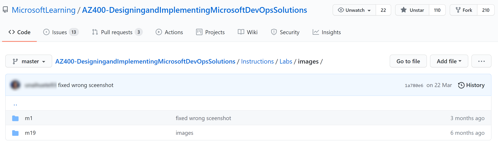
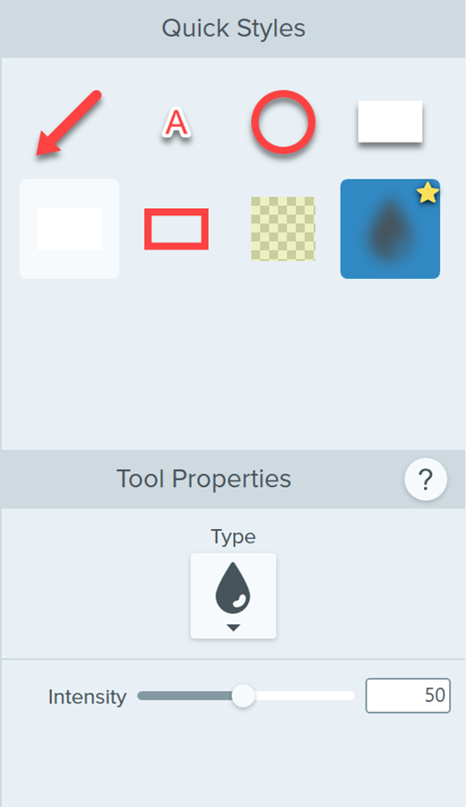
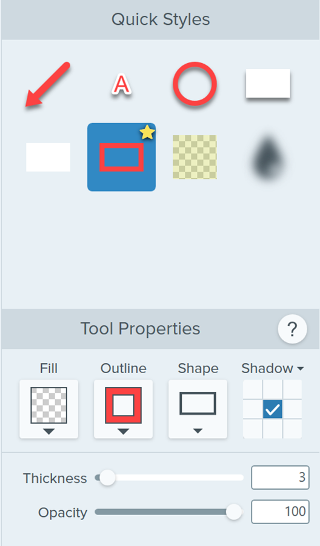
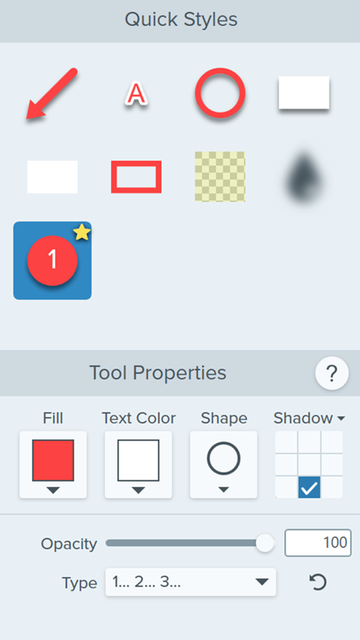
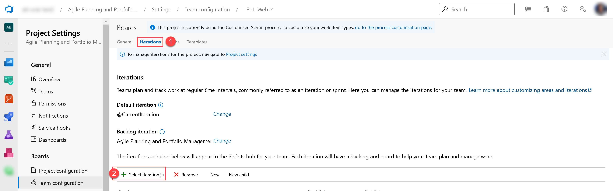

# Contributing to Microsoft Learning Repositories

MCT contributions are a key part of keeping the lab and demo content current as the Azure platform changes. We want to make it as easy as possible for you to contribute changes to the lab files. Here are a few guidelines to keep in mind as you contribute changes.

## GitHub Use & Purpose

Microsoft Learning is using GitHub to publish the lab steps and lab scripts for courses that cover cloud services like Azure. Using GitHub allows the course’s authors and MCTs to keep the lab content current with Azure platform changes. Using GitHub allows the MCTs to provide feedback and suggestions for lab changes, and then the course authors can update lab steps and scripts quickly and relatively easily.

> When you prepare to teach these courses, you should ensure that you are using the latest lab steps and scripts by downloading the appropriate files from GitHub. GitHub should not be used to discuss technical content in the course, or how to prep. It should only be used to address changes in the labs.

It is strongly recommended that MCTs and Partners access these materials and in turn, provide them separately to students.  Pointing students directly to GitHub to access Lab steps as part of an ongoing class will require them to access yet another UI as part of the course, contributing to a confusing experience for the student. An explanation to the student regarding why they are receiving separate Lab instructions can highlight the nature of an always-changing cloud-based interface and platform. Microsoft Learning support for accessing files on GitHub and support for navigation of the GitHub site is limited to MCTs teaching this course only.

> As an alternative to pointing students directly to the GitHub repository, you can point students to the GitHub Pages website to view the lab instructions. The URL for the GitHub Pages website can be found at the top of the repository.

To address general comments about the course and demos, or how to prepare for a course delivery, please use the existing MCT forums.

## How can I collaborate?

If you don't already have a GitHub account, [create one](https://github.com/join) . Identify any affiliations in your GitHub profile. 

### Reporting Issues

You can open **Issues** from our public repository if you find any problems with the latest version of the lab instructions. Make sure to fill in information as specified by the issue templates (issue or feedback).

- **Explain the problem** and include additional details to help maintainers reproduce the problem.
- **Use a clear and descriptive title** for the issue to identify the problem, as mentioned in template.
- **Describe the exact steps which reproduce the problem** in as many details as possible.
- **Include screenshots** which show you following the described steps and clearly demonstrate the problem.

### Pull Requests

If you want to collaborate fixing an issue or proposing updates, please create a Pull Request (PR).

#### Easy PRs using GitHub (no git/github knowledge needed)
For people that may not have enough Git/GitHub experience (forking a repository and working with Git repositories locally), here we explain an easy way of proposing Pull Requests using GitHub website:

https://user-images.githubusercontent.com/64772417/137773529-9cad5c7f-2841-4efc-965e-c2c727eb769f.mp4

> ⚠️ This option is encouraged for people with no Git/GitHub experience, same process could be manually followed: [GitHub, working with forks](https://docs.github.com/en/github/collaborating-with-pull-requests/working-with-forks)

#### Creating a Pull Request

You may be creating a Pull Request for an existing issue or proposal. If the Pull Request is related to an existing issue, link it by providing the **Issue** number on the **Fixes #[Issue-Number]** section of the Pull Request description (replace "[]" too). 

> ⚠️ If the Pull Request is related to an issue that has not been reported yet, please report it, following the [previously](https://github.com/MicrosoftLearning/AZ400-DesigningandImplementingMicrosoftDevOpsSolutions/blob/master/.github/CONTRIBUTING.md#reporting-issues) mentioned steps. 

For the Pull Request title, use the following syntax:

`[Issue/Proposal]-[M00]-[LABNAME]:[QUICK_DESCRIPTION]`

#### Creating/Updating screenshots (Lab 1)

The screenshot being used by some instructions are organized the following way, a folder located under `AZ400-DesigningandImplementingMicrosoftDevOpsSolutions/Instructions/Labs/images` with the lab number. 

On the lab specific folder, screenshots will be saved on the following format (PNG) and naming:
`[descriptive_name]_[versionnumber].png`, for example, `create_epic_v1.png`

If the screenshot needs to be updated, the new one will increment the version number, `create_epic_v1.png` to `create_epic_v2.png`, be uploaded to the corresponding **images** folder and delete the existing one as part of your Pull Request.

For referencing and using the screenshot in the lab instructions, the image should be added as shown below:

``

For example,

``

> ⚠️ For accesibility, the ALT text should include a **clear** description of the screenshot, as shown in the example above.

> ⚠️ Image could be resized using the following syntax example, modifying with to your needs: 
``

#### Taking and editing screenshots (Lab 1)

For Microsoft Certified Trainers (MCT), TechSmith is offering **Snagit** as part of their Influencer Program. Apply now at https://discover.techsmith.com/techsmith-influencer-program/.

[Snagit](https://www.techsmith.com/screen-capture.html) is a great tool for capturing screen that provides us with useful tools for the functionality we want to add to our screenshots.

The screenshot by using **Snagit** should:
- Have tools using light theme (not dark or custom) for websites/apps like Azure portal, Azure DevOps, GitHub, etc.
- **NOT** show any personal information (name, email, profile picture, ... ), use the **Blur** functionality.
- Use **Red Rectangle** for highlighting.
- Use **Steps** to apply a numbered sequence of the actions shown on it (use **Red Rectangle** together with it).

All of them with following properties (blur,red rectangle and steps):

  

Example:

 

## Additional Resources

A user guide has been provided for MCTs who are new to GitHub. It provides steps for connecting to GitHub, downloading and printing course materials, updating the scripts that students use in labs, and explaining how you can help ensure that this course’s content remains current.

<https://microsoftlearning.github.io/MCT-User-Guide/>
