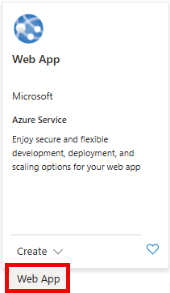

---
lab:
    title: 'Deploy a containerized app to Azure App Service'
    description: 'Learn how to deploy a containerized app to Azure App Service.'
---

# Deploy a containerized app to Azure App Service

Tasks performed in this exercise:

* Create an Azure App Service resource for a containerize app
* View the results
* Clean up resources

This exercise should take approximately **15** minutes to complete.

## Before you start

To complete the exercise you need:

* An Azure subscription. If you don't already have one, you can [sign up for one](https://azure.microsoft.com/).

## Create a web app resource

1. In your browser navigate to the Azure portal [https://portal.azure.com](https://portal.azure.com); signing in with your Azure credentials if prompted.
1. Select the **+ Create a resource** located in the **Azure Services** heading near the top of the homepage. 
1. In the **Search the Marketplace** search bar, enter *web app* and press **enter** to start searching.
1. In the Web App tile, select the **Create** drop-down and then select **Web App**.

    

Selecting **Create** will open a template with a few tabs to fill out with information about your deployment. The following steps walk you through what changes to make in the relevant tabs.

1. Fill out the **Basics** tab with the information in the following table:

    | Setting | Action |
    |--|--|
    | **Subscription** | Retain the default value. |
    | **Resource group** | Select Create new, enter `rg-WebApp`, and then select OK. |
    | **Name** | Enter a unique name, for example `<your-initials>-containerwebapp`. Replace *\<your-initials>* with your initials, or some other value. The name needs to be unique, so it may require a few changes. |
    | Slider under **Name** setting | Select the slider to turn it off. |
    | **Publish** | Select the **Container** option. |
    | **Operating System** | Ensure **Linux** is selected. |
    | **Region** | Retain the default selection, or choose a region near you. |
    | **Linux Plan** | Retain the default selection. |
    | **Pricing plan** | Select the drop-down and choose the **Free F1** plan. |

1. Select, or navigate to, the **Container** tab, and enter the information in the following table:

    | Setting | Action |
    |--|--|
    | **Sidecar support** | Retain default off position. |
    | **Image Source** | Select **Other container registries**. |
    | **Access Type** | Retain default **Public** selection. |
    | **Registry server URL** | Enter `mcr.microsoft.com/k8se`. |
    | **Image and Tag** | Enter `quickstart:latest`. |
    | **Startup Command** | Leave blank. |

1. Select the **Review + create** tab.
1. Review the selections you made, and then select the **Create** button.

It may take a few minutes for the deployment to complete. When it is finished select the **Go to resource** button.

Now that your deployment has finished it's time to view the web app. Select the link to your web app located next to the **Default domain** field in the **Essentials** section. The link will open the site in a new tab.

>**Note:** It may take a few minutes for the deployed container app to run and display in the new tab.

## Clean up resources

Now that you finished the exercise, you should delete the cloud resources you created to avoid unnecessary resource usage.

1. Navigate to the resource group you created and view the contents of the resources used in this exercise.
1. On the toolbar, select **Delete resource group**.
1. Enter the resource group name and confirm that you want to delete it.
