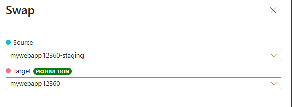

---
lab:
    title: 'Swap deployment slots in Azure App Service'
    description: 'Learn how to swap deployment slots in Azure App Service. In this exercise you: deploy a simple app to App Service; make a small change to the app and deploy that to a staging slot; and finally swap the slots so the updated app is in production.'
---

# Swap deployment slots in Azure App Service

In this exercise, you deploy a basic HTML+CSS site to Azure App Service by using the Azure CLI `az  webapp up` command. Next, you update the code and deploy the change to a staging slot. Finally, you swap the slots.

Tasks performed in this exercise:

* Download and deploy the sample app to Azure App Service.
* Create a staging deployment slot.
* Make a change to the sample app and deploy it to the staging slot.
* Swap the staging and default production slots to move the changes to the production slot.

This exercise should take approximately **30** minutes to complete.

## Before you start

To complete the exercise you need:

* An Azure subscription. If you don't already have one, you can sign up for one [https://azure.microsoft.com/](https://azure.microsoft.com/).

## Download and deploy the sample app

In this section you download the sample app and set variables to make the commands easier to enter, and then create an Azure App Service resource and deploy a static HTML site using Azure CLI commands.

1. In your browser navigate to the Azure portal [https://portal.azure.com](https://portal.azure.com); signing in with your Azure credentials if prompted.

1. Use the **[\>_]** button to the right of the search bar at the top of the page to create a new cloud shell in the Azure portal, selecting a ***Bash*** environment. The cloud shell provides a command line interface in a pane at the bottom of the Azure portal.

    > **Note**: If you have previously created a cloud shell that uses a *PowerShell* environment, switch it to ***Bash***.

1. In the cloud shell toolbar, in the **Settings** menu, select **Go to Classic version** (this is required to use the code editor).

1. Run the following **git** command to clone the sample app repository.

    ```bash
    git clone https://github.com/Azure-Samples/html-docs-hello-world.git
    ```

1. Set variables to hold the resource group and app names by running the following commands. Make note of the value of the **appName** that is displayed after the commands run, you'll need it later in this exercise.

    ```bash
    resourceGroup=rg-mywebapp

    appName=mywebapp$RANDOM
    echo $appName
    ```

1. Navigate to the directory that contains the sample code and run the **az webapp up** command. **Note:** This command might take a few minutes to run.

    ```bash
    cd html-docs-hello-world

    az webapp up -g $resourceGroup -n $appName --sku P0V3 --html
    ```

    Now that your deployment has finished it's time to view the web app.

1. In the Azure portal navigate to the web app you deployed. You can enter the name you noted earlier in the **Search resources, services, and docs (G + /)** search bar, and select the resource from the list.

1. Select the link to your web app located in the **Default domain** field in the **Essentials** section. The link will open the site in a new tab.

## Deploy updated code to a deployment slot

In this section you create a deployment slot, modify the HTML in the app, and deploy the updated code to the new deployment slot.

### Create a deployment slot 

1. Return to the tab with the Azure portal and cloud shell.

1. Enter the following command in the cloud shell to create a deployment slot named *staging*.

    ```bash
    az webapp deployment slot create -n $appName -g $resourceGroup --slot staging
    ```

1. Wait for the command to finish, and then select **Deployment > Deployment slots** in the left menu to view the deployment slots for your web app. Note the name of the new slot contains *-staging* appended to name of your web app

### Update code and deploy to the staging slot

1. In the cloud shell, type `code index.html` to open the editor. In the `<h1>` heading tag, change *Azure App Service - Sample Static HTML Site* to *Azure App Service Staging Slot* - or to anything else that you'd like.

1. Use the commands **ctrl-s** to save, and **ctrl-q** to exit.

1. In the cloud shell run the following command to create a zip file of the updated project. A zip,  or a web application resource (WAR), file is needed for the next step.

    ```bash
    zip -r stagingcode.zip .
    ```

1. Run the following command in the cloud shell to deploy your updates to the staging slot.

    ```bash
    az webapp deploy -g $resourceGroup -n $appName --src-path ./stagingcode.zip --slot staging
    ```

1. Select **Deployment > Deployment slots** in the left menu of your web app, and then select the staging slot you created earlier.

1. Select the link in the **Default domain** field in the **Essentials** section. The link will open the web site for the staging slot in a new tab.

## Swap the staging and production slots

You can perform a swap in the Azure portal with the **Swap** option in the toolbar. The **Swap** option will appear in the toolbar if you select **Overview** or **Deployment > Deployment slots** in the left menu.

1. In the Azure portal, select **Swap** in the toolbar to open the **Swap** panel.

1. Review the settings in the swap panel. The **Source** should show the **-staging** slot, and the **Target** should show the default production slot.

    

1. Select **Start Swap** and wait for the operation to complete. You can track completion in the **Notifications** panel that you can open by selecting the bell icon at the top of the portal.

1. To verify the swap navigate to the web app you deployed. Enter the web app name you created earlier (for example, *mywebapp12360*) in the **Search resources, services, and docs (G + /)** search bar, and then select the resource from the list.

1. Select the link to your web app located in the **Default domain** field in the **Essentials** section. The link will open the site (production slot) in a new tab.

1. Verify your changes, you may need to refresh the page for them to appear.

## Clean up resources

Now that you finished the exercise, you should delete the cloud resources you created to avoid unnecessary resource usage.

1. Navigate to the resource group you created and view the contents of the resources used in this exercise.
1. On the toolbar, select **Delete resource group**.
1. Enter the resource group name and confirm that you want to delete it.
