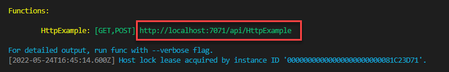
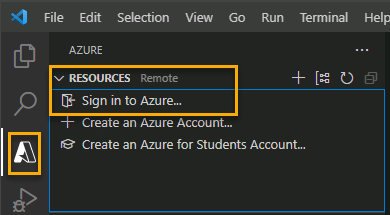
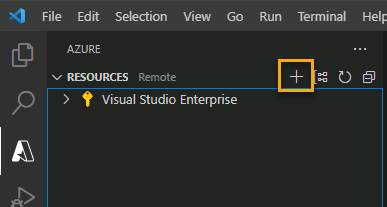
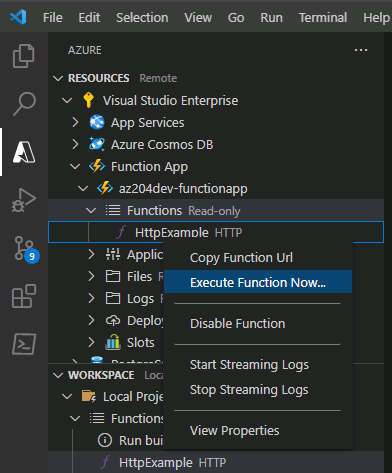

---
lab:
    title: 'Create an Azure Function with Visual Studio Code'
    description: 'Learn how to create an Azure Function with an HTTP trigger. After creating and testing the code locally in Visual Studio Code, you deploy the function to Azure.'
---

# Create an Azure Function with Visual Studio Code

In this exercise, you learn how to create a C\# function that responds to HTTP requests. After creating and testing the code locally in Visual Studio Code, you deploy and test the function in Azure.

Tasks performed in this exercise:

* Create an Azure App Service resource for a containerize app
* View the results
* Clean up resources

This exercise should take approximately **30** minutes to complete.

## Before you start

Before you begin, make sure you have the following requirements in place:

* An Azure subscription. If you don't already have one, you can [sign up for one](https://azure.microsoft.com/).

* [Azure Functions Core Tools](https://github.com/Azure/azure-functions-core-tools#installing) version 4.x.

* [Visual Studio Code](https://code.visualstudio.com/) on one of the [supported platforms](https://code.visualstudio.com/docs/supporting/requirements#_platforms).

* [.NET 8](https://dotnet.microsoft.com/en-us/download/dotnet/8.0) is the target framework.

* [C# Dev Kit](https://marketplace.visualstudio.com/items?itemName=ms-dotnettools.csdevkit) for Visual Studio Code.

* [Azure Functions extension](https://marketplace.visualstudio.com/items?itemName=ms-azuretools.vscode-azurefunctions) for Visual Studio Code.

## Create your local project

In this section, you use Visual Studio Code to create a local Azure Functions project in C#. Later in this exercise, you publish your function code to Azure.

1. In Visual Studio Code, press F1 to open the command palette and search for and run the command `Azure Functions: Create New Project...`.

1. Select the directory location for your project workspace and choose **Select**. You should either create a new folder or choose an empty folder for the project workspace. Don't choose a project folder that is already part of a workspace.

1. Provide the following information at the prompts:

    | Prompt | Action |
    |--|--|
    | Select the folder that will contain your function projects | Select **Browse...** to select a folder for you app.
    | Select a language | Select **C#**. |
    | Select a .NET runtime | Select **.NET 8.0 Isolated** |
    | Select a template for your project's first function | Select **HTTP trigger**.1 |
    | Provide a function name | Enter `HttpExample`. |
    | Provide a namespace | Enter `My.Function`. |
    | Authorization level | Select **Anonymous**, which enables anyone to call your function endpoint. |

    1 Depending on your VS Code settings, you might need to use the **Change template filter** option to see the full list of templates.

1. Visual Studio Code uses the provided information and generates an Azure Functions project with an HTTP trigger. You can view the local project files in the Explorer.

### Run the function locally

Visual Studio Code integrates with Azure Functions Core tools to let you run this project on your local development computer before you publish to Azure.

1. Make sure the terminal is open in Visual Studio Code. You can open the terminal by selecting **Terminal** and then **New Terminal** in the menu bar. 

1. Press **F5** to start the function app project in the debugger. Output from Core Tools is displayed in the **Terminal** panel. Your app starts in the **Terminal** panel. You can see the URL endpoint of your HTTP-triggered function running locally.

    

1. With Core Tools running, go to the **Azure: Functions** area. Under **Functions**, expand **Local Project** > **Functions**. Right-click the **HttpExample** function and select **Execute Function Now...**.

    

1. In **Enter request body** type the request message body value of `{ "name": "Azure" }`. Press **Enter** to send this request message to your function. When the function executes locally and returns a response, a notification is raised in Visual Studio Code.

    select the notification bell icon to view the notification. Information about the function execution is shown in **Terminal** panel.

1. Press **Shift + F5** to stop Core Tools and disconnect the debugger.

After verifying that the function runs correctly on your local computer, it's time to use Visual Studio Code to publish the project directly to Azure.

## Deploy and execute the function in Azure

In this section you create an Azure Function App resource and deploy the function to the resource.

### Sign in to Azure

Before you can publish your app, you must sign in to Azure. If you already signed in, go to the next section.

1. If you aren't already signed in, choose the Azure icon in the Activity bar, then in the **Azure: Functions** area, choose **Sign in to Azure...**.

    

1. When prompted in the browser, choose your Azure account and sign in using your Azure account credentials.

1. After successfully signing in, you can close the new browser window. The subscriptions that belong to your Azure account are displayed in the Side bar.

### Create resources in Azure

In this section, you create the Azure resources you need to deploy your local function app.

1. Choose the Azure icon in the Activity bar, then in the **Resources** area select the **Create resource...** button.

        

1. Provide the following information at the prompts:

    | Prompt | Action |
    |--|--|
    | Select a resource to create | Select **Create Function App in Azure...** |
    | Select subscription | Select the subscription to use. *You won't see this if you only have one subscription.* |
    | Enter a globally unique name for the function app | Type a name that is valid in a URL path, for example `myfunctionapp`. The name you type is validated to make sure that it's unique. |
    | Select a location for new resources | For better performance, select a region near you. |
    | Select a runtime stack | Select **.NET 8.0 Isolated**. |
    | Select an instance memory size | Select **2048 Default** |
    | Select the maximum instance count | Accept the default **100**. |

    The extension shows the status of individual resources as they're being created in the **AZURE** area of the terminal window.
    
1. When completed, the following Azure resources are created in your subscription, using names based on your function app name:

    * A resource group, which is a logical container for related resources.
    * A standard Azure Storage account, which maintains state and other information about your projects.
    * A Flex consumption plan, which defines the underlying host for your serverless function app.
    * A function app, which provides the environment for executing your function code. A function app lets you group functions as a logical unit for easier management, deployment, and sharing of resources within the same hosting plan.
    * An Application Insights instance connected to the function app, which tracks usage of your serverless function.

### Deploy the project to Azure

> **! Important:** Publishing to an existing function overwrites any previous deployments.

1. In the command palette, search for and run the command **Azure Functions: Deploy to Function App...**.

1. Select the subscription you used when creating the resources.

1. Select the function app you created. When prompted about overwriting previous deployments, select **Deploy** to deploy your function code to the new function app resource.

1. After deployment completes, select **View Output** to view the details of the deployment results. If you miss the notification, select the notification bell icon in the lower right corner to see it again.

    

### Run the function in Azure

1. Back in the **Resources** area in the side bar, expand your subscription, your new function app, and **Functions**. **Right-click** the **HttpExample** function and choose **Execute Function Now...**.

    

1. In **Enter request body** you see the request message body value of `{ "name": "Azure" }`. Press Enter to send this request message to your function.

1. When the function executes in Azure and returns a response, a notification is raised in Visual Studio Code. select the notification bell icon to view the notification.

## Clean up resources

Now that you finished the exercise, you should delete the cloud resources you created to avoid unnecessary resource usage.

1. In your browser navigate to the Azure portal [https://portal.azure.com](https://portal.azure.com); signing in with your Azure credentials if prompted.
1. Navigate to the resource group you created and view the contents of the resources used in this exercise.
1. On the toolbar, select **Delete resource group**.
1. Enter the resource group name and confirm that you want to delete it.
