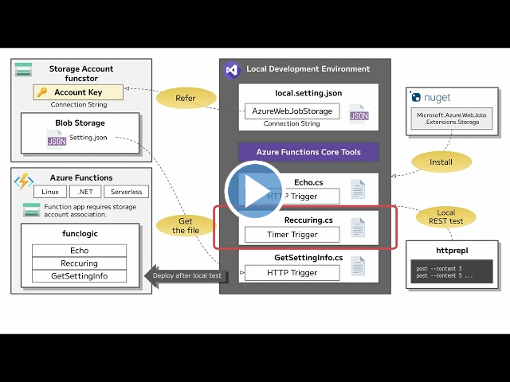
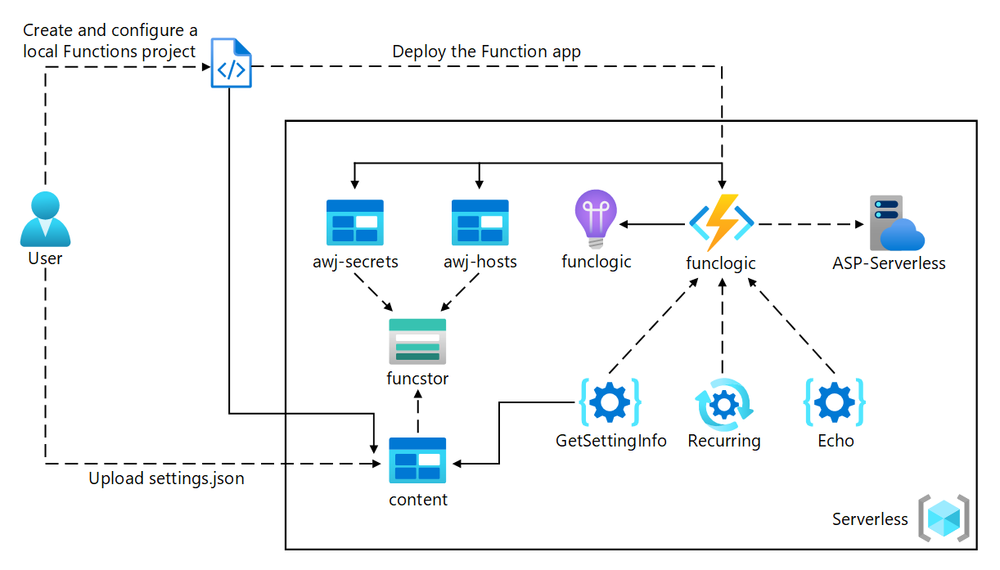
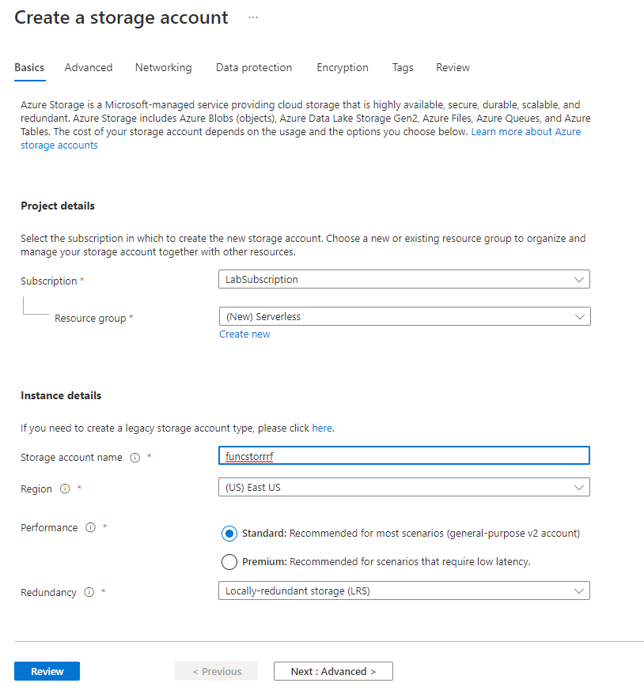
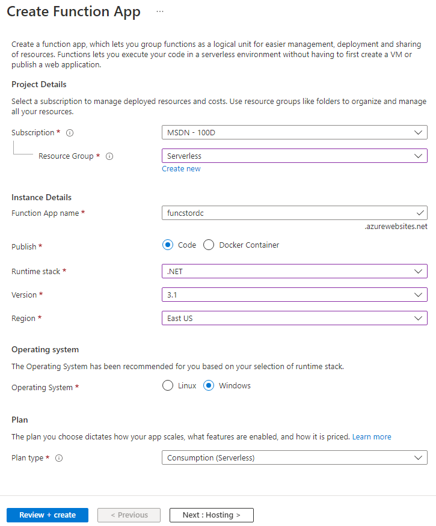

---
lab:
    az204Title: 'Lab 02: Implement task processing logic by using Azure Functions'
    az204Module: 'Learning Path 02: Implement Azure Functions'
---

# Lab 02: Implement task processing logic by using Azure Functions

## Microsoft Azure user interface

Given the dynamic nature of Microsoft cloud tools, you might experience Azure UI changes that occur after the development of this training content. As a result, the lab instructions and lab steps might not align correctly.

Microsoft updates this training course when the community alerts us to needed changes. However, cloud updates occur frequently, so you might encounter UI changes before this training content updates. **If this occurs, adapt to the changes, and then work through them in the labs as needed.**

## Instructions

### Before you start

#### Sign in to the lab environment

Sign in to your Windows 11 virtual machine (VM) by using the following credentials:

- Username: `Admin`
- Password: `Pa55w.rd`

> **Note**: Your instructor will provide instructions to connect to the virtual lab environment.

#### Review the installed applications

Find the taskbar on your Windows 11 desktop. The taskbar contains the icons for the applications that you'll use in this lab, including:

- Microsoft Edge
- File Explorer
- Terminal
- Visual Studio Code

## Lab Scenario

In this lab, you will demonstrate the ability to create a simple Azure function that echoes text that is entered and sent to the function by using HTTP POST commands. This will illustrate how the function can be triggered over HTTP. 

Additionally, you will demonstrate how to execute an Azure function by setting it to execute on a fixed schedule. The function will write a message to a log each time the schedule is triggered.

Finally, you will demonstrate how an Azure function can connect to other Azure resources, such as a storage account. The function will connect to a storage account that you create and return the contents of a file that is stored in the Azure storage account.

<em>View this video by right-clicking this **[video link](https://youtu.be/-3tneDvkYDo)** and select 'Open link in a new tab / new window'.</em>

 

### Architecture diagram



### Exercise 1: Create Azure resources

#### Task 1: Open the Azure portal

1. On the taskbar, select the **Microsoft Edge** icon.
1. In the browser window, browse to the Azure portal at `https://portal.azure.com`, and then sign in with the account you'll be using for this lab.

    > **Note**: If this is your first time signing in to the Azure portal, you'll be offered a tour of the portal. If you prefer to skip the tour, select **Get Started** to begin using the portal.

#### Task 2: Create an Azure Storage account

1. In the Azure portal, use the **Search resources, services, and docs** text box to search for **Storage Accounts**, and then, in the list of results, select **Storage Accounts**.

1. On the **Storage accounts** blade, select **+ Create**.

1. On the **Create a storage account** blade, on the **Basics** tab, perform the following actions, and then select **Review**:

    | Setting | Action |
    | -- | -- |
    | **Subscription** drop-down list | Retain the default value |
    | **Resource group** section | Select **Create new**, enter **Serverless**, and then select **OK** |
    | **Storage account name** text box | Enter **funcstor**_[yourname]_ |
    | **Region** drop-down list | Select **(US) East US** |
    | **Performance** section | Select the **Standard** option |
    | **Redundancy** drop-down list | Select **Locally-redundant storage (LRS)** |

    The following screenshot displays the configured settings in the **Create a storage account** blade.

    

1. On the **Review** tab, review the options that you selected during the previous steps.

1. Select **Create** to create the storage account by using your specified configuration.

    > **Note**: Wait for the creation task to complete before you proceed with this lab.

1. On the **Overview** blade, select the **Go to resource** button to navigate to the blade of the newly created storage account.

1. On the **Storage account** blade, in the **Security + networking** section, select **Access keys**.

1. On the **Access keys** blade, select **Show keys**.

1. On the **Access keys** blade, review any one of the **Connection string**\s (using **Show** button), and then record the value of either **Connection string** boxes in Notepad. The **Key**\s are platform managed encryption keys and are **not** used for this lab.

   > **Note**: It doesn't matter which connection string you choose. They are interchangeable.

1. Open Notepad, and then paste the copied connection string value to Notepad. You'll use this value later in this lab.

#### Task 3: Create a function app

1. On the Azure portal's navigation pane, select the **Create a resource** link.

1. On the **Create a resource** blade, in the **Search services and marketplace** text box, enter **Function**, and then select Enter.

1. On the **Marketplace** search results blade, select the **Function App** result.

1. On the **Function App** blade, select **Create**.

1. On the **Create Function App** blade, ensure **Consumption** is the selected hosting plan, and then click **Select**.

1. On the **Create Function App (Consumpotion)** blade, on the **Basics** tab, perform the following actions, and then select **Next: Storage**:

    | Setting | Action |
    | -- | -- |
    | **Subscription** drop-down list | Retain the default value |
    | **Resource group** section | Select **Serverless** |
    | **Function App name** text box | Enter **funclogic**_[yourname]_ |
    | **Runtime stack** drop-down list | Select **.NET** |
    | **Version** drop-down list | Select **8 (LTS),  isolated worker model ** |
    | **Region** drop-down list | Select the **East US** region |
    | **Operating System** option | Select **Linux** |

    The following screenshot displays the configured settings in the **Create Function App** blade.

    

1. On the **Storage** tab, perform the following actions, and then select **Review + create**:

    | Setting | Action |
    | -- | -- |
    | **Storage account** drop-down list | Select the **funcstor**_[yourname]_ storage account |

1. On the **Review + create** tab, review the options that you selected during the previous steps.

1. Select **Create** to create the function app by using your specified configuration.

    > **Note**: Wait for the creation task to complete before you move forward with this lab.

#### Review

In this exercise, you created all the resources that you'll use in this lab.

### Exercise 2: Configure a local Azure Functions project

#### Task 1: Initialize a function project

1. On the taskbar, select the **Terminal** icon.

1. Run the following command to change the current directory to the **Allfiles (F):\\Allfiles\\Labs\\02\\Starter\\func** empty directory:

    ```powershell
    cd F:\Allfiles\Labs\02\Starter\func
    ```

    > **Note**: In Windows Explorer remove the **Read-only** attribute from **F:\\Allfiles\\Labs\\02\\Starter\\func\\.gitignore** file.

1. Run the following command to use the **Azure Functions Core Tools** to create a new local Azure Functions project in the current directory using the **dotnet-isolated** runtime:

    ```powershell
    func init --worker-runtime dotnet-isolated --target-framework net8.0 --force
    ```

    > **Note**: You can review the documentation to [create a new project][azure-functions-core-tools-new-project] using the **Azure Functions Core Tools**.
    
1. Close the **Terminal** application.

#### Task 2: Configure a connection string

1. On the **Start** screen, select the **Visual Studio Code** tile.
1. On the **File** menu, select **Open Folder**.
1. In the **File Explorer** window that opens, browse to **Allfiles (F):\\Allfiles\\Labs\\02\\Starter\\func**, and then select **Select Folder**.
1. On the **Explorer** pane of the **Visual Studio Code** window, open the **local.settings.json** file.
1. Observe the current value of the **AzureWebJobsStorage** setting:

    ```json
    "AzureWebJobsStorage": "UseDevelopmentStorage=true",
    ```

1. Change the value of the **AzureWebJobsStorage** element to the **connection string** of the storage account that you recorded earlier in this lab.
1. Save the **local.settings.json** file.

#### Task 3: Build and validate a project

1. On the taskbar, select the **Terminal** icon.
1. Run the following command to change the current directory to the **Allfiles (F):\\Allfiles\\Labs\\02\\Starter\\func** directory:

    ```powershell
    cd F:\Allfiles\Labs\02\Starter\func
    ```

1. Run the following command to **build** the .NET project:

    ```powershell
    dotnet build
    ```

#### Review

In this exercise, you created a local project that you'll use for Azure Functions development.

### Exercise 3: Create a function that's triggered by an HTTP request

#### Task 1: Create an HTTP-triggered function

1. On the taskbar, select the **Terminal** icon.
1. Run the following command to change the current directory to the **Allfiles (F):\\Allfiles\\Labs\\02\\Starter\\func** directory:

    ```powershell
    cd F:\Allfiles\Labs\02\Starter\func
    ```

1. Run the following command to use the **Azure Functions Core Tools** to create a new function named **Echo** using the **HTTP trigger** template:

    ```powershell
    func new --template "HTTP trigger" --name "Echo"
    ```

    > **Note**: You can review the documentation to [create a new function][azure-functions-core-tools-new-function] using the **Azure Functions Core Tools**.

1. Close the currently running **Terminal** application.

#### Task 2: Write HTTP-triggered function code

1. On the **Start** screen, select the **Visual Studio Code** tile.
1. On the **File** menu, select **Open Folder**.
1. In the **File Explorer** window that opens, browse to **Allfiles (F):\\Allfiles\\Labs\\02\\Starter\\func**, and then select **Select Folder**.
1. On the **Explorer** pane of the **Visual Studio Code** window, open the **Echo.cs** file.

1. Delete all the content within the **Echo.cs** file, and add the following code. It defines an HTTP-triggered function called "Echo" which takes in a POST request and returns the request body. The ILogger interface is also used for logging information. This function can be used to test HTTP requests and responses.

    ```csharp
    using System.Net;
    using Microsoft.Azure.Functions.Worker;
    using Microsoft.Azure.Functions.Worker.Http;
    using Microsoft.Extensions.Logging;
    
    namespace func
    {
        public class Echo
        {
            private readonly ILogger _logger;

            public Echo(ILoggerFactory loggerFactory)
            {
                _logger = loggerFactory.CreateLogger<Echo>();
            }

            [Function("Echo")]
            public HttpResponseData Run([HttpTrigger(AuthorizationLevel.Function, "get", "post")] HttpRequestData req)
            {
                _logger.LogInformation("C# HTTP trigger function processed a request.");

                var response = req.CreateResponse(HttpStatusCode.OK);
                response.Headers.Add("Content-Type", "text/plain; charset=utf-8");

                StreamReader reader = new StreamReader(req.Body);
                string requestBody = reader.ReadToEnd();
                response.WriteString(requestBody);

                return response;
            }
        }
    }
    ```

1. Select **Save** to save your changes to the **Echo.cs** file.

#### Task 3: Test the HTTP-triggered function by using curl

1. On the taskbar, select the **Terminal** icon.
1. Run the following command to change the current directory to the **Allfiles (F):\\Allfiles\\Labs\\02\\Starter\\func** directory:

    ```powershell
    cd F:\Allfiles\Labs\02\Starter\func
    ```

1. Run the following command to run the function app project:

    ```powershell
    func start --build
    ```

    > **Note**: You can review the documentation to [start the function app project locally](https://docs.microsoft.com/azure/azure-functions/functions-develop-local) using the **Azure Functions Core Tools**.
    
1. On the lab computer, start **Command Prompt**.

1. Run the following command to run test the **POST** REST API call against `http://localhost:7071/api/echo` with HTTP request body set to a numeric value of **3**:

   ```cmd
   curl -X POST -i http://localhost:7071/api/echo -d 3
   ```

1. Run the following command to test the **POST** REST API call against `http://localhost:7071/api/echo` with HTTP request body set to a numeric value of **5**:

   ```cmd
   curl -X POST -i http://localhost:7071/api/echo -d 5
   ```

1. Run the following command to test the **POST** REST API call against `http://localhost:7071/api/echo` with HTTP request body set to a string value of **Hello**:

   ```cmd
   curl -X POST -i http://localhost:7071/api/echo -d "Hello"
   ```

1. Run the following command to test the **POST** REST API call against `http://localhost:7071/api/echo` with HTTP request body set to a JavaScript Object Notation (JSON) value of **{"msg": "Successful"}**:

   ```cmd
   curl -X POST -i http://localhost:7071/api/echo -d "{"msg": "Successful"}"
   ```

1. Close all currently running instances of the **Terminal** application, and the **Command Prompt** application.

#### Review

In this exercise, you created a basic function that echoes the content sent through an HTTP POST request.

### Exercise 4: Create a function that triggers on a schedule

#### Task 1: Create a schedule-triggered function

1. On the taskbar, select the **Terminal** icon.
1. Run the following command to change the current directory to the **Allfiles (F):\\Allfiles\\Labs\\02\\Starter\\func** directory:

    ```powershell
    cd F:\Allfiles\Labs\02\Starter\func
    ```

1. Within the terminal, run the following command to use the **Azure Functions Core Tools** to create a new function named **Recurring**, using the **Timer trigger** template:

    ```powershell
    func new --template "Timer trigger" --name "Recurring"
    ```

    > **Note**: You can review the documentation to [create a new function][azure-functions-core-tools-new-function] using the **Azure Functions Core Tools**.
    
1. Close the currently running **Terminal** application.

#### Task 2: Observe function code

1. On the **Start** screen, select the **Visual Studio Code** tile.
1. On the **File** menu, select **Open Folder**.
1. In the **File Explorer** window that opens, browse to **Allfiles (F):\\Allfiles\\Labs\\02\\Starter\\func**, and then select **Select Folder**.
1. On the **Explorer** pane of the **Visual Studio Code** window, open the **Recurring.cs** file.
1. In the code editor, observe the implementation:

    ```csharp
    using System;
    using Microsoft.Azure.Functions.Worker;
    using Microsoft.Extensions.Logging;

    namespace func
    {
        public class Recurring
        {
            private readonly ILogger _logger;

            public Recurring(ILoggerFactory loggerFactory)
            {
                _logger = loggerFactory.CreateLogger<Recurring>();
            }

            [Function("Recurring")]
            public void Run([TimerTrigger("0 */5 * * * *")] TimerInfo myTimer)
            {
                _logger.LogInformation($"C# Timer trigger function executed at: {DateTime.Now}");

                if (myTimer.ScheduleStatus is not null)
                {
                    _logger.LogInformation($"Next timer schedule at: {myTimer.ScheduleStatus.Next}");
                }
            }
        }
    }
    ```

1. In line 17, replace `"0 */5 * * * *"` with `"0 */1 * * * *"` to set the recurring frequency interval to 1 minute rather than 5 minutes and save the change.

#### Task 3: Observe function runs

1. On the taskbar, select the **Terminal** icon.
1. Run the following command to change the current directory to the **Allfiles (F):\\Allfiles\\Labs\\02\\Starter\\func** directory:

    ```powershell
    cd F:\Allfiles\Labs\02\Starter\func
    ```

1. Within the terminal, run the following command to run the function app project:

    ```powershell
    func start --build
    ```

    > **Note**: You can review the documentation to [start the function app project locally][azure-functions-core-tools-start-function] using the **Azure Functions Core Tools**.
    
1. Observe the function run that occurs about every one minute. Each function run should render a simple message to the log.
1. Close the currently running **Terminal** application.
1. Close the Visual Studio Code window.

#### Review

In this exercise, you created a function that runs automatically based on a fixed schedule.

### Exercise 5: Create a function that integrates with other services

#### Task 1: Upload sample content to Azure Blob Storage

1. On the Azure portal's **navigation** pane, select the **Resource groups** link.
1. On the **Resource groups** blade, select the **Serverless** resource group that you created previously in this lab.
1. On the **Serverless** blade, select the **funcstor**_[yourname]_ storage account that you created previously in this lab.
1. On the **Storage account** blade, select the **Containers** link in the **Data storage** section.
1. In the **Containers** section, select **+ Container**.
1. In the **New container** pop-up window, perform the following actions, and then select **Create**:

    | Setting | Action |
    | -- | -- |
    | **Name** text box  | Enter **content** |

1. Return to the **Containers** section, and then select the recently created **content** container.
1. On the **Container** blade, select **Upload**.
1. In the **Upload blob** window, perform the following actions, and then select **Upload**:

    | Setting | Action |
    | -- | -- |
    | **Files** section  | Select **Browse for files** or use the drag and drop feature |
    | **File Explorer** window  | Browse to **Allfiles (F):\\Allfiles\\Labs\\02\\Starter**, select the **settings.json** file, and then select **Open** |
    | **Overwrite if files already exist** check box | Ensure that this check box is selected |

      > **Note**: Wait for the blob to upload before you continue with this lab.

#### Task 2: Create an HTTP-triggered function

1. On the taskbar, select the **Terminal** icon.
1. Run the following command to change the current directory to the **Allfiles (F):\\Allfiles\\Labs\\02\\Starter\\func** directory:

    ```powershell
    cd F:\Allfiles\Labs\02\Starter\func
    ```

1. Within the terminal, run the following command to use the **Azure Functions Core Tools** to create a new function named **GetSettingInfo**, using the **HTTP trigger** template:

    ```powershell
    func new --template "HTTP trigger" --name "GetSettingInfo"
    ```

    > **Note**: You can review the documentation to [create a new function][azure-functions-core-tools-new-function] using the **Azure Functions Core Tools**.
1. Close the currently running **Terminal** application.

#### Task 3: Register Azure Storage Blob extensions

1. On the taskbar, select the **Terminal** icon.
1. Run the following command to change the current directory to the **Allfiles (F):\\Allfiles\\Labs\\02\\Starter\\func** directory:

    ```powershell
    cd F:\Allfiles\Labs\02\Starter\func
    ```

1. Within the terminal, run the following command to register the [Microsoft.Azure.Functions.Worker.Extensions.Storage](https://www.nuget.org/packages/Microsoft.Azure.Functions.Worker.Extensions.Storage/6.2.0) extension:

    ```powershell
    dotnet add package Microsoft.Azure.Functions.Worker.Extensions.Storage --version 6.2.0
    ```

#### Task 4: Write HTTP-triggered function code with blob input

1. On the **Start** screen, select the **Visual Studio Code** tile.
1. On the **File** menu, select **Open Folder**.
1. In the **File Explorer** window that opens, browse to **Allfiles (F):\\Allfiles\\Labs\\02\\Starter\\func**, and then select **Select Folder**.
1. On the **Explorer** pane of the **Visual Studio Code** window, open the **GetSettingInfo.cs** file.
1. Replace the content of the auto-generated code of the function **GetSettingInfo** starting with line 17 with the following code:

    ```csharp
            [Function("GetSettingInfo")]
            public HttpResponseData Run([HttpTrigger(AuthorizationLevel.Function, "get", "post")] HttpRequestData req, 
                [BlobInput("content/settings.json", Connection = "AzureWebJobsStorage")] string blobContent
                )
            {
                _logger.LogInformation("C# HTTP trigger function processed a request.");
                _logger.LogInformation($"{blobContent}");

                var response = req.CreateResponse(HttpStatusCode.OK);
                response.Headers.Add("Content-Type", "text/plain; charset=utf-8");
                response.WriteString($"{blobContent}");

                return response;
            }
    ```

1. Review the resulting code, which should consist of the following content (this code returns the contents of a JSON file in an Azure Blob Storage container in response to an HTTP GET request):

    ```csharp
    using System.Net;
    using Microsoft.Azure.Functions.Worker;
    using Microsoft.Azure.Functions.Worker.Http;
    using Microsoft.Extensions.Logging;

    namespace func
    {
        public class GetSettingInfo
        {
            private readonly ILogger _logger;

            public GetSettingInfo(ILoggerFactory loggerFactory)
            {
                _logger = loggerFactory.CreateLogger<GetSettingInfo>();
            }

            [Function("GetSettingInfo")]
            public HttpResponseData Run([HttpTrigger(AuthorizationLevel.Function, "get", "post")] HttpRequestData req,
                [BlobInput("content/settings.json", Connection = "AzureWebJobsStorage")] string blobContent
                )
            {
                _logger.LogInformation("C# HTTP trigger function processed a request.");
                _logger.LogInformation($"{blobContent}");

                var response = req.CreateResponse(HttpStatusCode.OK);
                response.Headers.Add("Content-Type", "text/plain; charset=utf-8");
                response.WriteString($"{blobContent}");

                return response;
            }
        }
    }
    ```

1. Select **Save** to save your changes to the **GetSettingInfo.cs** file.


#### Task 5: Test the function by using curl

1. On the taskbar, select the **Terminal** icon.
1. Within the terminal, run the following command to run the function app project:

    ```powershell
    func start --build
    ```

    > **Note**: You can review the documentation to [start the function app project locally][azure-functions-core-tools-start-function] using the **Azure Functions Core Tools**.

1. On the lab computer, start **Command Prompt**.

1. Run the following command to test the **GET** REST API call against `http://localhost:7071/api/GetSettingInfo`:

   ```cmd
   curl -X GET -i http://localhost:7071/api/GetSettingInfo
   ```

1. Observe the JSON content of the response from the function app, which should now include:

    ```json
    {
        "version": "0.2.4",
        "root": "/usr/libexec/mews_principal/",
        "device": {
            "id": "21e46d2b2b926cba031a23c6919"
        },
        "notifications": {
            "email": "joseph.price@contoso.com",
            "phone": "(425) 555-0162 x4151"
        }
    }
    ```

1. Close all currently running instances of the **Terminal** application, and the **Command Prompt** application.

#### Review

In this exercise, you created a function that returns the content of a JSON file from a storage account.

### Exercise 6: Deploy a local function project to an Azure Functions app

#### Task 1: Deploy using the Azure Functions Core Tools

1. On the taskbar, select the **Terminal** icon.
1. Run the following command to change the current directory to the **Allfiles (F):\\Allfiles\\Labs\\02\\Starter\\func** directory:

    ```powershell
    cd F:\Allfiles\Labs\02\Starter\func
    ```

1. From command prompt, run the following command to login to the Azure Command-Line Interface (CLI):

    ```powershell
    az login
    ```

1. In the **Microsoft Edge** browser window, enter the name and password of the Microsoft or Azure Active Directory account you are using in this lab, and then select **Sign in**.
1. Return to the currently open **Terminal** window. Wait for the sign-in process to finish.
1. Within the terminal, run the following command to publish the function app project (replace the `<function-app-name>` placeholder with the name of the function app you created earlier in this lab):

    ```powershell
    func azure functionapp publish <function-app-name> --dotnet-version 8.0
    ```

    > **Note**: For example, if your **Function App name** is **funclogicstudent**, your command would be ``func azure functionapp publish funclogicstudent``. You can review the documentation to [publish the local function app project][azure-functions-core-tools-publish-azure] using the **Azure Functions Core Tools**.

1. Wait for the deployment to finalize before you move forward with the lab.
1. Close the currently running **Terminal** application.

#### Task 2: Validate deployment

1. On the taskbar, select the **Microsoft Edge** icon, and select the tab that displays the Azure portal.
2. On the Azure portal's **navigation** pane, select the **Resource groups** link.
3. On the **Resource groups** blade, select the **Serverless** resource group that you created previously in this lab.
4. On the **Serverless** blade, select the **funclogic**_[yourname]_ function app that you created previously in this lab.
5. On the **Overview** blade in Function App, select the **Functions** pane.
6. On the **Functions** pane, select the existing **GetSettingInfo** function.
7. In the **Function** blade, select the **Code + Test** option in the **Developer** section.
8. In the function editor, select **Test/Run**.
9. In the automatically displayed pane, in the **HTTP method** drop-down list, select **GET**.
10. Select **Run** to test the function.
11. In the **HTTP response content**, review the results of the test run. The JSON content should now include the following code:

    ```json
    {
        "version": "0.2.4",
        "root": "/usr/libexec/mews_principal/",
        "device": {
            "id": "21e46d2b2b926cba031a23c6919"
        },
        "notifications": {
            "email": "joseph.price@contoso.com",
            "phone": "(425) 555-0162 x4151"
        }
    }
    ```

#### Review

In this exercise, you deployed a local function project to Azure Functions and validated that the functions work in Azure.
