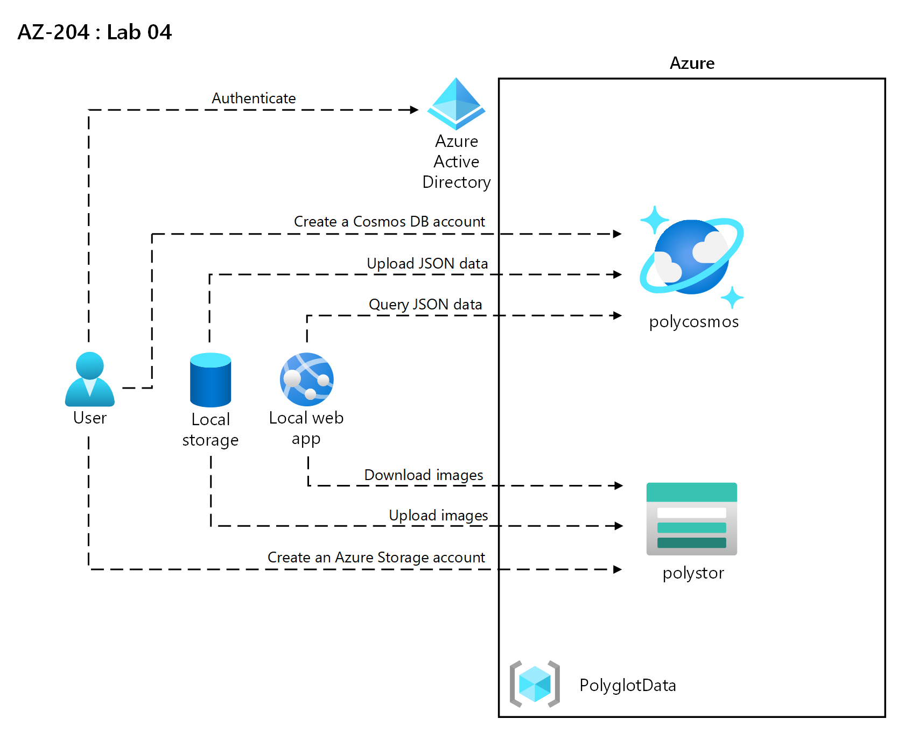
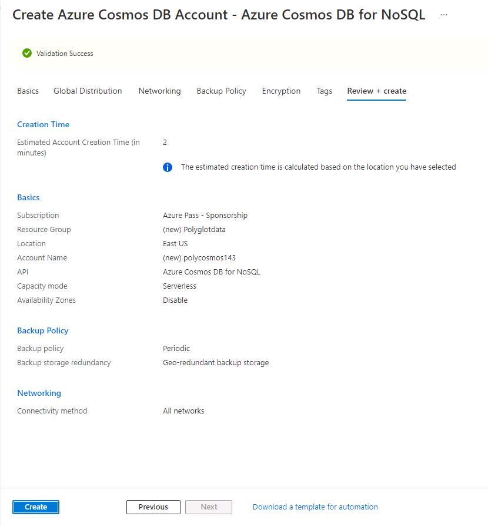
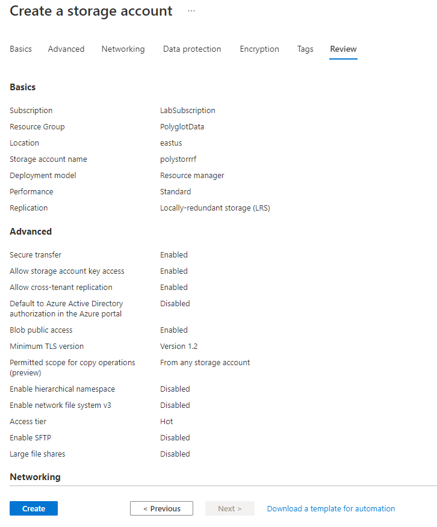
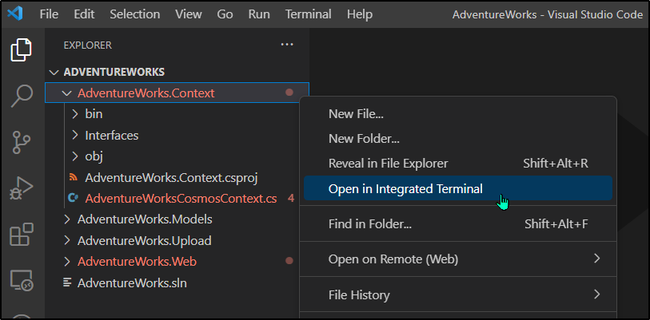

---
lab:
  az204Title: "Lab 04: Construct a polyglot data solution"
  az204Module: "Learning Path 04: Develop solutions that use Cosmos DB storage"
---

# Lab 04: Construct a polyglot data solution

## Microsoft Azure user interface

Given the dynamic nature of Microsoft cloud tools, you might experience Azure UI changes that occur after the development of this training content. As a result, the lab instructions and lab steps might not align correctly.

Microsoft updates this training course when the community alerts us to needed changes. However, cloud updates occur frequently, so you might encounter UI changes before this training content updates. **If this occurs, adapt to the changes, and then work through them in the labs as needed.**

## Instructions

### Before you start

#### Sign in to the lab environment

Sign in to your Windows 11 virtual machine (VM) by using the following credentials:

- Username: `Admin`
- Password: `Pa55w.rd`

> **Note**: Your instructor will provide instructions to connect to the virtual lab environment.

#### Review the installed applications

Find the taskbar on your Windows 11 desktop. The taskbar contains the icons for the applications that you'll use in this lab, including:

- Microsoft Edge
- File Explorer
- Visual Studio Code

## Lab Scenario

In this lab, you will create an Azure Cosmos DB resource and a storage account resource. Using C# and .NET, you will access the Cosmos DB resource and upload data into it.

Additionally, as Contoso may want to access the data in Cosmos DB through a user-friendly interface, you will implement a .NET solution that accesses and displays the data from Cosmos DB in a web browser.

## Architecture diagram



### Exercise 1: Creating data store resources in Azure

#### Task 1: Open the Azure portal

1. On the taskbar, select the **Microsoft Edge** icon.

1. In the open browser window, browse to the Azure portal at `https://portal.azure.com`, and then sign in with the account you will be using for this lab.

   > **Note**: If this is your first time signing in to the Azure portal, you'll be offered a tour of the portal. Select **Get Started** to skip the tour and begin using the portal.

#### Task 2: Create an Azure Cosmos DB account resource

1. In the Azure portal, use the **Search resources, services, and docs** text box to search for **Azure Cosmos DB** and then in the list of results, select **Azure Cosmos DB**.

1. On the **Azure Cosmos DB** blade, select **+ Create**.

1. On the **Create an Azure Cosmos DB account** blade, select **Create** in the **Azure Cosmos DB for NoSQL** box.

1. On the **Basics** tab of the **Create Azure Cosmos DB Account - Azure Cosmos DB for NoSQL** page, perform the following actions, and then select **Review + create**:

   | Setting                     | Action                                                                                                                   |
   | --------------------------- | ------------------------------------------------------------------------------------------------------------------------ |
   | **Subscription** list       | Retain defaults                                                                                                          |
   | **Resource group** section  | Select **Create new**                                                                                                    |
   | **Name** text box           | Enter **Polyglotdata** and select **OK**                                                                                 |
   | **AccountName** text box    | Enter **polycosmos**_[yourname]_                                                                                         |
   | **Location** drop-down list | Select an Azure region that is closest to the location of your lab computer and where you can create a Cosmos DB account |
   | **Capacity mode** section   | Select **Serverless**                                                                                                    |

   The following screenshot displays the configured settings on the **Create Azure Cosmos DB Account - Azure Cosmos DB for NoSQL** page.

   

1. On the **Review + create** tab of the **Create Azure Cosmos DB Account - Azure Cosmos DB for NoSQL** page, review the options that you selected during the previous steps.

1. Select **Create** to create the Azure Cosmos DB account by using your specified configuration.

   > **Note**: Wait for the creation task to complete before you move forward with this lab.

1. Select **Go to resource**.

1. On the **Azure Cosmos DB account** blade, find the **Settings** section, and then select the **Keys** link.

1. In the **Keys** pane, on the **Read-write Keys** tab, record the values of the **URI**, **PRIMARY KEY**, and **PRIMARY CONNECTION STRING** text boxes into Notepad. You'll use these values later in this lab.

   > **Note**: You will need to use the eye icon for **Primary Key** and **Primary Connection String** in order to be able to copy them into the clipboard. 

#### Task 3: Create an Azure Storage account resource

1. In the Azure portal, use the **Search resources, services, and docs** text box to search for **Storage accounts** and, in the list of results, select **Storage accounts**.

1. On the **Storage accounts** blade, select **+ Create**.

1. On the **Basics** tab of the **Create a storage account** blade, perform the following actions, and then select **Review**:

   | Setting                           | Action                                                                                  |
   | --------------------------------- | --------------------------------------------------------------------------------------- |
   | **Subscription** list             | Retain defaults                                                                         |
   | **Resource group** section        | Select **PolyglotData**                                                                 |
   | **Storage account name** text box | Enter **polystor**_[yourname]_                                                          |
   | **Region** drop-down list         | Select the same region where you created the Cosmos DB account earlier in this exercise |
   | **Performance** section           | Select **Standard**                                                                     |
   | **Redundancy** drop-down list     | Select **Locally-redundant storage (LRS)**                                              |

   The following screenshot displays the configured settings on the **Create a storage account** blade.

   

1. On the **Review** tab of the **Create a storage account** blade, review the options that you selected during the previous steps.

1. Select **Create** to create the storage account by using your specified configuration.

   > **Note**: Wait for the creation task to complete before you proceed with this lab.

#### Review

In this exercise, you created the Azure resources that you'll need for the polyglot data solution you'll implement in this lab. The Azure resources you created include an Azure Cosmos DB account and an Azure Storage account.

### Exercise 2: Review and upload data

#### Task 1: Upload images to Azure Blob Storage

1. In the Azure portal's navigation pane, navigate back to the **Storage accounts** blade, and then select the **polystor**_[yourname]_ storage account that you created in this lab's previous exercise.

1. On the **polystor**_[yourname]_ storage account blade, select the **Containers** link in the **Data storage** section.

1. In the **Containers** section, select **+ Container**.

1. In the **New container** pop-up window, perform the following actions, and then select **Create**:

   | Setting                                | Action                                   |
   | -------------------------------------- | ---------------------------------------- |
   | **Name** text box                      | Enter **images**                         |

1. Back in the **Containers** section, navigate into the newly created **images** container.

1. Find the **Settings** section on the **Container** blade, and then select the **Properties** link.

1. In the **Properties** pane, note and record the value in the **URL** text box into Notepad. You'll use this value later in this lab.

1. Click on **Shared access tokens** next and generate an access token with the default settings by clicking **Generate SAS token and URL**. Record the value of the **Blob SAS token** into Notepad, you will need this later.

   > **Note**: You should now have 5 values in Notepad. The **URI**, **Pimary Key** and **Primary Connection String** for your Cosmos DB account. Then the **URL** and **SAS Token** for your Blob container.

1. Find and select the **Overview** link on the blade.
1. On the blade, select **Upload**.

1. In the **Upload blob** pop-up, perform the following actions:

   a. In the **Files** section, select **Browse for files** or use the drag and drop feature.

   b. In the **File Explorer** window, browse to **Allfiles (F):\\Allfiles\\Labs\\04\\Starter\\Images**, select all 42 individual **.jpg** image files, and then select **Open**.

   c. Ensure that **Overwrite if files already exist** is selected, and then select **Upload**.

   > **Note**: Wait for all blobs to upload before you continue with this lab.

#### Task 2: Review JSON data

1. From the lab computer, start Visual Studio Code.

1. From the **File** menu, select **Open File**, browse to **Allfiles (F):\\Allfiles\\Labs\\04\\Starter\\AdventureWorks\\AdventureWorks.Upload**, select **models.json**, and then select **Open**.

1. Review the format of the **models.json** file and note that it contains an array of JSON objects, with a nested array of objects that are part of the **Products** property.

   > **Note**: This will determine the classes you'll define to deserialize the JSON file's contents before uploading it to a Cosmos DB collection.

1. Within the **models.json** file, note that one of the properties is named **Category**.

   > **Note**: You'll use the **Category** property to define partitioning of the target Cosmos DB collection.

1. Close Visual Studio Code.

#### Task 3: Create a Cosmos DB database and collection, and perform a JSON data upload

1. On the **Start** screen, select the **Visual Studio Code** tile.

1. From the **File** menu, select **Open Folder**.

1. In the **File Explorer** window that opens, browse to **Allfiles (F):\\Allfiles\\Labs\\04\\Starter\\AdventureWorks**, and then select **Select Folder**.

1. In the **Visual Studio Code** window, on the Menu Bar, select **Terminal** and then select **New Terminal**.

1. In the terminal, verify that the current directory is set to **AdventureWorks** (or change it to that if it's not), and then run the following command to switch your terminal context to the **AdventureWorks.Upload** folder:

   ```
   cd .\AdventureWorks.Upload\
   ```

   > **Note**: Before you perform the next step, open Windows Explorer and remove the **Read-only** attribute from the file **Allfiles (F):\\Allfiles\\Labs\\04\\Starter\\AdventureWorks\\AdventureWorks.Upload\\AdventureWorks.Upload.csproj**

1. From the terminal prompt, run the following command to add the Azure Cosmos DB .NET client library to the currently opened project:

   > **Note**: Before proceeding with the following command, kindly ensure that you are presently positioned at this path: 
   > **(F):\\Allfiles\\Labs\\04\\Starter\\AdventureWorks\\AdventureWorks.Upload\\**

   ```
   dotnet add package Microsoft.Azure.Cosmos --version 3.28.0
   ```
   
   > **Note**: The **dotnet add package** command will add the **Microsoft.Azure.Cosmos** package from **NuGet**. For more information, refer to [Microsoft.Azure.Cosmos](https://www.nuget.org/packages/Microsoft.Azure.Cosmos).

1. Observe the results of the build printed in the terminal. The build should complete successfully with no errors or warning messages.

1. In the **Explorer** pane of the **Visual Studio Code** window, expand the **AdventureWorks.Upload** project.

1. Open the **Program.cs** file.

1. In the **Program.cs** file, review the **using** directives and note that they include **Microsoft.Azure.Cosmos**, **System.IO;**, **System.Text.Json**, **System.Threading.Tasks**, and **System.Collections.Generic**. This enables asynchronous upload of JSON items from a local file on your lab computer to a collection in a Cosmos DB database.

1. In the **Program.cs** file, on line 14, set the value of **EndpointUrl** by replacing the empty string with the **URI** property of the **Cosmos DB account** that you recorded earlier in this lab. Ensure that the value is enclosed in double quotes. This is the **first** value you recorded in Notepad.

1. On line 15, set the value of **AuthorizationKey** by replacing the empty string with the **PRIMARY KEY** property of the **Cosmos DB account** that you recorded earlier in this lab. Ensure that the value is enclosed in double quotes. This is the **second** value you recorded in Notepad.

1. On line 18, set the value of **PartitionKey** by replacing the empty string with **"/Category"**.

1. On line 19, set the value of **JsonFilePath** by replacing the empty string with **"F:\\\\Allfiles\\\\Labs\\\\04\\\\Starter\\\\AdventureWorks\\\\AdventureWorks.Upload\\\\models.json"**.

1. Within the try block, note the invocation of the **CreateDatabaseIfNotExistsAsync** method of the **CosmosClient** class. This will create a database if one doesn't already exist.

1. Note the invocation of the **DefineContainer** method of the **Database** class. This will create a container that will host the JSON items if one doesn't already exist.

   > **Note**: The **DefineContainer** method includes a cost-minimizing option whereby you can modify the default indexing policy (which automatically indexes all attributes).

1. Note the **using** statement that relies on a **StreamReader** object to read JSON items from a text file and deserializes them into objects of the **Model** class defined further in the **Program.cs** file.

1. Note the foreach loop that iterates over the collection of deserialized objects and asynchronously inserts each of them into the target collection.

1. Review the **Model** and **Product** classes that reflect the format of the objects stored in the JSON-formatted file you reviewed earlier in this lab.

1. Save and close the **Program.cs** file.

   > **Note**: Select **Overwrite** if you received a prompt that the file is read-only.

1. In terminal, run the following command to restore any missing NuGet packages and build the project in the folder:

   ```
   dotnet build
   ```

   > **Note**: The **dotnet build** command will automatically restore any missing NuGet packages prior to building all projects in the folder.

1. From the terminal prompt, run the following command to run the .NET Core console application:

   ```
   dotnet run
   ```

   > **Note**: The **dotnet run** command will automatically build any changes to the project and then start the web application without a debugger attached. The command will output the messages indicating the data load's progress, including the number of items inserted into the target collection and the duration of the insert operation.

1. Observe the results of running the command printed in the terminal. The run should complete successfully, displaying the message about there being 119 items inserted into the target Cosmos DB collection.

1. Select **Kill Terminal** (the **Recycle Bin** icon) to close the terminal pane and any associated processes.

#### Task 4: Validate JSON data upload

1. On your lab computer, switch to the **Microsoft Edge** browser window displaying the Azure portal.

1. In the Azure portal, select the **Search resources, services, and docs** text box, in the **Recent resources** list, select the **polycosmos**_[yourname]_ Azure Cosmos DB account that you created earlier in this lab.

1. On the **Azure Cosmos DB account** blade, find and select the **Data Explorer** link on the blade.

1. In the **Data Explorer** pane, expand the **Retail** database node.

1. Expand the **Online** container node, and then select **New SQL Query**.

   > **Note**: The label for this option might be hidden. You can display labels by hovering over the icons in the **Data Explorer** pane.

1. On the query tab, enter the following text:

   ```sql
   SELECT * FROM models
   ```

1. Select **Execute Query**, and then observe the list of JSON items returned by the query.

1. Back in the query editor, replace the existing text with the following text:

   ```sql
   SELECT VALUE COUNT(1) FROM models
   ```

1. Select **Execute Query**, and then observe the result of the **COUNT** aggregate operation. It should output 119, which matches the number of items inserted. 

1. Switch back to the **Visual Studio Code** window.

#### Review

In this exercise, you used the .NET SDK for Azure Cosmos DB to insert data into Azure Cosmos DB. The web application that you implement next will use this data.

### Exercise 3: Configure a .NET web application

#### Task 1: Update references to data stores and build the web application

1. In the **Explorer** pane of the **Visual Studio Code** window, expand the **AdventureWorks.Web** project.

1. Open the **appsettings.json** file.

1. In the JSON object on line 3, find the **ConnectionStrings.AdventureWorksCosmosContext** path. Note that the current value is empty:

   ```json
   "ConnectionStrings": {
       "AdventureWorksCosmosContext": "",
   },
   ```

1. Update the value of the **AdventureWorksCosmosContext** property by setting its value to the **PRIMARY CONNECTION STRING** of the Azure Cosmos DB account that you recorded earlier in this lab. This is the **third** value you recorded in Notepad.

1. In the JSON object on line 6, find the **Settings.BlobContainerUrl** property. Note that the current value is empty:

   ```json
   "Settings": {
       "BlobContainerUrl": "",
       "BlobSASToken": ""
   }
   ```

1. Update the **BlobContainerUrl** and **BlobSASToken** properties by setting their value to the **URL** property of the Azure Storage blob container named **images** and the blob **SAS token** value that you recorded earlier in this lab accordingly. These were the **fourth** and **fifth** values you recorded in Notepad.

1. Save the **appsettings.json** file and close it.

   > **Note**: Select **Overwrite** if you received a prompt that the file is read-only.

1. In the **Visual Studio Code** window, right click on **AdventureWorks.Context** folder in the explorer pane, and then select **Open in Integrated Terminal**.

   

   > **Note**:Before you perform the next step, open Windows Explorer and remove the Read-only attribute from the file **Allfiles (F):\Allfiles\Labs\04\Starter\AdventureWorks\AdventureWorks.Context\AdventureWorks.Context.csproj**

1. From the terminal prompt, verify that the current directory is set to **AdventureWorks.Context** (or change it to that if it's not), and then run the following command to import **Microsoft.Azure.Cosmos** from NuGet:

   > **Note**: Before proceeding with the following command, kindly ensure that you are presently positioned at this path:
   > **(F):\\Allfiles\\Labs\\04\\Starter\\AdventureWorks\\AdventureWorks.Context\\**

   ```
   dotnet add package Microsoft.Azure.Cosmos --version 3.28.0
   ```

1. From the terminal prompt, run the following command to build the **AdventureWorks.Context** project:

   ```
   dotnet build
   ```

1. Observe the results of the build printed in the terminal. The build should complete successfully with no errors or warning messages.

#### Task 2: Configure connectivity to Azure Cosmos DB

1. In the **Explorer** pane of the **Visual Studio Code** window, expand the **AdventureWorks.Context** project.

1. From the shortcut menu of the **AdventureWorks.Context** folder node, select **New File**.

1. At the new file prompt, enter **AdventureWorksCosmosContext.cs**.

1. From the code editor tab for the **AdventureWorksCosmosContext.cs** file, add the following code:

   ```csharp
   using AdventureWorks.Models;
   using Microsoft.Azure.Cosmos;
   using Microsoft.Azure.Cosmos.Linq;
   using System;
   using System.Collections.Generic;
   using System.Linq;
   using System.Threading.Tasks;

   namespace AdventureWorks.Context
   {
       /* AdventureWorksCosmosContext class will implement the
       IAdventureWorksProductContext interface */
      public class AdventureWorksCosmosContext : IAdventureWorksProductContext
      {
           /* Create a new read-only Container variable named _container */
           private readonly Container _container;

         public AdventureWorksCosmosContext(string connectionString, string database = "Retail", string container = "Online")
         {
           /* Create a new instance of the CosmosClient class, and then obtain
             both a Database and Container instance from the client */
           _container = new CosmosClient(connectionString)
           .GetDatabase(database)
           .GetContainer(container);
         }

         public async Task<Model> FindModelAsync(Guid id)
         {
           /* Create a LINQ query, transform it into an iterator, iterate over the result set,
              and then return the single item in the result set */
           var iterator = _container.GetItemLinqQueryable<Model>()
           .Where(m => m.id == id).ToFeedIterator<Model>();
           List<Model> matches = new List<Model>();
           while (iterator.HasMoreResults)
           {
               var next = await iterator.ReadNextAsync();
               matches.AddRange(next);
           }

           return matches.SingleOrDefault();
         }

         public async Task<List<Model>> GetModelsAsync()
         {
           /* Run an SQL query, get the query result iterator, iterate over the result set,
               and then return the union of all results */
           string query = $@"SELECT * FROM items";
           var iterator = _container.GetItemQueryIterator<Model>(query);
           List<Model> matches = new List<Model>();
           while (iterator.HasMoreResults)
           {
               var next = await iterator.ReadNextAsync();
               matches.AddRange(next);
           }

           return matches;
         }

         public async Task<Product> FindProductAsync(Guid id)
         {
           /* Run an SQL query, get the query result iterator, iterate over the result set,
              and then return the single item in the result set */
           string query = $@"SELECT VALUE products
                       FROM models
                       JOIN products in models.Products
                       WHERE products.id = '{id}'";
           var iterator = _container.GetItemQueryIterator<Product>(query);
           List<Product> matches = new List<Product>();
           while (iterator.HasMoreResults)
           {
               var next = await iterator.ReadNextAsync();
               matches.AddRange(next);
           }

           return matches.SingleOrDefault();
         }

      }
   }
   ```

1. Save and close the **AdventureWorksCosmosContext.cs** file.
1. From the terminal prompt, with the current directory set to **AdventureWorks.Context**, run the following command to build the .NET web application:

   ```
   dotnet build
   ```

   > **Note**: If there are any build errors, review the **AdventureWorksCosmosContext.cs** file in the **Allfiles    > (F):\\Allfiles\\Labs\\04\\Solution\\AdventureWorks\\AdventureWorks.Context** folder.

#### Task 3: Review the .NET application startup logic

1. In the **Explorer** pane of the **Visual Studio Code** window, expand the **AdventureWorks.Web** project.

1. Open the **Startup.cs** file.

1. In the **Startup** class, note the existing **ConfigureProductService** method:

   ```csharp
   public void ConfigureProductService(IServiceCollection services)
   {
       services.AddScoped<IAdventureWorksProductContext, AdventureWorksCosmosContext>(provider =>
           new AdventureWorksCosmosContext(
               _configuration.GetConnectionString(nameof(AdventureWorksCosmosContext))
           )
       );
   }
   ```

   > **Note**: The product service uses Cosmos DB as its database.

1. Close the **Startup.cs** file without making any modifications.

#### Task 4: Validate that the .NET application successfully connects to data stores

1. In Visual Studio Code, from the terminal prompt, run the following command to switch your terminal context to the **AdventureWorks.Web** folder:

   ```
   cd ..\AdventureWorks.Web\
   ```

1. From the terminal prompt, run the following command to run the ASP.NET web application:

   > **Note**: Before proceeding with the following command, kindly ensure that you are presently positioned at this path:
   > **(F):\\Allfiles\\Labs\\04\\Starter\\AdventureWorks\\AdventureWorks.Web\\**

   ```
   dotnet run
   ```

   > **Note**: The **dotnet run** command will automatically build any changes to the project and then start the web application without a debugger attached. The command will output the URL of the running application and any assigned ports.

1. On the taskbar, select the **Microsoft Edge** icon.

1. In the open browser window, browse to the currently running web application (<http://localhost:5000>).

1. In the web application, observe the list of models displayed from the front page.

1. Find the **Touring-1000** model, and then select **View Details**.

1. On the **Touring-1000** product detail page, review the listing of options.

1. Close the browser window displaying your web application.

1. Switch to the **Visual Studio Code** window, and then select **Kill Terminal** (the **Recycle Bin** icon) to close the currently open terminal and any associated processes.

#### Review

In this exercise, you wrote C# code to query an Azure Cosmos DB collection by using the .NET SDK.
