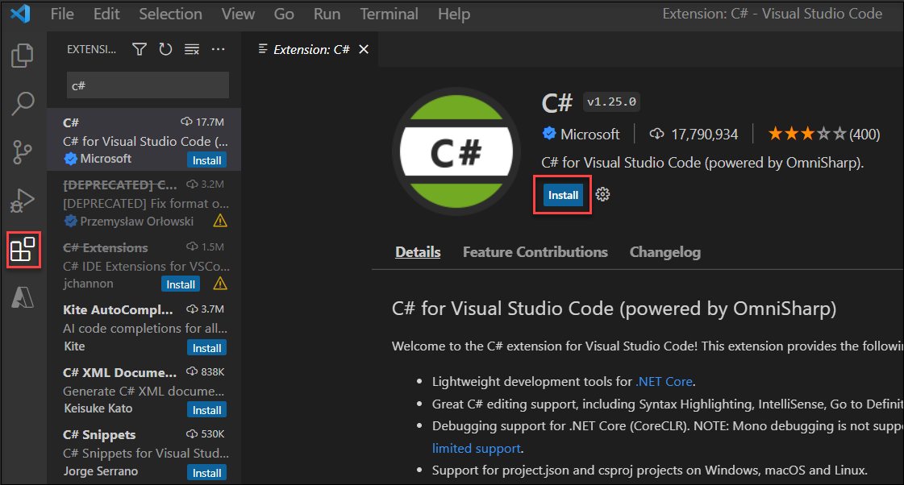

# Lab 04: Construct a polyglot data solution

## Architecture diagram


## Lab setup and pre-requisites

Before starting this lab, you must complete **Prerequisites** of this lab.

To install **C#** extension for this lab, follow the below steps in visual studio code:

1. Start Visual Studio Code (the program icon is pinned to the bottom taskbar).

     

2. Select the **Extensions** blade from the left panel.
3. Search with **C#** and select **Install** to install the extension.

    

4. After installing C# extensions, close the Visual studio code.

### Exercise 1: Creating data store resources in Azure

#### Task 1: Open the Azure portal

1. If you are not logged in already, click on Azure portal shortcut that is available on the desktop and log in with Azure credentials.

1. To get the Azure credentials select the **Environment Details** tab from the lab environment details page.

    
    
1. On the Welcome to Microsoft Edge page, select **Start without your data** and on the help for importing Google browsing data page, select the **Continue without this data** button. Then, proceed to select **Confirm and start browsing** on the next page.

#### Task 2: Create an Azure Cosmos DB account resource

1.  On the **Search resources, services, and docs** text box to search for **Azure Cosmos DB** and then in the list of results, select **Azure Cosmos DB**.

1.  On the **Azure Cosmos DB** blade, select **+ Create**.

1.  On the **Select API option** blade, select **Core (SQL) - Recommended**.

1.  On the **Basics** tab of the **Create Azure Cosmos DB Account - Azure Cosmos DB for NoSQL** page, perform the following actions, and then select **Review + Create**:

    | Setting                     | Action                                                       |
    | --------------------------- | ------------------------------------------------------------ |
    | **Subscription** list       | Retain defaults.                                             |
    | **Resource group** section  | Select existing rg **PolyglotData-DeploymentID**                       |
    | **AccountName** text box    | Enter **polycosmos{DeploymentID}**                                      |
    | **Location** drop-down list | leave default and make a note of it|
    | **Capacity mode** section   | Select **Serverless**. |
    
    >Note : Deployment ID can be found in the environment tab
    
    The following screenshot displays the configured settings on the **Create Azure Cosmos DB Account - Azure Cosmos DB for NoSQL** page.
    
    
    
1.  On the **Review** tab of the **Create Azure Cosmos DB Account - Azure Cosmos DB for NoSQL** page, review the options that you selected during the previous steps. 

1.  Select **Create** to create the Azure Cosmos DB account by using your specified configuration.

    > **Note**: Wait for the creation task to complete before you move forward with this lab.

1.  In the Azure portal, navigate back to the **Azure Cosmos DB** blade and, in the Cosmos DB accounts list, select the newly created **polycosmos{DeploymentID}** Azure Cosmos DB account.

1.  On the **Azure Cosmos DB account** blade, find the **Settings** section, and then select the **Keys** link.

1.  In the **Keys** pane, on the **Read-write Keys** tab, record the values of the **URI**, **PRIMARY KEY**, and **PRIMARY CONNECTION STRING** text boxes. You'll use these values later in this lab.

#### Task 3: Create an Azure Storage account resource

1.  In the Azure portal, use the **Search resources, services, and docs** text box to search for **Storage accounts** and, in the list of results, select **Storage accounts**.

1.  On the **Storage accounts** blade, select **+ Create**.

1.  On the **Basics** tab of the **Create a storage account** blade, perform the following actions, and then select **Review + Create**:

    | Setting                           | Action                                                       |
    | --------------------------------  | ------------------------------------------------------------ |
    | **Subscription** list             | Retain defaults.                                             |
    | **Resource group** section        | Select **PolyglotData-{DeploymentID}**.                                     |
    | **Storage account name** text box | Enter **polystor{DeploymentID}**.                                 |
    | **Region** drop-down list         | Select the same region where you created the Cosmos DB account earlier in this exercise.  |
    | **Performance** section           | Select **Standard**. |
    | **Redundancy** drop-down list     | Select **Locally-redundant storage (LRS)**. |
    
     >Note : DeploymentID (DID) can be found under the environment tab
    
    The following screenshot displays the configured settings on the **Create a storage account** blade.
          
     
     
1.  On the **Review + Create** tab of the **Create a storage account** blade, review the options that you selected during the previous steps.

1.  Select **Create** to create the storage account by using your specified configuration.

    > **Note**: Wait for the creation task to complete before you proceed with this lab.

#### Review

In this exercise, you created the Azure resources that you'll need for the polyglot data solution you'll implement in this lab. The Azure resources you created include an Azure Cosmos DB account and an Azure Storage account.

### Exercise 2: Review and upload data

#### Task 1: Upload images to Azure Blob Storage

1.  In the Azure portal's navigation pane, navigate back to the **Storage accounts** blade, and then select the **polystor{DeploymentID}** storage account that you created in this lab's previous exercise.

1.  On the **polystorDID** storage account blade, select the **Containers** link in the **Data storage** section.

1.  In the **Containers** section, select **+ Container**.

1.  In the **New container** pop-up window, perform the following actions, and then select **Create**:

    | Setting                     | Action                                                             |
    | --------------------------- | ------------------------------------------------------------       |
    | **Name** text box           | Enter **images**.                                                  |
    | **Public access level** drop-down list | Select **Blob (anonymous read access for blobs only)**. |
    
   
1.  Back in the **Containers** section, select the newly created **images** container.

1.  Find the **Settings** section on the **Container** blade, and then select the **Properties** link.

1.  In the **Properties** pane, note and record the value in the **URL** text box. You'll use this value later in this lab.

1.  Find and select the **Overview** link on the blade.

1.  On the blade, select **Upload**.

1.  In the **Upload blob** pop-up, perform the following actions:
    
    a.  In the **Files** section, select the **Folder** icon.
    
    b.  In the **File Explorer** window, browse to **C:\AllFiles\AZ-204-DevelopingSolutionsforMicrosoftAzure-master\Allfiles\Labs\04\Starter\Images**, select all 42 individual **.jpg** image files, and then select **Open**.
    
    c.  Ensure that **Overwrite if files already exist** is selected, and then select **Upload**.

    > **Note**: Wait for all blobs to upload before you continue with this lab.

#### Task 2: Review JSON data

1.  From the lab computer, start **Visual Studio Code**.

1.  From the **File** menu, select **Open File**, browse to **C:\AllFiles\AZ-204-DevelopingSolutionsforMicrosoftAzure-master\Allfiles\Labs\04\Solution\AdventureWorks\AdventureWorks.Upload**, select **models.json**, and then select **Open**.

1. On the **Visual Studio Code** pop-up select **Yes, I trust the authors**.

1.  Review the format of the **models.json** file and note that it contains an array of JSON objects, with a nested array of objects that are part of the **Products** property.

    > **Note**: This will determine the classes you'll define to deserialize the JSON file's contents before uploading it to a Cosmos DB collection.

1.  Within the **models.json** file, note that one of the properties is named **Category**.

    > **Note**: You'll use the **Category** property to define partitioning of the target Cosmos DB collection.

1.  Close Visual Studio Code.

#### Task 3: Create a Cosmos DB database and collection, and perform a JSON data upload

1.  On the **Start** screen, select the **Visual Studio Code** tile.

1.  From the **File** menu, select **Open Folder**.

1.  In the **File Explorer** window that opens, browse to **C:\AllFiles\AZ-204-DevelopingSolutionsforMicrosoftAzure-master\Allfiles\Labs\04\Solution\AdventureWorks**, and then select **Select Folder**.

1.  In the **Visual Studio Code** window, select an empty area of the **Explorer** pane, activate the shortcut menu, and then select **Open in Integrated Terminal**.

1.  From the terminal prompt, verify that the current directory is set to **AdventureWorks** (or change it to that if it's not), and then run the following command to switch your terminal context to the **AdventureWorks.Upload** folder:

    ```
    cd .\AdventureWorks.Upload\
    ```

1.  From the terminal prompt, run the following command to add the Azure Cosmos DB .NET client library to the currently opened project:

    ```
    dotnet add package Microsoft.Azure.Cosmos --version 3.28.0
    ```

    > **Note**: The **dotnet add package** command will add the **Microsoft.Azure.Cosmos** package from **NuGet**. For more information, refer to [Microsoft.Azure.Cosmos](https://www.nuget.org/packages/Microsoft.Azure.Cosmos).

1.  Observe the results of the build printed in the terminal. The build should complete successfully with no errors or warning messages.

1.  In the **Explorer** pane of the **Visual Studio Code** window, expand the **AdventureWorks.Upload** project.

1.  Open the **Program.cs** file.

1.  In the **Program.cs** file, review the **using** directives and note that they include **Microsoft.Azure.Cosmos**, **System.IO;**, **System.Text.Json**, **System.Threading.Tasks**, and **System.Collections.Generic**. This enables asynchronous upload of JSON items from a local file on your lab computer to a collection in a Cosmos DB database.

1.  In the **Program.cs** file, on line 14, set the value of **EndpointUrl** by replacing the empty string with the **URI** property of the Cosmos DB account that you recorded earlier in this lab. Ensure that the value is enclosed in double-quotes.

1.  On line 15, set the value of **AuthorizationKey** by replacing the empty string with the **PRIMARY KEY** property of the Cosmos DB account that you recorded earlier in this lab. Ensure that the value is enclosed in double-quotes.

1.  On line 18, set the value of **PartitionKey** by replacing the empty string with **"/Category"**.

1.  On line 19, set the value of **JsonFilePath** by replacing the empty string with the given below path.

     ```
    C:\\AllFiles\\AZ-204-DevelopingSolutionsforMicrosoftAzure-master\\Allfiles\\Labs\\04\\Starter\\AdventureWorks\\AdventureWorks.Upload\\Models.json
    ```
    >Note : Verify the JsonPath accordingly and also make sure the path contains two **\\\**.

1.  Within the try block, note the invocation of the **CreateDatabaseIfNotExistsAsync** method of the **CosmosClient** class. This will create a database if one doesn't already exist.

1.  Note the invocation of the **DefineContainer** method of the **Database** class. This will create a container that will host the JSON items if one doesn't already exist.

    > **Note**: The **DefineContainer** method includes a cost-minimizing option whereby you can modify the default indexing policy (which automatically indexes all attributes).

1.  Note the **using** statement that relies on a **StreamReader** object to read JSON items from a text file and deserializes them into objects of the **Model** class defined further in the **Program.cs** file.

1.  Note the for each loop that iterates over the collection of deserialized objects and asynchronously inserts each of them into the target collection.

1.  Review the **Model** and **Product** classes that reflect the format of the objects stored in the JSON-formatted file you reviewed earlier in this lab.

1.  Save and close the **Program.cs** file.

1.  From the terminal prompt, run the following command to restore any missing NuGet packages and build the project in the folder:

    ```
    dotnet build
    ```

    > **Note**: The **dotnet build** command will automatically restore any missing NuGet packages prior to building all projects in the folder.

1.  From the terminal prompt, run the following command to run the .NET Core console application:

    ```
    dotnet run
    ```

    > **Note**: The **dotnet run** command will automatically build any changes to the project and then start the web application without a debugger attached. The command will output the messages indicating the data load's progress, including the number of items inserted into the target collection and the duration of the insert operation.

1.  Observe the results of running the command printed in the terminal. The run should complete successfully, displaying the message about there being 119 items inserted into the target Cosmos DB collection.

1.  Select **Kill Terminal** (the **Recycle Bin** icon) to close the terminal pane and any associated processes.

#### Task 4: Validate JSON data upload

1.  On your lab computer, switch to the **Microsoft Edge** browser window displaying the Azure portal.

1.  In the Azure portal, navigate back to the **Azure Cosmos DB** blade and, in the Cosmos DB accounts list, select the **polycosmosDID** Azure Cosmos DB account that you created earlier in this lab.

1.  On the **Azure Cosmos DB account** blade, find and select the **Data Explorer** link on the blade.

1.  In the **Data Explorer** pane, expand the **Retail** database node.

1.  Expand the **Online** container node, and then select **New SQL Query**.

    > **Note**: The label for this option might be hidden. You can display labels by hovering over the icons in the **Data Explorer** pane.

1.  On the query tab, enter the following text:

    ```sql
    SELECT * FROM models
    ```

1.  Select **Execute Query**, and then observe the list of JSON items returned by the query.

1.  Back in the query editor, replace the existing text with the following text:

    ```sql
    SELECT VALUE COUNT(1) FROM models
    ```

1.  Select **Execute Query**, and then observe the result of the **COUNT** aggregate operation.

1.  Switch back to the **Visual Studio Code** window.

#### Review

In this exercise, you used the .NET SDK for Azure Cosmos DB to insert data into Azure Cosmos DB. The web application that you implement next will use this data.

### Exercise 3: Configure a .NET web application

#### Task 1: Update references to data stores and build the web application

1.  In the **Explorer** pane of the **Visual Studio Code** window, expand the **AdventureWorks.Web** project.

1.  Open the **appsettings.json** file.

1.  In the JSON object on line 3, find the **ConnectionStrings.AdventureWorksCosmosContext** path. Note that the current value is empty:

    ```json
    "ConnectionStrings": {
        "AdventureWorksCosmosContext": ""
    },
    ```

1.  Update the value of the **AdventureWorksCosmosContext** property by setting its value to the **PRIMARY CONNECTION STRING** of the Azure Cosmos DB account that you recorded earlier in this lab.

1.  In the JSON object on line 6, find the **Settings.BlobContainerUrl** path. Note that the current value is empty:

    ```json
    "Settings": {
        "BlobContainerUrl": ""
    }
    ```

1.  Update the **BlobContainerUrl** property by setting its value to the **URL** property of the Azure Storage blob container named **images** that you recorded earlier in this lab.

1.  Save the **appsettings.json** file and close it.

1.  In the **Visual Studio Code** window, select an empty area of the **Explorer** pane, activate the shortcut menu, and then select **Open in Integrated Terminal**.

1.  From the terminal prompt, verify that the current directory is set to **AdventureWorks.Context** (or change it to that if it's not), and then run the following command to import **Microsoft.Azure.Cosmos** from NuGet:

    ```
    dotnet add package Microsoft.Azure.Cosmos --version 3.28.0
    ```

1.  From the terminal prompt, run the following command to build the .NET web application:

    ```
    dotnet build
    ```

1.  Observe the results of the build printed in the terminal. The build should complete successfully with no errors or warning messages.

#### Task 2: Configure connectivity to Azure Cosmos DB

1.  In the **Explorer** pane of the **Visual Studio Code** window, expand the **AdventureWorks.Context** project and select **AdventureWorksCosmosContext.cs**.

1.  From the code editor tab for the **AdventureWorksCosmosContext.cs** file, review the file but do not make any changes:

    ```
    using AdventureWorks.Models;
    using Microsoft.Azure.Cosmos;
    using Microsoft.Azure.Cosmos.Linq;
    using System;
    using System.Collections.Generic;
    using System.Linq;
    using System.Threading.Tasks;

    namespace AdventureWorks.Context
    {
        public class AdventureWorksCosmosContext : IAdventureWorksProductContext
        {
            private readonly Container _container;

            public AdventureWorksCosmosContext(string connectionString, string database = "Retail", string container = "Online")
            {
                _container = new CosmosClient(connectionString)
                    .GetDatabase(database)
                    .GetContainer(container);
            }
            public async Task<Model> FindModelAsync(Guid id)
            {
                var iterator = _container.GetItemLinqQueryable<Model>()
                    .Where(m => m.id == id)
                    .ToFeedIterator<Model>();

                List<Model> matches = new List<Model>();
                while (iterator.HasMoreResults)
                {
                    var next = await iterator.ReadNextAsync();
                    matches.AddRange(next);
                }

                return matches.SingleOrDefault();
            }

            public async Task<List<Model>> GetModelsAsync()
            {
                string query = $@"SELECT * FROM items";

                var iterator = _container.GetItemQueryIterator<Model>(query);

                List<Model> matches = new List<Model>();
                while (iterator.HasMoreResults)
                {
                    var next = await iterator.ReadNextAsync();
                    matches.AddRange(next);
                }

                return matches;
            }

            public async Task<Product> FindProductAsync(Guid id)
            {
                string query = $@"SELECT VALUE products
                                    FROM models
                                    JOIN products in models.Products
                                    WHERE products.id = '{id}'";

                var iterator = _container.GetItemQueryIterator<Product>(query);

                List<Product> matches = new List<Product>();
                while (iterator.HasMoreResults)
                {
                    var next = await iterator.ReadNextAsync();
                    matches.AddRange(next);
                }

                return matches.SingleOrDefault();
            }
        }
    }
    ```
1.  Close the **AdventureWorksCosmosContext.cs** file.
   
1.  From the terminal prompt, with the current directory set to **AdventureWorks.Context**, run the following command to build the .NET web application:

    ```
    dotnet build
    ```

    > **Note**: If there are any build errors, review the **AdventureWorksCosmosContext.cs** 

#### Task 3: Review the .NET application startup logic

1.  In the **Explorer** pane of the **Visual Studio Code** window, expand the **AdventureWorks.Web** project.

1.  Open the **Startup.cs** file.

1.  In the **Startup** class, note the existing **ConfigureProductService** method:

    ```csharp
    public void ConfigureProductService(IServiceCollection services)
    {
        services.AddScoped<IAdventureWorksProductContext, AdventureWorksSqlContext>(provider =>
            new AdventureWorksCosmosContext(
                _configuration.GetConnectionString(nameof(AdventureWorksCosmosContext))
            )
        );
    }
    ```

    > **Note**: The product service uses Cosmos DB as its database.

1.  Close the **Startup.cs** file without making any modifications.

#### Task 4: Validate that the .NET application successfully connects to data stores

1.  In Visual Studio Code, from the terminal prompt, run the following command to switch your terminal context to the **AdventureWorks.Web** folder:

    ```
    cd ..\AdventureWorks.Web\
    ```

1.  From the terminal prompt, run the following command to run the ASP.NET web application:

    ```
    dotnet run
    ```

    > **Note**: The **dotnet run** command will automatically build any changes to the project and then start the web application without a debugger attached. The command will output the URL of the running application and any assigned ports.

1.  On the taskbar, select the **Microsoft Edge** icon.

1.  In the open browser window, browse to the currently running web application (<http://localhost:5000>).

1.  In the web application, observe the list of models displayed on the front page.

1.  Find the **Touring-1000** model, and then select **View Details**.

1.  On the **Touring-1000** product detail page, review the listing of options.

1.  Close the browser window displaying your web application.

1.  Switch to the **Visual Studio Code** window, and then select **Kill Terminal** (the **Recycle Bin** icon) to close the currently open terminal and any associated processes.

#### Review

In this exercise, you wrote C# code to query an Azure Cosmos DB collection by using the .NET SDK.

