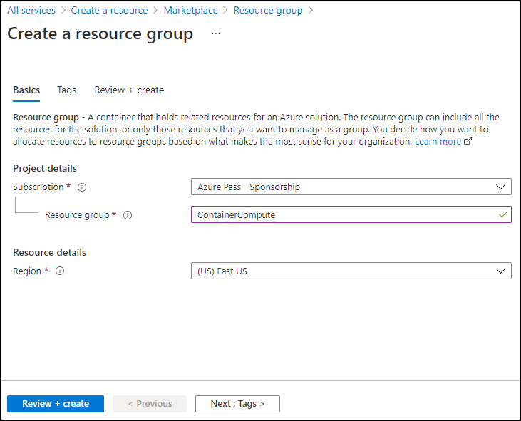
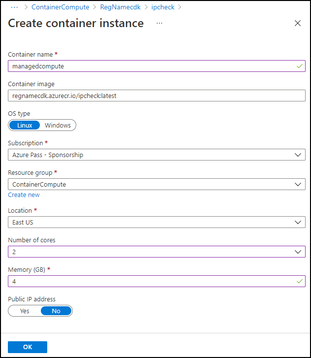
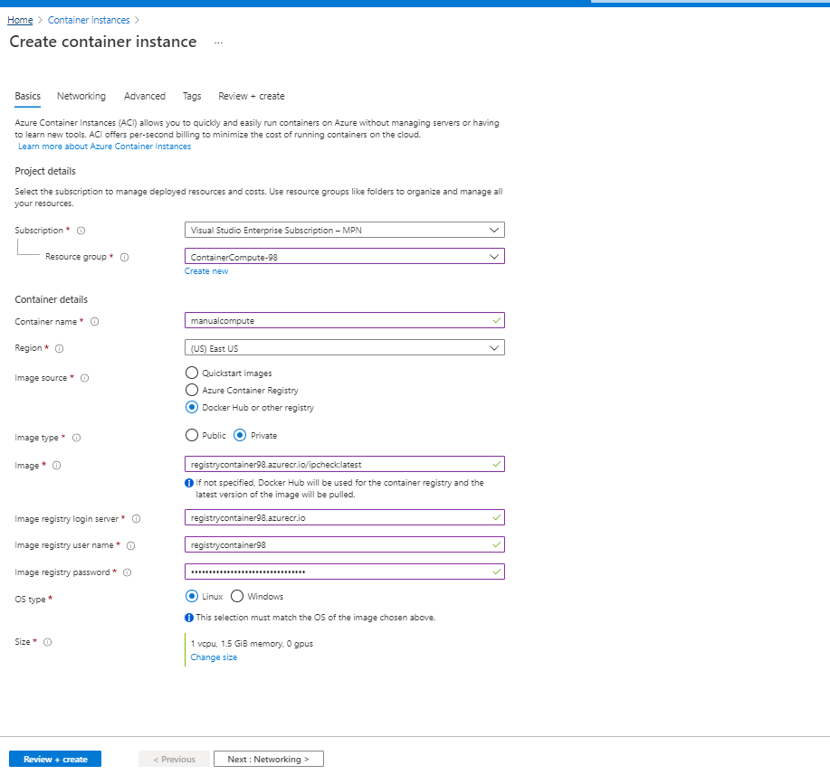

---
lab:
    az204Title: 'Lab 05: Deploy compute workloads by using images and containers'
    az204Module: 'Learning Path 05: Implement containerized solutions'
---

# Lab 05: Deploy compute workloads by using images and containers

## Microsoft Azure user interface

Given the dynamic nature of Microsoft cloud tools, you might experience Azure UI changes that occur after this training content's development. As a result, the lab instructions and lab steps might not align correctly.

Microsoft updates this training course when the community alerts us to needed changes. However, cloud updates occur frequently, so you might encounter UI changes before this training content updates. **If this occurs, adapt to the changes, and then work through them in the labs as needed.**

## Instructions

### Before you start

#### Sign in to the lab environment

Sign in to your Windows 11 virtual machine (VM) by using the following credentials:

- Username: `Admin`
- Password: `Pa55w.rd`

> **Note**: Your instructor will provide instructions to connect to the virtual lab environment.

#### Review the installed applications

Find the taskbar on your Windows 11 desktop. The taskbar contains the icons for the applications that you'll use in this lab, including:

-   Microsoft Edge
-   File Explorer

## Lab Scenario

In this lab, you will explore how to create and deploy containers to the Azure Container Registry using a .NET application and docker files. And also deploy a containerized solution to Azure Container Apps.

## Architecture diagram


### Exercise 1: Create a Docker container image and deploy it to Azure Container Registry

#### Task 1: Open the Azure portal

1. On the taskbar, select the **Microsoft Edge** icon.

1. In the open browser window, navigate to the Azure portal at `https://portal.azure.com`, and then sign in with the account you'll be using for this lab.

   > **Note**: If this is your first time signing in to the Azure portal, you'll be offered a tour of the portal. If you prefer to skip the tour, select **Get Started** to begin using the portal.

#### Task 2: Create a resource group

1. On the Azure portal's navigation pane, use the **Search resources, services, and docs** text box to search for **Resource group**, and then in the list of results, select **Resource groups**.

1. On the **Resource groups** blade, select **Create**.

1. On the **Create a resource group** blade, on the **Basics** tab, perform the following actions, and then select **Review + create**:

    | Setting | Action |
    | -- | -- |
    | **Subscription** drop-down list | Retain the default value  |
    | **Resource group** text box | Enter **ContainerCompute** |
    | **Region** drop-down list | Select **(US) East US** |

    The following screenshot displays the configured settings on the **Create a resource group** blade.

    

1. On the **Review + create** tab, review the options that you selected during the previous steps.

1. Select **Create** to create the resource group by using your specified configuration.  

    > **Note**: Wait for the creation task to complete before moving forward with this lab.


#### Task 3: Initiate the source project

1. On the taskbar, select the **Terminal** icon.

1. Run the following command to change the current directory to the **Allfiles (F):\\Allfiles\\Labs\\05\\Starter** directory:

    ```powershell
    cd F:\Allfiles\Labs\05\Starter
    ```

1. Run the following command to create a new .NET console application in the current directory using .NET 8.0:

    ```powershell
    dotnet new console --output . --name ipcheck --framework net8.0
    ```

1. Run the following command to create a new file in the current directory named **Dockerfile**:

    ```powershell
    New-Item -ItemType File Dockerfile
    ```

1. Run the following command to open the current directory in Visual Studio Code:

    ```powershell
    code .
    ```

#### Task 4: Create and test a .NET application

1. On the **Explorer** pane of the **Visual Studio Code** window, open the **Program.cs** file.

1. Delete the entire contents of the **Program.cs** file.

1. Copy and paste the following code into the **Program.cs** file:

    ```csharp
    // Check if network is available
    if (System.Net.NetworkInformation.NetworkInterface.GetIsNetworkAvailable())
    {
        System.Console.WriteLine("Current IP Addresses:");

        // Get host entry for current hostname
        string hostname = System.Net.Dns.GetHostName();
        System.Net.IPHostEntry host = System.Net.Dns.GetHostEntry(hostname);
        
        // Iterate over each IP address and render their values
        foreach(System.Net.IPAddress address in host.AddressList)
        {
            System.Console.WriteLine($"\t{address}");
        }
    }
    else
    {
        System.Console.WriteLine("No Network Connection");
    }
    ```

1. Save the **Program.cs** file.

1. Delete the **Starter.sln** file.

    > **Note**: This will eliminate the need to explicitly reference the .csproj file when using dotnet commands.

1. Switch to the **Terminal** application.

1. Run the following command to execute the application:

    ```powershell
    dotnet run
    ```

1. Review the results. At least one IP address should be listed, representing the IP address assigned to your computer.

1. Switch back to From the **Visual Studio Code** window and, from the **Explorer** pane, open the **Dockerfile** file.

1. Copy and paste the following code into the **Dockerfile** file:

    ```
    # Start using the .NET 8.0 SDK container image
    FROM mcr.microsoft.com/dotnet/sdk:8.0 AS build

    # Change current working directory
    WORKDIR /app

    # Copy existing files from host machine
    COPY . ./

    # Publish application to the "out" folder
    RUN dotnet publish --configuration Release --output out

    # Start container by running application DLL
    ENTRYPOINT ["dotnet", "out/ipcheck.dll"]
    ```

1. Save the **Dockerfile** file.

    > **Note**: Next, you will create an archive containing all of the project file. This will simplify upload the project files into Cloud Shell.

1. Switch to the **Terminal** application.

1. Run the following command to execute the application:

    ```powershell
    Compress-Archive -Path .\* -DestinationPath .\lab05.zip
    ```

#### Task 5: Create a Container Registry resource

1. Switch to the browser window displaying the Azure portal. 

1. In the Azure portal, select the **Cloud Shell** icon  to open a the Cloud Shell. If Cloud Shell defaults to a PowerShell session, select **Switch to Bash** in the **Cloud Shell** menu and then select **Confirm**.

    > **Note**: The **Cloud Shell** icon is represented by a greater than sign (\>) and underscore character (\_).

    If this is the first time you're starting **Cloud Shell** you will be presented with a series of prompts to create the resource. Perform the actions presented in the following table:

    | Prompt | Action |
    |--|--|
    | Welcome to Azure Cloud Shell | Select **Bash**. |
    | Getting Started | Select **Mount storage account**, then select your **Storage account subscription** from the drop-down, and finally select **Apply**. |
    | Mount storage account | Select **We will create a storage account for you**, and then select **Next**. |

1. In the **Cloud Shell** pane, select **Manage files** and, in the drop-down menu, select **Upload**.

1. In the **Open** dialog box, navigate to the **Allfiles (F):\\Allfiles\\Labs\\05\\Starter** empty directory, select **lab05.zip**, and then select **Open**.

    > **Note**: This will upload the file to the **/~** directory within the **Cloud Shell** session.

1. At the **Cloud Shell** command prompt in the portal, run the following command to create a new directory named **ipcheck** in the **\~** directory:

    ```bash
    mkdir ~/ipcheck
    ```

1. Run the following command to extract the content of the uploaded archive to the newly created directory **\~/ipcheck**:

    ```bash
    unzip ~/lab05.zip -d ~/ipcheck
    ```

1. Run the following command to set the read and execute permissions on the entire extracted content in the **\~/ipcheck** directory:

    ```bash
    chmod -R +xr ~/ipcheck
    ```

1. Run the following command to change the current directory to **\~/ipcheck**:

    ```bash
    cd ~/ipcheck
    ```

1. At the **Cloud Shell** command prompt in the portal, run the following command to create a variable with a unique value for the Container Registry resource: 

    ```bash
    registryName=conregistry$RANDOM
    ```

1. At the **Cloud Shell** command prompt in the portal, run the following command to verify the name created in the previous step is available: 

    ```bash
    az acr check-name --name $registryName
    ```

    If the results show the name is available, continue to the next step. If the name is not available then re-run the command in the previous step and verify availability again.

1. At the **Cloud Shell** command prompt in the portal, run the following command to create a Container Registry resource: 

    ```bash
    az acr create --resource-group ContainerCompute --name $registryName --sku Basic
    ```

    > **Note**: Wait for the creation task to complete before you continue with this lab.

#### Task 6: Store Container Registry metadata

1. At the **Cloud Shell** command prompt in the portal, run the following command to get a list of all container registries in your subscription:

    ```
    az acr list --resource-group ContainerCompute
    ```

1. Run the following command, ensuring you see the name of your registry as output. If you see no output other than '[]', wait a minute and try running the command again.

    ```
    az acr list --resource-group ContainerCompute --query "max_by([], &creationDate).name" --output tsv
    ```

1. Run the following command:

    ```
    acrName=$(az acr list --resource-group ContainerCompute --query "max_by([], &creationDate).name" --output tsv)
    ```

1. Run the following command:

    ```
    echo $acrName
    ```

#### Task 7: Deploy a Docker container image to Container Registry

1. Run the following command to change the active directory from **\~/** to **\~/ipcheck**:

    ```
    cd ~/ipcheck
    ```

1. Run the following command to get the contents of the current directory:

    ```
    dir
    ```

1. Run the following command to upload the source code to your container registry and build the container image as a Container Registry task:

    ```
    az acr build --registry $acrName --image ipcheck:latest .
    ```

    > **Note**: Wait for the build task to complete before moving forward with this lab.

1. Close the **Cloud Shell** pane in the portal.

#### Task 8: Validate your container image in Container Registry

1. On the Azure portal's **navigation** pane, select the **Resource groups** link.

1. From the **Resource groups** blade, select the **ContainerCompute** resource group that you created previously in this lab.

1. From the **ContainerCompute** blade, select the container registry that you created previously in this lab.

1. From the **Container Registry** blade, in the **Services** section, select the **Repositories** link.

1. In the **Repositories** section, select the **ipcheck** container image repository, and then select the **latest** tag.

1. Review the metadata for the version of your container image with the **latest** tag.

    > **Note**: You can also select the **Run ID** link to find metadata about the build task.

#### Review

In this exercise, you created a .NET console application to display a machine’s current IP address. You then added the **Dockerfile** file to the application so that it could be converted into a Docker container image. Finally, you deployed the container image to Container Registry.

### Exercise 2: Deploy an Azure container instance

#### Task 1: Enable the admin user in Container Registry

1. In the **ContainerCompute** resource group, select the container registry that you created previously in this lab, and then select the **Access keys** blade.

1. Toggle the switch in the admin user section to enable the admin user for this container registry.

#### Task 2: Automatically deploy a container image to an Azure container instance

1. On the **Container Registry** blade, in the **Services** section, select the **Repositories** link.

1. In the **Repositories** section, select the repository containing the **ipcheck** container image.

1. On the repository blade, in the **Settings** section, select **Access keys**.

1. On the **Access key** blade, select the **Admin user** checkbox.

1. On the repository blade, in the **Services** section, select **Repositories**. 

1. In the list of repositories, select **ipcheck**.

1. On the **ipcheck** pane, select the ellipsis menu associated with the **latest** tag entry, and then select **Run instance**.

1. On the **Create container instance** blade, perform the following actions, and then select **Create**:

    | Setting | Action |
    | -- | -- |
    | **Container name** text box | Enter **managedcompute** |
    | **Container image** text box | Retain the default value |
    | **OS type** section | Select **Linux** |
    | **Subscription** text box | Retain the default value |
    | **Resource group** drop-down list | Select **ContainerCompute** |
    | **Location** drop-down list | Select **East US** |
    | **Number of cores** drop-down list | Select **2** |
    | **Memory (GB)** text box | Enter **4** |
    | **Public IP address** section | Select **No** |

    The following screenshot displays the configured settings on the **Create container instance** blade.

    

    > **Note**: Wait for the container instance to be created before you continue with this lab.

#### Task 3: Manually deploy a container image to Container Instances

1. On the Azure portal's **navigation** pane, select the **Create a resource** link.

1. On the **Create a resource** blade, in the **Search services and marketplace** text box, enter **container instances**, and then select Enter.

1. On the **Marketplace** search results blade, select the **Container Instances** result.

1. On the **Container Instances** blade, select **Create**.

1. On the **Create Container Instance** blade, on the **Basics** tab, perform the following actions, and then select **Review + create**:

    | Setting | Action |
    | -- | -- |
    | **Subscription** drop-down list | Retain the default value |
    | **Resource group** drop-down list | Select **ContainerCompute** |
    | **Container name** text box | Enter **manualcompute** |
    | **Region** drop-down list | Select **(US) East US** |
    | **Image source** section | Select **Azure Container Registry** |
    | **Registry** drop-down list | Select the **Azure Container Registry** resource that you created previously in this lab |
    | **Image** drop-down list | Select **ipcheck** |
    | **Image tag** drop-down list | Select **latest** |
    | **Size : cores**  | Enter **2** |
    | **Size : Memory (GiB)** | Enter **4** |

    The following screenshot displays the configured settings on the **Create container instance** blade.

    

1. From the **Review + create** tab, review the selected options.

1. Select **Create** to create the container instance by using your specified configuration.  

    > **Note**: Wait for the container instance to be created before you continue with this lab.


#### Task 4: Validate that the container instance ran successfully

1. On the Azure portal's navigation pane, select the **Resource groups** link.

1. On the **Resource groups** blade, select the **ContainerCompute** resource group that you created previously in this lab.

1. On the **ContainerCompute** blade, select the **manualcompute** container instance that you created previously in this lab.

1. On the **Container Instances** blade, in the **Settings** section, select the **Containers** link.

1. In the **Containers** section, review the list of **Events**.

1. Select the **Logs** tab, and then review the text logs from the container instance.

> **Note**: You can also optionally find the **Events** and **Logs** from the **managedcompute** container instance.

> **Note**: It is possible that **manualcompute** and **managedcompute** will not contain any events at this point.

> **Note**: After the application finishes running, the container terminates because it has completed its work. For the manually created container instance, you indicated that a successful exit was acceptable, so the container ran once. The automatically created instance didn't offer this option, and it assumes the container should always be running, so you'll notice repeated restarts of the container.

#### Review

In this exercise, you used multiple methods to deploy a container image to an Azure container instance. By using the manual method, you were able to customize the deployment further and to run task-based applications as part of a container run.


### Exercise 3: Create a secure Container Apps environment and deploy container app.

#### Task 1: Prepare your environment

1. Sign in to the Azure portal.

1. Select the **Cloud Shell** icon, select the **Bash** environment.

1. In the **Cloud Shell** command prompt in the portal, run the following command to install the Azure Container Apps extension for the CLI: 

    ```bash
    az extension add --name containerapp --upgrade
    ```

1. Run the following command to register the Microsoft.App namespace: 

    ```bash
    az provider register --namespace Microsoft.App
    ```
   
   > **Note**: Azure Container Apps resources have migrated from the **Microsoft.Web** namespace to the **Microsoft.App** namespace.

1. Run the following command to Register the **Microsoft.OperationalInsights** provider for the Azure Monitor Log Analytics workspace if you haven't used it before: 

    ```bash
    az provider register --namespace Microsoft.OperationalInsights
    ```

    > **Note**: Registering the **Microsoft.App** namespace and **Microsoft.OperationalInsights** can each take a few minutes to complete.

1. Set environment variables used later in this exercise. 
   
   ```bash
     myRG=ContainerCompute
     myAppContEnv=az204-env-$RANDOM
    ```

With the CLI upgraded and environment variables created, you can create a Container Apps environment and deploy your container app.

#### Task 2: Create an environment

An environment in Azure Container Apps creates a secure boundary around a group of container apps. Container Apps deployed to the same environment are deployed in the same virtual network and write logs to the same Log Analytics workspace.

1. In the **Cloud Shell** command prompt in the portal, run the following command to create an environment by using the `az containerapp env` create command: 

    ```bash
    az containerapp env create \
        --name $myAppContEnv \
        --resource-group $myRG \
        --location eastus
    ```

#### Task 3: Create a container app

After the container app environment finishes deployment, you deploy a container image to Azure Container Apps.

1. In the **Cloud Shell** command prompt in the portal, run the following command to deploy a sample app container image by using the `az containerapp create` command: 

    ```bash
    az containerapp create \
        --name my-container-app \
        --resource-group $myRG \
        --environment $myAppContEnv \
        --image mcr.microsoft.com/azuredocs/containerapps-helloworld:latest \
        --target-port 80 \
        --ingress 'external' \
        --query properties.configuration.ingress.fqdn
    ```
By setting `--ingress` to `external`, you make the container app available to public requests. The command returns a link to access your app.

1. Select the link returned by the `az containerapp create` command to verify the container app is running.

