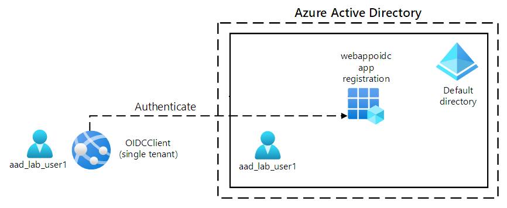
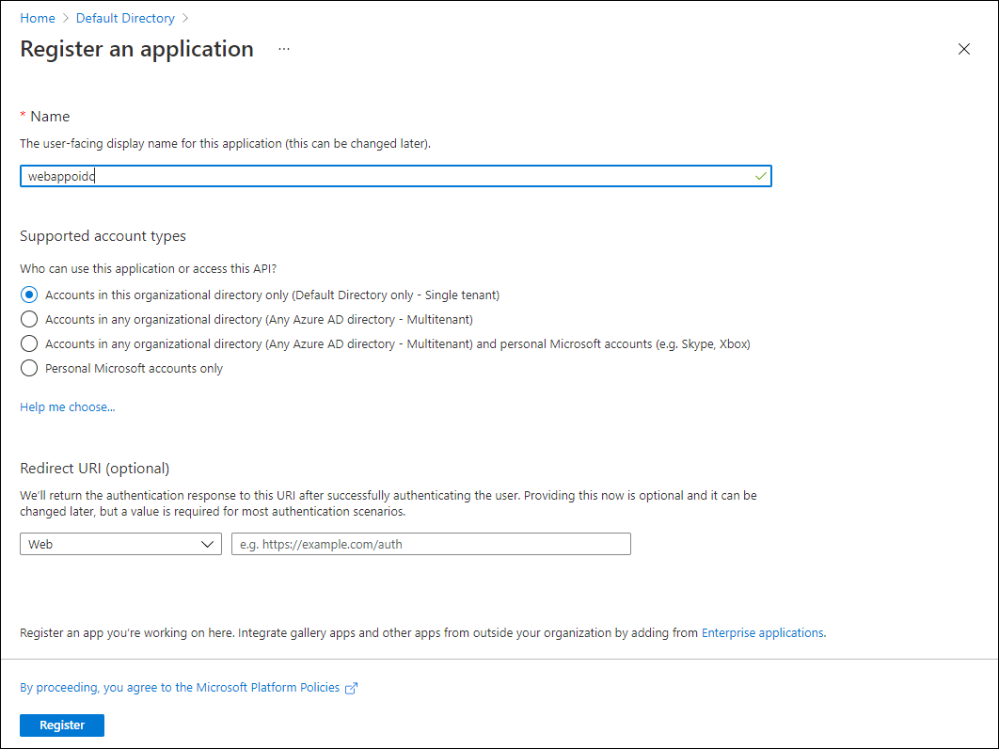
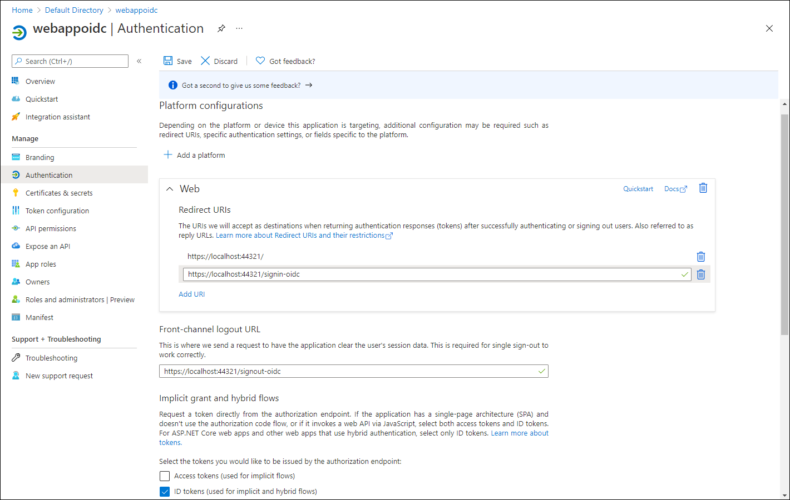

---
lab:
    az204Title: 'Lab 06: Authenticate by using OpenID Connect, MSAL, and .NET SDKs'
    az020Title: 'Lab 06: Authenticate by using OpenID Connect, MSAL, and .NET SDKs'
    az204Module: 'Module 06: Implement user authentication and authorization'
    az020Module: 'Module 06: Implement user authentication and authorization'
---

# Lab 06: Authenticate by using OpenID Connect, MSAL, and .NET SDKs

## Microsoft Azure user interface

Given the dynamic nature of Microsoft cloud tools, you might experience Azure UI changes that occur after the development of this training content. As a result, the lab instructions and lab steps might not align correctly.

Microsoft updates this training course when the community alerts us to needed changes. However, cloud updates occur frequently, so you might encounter UI changes before this training content updates. **If this occurs, adapt to the changes, and then work through them in the labs as needed.**

## Instructions

### Before you start

#### Sign in to the lab environment

Sign in to your Windows 10 virtual machine (VM) by using the following credentials:
    
-   Username: **Admin**

-   Password: **Pa55w.rd**

> **Note**: Your instructor will provide instructions to connect to the virtual lab environment.

#### Review the installed applications

Find the taskbar on your Windows 10 desktop. The taskbar contains the icons for the applications that you'll use in this lab, including:
    
-   Microsoft Edge

-   Visual Studio Code

## Ensure that your local lab environment has its time set properly (no delay, according to your timezone)

> **Note:** If you notice that your local lab environment (lab VM or your local computer) has its time delayed, please adjust its local time by using the following PowerShell command to increase the time by 15 minutes. You may need to run the powershell as an administrator.

```powershell
  Set-Date -Adjust (New-TimeSpan -Minutes 15)
```

## Architecture diagram



### Exercise 1: Configure a single-tenant Azure AD environment

#### Task 1: Open the Azure portal

1.  On the taskbar, select the **Microsoft Edge** icon.

1.  In the open browser window, browse to the Azure portal ([portal.azure.com](https://portal.azure.com)), and then sign in with the account you'll use for this lab.

    > **Note**: If this is your first time signing in to the Azure portal, you'll be offered a tour of the portal. Select **Get Started** to skip the tour and begin using the portal.

#### Task 2: Register an application in Azure AD

1.  In the Azure portal, use the **Search resources, services, and docs** text box to search for **Azure Active Directory** and, in the list of results, select **Azure Active Directory**.

    > **Note**: This redirects your browser session to the blade of the Azure Active Directory (Azure AD) tenant associated with your Azure subscription.

1.  On the **Azure Active Directory** blade, select **App registrations** in the **Manage** section.

1.  In the **App registrations** section, select **+ New registration**.

1.  In the **Register an application** section, perform the following actions, and then select **Register**:
    
    | Setting | Action |
    | -- | -- |
    | **Name** text box | Enter **webappoidc** |
    | **Supported account types** list | Select **Accounts in this organizational directory only (Default Directory only - Single tenant)** |

    > **Note**: The name of the tenant might differ depending on your Azure subscription.
   
    The following screenshot displays the configured settings in the **Register an application** section.
          
     
      
    
#### Task 3: Record unique identifiers

1.  On the **webappoidc** application registration blade, select **Overview**.

1.  In the **Overview** section, find and record the value of the **Application (client) ID** text box. You'll use this value later in the lab.

1.  In the **Overview** section, find and record the value of the **Directory (tenant) ID** text box. You'll use this value later in the lab.

#### Task 4: Configure the application authentication settings

1.  On the **webappoidc** application registration blade, select **Authentication** in the **Manage** section.

1.  In the **Authentication** section, perform the following actions, and select **Configure**:

    | Setting | Action |
    | -- | -- |
    | **Platform configurations** section | Select **+ Add a platform** |
    | **Configure platforms** blade | Select **Web** |
    | **Redirect URIs** text box | Enter `https://localhost:5001/` |
    | **Front-channel logout URL** text box | Enter `https://localhost:5001/signout-oidc` |
        
1. Back in the **Platform configurations** section, select **Add URI**, and then enter `https://localhost:5001/signin-oidc`.

1. In the **Implicit grant and hybrid flows** section, select **ID tokens (used for implicit and hybrid  flows)**. 

1. Select **Save**.

    The following screenshot displays the configured settings on the **Authentication** blade.
          
     
       

#### Task 5: Create an Azure AD user

1.  In the Azure portal, select the **Cloud Shell** icon  to open a new PowerShell session. If Cloud Shell defaults to a Bash session, select **Bash** and then, in the drop down menu, select **PowerShell**.

     > **Note**: If this is the first time you're starting **Cloud Shell**, when prompted to select either **Bash** or **PowerShell**, select **PowerShell**. When the **You have no storage mounted** message appears, select the subscription you're using in this lab, and then select **Create storage**.

1.  In the **Cloud Shell** pane, run the following command to sign in to the Azure AD tenant associated with your Azure subscription:

      ```powershell
       Connect-AzureAD
      ```

1.  Run the following command to retrieve and display the primary Domain Name System (DNS) domain name of the Azure AD tenant:

       ```powershell
       $aadDomainName = ((Get-AzureAdTenantDetail).VerifiedDomains)[0].Name
       $aadDomainName
       ```

    > **Note**: Record the value of the DNS domain name. You'll use this value later in the lab.

1.  Run the following commands to create Azure AD users that you'll use to test Azure AD authentication:

       ```powershell
       $passwordProfile = New-Object -TypeName Microsoft.Open.AzureAD.Model.PasswordProfile
       $passwordProfile.Password = 'Pa55w.rd1234'
       $passwordProfile.ForceChangePasswordNextLogin = $false
       New-AzureADUser -AccountEnabled $true -DisplayName 'aad_lab_user1' -PasswordProfile $passwordProfile -MailNickName 'aad_lab_user1' -UserPrincipalName "aad_lab_user1@$aadDomainName" 
       ```

1.  Run the following command to identify the user principal name (UPN) of the newly created Azure AD user:

       ```powershell
       (Get-AzureADUser -Filter "MailNickName eq 'aad_lab_user1'").UserPrincipalName
       ```

    > **Note**: Record the UPN. You'll use this value later in the lab.

1.  Close the Cloud Shell pane.

#### Review

In this exercise, you registered a single-tenant Azure AD application and created an Azure AD user account.

### Exercise 2: Create a single-tenant ASP.NET web app

#### Task 1: Create an ASP.NET web app project

1.  On the lab computer, start **Command Prompt**.

1.  From the command prompt, run the following commands to create and set the current directory to **Allfiles (F):\\Allfiles\\Labs\\06\\Starter\\OIDCClient**:

    ```cmd
    F:
    cd F:\Allfiles\Labs\06\Starter\OIDCClient
    ```

1.  Run the following commands to create a new .NET Core web app based on the Model View Controller (MVC) template (replace the placeholders `<application_ID>`, `<tenant_ID>`, and `<domain_Name>` with the corresponding values you recorded earlier in this lab):

    ```cmd
    dotnet new mvc --auth SingleOrg --client-id <application_ID> --tenant-id <tenant_ID> --domain <domain_Name>
    rmdir .\obj /S /Q
    ```

1.  Run the following command to start Visual Studio Code. 

    ```cmd
    code .
    ```
    > If you have been prompted **Do you trust the authors of all files in this folder?**, select **Yes, I trust the authors**.


1.  In the Visual Studio Code **Explorer** pane, review the autogenerated folder structure that represents an MVC web app.

1.  Navigate to the **Properties** folder, open the **launchSettings.json** file, and then apply the following changes:

    
    | Section | Property | Value |
    | -- | -- | -- |
    | **iisSettings** | **sslPort** | **44321** |
    | **OIDCClient**  | **applicationUrl** | `https://localhost:5001` |
    

    > **Note**: The port numbers must match the value you specified when creating the Azure AD app registration.

1.  Save and close the file.

1.  In the Visual Studio Code **Explorer** pane, select **OIDCClient.csproj**.

1.  Ensure that the value of `<TargetFramework>` element is set to **net6.0**.

1.  Ensure that version of the `Microsoft.AspNetCore.Authentication.JwtBearer` and `Microsoft.AspNetCore.Authentication.OpenIdConnect` NuGet packages is set to **6.0.9**.

1.  Set the version of the `Microsoft.Identity.Web` and `Microsoft.Identity.Web.UI` NuGet packages to **1.25.3**.

1.  Verify that the content of the **OIDCClient.csproj** file resembles the following listing (the value of the `UserSecretsId`will differ) and save the changes.

    ```csharp
    <Project Sdk="Microsoft.NET.Sdk.Web">
      <PropertyGroup>
        <TargetFramework>net6.0</TargetFramework>
        <UserSecretsId>aspnet-OIDCClient-737DEB13-25D4-4C52-93C5-F485367E3C8C</UserSecretsId>
      </PropertyGroup>

      <ItemGroup>
        <PackageReference Include="Microsoft.AspNetCore.Authentication.JwtBearer" Version="6.0.9" NoWarn="NU1605" />
        <PackageReference Include="Microsoft.AspNetCore.Authentication.OpenIdConnect" Version="6.0.9" NoWarn="NU1605" />
        <PackageReference Include="Microsoft.Identity.Web" Version="1.25.3" />
        <PackageReference Include="Microsoft.Identity.Web.UI" Version="1.25.3" />
      </ItemGroup>
    </Project>
    ```

1.  Close the **OIDCClient.csproj** file.

1.  Navigate to the **Views\Shared** folder, and then open the **_LoginPartial.cshtml** file.

1.  Verify that the `asp-area` attribute in each span element references `MicrosoftIdentity`, as in the following line:

    ```csharp
    <a class="nav-link text-dark" asp-area="MicrosoftIdentity" asp-controller="Account" asp-action="SignOut">Sign out</a>
    ```

1.  Close the file without making any changes.

1.  Open the file **appsettings.json** and review the content of the **AzureAd** object, including the following elements:

    | Element | Value |
    | -- | -- |
    | `Instance` | `https://login.microsoftonline.com/`|
    | `Domain` | Primary DNS domain of the Azure AD tenant associated with your Azure subscription |
    | `TenantId` | GUID of the Azure AD tenant |
    | `ClientId` | Application (client) ID of the application you registered in the Azure AD tenant |
    | `CallbackPath` | `/signin-oidc` |

1.  Close the file without making any changes.

1.  In the Visual Studio Code **Explorer** pane, select **Program.cs**.

1.  Verify that the file contains the following **using** directives:

    ```csharp
    using Microsoft.AspNetCore.Authentication.OpenIdConnect;
    using Microsoft.Identity.Web;
    using Microsoft.Identity.Web.UI;
    ```

1.  Verify that the file contains the following lines that add the relevant authentication services to the container:

    ```csharp
    // Add services to the container.
    builder.Services.AddAuthentication(OpenIdConnectDefaults.AuthenticationScheme)
      .AddMicrosoftIdentityWebApp(builder.Configuration.GetSection("AzureAd"));
    ```

1.  Verify that the file contains the following lines that add a controller and Razor pages for the accounts management:

    ```csharp
    builder.services.AddRazorPages()
      .AddMicrosoftIdentityUI();
    ```

1.  Save and close the file.

### Task 2: Test the single-tenant web app in a single-tenant scenario

1.  In the **Visual Studio Code** window, from its top menu bar, go to **Terminal** menu and select **New Terminal**.

1.  In the **Terminal** panel, the current path of current working directory should be **F:\Allfiles\Labs\06\Starter\OIDCClient**. Run the following commands to build the .NET web app:

    ```
    dotnet build
    ```

    > **Note**: If there are any build errors, review the files in the **Allfiles (F):\\Allfiles\\Labs\\06\\Solution\\OIDCClient** folder. Ignore any warning messages.

1.  Run the following command to generate a self-signed certificate and configure the local computer to trust it:

    ```
    dotnet dev-certs https --trust
    ```

1.  If prompted to install the autogenerated certificate, select **Yes**.

1.  From the terminal prompt, run the following command to run the .NET web app:

    ```
    dotnet run
    ```

1.  Start the Microsoft Edge browser in the **InPrivate** mode, and then navigate to the `https://localhost:5001` URL.

1.  If presented with the **Your connection isn't private** message, select **Advanced**, and then select the **Continue to localhost (unsafe)** link.

1.  In the open browser window, when prompted, authenticate by using the UPN of the **aad_lab_user1** Azure AD account you created earlier in this lab with **Pa55w.rd1234** as its password.

    > **Note**: If you are prompted with a **Help us protect your account** window, select **Skip for now**.

1.  The browser window will automatically open the **Permissions requested** webpage.

1.  Review the requested permissions, which include **View your basic profile** and **Maintain access to data you have given it access to**.

1.  Select **Accept**.

1.  Review the **Welcome** home page of the target site displayed by the browser and verify that the UPN of the **aad_user1** Azure AD account appears in the browser window.

1.  On the **Welcome** page, select **Sign out**.

1.  When prompted to select the account to sign out, select the **aad_lab_user1** Azure AD account. You'll be automatically redirected to the **Signed out** page.

1.  Close the Microsoft Edge browser.

#### Review 

In this exercise, you implemented a single-tenant web app and tested it in a single-tenant Azure environment.
