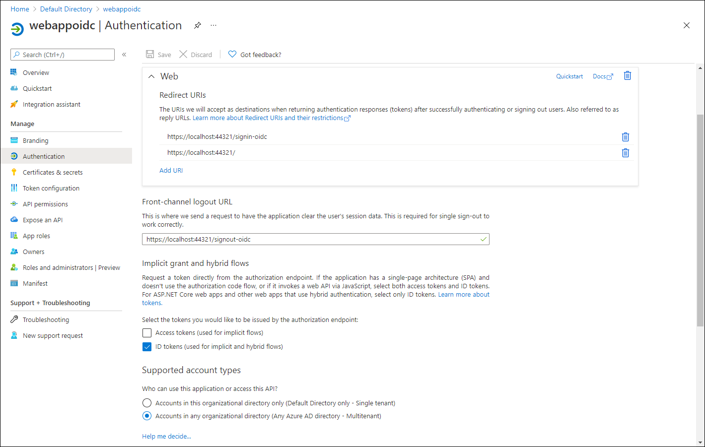

---
lab:
    az204Title: 'Lab 06: Authenticate by using OpenID Connect, MSAL, and .NET SDKs'
    az020Title: 'Lab 06: Authenticate by using OpenID Connect, MSAL, and .NET SDKs'
    az204Module: 'Module 06: Implement user authentication and authorization'
    az020Module: 'Module 06: Implement user authentication and authorization'
---

# Lab 06: Authenticate by using OpenID Connect, MSAL, and .NET SDKs

## Microsoft Azure user interface

Given the dynamic nature of Microsoft cloud tools, you might experience Azure UI changes that occur after the development of this training content. As a result, the lab instructions and lab steps might not align correctly.

Microsoft updates this training course when the community alerts us to needed changes. However, cloud updates occur frequently, so you might encounter UI changes before this training content updates. **If this occurs, adapt to the changes, and then work through them in the labs as needed.**

## Instructions

### Before you start

#### Sign in to the lab environment

Sign in to your Windows 10 virtual machine (VM) by using the following credentials:
    
-   Username: **Admin**

-   Password: **Pa55w.rd**

> **Note**: Your instructor will provide instructions to connect to the virtual lab environment.

#### Review the installed applications

Find the taskbar on your Windows 10 desktop. The taskbar contains the icons for the applications that you'll use in this lab, including:

-   Microsoft Edge

-   Visual Studio Code

## Ensure that your lab environment has its time set properly (no delay, according to your timezone)

>**Note:** If you notice that your lab environment has its time delayed, please adjust its local time by using the following powershell command to increase the time by 15 minutes

```powershell
  Set-Date -Adjust (New-TimeSpan -Minutes 15)
```

## Architecture diagram


### Exercise 1: Configure a single-tenant Azure AD environment

#### Task 1: Open the Azure portal

1. On the taskbar, select the **Microsoft Edge** icon.

1. In the open browser window, browse to the Azure portal ([portal.azure.com](https://portal.azure.com)), and then sign in with the account you'll use for this lab.

    > **Note**: If this is your first time signing in to the Azure portal, you'll be offered a tour of the portal. Select **Get Started** to skip the tour and begin using the portal.

#### Task 2: Register an application in Azure AD

1.  In the Azure portal, use the **Search resources, services, and docs** text box to search for **Azure Active Directory** and, in the list of results, select **Azure Active Directory**.

    > **Note**: This redirects your browser session to the blade of the Azure Active Directory (Azure AD) tenant associated with your Azure subscription.

1.  On the **Azure Active Directory** blade, select **App registrations** in the **Manage** section.

1.  In the **App registrations** section, select **+ New registration**.

1.  In the **Register an application** section, perform the following actions, and then select **Register**:

    | Setting | Action |
    | --- | --- |
    | **Name** text box | Enter **webappoidc** |
    | **Supported account types** list | Select **Accounts in this organizational directory only (Default Directory only - Single tenant)** |

    The following screenshot displays the configured settings in the **Register an application** section.

     

#### Task 3: Record unique identifiers

1.  On the **webappoidc** application registration blade, select **Overview**.

1.  In the **Overview** section, find and record the value of the **Application (client) ID** text box. You'll use this value later in the lab.

1.  In the **Overview** section, find and record the value of the **Directory (tenant) ID** text box. You'll use this value later in the lab.

#### Task 4: Configure the application authentication settings

1.  On the **webappoidc** application registration blade, select **Authentication** in the **Manage** section.

1.  In the **Authentication** section, perform the following actions, and select **Configure**:

    | Setting | Action |
    | --- | --- |
    | **Platform configurations** section | Select **+ Add a platform** |
    | **Configure platforms** blade  | Select **Web** |
    | **Redirect URIs** text box | Enter `https://localhost:44321/` |
    | **Front-channel logout URL** text box   | Enter  `https://localhost:44321/signout-oidc` |
        
1. Back in the **Platform configurations** section, select **Add URI**, and then enter `https://localhost:44321/signin-oidc`.

1. In the **Implicit grant and hybrid flows** section, select **ID tokens (used for implicit and hybrid  flows)**. 

1. Select **Save**.

    The following screenshot displays the configured settings on the **Authentication** blade.

     
       

#### Task 5: Create an Azure AD user

1.  In the Azure portal, select the **Cloud Shell** icon  to open a new PowerShell session. If Cloud Shell defaults to a Bash session, select **Bash** and then, in the drop down menu, select **PowerShell**.

    > **Note**: If this is the first time you're starting **Cloud Shell**, when prompted to select either **Bash** or **PowerShell**, select **PowerShell**. When the **You have no storage mounted** message appears, select the subscription you're using in this lab, and then select **Create storage**.

1.  In the **Cloud Shell** pane, run the following command to sign in to the Azure AD tenant associated with your Azure subscription:

    ```powershell
    Connect-AzureAD
    ```

1.  Run the following command to retrieve and display the primary Domain Name System (DNS) domain name of the Azure AD tenant:

    ```powershell
    $aadDomainName = ((Get-AzureAdTenantDetail).VerifiedDomains)[0].Name
    $aadDomainName
    ```

    > **Note**: Record the value of the DNS domain name. You'll use this value later in the lab.

1.  Run the following commands to create Azure AD users that you'll use to test Azure AD authentication:

    ```powershell
    $passwordProfile = New-Object -TypeName Microsoft.Open.AzureAD.Model.PasswordProfile
    $passwordProfile.Password = 'Pa55w.rd1234'
    $passwordProfile.ForceChangePasswordNextLogin = $false
    New-AzureADUser -AccountEnabled $true -DisplayName 'aad_lab_user1' -PasswordProfile $passwordProfile -MailNickName 'aad_lab_user1' -UserPrincipalName "aad_lab_user1@$aadDomainName" 
    ```

1.  Run the following command to identify the user principal name (UPN) of the newly created Azure AD user:

    ```powershell
    (Get-AzureADUser -Filter "MailNickName eq 'aad_lab_user1'").UserPrincipalName
    ```

    > **Note**: Record the UPN. You'll use this value later in the lab.

    > **Note**: Alternatively, you can retrieve the UPN by using the Azure portal, go to Azure Active Directory, select Users blade and search by giving the userid as input.
    > 


    > Here is the UPN as highlighted.
    > 


1.  Close the Cloud Shell pane.

#### Review

In this exercise, you registered a single-tenant Azure AD application and created an Azure AD user account.

### Exercise 2: Create a single-tenant ASP.NET Core web app

#### Task 1: Create an ASP.NET Core web app project

1.  On the lab computer, start **Windows Terminal**.

1.  From the command prompt, run the following commands to create and set the working directory to **Allfiles (F):\\Allfiles\\Labs\\06\\Starter\\OIDCClient**:

    ```powershell
    F:
    cd "F:\Allfiles\Labs\06\Starter\OIDCClient"
    ```

1.  Run the following commands to create a new .NET Core web app based on the Model View Controller (MVC) template (replace the placeholders `<application_ID>`, `<tenant_ID>`, and `<domain_Name>` with the corresponding values you recorded earlier in this lab):

    ```powershell
    dotnet new mvc --auth SingleOrg --client-id <application_ID> --tenant-id <tenant_ID> --domain <domain_Name>
    ```

1.  On the lab computer, start Visual Studio Code.

1.  In the **File** menu, select **Open Folder**.

1.  In the **File Explorer** window, browse to **Allfiles (F):\\Allfiles\\Labs\\06\\Starter\\OIDCClient**, and then select **Select Folder**.

1.  In the Visual Studio Code **Explorer** pane, review the autogenerated folder structure that represents an MVC web app.

1.  Navigate to the **Properties** folder, open the **launchSettings.json** file, and then apply the following changes:

    
    | Section | Property  | Value |
    | --- | --- | --- |
    | **iisSettings** | **sslPort** | **44321** |
    | **OIDCClient**  | **applicationUrl** | `https://localhost:44321` |

    > **Note**: The port numbers must match the value you specified when creating the Azure AD app registration.

1.  Save and close the file.

1.  In the Visual Studio Code **Explorer** pane, select **OIDCClient.csproj**.

1.  Ensure that the value of `<TargetFramework>` element is set to **netcoreapp3.1**.

    > **Note**: Starting from step 12 until step 15, we will modify **OIDCClient.csproj** by adding the additional packages, Please see step 16 for the complete snippet of configuration.

1.  Set the version of the `Microsoft.AspNetCore.Authentication.JwtBearer` and `Microsoft.AspNetCore.Authentication.OpenIdConnect` NuGet packages to **3.1.18**. 


1.  Set the version of the `Microsoft.Identity.Web` and `Microsoft.Identity.Web.UI` NuGet packages to **0.3.1-preview**.

1.  Remove the `<WebProject_DirectoryAccessLevelKey>0</WebProject_DirectoryAccessLevelKey>` entry.

1.  Remove the `<PackageReference Include="Microsoft.AspNetCore.Authentication.AzureAD.UI" Version="3.1.7" />` entry.

1.  Verify that the content of the **OIDCClient.csproj** file resembles the following listing (the value of the `UserSecretsId`will differ) and save the changes.

    ```csharp
    <Project Sdk="Microsoft.NET.Sdk.Web">
      <PropertyGroup>
        <TargetFramework>netcoreapp3.1</TargetFramework>
        <UserSecretsId>aspnet-OIDCClient-737DEB13-25D4-4C52-93C5-F485367E3C8C</UserSecretsId>
      </PropertyGroup>
      <ItemGroup>
        <PackageReference Include="Microsoft.AspNetCore.Authentication.JwtBearer" Version="3.1.18" NoWarn="NU1605" />
        <PackageReference Include="Microsoft.AspNetCore.Authentication.OpenIdConnect" Version="3.1.18" NoWarn="NU1605" />
        <PackageReference Include="Microsoft.Identity.Web" Version="0.3.1-preview" />
        <PackageReference Include="Microsoft.Identity.Web.UI" Version="0.3.1-preview" />
      </ItemGroup>
    </Project>
    ```

1.  Close the **OIDCClient.csproj** file.

1.  Navigate to the **Views\Shared** folder, and then open the **_LoginPartial.cshtml** file.

1.  Replace `AzureAD` with `MicrosoftIdentity` in the following line:

    ```csharp
    <a class="nav-link text-dark" asp-area="AzureAD" asp-controller="Account" asp-action="SignOut">Sign out</a>`
    ```

1.  Replace `AzureAD` with `MicrosoftIdentity` in the following line:

    ```csharp
    <a class="nav-link text-dark" asp-area="AzureAD" asp-controller="Account" asp-action="SignIn">Sign in</a>
    ```

1.  Save and close the file.

1.  Open the file **appsettings.json** and review the content of the **AzureAd** object, including the following elements:

    | Element | Value |
    | --- | --- |
    | `Instance` | `https://login.microsoftonline.com/` |
    | `Domain` | Primary DNS domain of the Azure AD tenant associated with your Azure subscription. |
    | `TenantId` | GUID of the Azure AD tenant. |
    | `ClientId` | Application (client) ID of the application you registered in the Azure AD tenant. |
    | `CallbackPath` | `/signin-oidc` |

1.  Close the file without making any changes.

1.  In the Visual Studio Code **Explorer** pane, select **Startup.cs**.

1.  Remove the `using Microsoft.AspNetCore.Authentication.AzureAD.UI;` directive.

1.  Add the following **using** directives directly after the entry that you removed in the previous step:

    ```csharp
    using Microsoft.AspNetCore.Authentication.OpenIdConnect;
    using Microsoft.Identity.Web;
    using Microsoft.Identity.Web.UI;
    ```

1.  Remove the following lines from the **ConfigureServices** method:

    ```csharp
    services.AddAuthentication(AzureADDefaults.AuthenticationScheme)
      .AddAzureAD(options => Configuration.Bind("AzureAd", options));
    ```

1.  Replace the lines you removed in the last step from the **ConfigureServices** method with the following ones:

    ```csharp
    services.AddAuthentication(OpenIdConnectDefaults.AuthenticationScheme)
      .AddMicrosoftIdentityWebApp(Configuration.GetSection("AzureAd"));
    ```

1.  Remove the following line from the **ConfigureServices** method:

    ```csharp
    services.AddRazorPages();
    ```

1.  Replace the line that you removed from the **ConfigureServices** method in the last step with the following ones:

    ```csharp
    services.AddRazorPages()
      .AddMicrosoftIdentityUI();
    ```

1.  Save and close the file.

### Task 2: Test the single-tenant web app in a single-tenant scenario

1.  In the **Visual Studio Code** window, activate the shortcut menu of the **Explorer** pane, and then select **Open in Integrated Terminal**.

1.  Run the following command to build the .NET web app:

    ```
    dotnet build
    ```

    > **Note**: If there are any build errors, review the files in the **Allfiles (F):\\Allfiles\\Labs\\06\\Solution\\OIDCClient** folder.

1.  Run the following command to generate a self-signed certificate and configure the local computer to trust it:

    ```
    dotnet dev-certs https --trust
    ```

1.  When prompted to install the autogenerated certificate, select **Yes**.

1.  From the terminal prompt, run the following command to run the .NET web app:

    ```
    dotnet run
    ```

1.  Start the Microsoft Edge browser in the **InPrivate** mode, and then navigate to the `https://localhost:44321` URL.

1.  If presented with the **Your connection isn't private** message, select **Advanced**, and then select the **Continue to localhost (unsafe)** link.

1.  In the open browser window, when prompted, authenticate by using the UPN of the **aad_lab_user1** Azure AD account you created earlier in this lab with **Pa55w.rd1234** as its password.

    > **Note**: If you are prompted with a **Help us protect your account** window, select **Skip for now**.

1.  The browser window will automatically open the **Permissions requested** webpage.

1.  Review the requested permissions, which include **View your basic profile** and **Maintain access to data you have given it access to**.

1.  Select **Accept**.

1.  Review the **Welcome** home page of the target site displayed by the browser and verify that the UPN of the **aad_user1** Azure AD account appears in the browser window.

1.  On the **Welcome** page, select **Sign out**.

1.  When prompted to select the account to sign out, select the **aad_lab_user1** Azure AD account. You'll be automatically redirected to the **Signed out** page.

1.  Leave the Microsoft Edge browser open that displays the **Signed out** page.

#### Review 

In this exercise, you implemented a single-tenant web app and tested it in a single-tenant Azure environment.

### Exercise 3: Configure a multitenant Azure AD environment

#### Task 1: Create an Azure AD tenant

1.  Switch to the Microsoft Edge browser that displays the Azure portal.

1.  In the Azure portal, navigate to the **Azure Active Directory** blade.

1.  On the **Azure Active Directory** blade, select **Manage tenants**, and then select **+ Create**.

1.  On the **Basics** tab of the **Create a tenant** blade, ensure that the **Azure Active Directory** option is selected, and then select **Next: Configuration >**.

1.  On the **Configuration** tab of the **Create a tenant** blade, specify the following settings:

    | Setting | Value |
    | --- | --- |
    | Organization name | **Contoso** |
    | Initial domain name | Any valid DNS name consisting of lowercase letters and digits and starting with a letter. |
    | Country/Region | The name of your country or region. |

1.  Select **Review + create**, and then select **Create**.

1.  If prompted, on the **Help us prove you're not a robot**, enter the provided code, and then select **Submit**.

1.  Wait for the provisioning to complete, and then select the **Contoso** link to navigate to the blade that displays properties of the Contoso Azure AD tenant.

1.  On the **Overview** blade of the Azure AD tenant, identify and record the value of its **Tenant ID** property. You'll use this value later in the lab.

#### Task 2: Create an Azure AD user

1.  In the web browser window displaying the Azure portal, select the **Directories + subscriptions** toolbar icon.

1.  On the **Portal settings | Directories + subscriptions** blade, select **Switch** next to the entry representing the Azure AD tenant associated with your subscription.

1.  In the Azure portal, select the **Cloud Shell** icon to open a new PowerShell session. 

1.  In the **Cloud Shell** pane, run the following command to sign in to the Contoso Azure AD tenant. Replace the `<tenant_Id>` placeholder with the value of the tenant ID property you identified in the previous task:

    ```powershell
    Import-Module AzureAD.Standard.Preview
    AzureAD.Standard.Preview\Connect-AzureAD -TenantID '<tenant_ID>'
    ```

1.  Ctrl + Click the URL in the WARNING to open a browser window and follow the steps to authenticate.  

1.  Run the following command to retrieve the DNS domain name of the Azure AD tenant:

    ```powershell
    $aadDomainName = ((Get-AzureAdTenantDetail).VerifiedDomains)[0].Name
    ```

1.  Run the following commands to create Azure AD users that you'll use to test Azure AD authentication:

    ```powershell
    $passwordProfile = New-Object -TypeName Microsoft.Open.AzureAD.Model.PasswordProfile
    $passwordProfile.Password = 'Pa55w.rd1234'
    $passwordProfile.ForceChangePasswordNextLogin = $false
    New-AzureADUser -AccountEnabled $true -DisplayName 'aad_lab_user2' -PasswordProfile $passwordProfile -MailNickName 'aad_lab_user2' -UserPrincipalName "aad_lab_user2@$aadDomainName"
    ```

1.  Run the following command to identify the UPN of the newly created Azure AD user:

    ```powershell
    (Get-AzureADUser -Filter "MailNickName eq 'aad_lab_user2'").UserPrincipalName
    ```

    > **Note**: Record the UPN. You'll use this value later in the lab.
 
1.  Close the **Cloud Shell** pane.

#### Task 3: Test the single-tenant web app in a multitenant scenario

1.  Switch back to the Microsoft Edge browser, in the **InPrivate** mode, that's displaying the **Signed out** page, and then select **Sign in**.

1.  In the open browser window, when prompted, authenticate by using the UPN of the **aad_lab_user2** Azure AD account you created earlier in this exercise with **Pa55w.rd1234** as its password.

1.  Note the error message that indicates the user account you used doesn't exist in the tenant where the **webappoidc** web app is registered.

    > **Note**: For the sign in to work in this scenario, you would need to first add this account as an external user to the tenant hosting the webappoidc web app registration.

1.  Close the Microsoft Edge browser that's displaying the error message, and then switch back to the **Visual Studio Code** window.

1.  In the **terminal** pane, select **Kill Terminal** (the **Recycle Bin** icon) to close the currently open terminal and any associated processes.

#### Review

In this exercise, you configured a multitenant Azure environment and tested it with a single-tenant web app.

### Exercise 4: Configure a multitenant ASP.NET Core web app

#### Task 1: Configure the application registration in Azure AD

1.  Switch to the Azure portal, and then select the **Directories + subscriptions** toolbar icon.

1.  On the **Portal settings | Directories + subscriptions** blade, select **Switch** next to the entry representing the Azure AD tenant associated with your subscription.

1.  On the **Azure Active Directory** blade, select **App registrations** in the **Manage** section.

1.  In the list of app registrations, select **webappoidc**.

1.  On the **webappoidc** application registration blade, select **Authentication** in the **Manage** section.

1.  In the **Supported account types** section, select **Accounts in any organizational directory (Any Azure AD directory - Multitenant)**.

1.  Select **Save**.

    The following screenshot displays the configured settings on the **App registration** blade.
          
     

    
#### Task 2: Configure multi-tenancy support of the ASP.NET Core web app

1.  On the lab computer, start Visual Studio Code.

1.  Open the **appsettings.json** file.

1.  Replace the line containing the `TenantId` element with the following one:

    ```
    "TenantId": "organizations", 
    ```

1.  Save and close the file.

### Task 3: Test the multitenant web app in a multitenant scenario

1.  In the **Visual Studio Code** window, activate the shortcut menu of the **Explorer** pane, and then select **Open in Integrated Terminal**.

1.  From the terminal prompt, run the following command to run the .NET web app:

    ```
    dotnet run
    ```

1.  Start the Microsoft Edge browser in the **InPrivate** mode, and then navigate to the `https://localhost:44321` URL.

1.  If presented with the **Your connection isn't private** message, select **Advanced**, and then select the **Continue to localhost (unsafe)** link.

1.  In the open browser window, when prompted, authenticate by using the UPN of the **aad_lab_user1** Azure AD account you created earlier in this lab with **Pa55w.rd1234** as its password.

1.  Review the **Welcome** home page of the target site that the browser displays, and then verify that the UPN of the **aad_lab_user1** Azure AD account appears in the browser window.

1.  On the **Welcome** page, select **Sign out**.

1.  When prompted to select the account to sign out, select the **aad_lab_user1** Azure AD account. You'll be automatically redirected to the **Signed out** page.

1.  In the Microsoft Edge browser that displays the **Signed out** page, select **Sign in**.

1.  In the open browser window, when prompted, authenticate by using the UPN of the **aad_lab_user2** Azure AD account you created earlier in this exercise with **Pa55w.rd1234** as its password.

1.  The browser window will automatically open the **Permissions requested** webpage.

1.  Review the requested permissions, which include **View your basic profile** and **Maintain access to data you have given it access to**.

1.  Select **Accept**.

    > **Note**: The application is listed as unverified. This is expected, because the sample app you're using in this lab hasn't undergone publisher verification. For more information, refer to Microsoft documentation describing [publisher verification](https://docs.microsoft.com/en-us/azure/active-directory/develop/publisher-verification-overview).

1.  Review the **Welcome** home page of the target site that the browser displays, and then verify that the UPN of the **aad_lab_user2** Azure AD account appears in the browser window.

1.  On the **Welcome** page, select **Sign out**.

1.  Close the Microsoft Edge browser in the **InPrivate** mode, and then switch back to the **Visual Studio Code** window.

1.  In the **terminal** pane, select **Kill Terminal** (the **Recycle Bin** icon) to close the currently open terminal and any associated processes.

#### Review

In this exercise, you implemented a multitenant web app and tested in in a multitenant Azure environment.

### Exercise 5: Clean up your subscription

#### Task 1: Delete the application registration in Azure AD

1.  Switch to the Microsoft Edge browser that is displaying the Azure portal.

1.  In the Azure portal, navigate to the blade of the Contoso Azure AD tenant. This will display the **Contoso \| Overview** blade.

1.  On the **Azure Active Directory** blade, select **Enterprise applications** in the **Manage** section.

1.  On the **Enterprise applications \| All applications** blade, select **webappoidc**.

1.  On the **webappoidc \| Overview** blade, select **Properties**.

1.  On the **webappoidc \| Properties** blade, select **Delete** and, when prompted to confirm, select **Yes**.

1.  Navigate to the **Users \| All users (Preview)** blade of the Contoso Azure AD tenant.

1.  In the list of users, select **aad_lab_user2**.

1.  On the **aad_lab_user2 \| Profile** blade, select **Delete** and then, when prompted to confirm, select **Yes**.

1.  Navigate back to the **Contoso \| Overview** blade, and then select **Manage tenants**.

1.  In the list of tenants, select the checkbox next to the **Contoso (Default)** entry, and then select **Delete**.

1.  On the **Delete tenant 'Contoso'?** blade, select **Delete**.

1.  If necessary, select **Get permission to delete Azure resource**, on the **Properties** blade of the Azure AD tenant, in the **Access management for Azure resources**, select **Yes**, and then select **Save**.

1.  Navigate back to the **Delete tenant 'Contoso'?** blade, refresh the browser page, select **Delete**, and then select **Yes** to confirm.

1.  In the Azure portal, navigate back to the blade of the Azure AD tenant associated with your Azure subscription.

1.  On the **Azure Active Directory** blade, select **App registrations** in the **Manage** section.

1.  In the **App registrations** section, select the **webappoidc** Azure AD application registration that you created earlier in this lab.

1.  In the **webappoidc** section, perform the following actions:

    a. Select **Delete**.

    b. On the **Delete app registration** blade, select **I understand the implications of deleting this app registration**, and then select **Delete**.

1.  Navigate to the **Users \| All users (Preview)** blade.

1.  In the list of users, select **aad_lab_user1**

1.  On the **aad_lab_user1 \| Profile** blade, select **Delete** and, when prompted to confirm, select **Yes**.

#### Task 2: Close the active applications

1.  Close any open Microsoft Edge windows.

1.  Close Visual Studio Code.

#### Review

In this exercise, you cleaned up your subscription by removing the application registration used in this lab.
