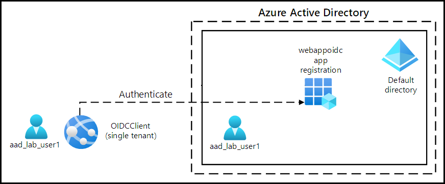
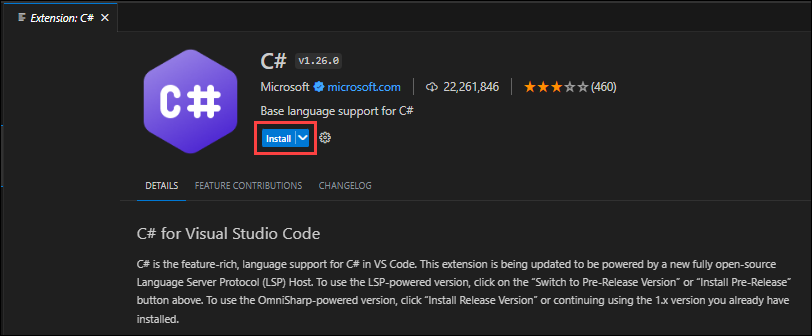
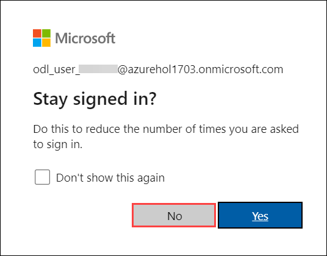
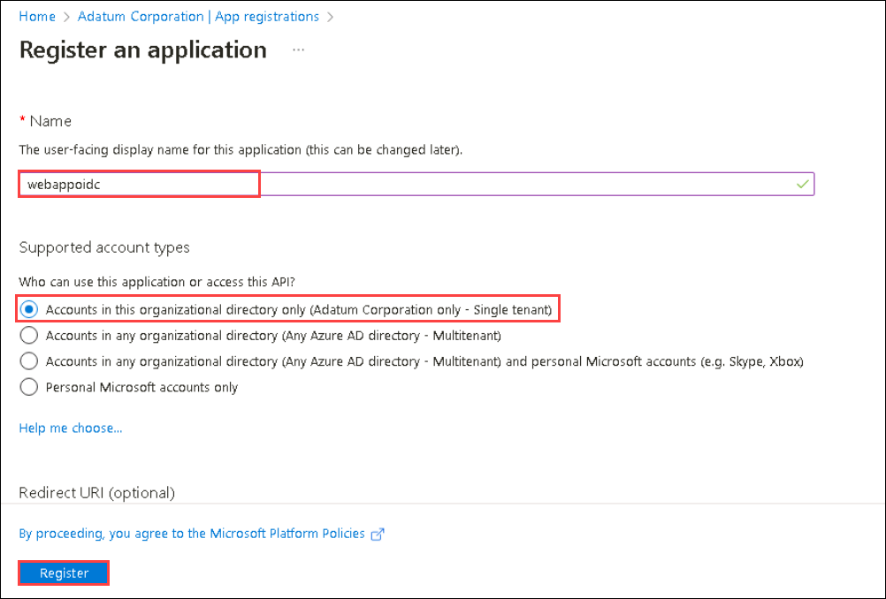
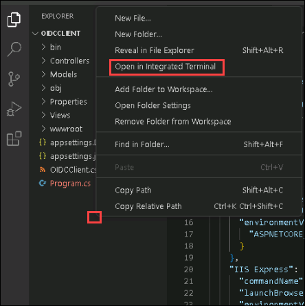

# Lab 06: Authenticate by using OpenID Connect, MSAL, and .NET SDKs

## Lab Scenario

In this lab, you will register an application in Azure AD, add a user, and then test the user’s access to the application to validate that Azure AD can secure it. You will also use the Graph Explorer tool to build and test requests against the Graph API for an Azure AD user account.

## Lab objectives

In this lab, you will perform:

+ Exercise 1: Configure a single-tenant Azure AD environment
+ Exercise 2: Create a single-tenant ASP.NET web app
      
## Estimated timing: 60 minutes

## Architecture diagram



## Lab setup and pre-requisites

Before starting this lab, you must complete the **Prerequisites** of this lab.

To install the **C#** extension for this lab, follow the below steps in visual studio code:

1. Start Visual Studio Code.

     

2. Select the **Extensions** blade from the left panel.
3. Search with **C#** and select **Install** to install the extension.

    

4. After installing C# extensions, close the Visual Studio code.

# Exercise 1: Configure a single-tenant Azure AD environment

In this exercise, you register a single-tenant Azure AD application and create an Azure AD user account.

## Task 1: Open the Azure portal

1. If you are not logged in already, click on the **Azure Portal** shortcut that is available on the desktop and log in with Azure credentials.

1. If not Sign-in, then on the **Sign into Microsoft Azure** tab you will see the login screen, in that enter the following **Email/Username** and then click on **Next**. 
   * Email/Username: <inject key="AzureAdUserEmail"></inject>
   
    
    
1. Now enter the following **Password** and click on **Sign in**.
   * Password: <inject key="AzureAdUserPassword"></inject>

     .png)
    
1. If you see the pop-up **Stay Signed in?**, click No.

    

## Task 2: Register an application in Azure AD

1.  In the Azure portal, use the **Search resources, services, and docs** text box to search for **Microsoft Entra ID** and, in the list of results, select **Microsoft Entra ID**.

    > **Note**: This redirects your browser session to the blade of the Microsoft Entra ID (Azure AD) tenant associated with your Azure subscription.

1.  On the **Microsoft Entra ID** blade, select **App Registrations** in the **Manage** section.

1.  In the **App registrations** section, select **+ New registration**.

1.  In the **Register, an application** section, perform the following actions, and then select **Register**:
    
    | Setting                          | Action                                                       |
    | -------------------------------- | ------------------------------------------------------------ |
    | **Name** text box                | Enter **webappoidc**                                         |
    | **Supported account types** list | Select **Accounts in this organizational directory only (MOC HOL <inject key="DeploymentID" enableCopy="false"/> - Single tenant)** |

   
    The following screenshot displays the configured settings in the **Register an Application** section.
          
    
      
    
## Task 3: Record unique identifiers

1.  On the **webappoidc** application registration blade, select **Overview**.

1.  In the **Overview** section, find and record the value of the **Application (client) ID** text box. You'll use this value later in the lab.

1.  In the **Overview** section, find and record the value of the **Directory (tenant) ID** text box. You'll use this value later in the lab.

## Task 4: Configure the application authentication settings

1.  On the **webappoidc** application registration blade, select **Authentication** in the **Manage** section.

1.  In the **Authentication** section, perform the following actions, and select **Configure**:

    | Setting                     | Action                                                       |
    | --------------------------- | ------------------------------------------------------------ |
    | **Platform configurations** section      | Select **+ Add a platform**.                    |
    | **Configure platforms** blade  | Select **Web**.                                    |
    | **Redirect URIs** text box | Enter `https://localhost:5001/`                                     |
    | **Front-channel logout URL** text box   | Enter  `https://localhost:5001/signout-oidc`  |
    
1. Back in the **Platform** Configurations section, select **Add URI**, and then enter `https://localhost:5001/signin-oidc`

1. In the **Implicit Grant and hybrid flows** section, select **ID tokens (used for implicit and hybrid flows)**.

1. Select **Save**.

    The following screenshot displays the configured settings on the **Authentication** blade.
          
     
  
    > **Congratulations** on completing the task! Now, it's time to validate it. Here are the steps:
    > - Navigate to the Lab Validation Page, from the upper right corner in the lab guide section.
    > - Hit the Validate button for the corresponding task. If you receive a success message, you can proceed to the next task. 
    > - If not, carefully read the error message and retry the step, following the instructions in the lab guide.
    > - If you need any assistance, please contact us at labs-support@spektrasystems.com. We are available 24/7 to help.

## Task 5: Create an Azure AD user

1. In the Azure portal, select the **Cloud Shell** icon .

1. when prompted to select either Bash or PowerShell, select **Powershell**.

1. When the You have no storage mounted message appears, select **Show advanced settings** and then select Use existing and choose existing resource group.

1. Then select Create new against Storage account and enter **cloudstor<inject key="DeploymentID" enableCopy="false"/>** and also

1. For File Share,enter **blob<inject key="DeploymentID" enableCopy="false"/>** and then click on Create storage, and wait for the Azure Cloud Shell to initialize.

1. Then select **Create storage**.

1.  In the **Cloud Shell** pane, run the following command to sign in to the Azure AD tenant associated with your Azure subscription:

      ```powershell
      Connect-AzureAD
      ```

1.  Run the following command to retrieve and display the primary Domain Name System (DNS) domain name of the Azure AD tenant:

      ```powershell
      $aadDomainName = ((Get-AzureAdTenantDetail).VerifiedDomains)[0].Name
      $aadDomainName
      ```

    > **Note**: Record the value of the DNS domain name. You'll use this value later in the lab.

1.  Run the following commands to create Azure AD users that you'll use to test Azure AD authentication:
 
      ```powershell
      
       $passwordProfile = New-Object -TypeName Microsoft.Open.AzureAD.Model.PasswordProfile
       $passwordProfile.Password = 'Pa55w.rd1234'
       $passwordProfile.ForceChangePasswordNextLogin = $false
       New-AzureADUser -AccountEnabled $true -DisplayName 'aad_lab_user1' -PasswordProfile $passwordProfile -MailNickName 'aad_lab_user1' -UserPrincipalName "aad_lab_user1@$aadDomainName" 
       
      ```

1.  Run the following command to identify the user principal name (UPN) of the newly created Azure AD user:

    ```powershell
    (Get-AzureADUser -Filter "MailNickName eq 'aad_lab_user1'").UserPrincipalName
    ```

    > **Note**: Record the UPN. You'll use this value later in the lab.

1.  Close the Cloud Shell pane.
    
    > **Congratulations** on completing the task! Now, it's time to validate it. Here are the steps:
    > - Navigate to the Lab Validation Page, from the upper right corner in the lab guide section.
    > - Hit the Validate button for the corresponding task. If you receive a success message, you can proceed to the next task. 
    > - If not, carefully read the error message and retry the step, following the instructions in the lab guide.
    > - If you need any assistance, please contact us at labs-support@spektrasystems.com. We are available 24/7 to help.

### Review

In this exercise, you registered a single-tenant Azure AD application and created an Azure AD user account.

# Exercise 2: Create a single-tenant ASP.NET web app

In this exercise, you implement a single-tenant web app and test it in a single-tenant Azure environment.

## Task 1: Create an ASP.NET web app project

1.  In the lab vm search and select the **Command Prompt**.

1.  From the command prompt, run the following commands to create and set the working directory to **Allfiles (C):\\Allfiles\\Labs\\06\\Solutiom\\OIDCClientST**:

    
    ```powershell
    md "C:\AZ-204-DevelopingSolutionsforMicrosoftAzure\Allfiles\Labs\06\Solution\OIDCClient"
    ```
     ```powershell
    cd C:\AZ-204-DevelopingSolutionsforMicrosoftAzure\Allfiles\Labs\06\Solution\OIDCClient
    ```

1.  Run the following commands to create a new .NET Core web app based on the Model View Controller (MVC) template (replace the placeholders `<application_ID>`, `<tenant_ID>`, and `<domain_Name>` with the corresponding values you recorded earlier in this lab):

    ```powershell
    dotnet new mvc --auth SingleOrg --client-id <application_ID> --tenant-id <tenant_ID> --domain <domain_Name>
    ```
    
    ```powershell
    rmdir .\obj /S /Q
    ```

1.  Run the following command to start Visual Studio Code. 

    ```cmd
    code .
    ```
    > If you have been prompted **Do you trust the authors of all files in this folder?**, select **Yes, I trust the authors**.

    > **Note** If the folder does not open by default follow the below steps
    -  In the **File** menu, select **Open Folder**.
    -  In the **File Explorer** window, browse to **C:\AZ-204-DevelopingSolutionsforMicrosoftAzure\Allfiles\Labs\06\Solution**, and then select **Select Folder OIDCClient**.
     
          - If you have been prompted **Do you trust the authors of all files in this folder?**, select **Yes, I trust the authors**.

1.  In the Visual Studio Code **Explorer** pane, review the autogenerated folder structure that represents an MVC web app.

1.  Navigate to the **Properties** folder, open the **launchSettings.json** file, and then apply the following changes:

    
    | Section         | Property           | Value                                                   |
    | --------------- | ------------------ | ------------------------------------------------------- |
    | **iisSettings** | **sslPort**        | **44321**                                               |
    | **iisSettings**  | **applicationUrl** | `https://localhost:44321` |
    | **OIDCClient**  | **applicationUrl** | `https://localhost:5001` |      

    > **Note**: The port numbers must match the value you specified when creating the Azure AD app registration.

1.  Save and close the file.

1.  In the Visual Studio Code **Explorer** pane, select **OIDCClient.csproj**.

1.  Ensure that the value of `<TargetFramework>` element is set to **net6.0**.

1.  Ensure that version of the `Microsoft.AspNetCore.Authentication.JwtBearer` and `Microsoft.AspNetCore.Authentication.OpenIdConnect` NuGet packages is set to **6.0.9**.

1.  Set the version of `Microsoft.Identity.Web` and `Microsoft.Identity.Web.UI` NuGet packages to **1.25.3**.

1.  Verify that the content of the **OIDCClient.csproj** file resembles the following listing (the value of the `UserSecretsId`will differ) and save the changes.

    > **Note**: Don't copy and paste this command because it will throw an error, just review and verify this code.

    ```csharp
    <Project Sdk="Microsoft.NET.Sdk.Web">
      <PropertyGroup>
        <TargetFramework>net6.0</TargetFramework>
        <Nullable>enable</Nullable>
        <UserSecretsId>aspnet-OIDCClient-737DEB13-25D4-4C52-93C5-F485367E3C8C</UserSecretsId>
      </PropertyGroup>

      <ItemGroup>
        <PackageReference Include="Microsoft.AspNetCore.Authentication.JwtBearer" Version="6.0.9" NoWarn="NU1605" />
        <PackageReference Include="Microsoft.AspNetCore.Authentication.OpenIdConnect" Version="6.0.9" NoWarn="NU1605" />
        <PackageReference Include="Microsoft.Identity.Web" Version="1.25.3" />
        <PackageReference Include="Microsoft.Identity.Web.UI" Version="1.25.3" />
      </ItemGroup>
    </Project>
    ```

1.  Close the **OIDCClient.csproj** file.

1.  In the explorer Navigate to the **Views\Shared** folder, and then open the **_LoginPartial.cshtml** file.

1.  Verify that the `asp-area` attribute in each span element references `MicrosoftIdentity`, as in the following line:

    ```csharp
    <a class="nav-link text-dark" asp-area="MicrosoftIdentity" asp-controller="Account" asp-action="SignOut">Sign out</a>
    ```

1.  Close the file without making any changes.

1.  Open the file **appsettings.json** and review the content of the **AzureAd** object, including the following elements:

    | Element | Value |
    | -- | -- |
    | `Instance` | `https://login.microsoftonline.com/`|
    | `Domain` | Primary DNS domain of the Azure AD tenant associated with your Azure subscription |
    | `TenantId` | GUID of the Azure AD tenant |
    | `ClientId` | Application (client) ID of the application you registered in the Azure AD tenant |
    | `CallbackPath` | `/signin-oidc` |

1.  Close the file without making any changes.
3.  In the Visual Studio Code **Explorer** pane, select **Program.cs**.
4.  Verify that the file contains the following **using** directives:

    ```csharp
    using Microsoft.AspNetCore.Authentication.OpenIdConnect;
    using Microsoft.Identity.Web;
    using Microsoft.Identity.Web.UI;
    ```

1.  Verify that the file contains the following lines that add the relevant authentication services to the container:

    ```csharp
    builder.services.AddAuthentication(OpenIdConnectDefaults.AuthenticationScheme)
      .AddMicrosoftIdentityWebApp(Configuration.GetSection("AzureAd"));
    ```

1.  Verify that the file contains the following lines that add a controller and Razor pages for the accounts management:

    ```csharp
    builder.services.AddRazorPages()
      .AddMicrosoftIdentityUI();
    ```

1.  Save and close the file.
    
    > **Congratulations** on completing the task! Now, it's time to validate it. Here are the steps:
    > - Navigate to the Lab Validation Page, from the upper right corner in the lab guide section.
    > - Hit the Validate button for the corresponding task. If you receive a success message, you can proceed to the next task. 
    > - If not, carefully read the error message and retry the step, following the instructions in the lab guide.
    > - If you need any assistance, please contact us at labs-support@spektrasystems.com. We are available 24/7 to help.

### Task 2: Test the single-tenant web app in a single-tenant scenario

1.  In the **Visual Studio Code** window, right-click on the blank space inside the **Explorer** pane, and then select **Open in Integrated Terminal**.

       

1.  Run the following commands to build the .NET web app:

    ```
    dotnet build
    ```

    > **Note**: If there are any build errors, review the files in the **Allfiles C:\\AZ-204 --  DevelopingSolutionsforMicrosoftAzure\\Allfiles\\Labs\\06\\Solution\\OIDCClient** folder.

1.  Run the following command to generate a self-signed certificate and configure the local computer to trust it:

    ```
    dotnet dev-certs https --trust
    ```

1.  When prompted to install the autogenerated certificate, select **Yes**.

1.  From the terminal prompt, run the following command to run the .NET web app:

    ```
    dotnet run
    ```

1.  Start the Microsoft Edge browser in the **InPrivate** mode, and then navigate to the `https://localhost:5001` URL.

1.  If presented with the **Your connection isn't private** message, select **Advanced**, and then select the **Continue to localhost (unsafe)** link.

1.  In the open browser window, when prompted, authenticate by using the UPN of the **aad_lab_user1** Azure AD account you created earlier and copied in this lab with **Pa55w.rd1234** as its password.

1.  The browser window will automatically open the **Permissions requested** webpage.

1.  Review the requested permissions, which include **View your basic profile** and **Maintain access to data you have given it access to**.

1.  Select **Accept**.

1.  Review the **Welcome** home page of the target site displayed by the browser and verify that the UPN of the **aad_user1** Azure AD account appears in the browser window.

1.  On the **Welcome** page, select **Sign out**.

1.  When prompted to select the account to sign out, select the **aad_lab_user1** Azure AD account. You'll be automatically redirected to the **Signed out** page.

1.  Leave the Microsoft Edge browser open that displays the **Signed out** page.

### Review 

In this exercise, you implemented a single-tenant web app and tested it in a single-tenant Azure environment.

## You have successfully completed the lab

