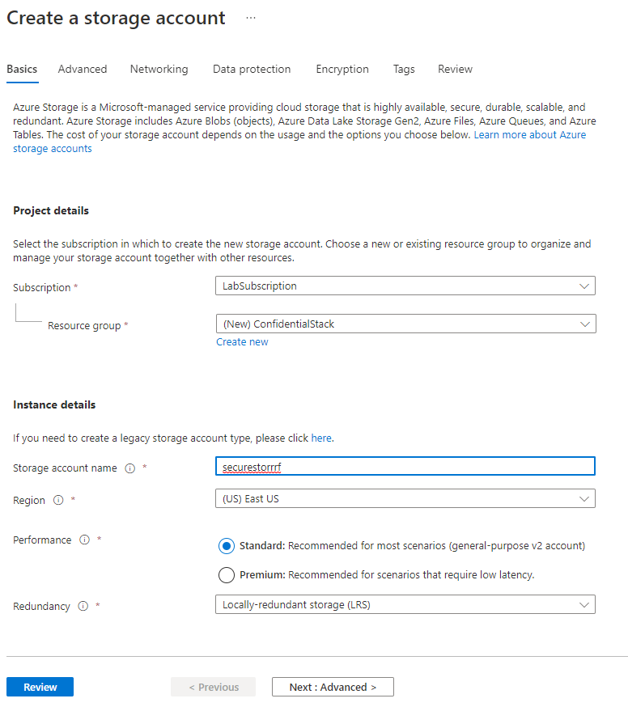
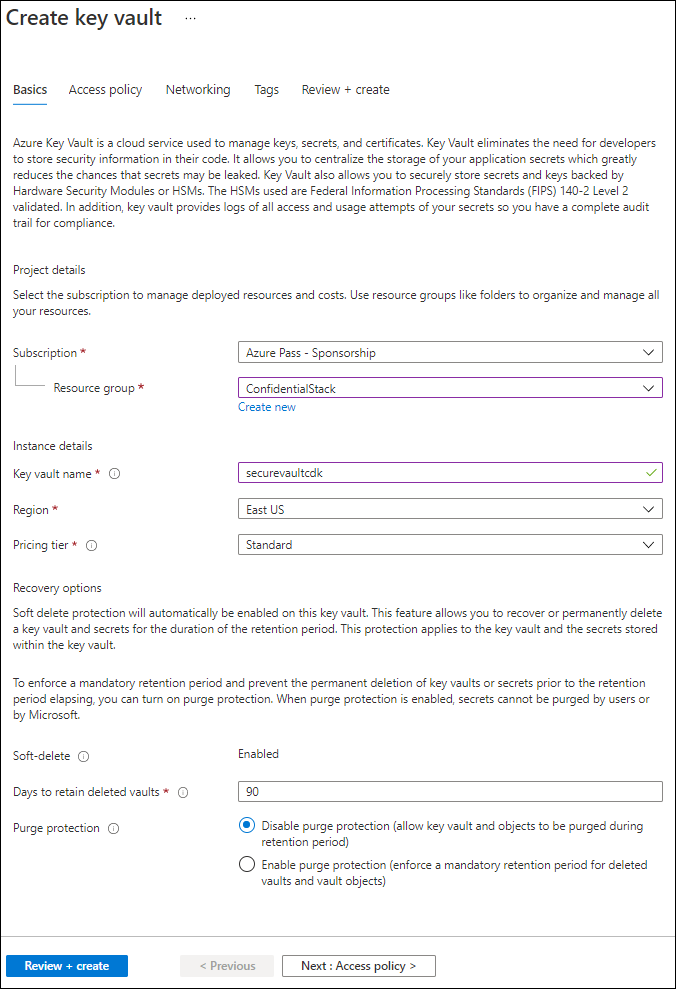
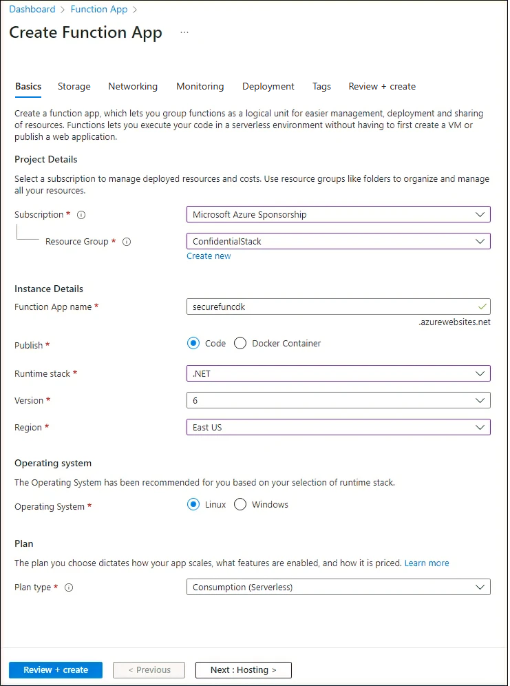
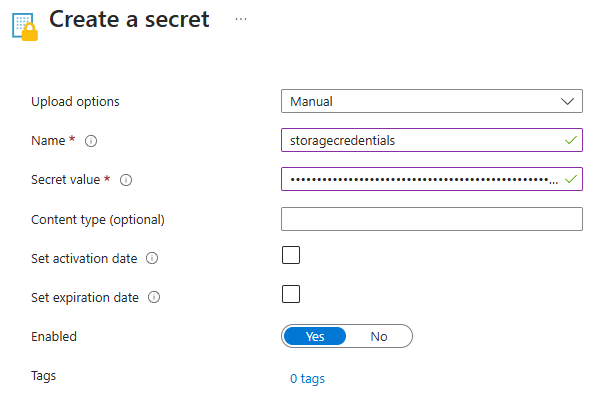

---
lab:
  az204Title: "Lab 07: Access resource secrets more securely across services"
  az204Module: "Learning Path 07: Implement secure Azure solutions"
---

# Lab 07: Access resource secrets more securely across services

## Microsoft Azure user interface

Given the dynamic nature of Microsoft cloud tools, you might experience Azure UI changes that occur after this training content's development. As a result, the lab instructions and lab steps might not align correctly.

Microsoft updates this training course when the community brings needed changes to our attention. However, because cloud updates occur frequently, you might encounter UI changes before this training content updates. **If this occurs, adapt to the changes, and then work through them in the labs as needed.**

## Instructions

### Before you start

#### Sign in to the lab environment

Sign in to your Windows 11 virtual machine (VM) by using the following credentials:

- Username: `Admin`
- Password: `Pa55w.rd`

> **Note**: Your instructor will provide instructions to connect to the virtual lab environment.

#### Review the installed applications

Find the taskbar on your Windows 11 desktop. The taskbar contains the icons for the applications that you'll use in this lab, including:

- Microsoft Edge
- File Explorer
- Terminal
- Visual Studio Code

## Lab Scenario

In this lab, you will create a storage account and an Azure Function app that will access the storage account. To demonstrate the secure storage of connection string information, you will provision a Key Vault resource and manage the appropriate secrets to store the connection string information. You will also manage the service identity to gain secure access to the connection string information for the storage account.

## Architecture diagram


### Exercise 1: Create Azure resources

#### Task 1: Open the Azure portal

1. On the taskbar, select the **Microsoft Edge** icon.

1. In the open browser window, browse to the Azure portal at `https://portal.azure.com`, and then sign in with the account you'll be using for this lab.

   > **Note**: If this is your first time signing in to the Azure portal, you'll be offered a tour of the portal. Select **Get Started** to skip the tour and begin using the portal.

#### Task 2: Create a Storage account

1. In the Azure portal, use the **Search resources, services, and docs** text box to search for **Storage Accounts**, and then in the list of results, select **Storage accounts**.

1. On the **Storage accounts** blade, select **+ Create**.

1. On the **Create a storage account** blade, on the **Basics** tab, perform the following actions, and select **Review**:

    | Setting | Action |
    |--|--|
    | **Subscription** drop-down list | Retain the default value |
    | **Resource group** section | Select **Create new**, enter **ConfidentialStack**, and then select **OK** |
    | **Storage account name** text box | Enter **securestor**_[yourname]_ |
    | **Region** drop-down list | Select **(US) East US** |
    | **Primary service** | No changes |
    | **Performance** section | Select the **Standard** option |
    | **Redundancy** drop-down list | Select **Locally-redundant storage (LRS)** |

   The following screenshot displays the configured settings on the **Create a storage account** blade.

   

1. On the **Review** tab, review the options that you selected during the previous steps.

1. Select **Create** to create the storage account by using your specified configuration.

   > **Note**: Wait for the creation task to complete before you move forward with this lab.

1. On the **Deployment Overview** blade, select **Go to resource**.

1. On the **Storage account** blade, in the **Security + networking** section, select the **Access keys** link.

1. In the **Access keys** section, select **Show keys**.

1. On the **Access keys** blade, review any one of the **Connection string**s (using **Show** button), and then record the value of either **Connection string** boxes in Notepad. The **Key**s are platform managed encryption keys and are **not** used for this lab.

   > **Note**: It doesn't matter which connection string you choose. They are interchangeable.

#### Task 3: Create an Azure Key Vault

1. In the Azure portal, use the **Search resources, services, and docs** text box to search for **Key vaults**, and then in the list of results, select **Key vaults**.

1. On the **Key vaults** blade, select **Create**.

1. On the **Create key vault** blade, on the **Basics** tab, perform the following actions, and then select **Next** to go to the **Access Configuration** tab:

   | Setting                           | Action                                   |
   | --------------------------------- | ---------------------------------------- |
   | **Subscription** drop-down list   | Retain the default value                 |
   | **Resource group** drop-down list | Select **ConfidentialStack** in the list |
   | **Key vault name** text box       | Enter **securevault**_[yourname]_        |
   | **Region** drop-down list         | Select **East US**                       |
   | **Pricing tier** drop-down list   | Select **Standard**                      |

   The following screenshot displays the configured settings on the **Create key vault** blade.

   

1. On the **Access Configuration** tab, change the permission model to **Vault access policy** and then select **Review + create**.

1. On the **Review + create** tab, review the options that you selected during the previous steps.

1. Select **Create** to create the key vault by using your specified configuration.

   > **Note**: Wait for the creation task to complete before you move forward with this lab.

#### Task 4: Create a Function app

1. In the Azure portal, use the **Search resources, services, and docs** text box to search for **Function App**, and then in the list of results, select **Function App**.

1. On the **Function App** blade, select **Create**.

1. On the **Select a hosting option** page, ensure **Consumption** is select, and then click **Select**.

1. On the **Create Function App (Consumption)** blade, on the **Basics** tab, perform the following actions, and then select **Next: Storage**:

   | Setting                           | Action                              |
   | --------------------------------- | ----------------------------------- |
   | **Subscription** drop-down list   | Retain the default value            |
   | **Resource group** drop-down list | Select **ConfidentialStack**        |
   | **Function App name** text box    | Enter **securefunc**_[yourname]_    |
   | **Runtime stack** drop-down list  | Select **.NET**                     |
   | **Version** drop-down list        | Select **8 (LTS), isolated worker model**                        |
   | **Region** drop-down list         | Select the **East US** region       |
   | **Operating System** section      | Select **Linux**                    |

   The following screenshot displays the configured settings in the **Create Function App** blade.

   

1. On the **Storage** tab, perform the following actions, and then select **Review + create**:

    | Setting | Action |
    |--|--|
    | **Storage account** drop-down list | Select the **securestor**_[yourname]_ storage account |

1. On the **Review + create** tab, review the options that you selected during the previous steps.

1. Select **Create** to create the function app by using your specified configuration.

   > **Note**: Wait for the creation task to complete before you move forward with this lab.

#### Review

In this exercise, you created all the resources that you'll use in this lab.

### Exercise 2: Configure secrets and identities

#### Task 1: Configure a system-assigned managed service identity

1. On the Azure portal's navigation pane, select the **Resource groups** link.

1. On the **Resource groups** blade, select the **ConfidentialStack** resource group.

1. On the **ConfidentialStack** blade, select the **securefunc**_[yourname]_ function app.

   > **Note**: There will be two resources, a function app and application insights resource, with the same name. Make sure you select the function app resource.

1. On the **Function App** blade, select the **Identity** option from the **Settings** section.

1. On the **Identity** pane, on the **System assigned** tab, set the **Status** to **On**, and then select **Save**.

1. Select **Yes** to confirm the setting.

   > **Note**: Wait for the system-assigned managed identity to be created before you move forward with this lab.

#### Task 2: Create a Key Vault secret

1. On the Azure portal's **navigation** pane, select the **Resource groups** link.

1. On the **Resource groups** blade, select the **ConfidentialStack** resource group.

1. On the **ConfidentialStack** blade, select the **securevault**_[yourname]_ key vault.

1. On the **Key Vault** blade, select the **Secrets** link in the **Objects** section.

1. On the **Secrets** pane, select **+ Generate/Import**.

1. On the **Create a secret** blade, perform the following actions, and then select **Create**:

    | Setting | Action |
    |--|--|
    | **Upload options** drop-down list | Select **Manual** |
    | **Name** text box | Enter **storagecredentials** |
    | **Secret Value** text box | Enter the storage account connection string that you recorded previously in this lab |
    | **Content type** text box | Leave blank |
    | **Set activation date** check box | Not selected |
    | **Set expiration date** check box | Not selected |
    | **Enabled** option | Select **Yes** |

   The following screenshot displays the configured settings on the **Create a secret** blade.

   

   > **Note**: Wait for the secret to be created before you move forward with this lab.

1. Return to the **Secrets** pane, and then select the **storagecredentials** item in the list.

1. On the **Versions** pane, select the latest version of the **storagecredentials** secret.

1. On the **Secret Version** pane, perform the following actions:

   1. Select **Show secret value** to find the value of the secret.

   1. Record the value of the **Secret Identifier** text box because you'll use this later in the lab.

   > **Note**: You're recording the value of the **Secret Identifier** text box, not the **Secret Value** text box.

#### Task 3: Configure a Key Vault access policy

1. On the Azure portal's navigation pane, select the **Resource groups** link.

1. On the **Resource groups** blade, select the **ConfidentialStack** resource group.

1. On the **ConfidentialStack** blade, select the **securevault[yourname]** key vault.

1. On the **Key vault** blade, select the **Access policies** link in the **Overview** section.

1. On the **Access policies** pane, select **+ Create**.

1. On the **Create an access policy** blade, in the **Permissons** section, make the following selections:

    | Setting | Action |
    |--|--|
    | **Configure from a template** drop-down list | Leave blank |
    | **Key permissions** checkboxes | 0 selected |
    | **Secret permissions** checkboxes | Select the **GET** permission |
    | **Certificate permissions** checkboxes | 0 selected |

1. Select the **Principal** section and make the following selections:

    | Setting | Action |
    |--|--|
    | **Select principal** link | Find and then select the service principal named **securefunc**_[yourname]_. The system-assigned managed identity you created previously in this lab will have the same name as the Azure Function resource |

1. Select **Review + create** and select **Create**.

   > **Note**: Wait for your changes to the access policies to save before you continue with this lab.

#### Task 4: Create a Key Vault-derived application setting

1. On the Azure portal's navigation pane, select the **Resource groups** link.

1. On the **Resource groups** blade, select the **ConfidentialStack** resource group.

1. On the **ConfidentialStack** blade, select the **securefunc[yourname]** function app.

1. On the **Function App** blade, in the **Settings** section, select the **Environment variables** link.

1. In the **App settings** tab, select **+ Add**. Enter the following information in the **Add/Edit application setting** pop-up dialog:

    | Setting | Action |
    |--|--|
    | **Name** text box | Enter **StorageConnectionString** |
    | **Value** text box | Construct a value by using the following syntax: `@Microsoft.KeyVault(SecretUri=<Secret Identifier>)`, where the `<Secret Identifier>` placeholder represents the secret identifier you recorded earlier in this exercise. |
    | **Deployment slot setting** check box | Retain the default value |

    >**Note**: For example, if your secret identifier is `https://securevaultstudent.vault.azure.net/secrets/storagecredentials/17b41386df3e4191b92f089f5efb4cbf`, the resulting value would be `@Microsoft.KeyVault(SecretUri=https://securevaultstudent.vault.azure.net/secrets/storagecredentials/17b41386df3e4191b92f089f5efb4cbf)`.

1. Select **Apply** to close the pop-up dialog and return to the **App settings** section.

1. At the bottom of the **App settings** section, select **Apply**.

    >**Note:** You may receive a warning that your app may restart when updating app settings. Select **Confirm**. Wait for your application settings to save before you continue with the lab.

#### Review

In this exercise, you created a system-assigned managed service identity for your function app, and then gave that identity the appropriate permissions to get the value of a secret in your key vault. Finally, you created a secret that you referenced within your function app's configuration settings.

### Exercise 3: Build an Azure Functions app

#### Task 1: Initialize a function project

1. On the taskbar, select the **Terminal** icon.

1. Run the following command to change the current directory to the **Allfiles (F):\\Allfiles\\Labs\\07\\Starter\\func** empty directory:

   ```powershell
   cd F:\Allfiles\Labs\07\Starter\func
   ```

   > **Note**: In Windows Explorer remove the Read-only attribute from F:\Allfiles\Labs\07\Starter\func\.gitignore file.

1. Run the following command to use the **Azure Functions Core Tools** to create a new local Functions project in the current directory using the **dotnet** runtime:

   ```powershell
   func init --worker-runtime dotnet-isolated --target-framework net8.0 --force
   ```

   > **Note**: You can review the documentation to [create a new project][azure-functions-core-tools-new-project] using the **Azure Functions Core Tools**.

1. Run the following command to **build** the .NET 8 project:

   ```powershell
   dotnet build
   ```

#### Task 2: Create an HTTP-triggered function

1. Run the following command to use the **Azure Functions Core Tools** to create a new function named **FileParser** using the **HTTP trigger** template:

   ```powershell
   func new --template "HTTP trigger" --name "FileParser"
   ```

   > **Note**: You can review the documentation to [create a new function][azure-functions-core-tools-new-function] using the **Azure Functions Core Tools**.

1. Close the currently running **Terminal** application.

#### Task 3: Configure and read an application setting

1. On the **Start** screen, select the **Visual Studio Code** tile.

1. On the **File** menu, select **Open Folder**.

1. In the **File Explorer** window that opens, browse to **Allfiles (F):\\Allfiles\\Labs\\07\\Starter\\func**, and then select **Select Folder**.

1. On the **Explorer** pane of the **Visual Studio Code** window, open the **local.settings.json** file.

1. Note the current value of the **Values** object:

   ```json
   "Values": {
       "AzureWebJobsStorage": "UseDevelopmentStorage=true",
       "FUNCTIONS_WORKER_RUNTIME": "dotnet-isolated"
   }
   ```

1. Update the value of the **Values** object by adding a new setting named **StorageConnectionString**, and then assigning it a string value of **[TEST VALUE]**:

   ```json
   "Values": {
       "AzureWebJobsStorage": "UseDevelopmentStorage=true",
       "FUNCTIONS_WORKER_RUNTIME": "dotnet-isolated",
       "StorageConnectionString": "[TEST VALUE]"
   }
   ```

1. The **local.settings.json** file should now include:

   ```json
   {
     "IsEncrypted": false,
     "Values": {
       "AzureWebJobsStorage": "UseDevelopmentStorage=true",
       "FUNCTIONS_WORKER_RUNTIME": "dotnet-isolated",
       "StorageConnectionString": "[TEST VALUE]"
     }
   }
   ```

1. Select **Save** to save your changes to the **local.settings.json** file.

1. On the **Explorer** pane of the **Visual Studio Code** window, open the **FileParser.cs** file.

1. In the code editor, replace the content of the auto-generated code of the function **FileParser** starting with line 18 with the following code:

    ```csharp
           [Function("FileParser")]
            public HttpResponseData Run([HttpTrigger(AuthorizationLevel.Function, "get", "post")] HttpRequestData req)
            {
                _logger.LogInformation("C# HTTP trigger function processed a request.");

                var response = req.CreateResponse(HttpStatusCode.OK);
                response.Headers.Add("Content-Type", "text/plain; charset=utf-8");

                string connectionString = Environment.GetEnvironmentVariable("StorageConnectionString");
                response.WriteString(connectionString);

                return response;
            }
    ``` 

1. Ignore the warnings regarding null values. 

1. Review the resulting code, which should consist of the following content (this code returns the value of the StorageConnectionString environment variable):

   ```csharp
   using System.Net;
   using Microsoft.Azure.Functions.Worker;
   using Microsoft.Azure.Functions.Worker.Http;
   using Microsoft.Extensions.Logging;

   namespace func
   {
       public class FileParser
       {
           private readonly ILogger _logger;

           public FileParser(ILoggerFactory loggerFactory)
           {
               _logger = loggerFactory.CreateLogger<FileParser>();
           }

           [Function("FileParser")]
           public HttpResponseData Run([HttpTrigger(AuthorizationLevel.Function, "get", "post")] HttpRequestData req)
           {
               _logger.LogInformation("C# HTTP trigger function processed a request.");

               var response = req.CreateResponse(HttpStatusCode.OK);
               response.Headers.Add("Content-Type", "text/plain; charset=utf-8");

               string connectionString = Environment.GetEnvironmentVariable("StorageConnectionString");
               response.WriteString(connectionString);

               return response;
           }
       }
   }
   ```

1. Select **Save** to save your changes to the **FileParser.cs** file.

#### Task 4: Validate the local function

1. On the taskbar, select the **Terminal** icon.

1. Run the following command to change the current directory to the **Allfiles (F):\\Allfiles\\Labs\\07\\Starter\\func** empty directory:

   ```powershell
   cd F:\Allfiles\Labs\07\Starter\func
   ```

1. Run the following command to run the function app project:

   ```powershell
   func start --build
   ```

   > **Note**: You can review the documentation to [start the function app project locally][azure-functions-core-tools-start-function] using the **Azure Functions Core Tools**.

1. On the lab computer, start **Command Prompt**.

1. Run the following command to run test the **GET** REST API call against `http://localhost:7071/api/FileParser`:

   ```cmd
   curl -X GET -i http://localhost:7071/api/FileParser
   ```

1. Observe the **[TEST VALUE]** value of the **StorageConnectionString** being returned as the result of the HTTP request:

   ```cmd
   HTTP/1.1 200 OK
   Content-Type: text/plain; charset=utf-8
   Date: Tue, 01 Sep 2020 23:35:39 GMT
   Server: Kestrel
   Transfer-Encoding: chunked

   [TEST VALUE]
   ```

1. Close all currently running instances of the **Terminal** application, and the **Command Prompt** application.

#### Task 5: Deploy the function using the Azure Functions Core Tools

1. On the taskbar, select the **Terminal** icon.

1. Run the following command to change the current directory to the **Allfiles (F):\\Allfiles\\Labs\\07\\Starter\\func** empty directory:

   ```powershell
   cd F:\Allfiles\Labs\07\Starter\func
   ```

1. Run the following command to sign in to the Azure Command-Line Interface (CLI):

   ```powershell
   az login
   ```

1. In the **Microsoft Edge** browser window, enter the credentials of the account you use to access your Azure subscription, and then select **Sign in**.

1. Return to the currently open **Terminal** window. Wait for the sign-in process to finish.

1. Run the following command to publish the function app project (replace the `<function-app-name>` placeholder with the name of the function app you created earlier in this lab):

   ```powershell
   func azure functionapp publish <function-app-name> --dotnet-version 8.0
   ```

   > **Note**: As an example, if your **Function App name** is **securefuncstudent**, your command would be `func azure functionapp publish securefuncstudent --force`. You can review the documentation to [publish the local function app project][azure-functions-core-tools-publish-azure] using the **Azure Functions Core Tools**.

1. Wait for the deployment to finalize before you move forward with the lab.

1. Close the currently running **Terminal** application.

#### Task 6: Test the Key Vault-derived application setting

1. On the taskbar, select the **Microsoft Edge** icon, and then select the tab that contains the Azure portal.

1. On the Azure portal's navigation pane, select the **Resource groups** link.

1. On the **Resource groups** blade, select the **ConfidentialStack** resource group.

1. On the **ConfidentialStack** blade, select the **securefunc[yourname]** function app.

1. On the **Function App** blade, select the **Overview** option.

1. On the **Functions** tab on the bottom of the Overview page, select the existing **FileParser** function.

1. On the **Function** blade, select the **Code + Test** option in the **Developer** section.

1. In the function editor, select **Test/Run**.

1. In the automatically displayed pane, in the **HTTP method** list, select **GET**.

1. Select **Run** to test the function.

1. Review the results of the test run. The result should be your Azure Storage connection string.

#### Review

In this exercise, you used a service identity to read the value of a secret stored in Key Vault and returned that value as the result of a function app.

### Exercise 4: Access Azure Blob Storage data

#### Task 1: Upload a sample storage blob

1. On the Azure portal's navigation pane, select the **Resource groups** link.

1. On the **Resource groups** blade, select the **ConfidentialStack** resource group.

1. On the **ConfidentialStack** blade, select the **securestor**_[yourname]_ storage account.

1. On the **Storage account** blade, select the **Containers** link in the **Data storage** section.

1. In the **Containers** section, select **+ Container**.

1. In the **New container** pop-up window, perform the following actions, and then select **Create**:

    | Setting | Action |
    |--|--|
    | **Name** text box | Enter **drop** |

1. Return to the **Containers** section, and then navigate into the newly created **drop** container.

1. On the **Container** blade, select **Upload**.

1. In the **Upload blob** window, perform the following actions, and then select **Upload**:

    | Setting | Action |
    |--|--|
    | **Files** section | Select **Browse for files** or use the drag and drop feature |
    | **File Explorer** window | Browse to **Allfiles (F):\\Allfiles\\Labs\\07\\Starter**, select the **records.json** file, and then select **Open** |
    | **Overwrite if files already exist** check box | Ensure that this check box is selected |

    > **Note**: Wait for the blob to upload before you continue with this lab.

1. Return to the **Container** blade, and then select the **records.json** blob in the list of blobs.

1. On the **Blob** blade, find the blob metadata, and then copy the URL for the blob.

1. On the taskbar, activate the shortcut menu for the **Microsoft Edge** icon, and then select **New window**.

1. In the new browser window, refer to the URL that you copied for the blob.

1. An error message indicating that public access is not permitted should now display.

   > **Note**: This is expected as anonymous access for our blobs is not enabled.

#### Task 2: Pull and configure the Azure SDK for .NET

1. On the taskbar, select the **Terminal** icon.

1. Run the following command to change the current directory to the **Allfiles (F):\\Allfiles\\Labs\\07\\Starter\\func** empty directory:

   ```powershell
   cd F:\Allfiles\Labs\07\Starter\func
   ```

1. Run the following command to add version **12.18.0** of the **Azure.Storage.Blobs** package from NuGet:

   ```powershell
   dotnet add package Azure.Storage.Blobs --version 12.18.0
   ```

   > **Note**: The [Azure.Storage.Blobs](https://www.nuget.org/packages/Azure.Storage.Blobs) NuGet package references the subset of the Azure SDK for .NET required to write code for Azure Blob Storage.

1. Close the currently running **Terminal** application.

1. On the **Start** screen, select the **Visual Studio Code** tile.

1. On the **File** menu, select **Open Folder**.

1. In the **File Explorer** window that opens, browse to **Allfiles (F):\\Allfiles\\Labs\\07\\Starter\\func**, and then select **Select Folder**.

1. On the **Explorer** pane of the **Visual Studio Code** window, open the **FileParser.cs** file.

1. Add **using directives** for the **Azure.Storage.Blobs** and **Azure.Storage.Blobs.Models** namespaces:

   ```csharp
   using Azure.Storage.Blobs;
   using Azure.Storage.Blobs.Models;
   ```

1. Replace the content of the current **FileParser** method starting with line 19 with the following code:

    ```csharp
            [Function("FileParser")]
            public HttpResponseData Run([HttpTrigger(AuthorizationLevel.Function, "get", "post")] HttpRequestData req)
            {
                _logger.LogInformation("C# HTTP trigger function processed a request.");

                var response = req.CreateResponse(HttpStatusCode.OK);

                string connectionString = Environment.GetEnvironmentVariable("StorageConnectionString");

                /* Create a new instance of the BlobClient class by passing in your
                   connectionString variable, a  "drop" string value, and a
                   "records.json" string value to the constructor */
                BlobClient blob = new BlobClient(connectionString, "drop", "records.json");

                // Download the content of the referenced blob 
                BlobDownloadResult downloadResult = blob.DownloadContent();

                 // Retrieve the value of the downloaded blob and convert it to string
                response.WriteString(downloadResult.Content.ToString());
            
                //return the response
                return response;
            }
    ``` 

1. Ignore the warning regarding null values.

1. Review the resulting code, which should consist of the following content (this code returns the content of the blob downloaded from the storage account designated by the StorageConnectionString environment variable):

   ```csharp
   namespace func
   {
       public class FileParser
       {
           private readonly ILogger _logger;

           public FileParser(ILoggerFactory loggerFactory)
           {
               _logger = loggerFactory.CreateLogger<FileParser>();
           }

           [Function("FileParser")]
           public HttpResponseData Run([HttpTrigger(AuthorizationLevel.Function, "get", "post")] HttpRequestData req)
           {
               _logger.LogInformation("C# HTTP trigger function processed a request.");

               var response = req.CreateResponse(HttpStatusCode.OK);

               string connectionString = Environment.GetEnvironmentVariable("StorageConnectionString");

               /* Create a new instance of the BlobClient class by passing in your
                  connectionString variable, a  "drop" string value, and a
                  "records.json" string value to the constructor */
               BlobClient blob = new BlobClient(connectionString, "drop", "records.json");

               // Download the content of the referenced blob 
               BlobDownloadResult downloadResult = blob.DownloadContent();

                // Retrieve the value of the downloaded blob and convert it to string
               response.WriteString(downloadResult.Content.ToString());
            
               //return the response
               return response;
           }
       }
   }
   ```

1. Select **Save** to save your changes to the **FileParser.cs** file.

#### Task 3: Deploy and validate the Azure Functions app

1. On the taskbar, select the **Terminal** icon.

1. Run the following command to change the current directory to the **Allfiles (F):\\Allfiles\\Labs\\07\\Starter\\func** empty directory:

   ```powershell
   cd F:\Allfiles\Labs\07\Starter\func
   ```

1. Run the following command to sign in to the Azure CLI:

   ```powershell
   az login
   ```

1. In the **Microsoft Edge** browser window, enter the email address and password for your Microsoft account, and then select **Sign in**.

1. Return to the currently open **Terminal** window. Wait for the sign-in process to finish.

1. Run the following command to publish the function app project again (replace the `<function-app-name>` placeholder with the name of the function app you used earlier in this lab):

   ```powershell
   func azure functionapp publish <function-app-name> --dotnet-version 8.0
   ```

   > **Note**: As an example, if your **Function App name** is **securefuncstudent**, your command would be `func azure functionapp publish securefuncstudent`. You can review the documentation to [publish the local function app project][azure-functions-core-tools-publish-azure] using the **Azure Functions Core Tools**.

1. Wait for the deployment to finalize before you move forward with the lab.

1. Close the currently running **Terminal** application.

1. On the taskbar, select the **Microsoft Edge** icon, and then refer to the Azure portal.

1. On the Azure portal's navigation pane, select the **Resource groups** link.

1. On the **Resource groups** blade, select the **ConfidentialStack** resource group.

1. On the **ConfidentialStack** blade, select the **securefunc[yourname]** function app.

1. On the **Function App** blade, select the **Overview** option.

1. On the **Functions** tab of the Overview page, select the existing **FileParser** function.

1. On the **Function** blade, select the **Code + Test** option in the **Developer** section.

1. In the function editor, select **Test/Run**.

1. In the automatically displayed pane, in the **HTTP method** list, select **GET**.

1. Select **Run** to test the function.

1. Review the results of the test run. The output will contain the content of the **$/drop/records.json** blob stored in your Azure Storage account.

#### Review

In this exercise, you used C\# code to access a storage account, and then downloaded the contents of a blob.
