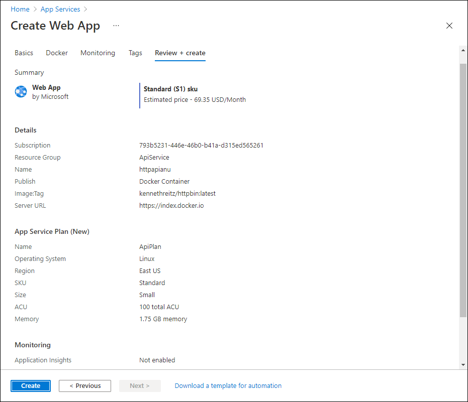
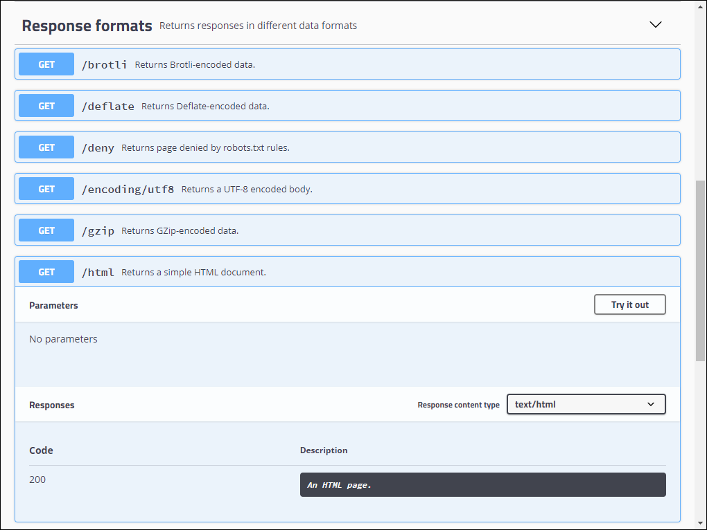
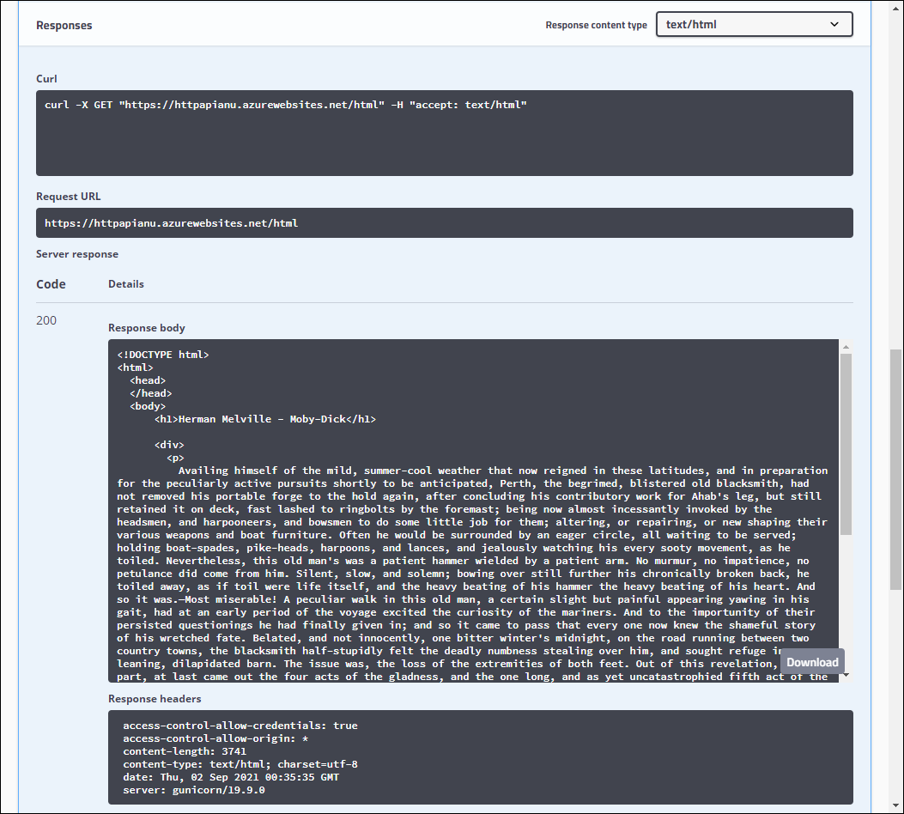
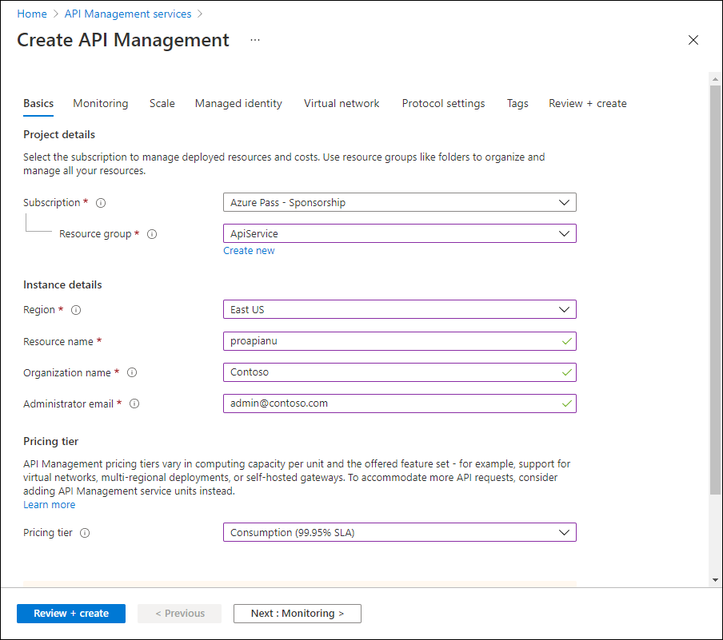
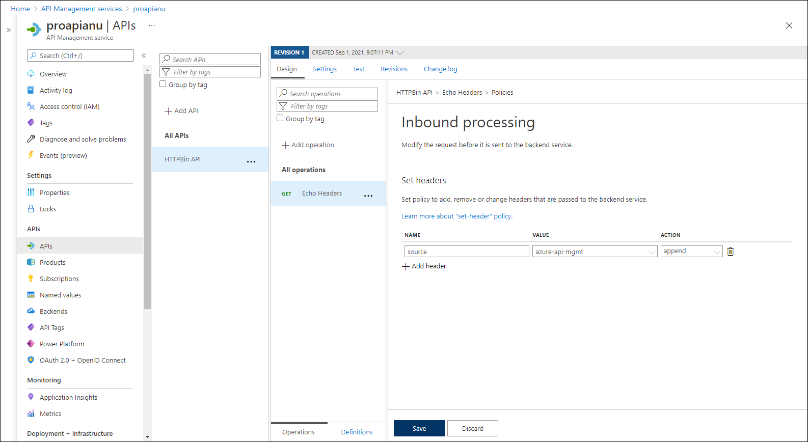
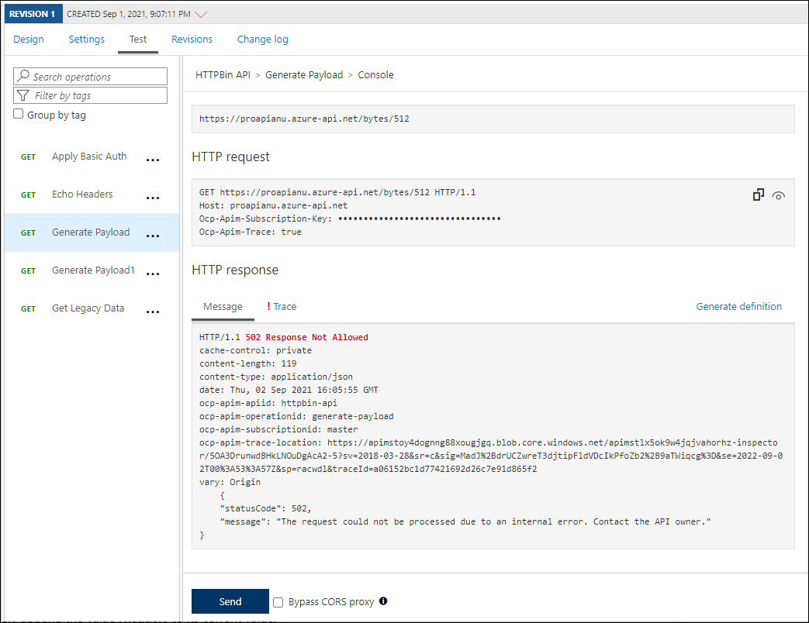
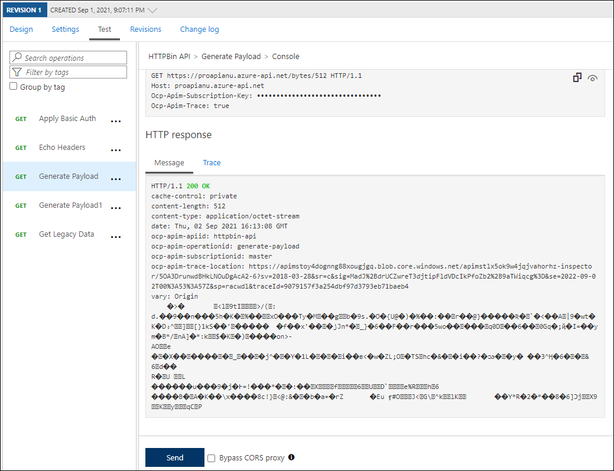
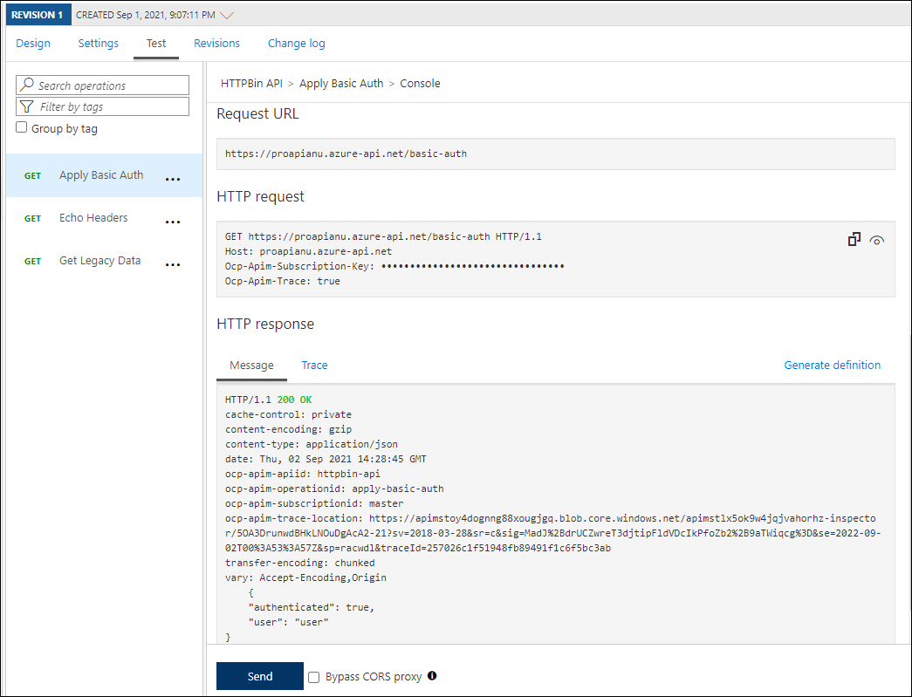

---
lab:
    az204Title: 'Lab 08: Creating a multi-tier solution by using services in Azure'
    az020Title: 'Lab 08: Creating a multi-tier solution by using services in Azure'
    az204Module: 'Module 08: Implement API Management'
    az020Module: 'Module 08: Implement API Management'
---

# Lab 08: Creating a multi-tier solution by using services in Azure

## Microsoft Azure user interface

Given the dynamic nature of Microsoft cloud tools, you might experience Azure UI changes after the development of this training content. These changes might cause the lab instructions and steps to not match up.

Microsoft updates this training course when the community brings needed changes to our attention. However, because cloud updates occur frequently, you might encounter UI changes before this training content updates. **If this occurs, adapt to the changes, and then work through them in the labs as needed.**

## Instructions

### Before you start

#### Sign in to the lab virtual machine

Sign in to your Windows 10 virtual machine (VM) by using the following credentials:
    
-   Username: **Admin**

-   Password: **Pa55w.rd**

> **Note**: Instructions to connect to the virtual lab environment will be provided by your instructor.

#### Review the installed applications

Find the taskbar on your Windows 10 desktop. The taskbar contains the icons for the applications that you'll use in this lab:
    
-   Microsoft Edge

### Exercise 1: Create an Azure App Service resource by using a Docker container image

#### Task 1: Open the Azure portal

1.  On the taskbar, select the **Microsoft Edge** icon.

1.  In the browser window that opens, browse to the Azure portal ([portal.azure.com](https://portal.azure.com)) and sign in with the account you will be using for this lab.

    > **Note**: If this is your first time signing in to the Azure portal, you will be offered a tour of the portal. Select **Get Started** to skip the tour and begin using the portal.

#### Task 2: Create a web app by using Azure App Service resource by using an httpbin container image

1.  In the Azure portal, use the **Search resources, services, and docs** text box at the top of the page to search for **App Services** and, in the list of results, select **App Services**.

1.  On the **App Services** blade, select **+ Create**.

1.  On the **Create Web App** blade, on the **Basics** tab, perform the following actions:
    
    | Setting                         | Action                                                       |
    | ------------------------------- | ------------------------------------------------------------ |
    | **Subscription** drop-down list | Retain the default value.                                    |
    | **Resource group** section      | Select **Create new**, enter **ApiService**,  and then select **OK**. |
    | **Name** text box               | **Enter** **httpapi***[yourname]*                        |
    | **Publish** section             | Select **Docker Container**.                                  |
    | **Operating System** section    | Select **Linux**.                                             |
    | **Region** drop-down  list      | Select any Azure region in which you can deploy an Azure web app.     |
    | **App Service Plan** section    | Select **Create new**, enter  the value **ApiPlan** in the **Name** text  box, and then select **OK**. |
    | **SKU and size** section        | Select **Change size**, on the **Spec  Picker** blade, select **See additional options**,  select **S1**, and select **Apply****.** |

1.  Select **Next: Docker >**.

1.  On the **Docker** tab, perform the following actions, and then select **Review + create**:

    | Setting                         | Action                                     |
    | ------------------------------- | ------------------------------------------ |
    | **Options** drop-down list      | Select **Single Container**.           |
    | **Image Source** drop-down list | Select **Docker Hub**.                 |
    | **Access Type** drop-down list  | Select **Public**.                  |
    | **Image and tag** text box      | Enter **kennethreitz/httpbin:latest**. |

       

1.  On the **Review + create** tab, review the options that you selected during the previous steps.

1.  Select **Create** to create the web app by using your specified configuration.

    > **Note**: Wait for the creation task to complete before you move forward with this lab.

#### Task 3: Test the httpbin web application

1.  In the Azure portal, use the **Search resources, services, and docs** text box at the top of the page to search for **App Services** and, in the list of results, select **App Services**.

1.  On the **App Services** blade, select the newly created web app.

1.  On the blade displaying the newly created app properties, select **Browse**.

1.  Within the web application, perform the following actions:

    1.  Select **Response formats**.

    1.  Select **GET /xml**.

    1.  Select **Try it out**.

     
       

    1.  Select **Execute**.

    1.  Review the value of the **Response body** and **Response headers** text boxes.

    1.  Review the value of the **Request URL** text box.

     
       

     
1.  Within the web application, perform the following actions:

    1.  Select **Dynamic data**.

    1.  Select **GET /bytes/{n}**.

    1.  Select **Try it out**.

    1.  In the **n** text box, enter **500**.

    1.  Select **Execute**.

    1.  Review the value of the **Response body** and **Response headers** text boxes.

    1.  Select **Download file**, and after the file is downloaded, open it in Notepad, review its content, and close it.

    > **Note**: The file contains a sequence of randomly generated bytes.

       

1.  Within the web application, perform the following actions:

    1.  Select **Auth**.

    1.  Select **GET /basic-auth/{user}/{passwd}**.

    1.  Select **Try it out**.

    1.  In the user text box, enter **user**. <!--Marcin, doesn't the text box name appear in the UI? if it appears, we should bold "user" and "passwd" in the next step.-->

    1.  In the passwd text box, enter **passwd**.

    1.  Select **Execute**.

    1.  When prompted, in the **Username** text box, enter **user**, in the **Password** text box, enter **passwd**, and select **Sign in**. <!--Marcin, are they entering the same credentials twice? Just checking-->

    1.  Review the value of the **Response body** and **Response headers** text boxes.

    1.  Review the value of the **Request URL** text box.
     
       
     
1.  Close the browser window displaying the web application.

1.  Switch back to the browser window displaying the **httpapi***[yourname]* web app.

1.  In the **Settings** section, select the **Properties** link.

1.  In the **Properties** section, record the value of the **URL** link. You'll use this value later in the lab to send requests to the corresponding API.

#### Review

In this exercise, you created a new Azure web app by using a container image sourced from Docker Hub.

### Exercise 2: Build an API proxy tier by using Azure API Management

#### Task 1: Create an API Management resource

1.  In the Azure portal, use the **Search resources, services, and docs** text box at the top of the page to search for **API Management services** and, in the list of results, select **API Management services**.

1.  On the **API Management services** blade, select **+ Create**.

1.  On the **Create API Management** blade, perform the following actions, and then select **Review + create**:

    
    | Setting                           | Action                                                       |
    | --------------------------------- | ------------------------------------------------------------ |
    | **Subscription** drop-down list    | Retain the default value.                                    |
    | **Resource group** section        | Select the **ApiService** group that you created  earlier in the lab. |
    | **Resource name** text box        | Enter **prodapi** *[yourname]*.                               |
    | **Region** list                   | Select the same region you chose in the previous exercise.   |
    | **Organization name** text box    | Enter **Contoso**.                                           |
    | **Administrator email** text  box | Enter `admin@contoso.com`.                                    |
    | **Pricing tier** drop-down  list   | **Consumption (99.95% SLA)**.                                |

       

1.  On the **Review + create** tab, review the option that you specified in the previous step and select **Create**.

    > **Note**: Wait for the creation task to complete before you move forward with this lab.

#### Task 2: Define a new API

1.  In the Azure portal, use the **Search resources, services, and docs** text box at the top of the page to search for **API Management services** and, in the list of results, select **API Management services**.

1.  On the **API Management services** blade, select the newly created API management service.

1.  On the **API Management Service** blade, in the **APIs** section, select **APIs**.

1.  In the **Define a new API** section, select **Blank API**.

1.  In the **Create a blank API** window, perform the following actions:
    
    | Setting                           | Action                                                       |
    | --------------------------------- | ------------------------------------------------------------ |
    | **Display name** text box    | Enter **HTTPBin API**, and select **Create**.                                    |
    | **Name** text box | Enter **httpbin-api**. |
    | **Web service URL** text box        | Enter the URL for the web app that you copied earlier in this lab. **Note**: Make sure that the URL starts with the https:// prefix.                              |
    | **API URL suffix** text box   | Leave it empty.  |
 
      

    > **Note**: Wait for the new API to finish being created.

1.  On the **Design** tab, select **+ Add operation**.

1.  In the **Add operation** section, perform the following actions, and then select **Save**:


    | Setting                           | Action                                                       |
    | --------------------------------- | ------------------------------------------------------------ |
    | **Display name** text box    | enter **Echo Headers**.              |
    | **Name** text box | verify that its value is set to **echo-headers**.|
    | **URL** list        | Select **GET**.              |
    | **URL** text box   | Enter **/**.  |

    
       

    
1.  Back on the **Design** tab, in the list of operations, select **Echo Headers**.

1.  In the **Design** section, on the **Inbound processing** tile select **+ Add policy**.

1.  In the **Add inbound policy** section, select the **Set headers** tile.

1.  In the **Set Headers** section, perform the following actions, and then select **Save**:
    
    | Setting                           | Action                                                       |
    | --------------------------------- | ------------------------------------------------------------ |
    | **Name** text box    | Enter **source**.                          |
    | **Value** text box | Select the list, select **Add Value**, and then enter **azure-api-mgmt**. |
    | **Action** list        | Select **append**.              |
    | **API URL suffix** text box   | Leave it empty.  |

       

1.  Back on the **Design** tab, in the list of operations, select **Echo Headers**.

1.  In the **Design** section for **Echo Headers**, on the **Backend** tile, select the pencil icon.
     
       

1.  In the **Backend** section, perform the following actions, and then select **Save**:

    | Setting                           | Action                                                       |
    | --------------------------------- | ------------------------------------------------------------ |
    | **Service URL** section    | Select the **Override** check box.|
    | **Service URL** text box | Append the value **/headers** to its current value. **Note**: For example, if the current value is `http://httpapi[yourname].azurewebsites.net`, the new value will be `http://httpapi*[yourname]*.azurewebsites.net/headers`.|
    
1.  Back on the **Design** tab, in the list of operations, select **Echo Headers**, and then select the **Test** tab.

1.  In the **Echo Headers** section, select **Send**.

       
    
1.  Review the results of the API request.

    > **Note**: Verify that there are many headers sent as part of your request that are echoed in the response. They include the new **Source** header that you created as part of this task.
     
       
     
1.  Select the **Design** tab to return to the list of operations.

#### Task 3: Manipulate an API response

1.  On the **Design** tab, select **+ Add operation**.

1.  In the **Add operation** section, perform the following actions, and select **Save**:

    | Setting                           | Action                                                       |
    | --------------------------------- | ------------------------------------------------------------ |
    | **Display name** text box    | Enter **Get Legacy Data**.|
    | **Name** text box | Verify that its value is set to **get-legacy-data**.|
    | **URL** list | Verify that its value is set to **get-legacy-data**.|
    | **URL** text box | Enter **/xml**.|

1.  Back on the **Design** tab, in the list of operations, select **Get Legacy Data**.

1.  Select the **Test** tab, and then select **Send**.

1.  Review the results of the API request.

    > **Note**: At this point, the results should be in XML format.

    
       

    
1.  Select the **Design** tab and then select **Get Legacy Data**.

1.  On the **Design** pane, in the **Outbound processing** section, select **Add policy**.
    
       
    
1.  In the **Add outbound policy** section, select the **Other policies** tile.

1.  In the policy code editor, find the following block of XML content:

    ```
    <outbound>
        <base />
    </outbound>
    ```

1.  Replace that block of XML with the following XML:

    ```
    <outbound>
        <base />
        <xml-to-json kind="direct" apply="always" consider-accept-header="false" />
    </outbound>
    ```

1.  In the policy code editor, select **Save**.

1.  Back on the **Design** tab, in the list of operations, select **Get Legacy Data**, and then select **Test**.

1.  In the **Get Legacy Data** section, select **Send**.

1.  Review the results of the API request.

    > **Note**: The new results are in JavaScript Object Notation (JSON) format.

1.  Within the **HTTP response** section, perform the following actions:

    1.  Select **Trace**.

    1.  Review the content in the **Backend** and **Outbound** text boxes and note that they include details of the corresponding API operations with their timing information.

1.  On the **Design** tab, select **+ Add operation**.

1.  In the **Add operation** section, perform the following actions, and select **Save**:

    | Setting                           | Action                                                       |
    | --------------------------------- | ------------------------------------------------------------ |
    | **Display name** text box    | Enter **Generate Payload**.|
    | **Name** text box | Verify that its value is set to **generate-payload**.|
    | **URL** list | Select **GET**.|
    | **URL** text box | Enter **/bytes/{n}**.|
    | **Template parameters** section | In the **TYPE** text box, enter **int**.|


1.  Back on the **Design** tab, in the list of operations, select **Generate Payload**.

1.  In the **Design** section, on the **Outbound processing** tile select **+ Add policy**.

1.  In the **Add outbound policy** section, select the **Validate content** tile.

1.  In the **Outbound processing** section, perform the following actions, and then select **Save**:
    
    | Setting                           | Action                                                       |
    | --------------------------------- | ------------------------------------------------------------ |
    | **Unspecified content type action** drop-down list    | Select **Ignore**.|
    | **Maximum payload size (in bytes)** text box | Enter **128**.|
    | **Size exceeded action** drop-down list| Select **Prevent**.|
    | **Errors variable name** text box | Enter **validationErrors**.|
    

1.  Back on the **Design** tab, in the list of operations, select **Generate Payload**, and then select the **Test** tab.

1.  In the **Generate Payload** section, in the **Template parameters** subsection, in the **VALUE** text box of the **n** parameter, enter **512** and select **Send**.

1.  Review the results of the API request.

    > **Note**: You should receive the HTTP/1.1 502 Response Not Allowed message, since the size of the payload exceed the limit defined by the outbound policy.

     
       

     
1.  Select the **Design** tab, and then select **Generate Payload**.

1.  On the **Outbound processing** tile, select the pencil icon.

1.  In the **Maximum payload size (in bytes)** text box, replace **128** with **1024**.

1.  Select **Save**.

1.  Back on the **Design** tab, in the list of operations, select **Generate Payload**, and then select the **Test** tab.

1.  In the **Generate Payload** section, in the **Template parameters** subsection, in the **VALUE** text box of the **n** parameter, enter **512** ,and then select **Send**.

1.  Review the results of the API request.

    > **Note**: You should receive the HTTP/1.1 200 OK response message because the size of the payload is now within the limit defined by the outbound policy.

       

#### Task 4: Manipulate an API request

1.  On the **Design** tab, select **+ Add operation**.

1.  In the **Add operation** section, perform the following actions, and then select **Save**:

    | Setting                           | Action                                                       |
    | --------------------------------- | ------------------------------------------------------------ |
    | **Display name** text box    | Enter **Apply Basic Auth**.|
    | **Name** text box | Verify that its value is set to **apply-basic-auth**.|
    | **URL** list | select **GET**.|
    | **URL** text box | Enter **/basic-auth**.|

1.  Back on the **Design** tab, in the list of operations, select **Apply Basic Auth**.

1.  In the **Design** section, on the **Inbound processing** tile select **+ Add policy**.

1.  In the **Add inbound policy** section, select the **Rewrite URL** tile.

1.  In the **Rewrite URL** section, perform the following actions:
       
    1.  In the **Backend** text box, enter **/basic-auth/user/passwd**.
    
    1.  Select **Save**.

1.  Back on the **Design** tab, in the list of operations, select **Apply Basic Auth**, and then select the **Test** tab.
    
1.  In the **Apply Basic Auth** section, select **Send**.

1.  Review the results of the API request.

    > **Note**: Verify that the request returned the **HTTP/1.1 200 OK** response.

    
       

    
#### Review

In this exercise, you built a proxy tier between your App Service resource and any developers who wish to make queries against its API.

### Exercise 3: Clean up your subscription

#### Task 1: Open Azure Cloud Shell

1.  In the Azure portal, select the **Cloud Shell** icon to open a new PowerShell session. If Cloud Shell defaults to a PowerShell session, select **PowerShell** and, in the drop-down menu, select **Bash**.

    > **Note**: The **Cloud Shell** icon is represented by a greater than sign (\>) and underscore character (\_).

    > **Note**: If this is the first time you are starting **Cloud Shell**, when prompted to select either **Bash** or **PowerShell**, select **PowerShell**. When you are presented with the **You have no storage mounted** message, select the subscription you are using in this lab, and select **Create storage**.

#### Task 2: Delete resource groups

1.  From the  Cloud Shell pane, run the following command to delete the **ApiService** resource group:

    ```
    az group delete --name ApiService --no-wait --yes
    ```
    
     > **Note**: The command executes asynchronously (as determined by the --no-wait parameter), so while you will be able to run another Azure CLI command immediately afterwards within the same Bash session, it will take a few minutes before the resource groups are actually removed.
  
1.  Close the **Cloud Shell** pane in the portal.

#### Task 3: Close the active applications

1.  Close the currently running Microsoft Edge application.

1.  Close the currently running Visual Studio Code application.

#### Review

In this exercise, you cleaned up your subscription by removing the resource groups used in this lab.
