# Lab 08: Create a multi-tier solution by using Azure services

## Architecture diagram


## Lab setup and pre-requisites

Before starting this lab, you must complete the **Prerequisites** of this lab.

To install the **C#** extension for this lab, follow the below steps in visual studio code:

1. Start Visual Studio Code.

     

2. Select the **Extensions** blade from the left panel.
3. Search with **C#** and select **Install** to install the extension.

    

4. After installing C# extensions, close the Visual Studio code.

### Exercise 1: Create an Azure App Service resource by using a Docker container image

#### Task 1: Open the Azure portal

1. If you are not logged in already, click on the **Azure portal** shortcut that is available on the desktop and log in with Azure credentials.

1. If not signed in, then on the **Sign into Microsoft Azure** tab you will see the login screen, in that enter the following **Email/Username** and click on **Next**. 
   * Email/Username: <inject key="AzureAdUserEmail"></inject>
   
    
    
1. Now enter the following **Password** and click on **Sign in**.
   * Password: <inject key="AzureAdUserPassword"></inject>

    
    
1. If you see the pop-up **Stay Signed in?**, click No.

    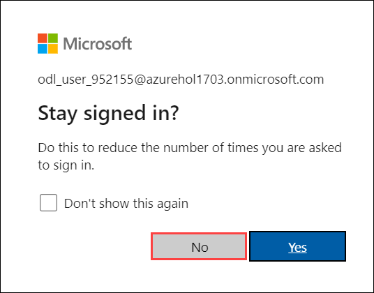

#### Task 2: Create a web app by using Azure App Service resource by using an httpbin container image

1.  In the Azure portal, use the **Search resources, services, and docs** text box to search for **App Services** and, in the list of results, select **App Services**.

1.  On the **App Services** blade, click on **+ Create** and then **+ Web App**.

1.  On the **Create Web App** blade, on the **Basics** tab, perform the following actions:
    
    | Setting                         | Action                                                       |
    | ------------------------------- | ------------------------------------------------------------ |
    | **Subscription** drop-down list | Retain the default value.                                    |
    | **Resource group** section      | Select Existing rg, enter **ApiService-<inject key="DeploymentID" enableCopy="false"/>**. |
    | **Name** text box               | Enter **httpapi<inject key="DeploymentID" enableCopy="false"/>**|
    | **Publish** section             | Select **Docker Container**.                                  |
    | **Operating System** section    | Select **Linux**.                                             |
    | **Region** drop-down list       | Select any Azure region in which you can deploy an Azure web app.     |
    | **Linux Plan** section          | Select **Create new**, enter  the value **ApiPlan** in the **Name** text  box, and then select **OK**. |
    | **Pricing Plan** section        | Select **Explore Pricing plan**, on the **Select App service Pricing Plan** blade, select **Standard S1** under Production then click on **Select**. 
    
    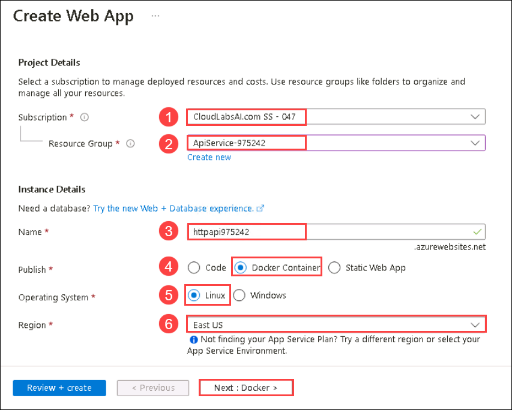
    
    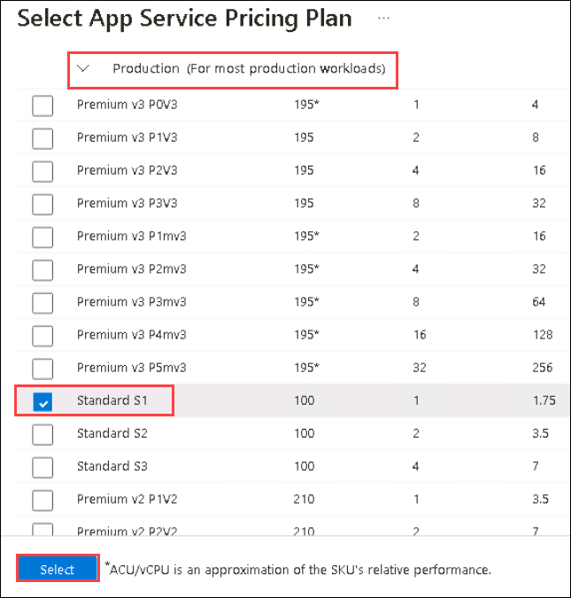

1.  Select **Next: Docker >**.

1.  On the **Docker** tab, perform the following actions, and then select **Review + create**:

    | Setting                         | Action                                     |
    | ------------------------------- | ------------------------------------------ |
    | **Options** drop-down list      | Select **Single Container**           |
    | **Image Source** drop-down list | Select **Docker Hub**                 |
    | **Access Type** drop-down list  | Select **Public**                  |
    | **Image and tag** text box      | Enter **kennethreitz/httpbin:latest** |

    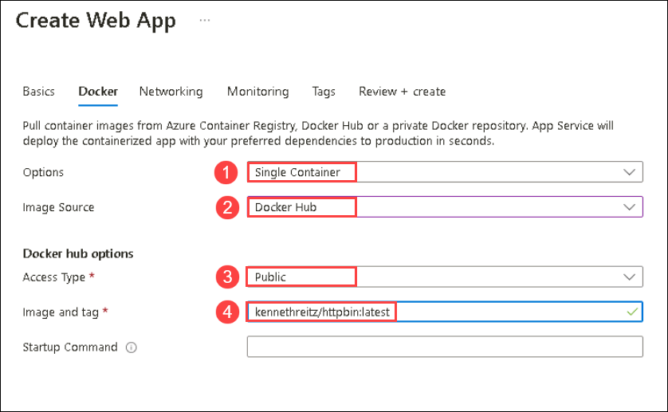

1.  On the **Review + create** tab, review the options that you selected during the previous steps.

1.  Select **Create** to create the web app by using your specified configuration.

     **Note**: Wait for the creation task to complete before you proceed with this lab.

#### Task 3: Test the httpbin web application

1.  In the Azure portal, use the **Search resources, services, and docs** text box to search for **App Services** and, in the list of results, select **App Services**.

2.  On the **App Services** blade, select the newly created web app.

3.  On the blade displaying the newly created app properties, select **Browse**.

4.  Within the web application, perform the following actions:

    a. Select **Response formats**.
    
    b. Select **GET /html**.

    c. Select **Try it out**.

    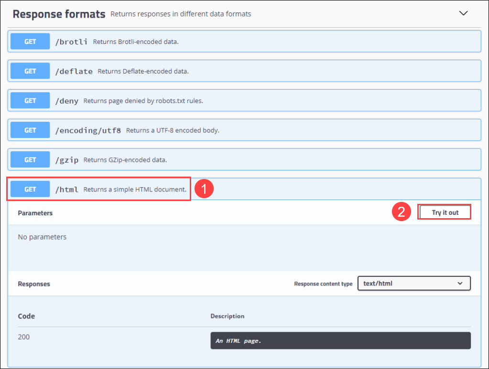

    d. Select **Execute**.

    e. Review the value of the **Response body** and **Response headers** text boxes.
    
    f. Review the value of the **Request URL** text box.

  
6.  Within the web application, perform the following actions:

    a.  Select **Dynamic data**.

    b.  Select **GET /bytes/{n}**.

    c.  Select **Try it out**.

    d.  In the **n** text box, enter **25**.

    e.  Select **Execute**.
    

     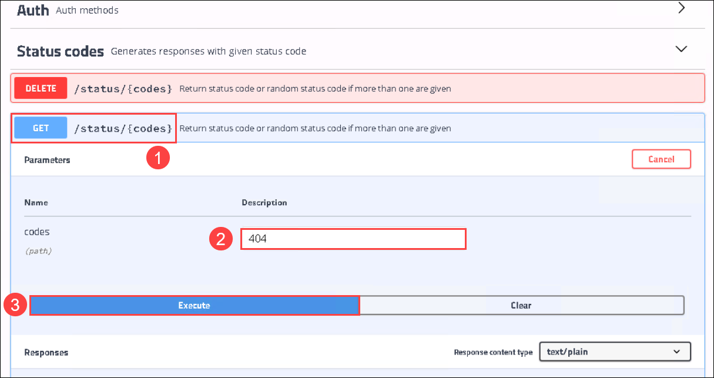

    f.  Review the value of the **Response body** and **Response headers** text boxes.

    g.  Select **Download file**, and after the file downloads, open it in Notepad, review its content, and then close it.

    > **Note**: The file contains a sequence of randomly generated bytes.

    The following screenshot displays the dynamic data section of the web application.
  
    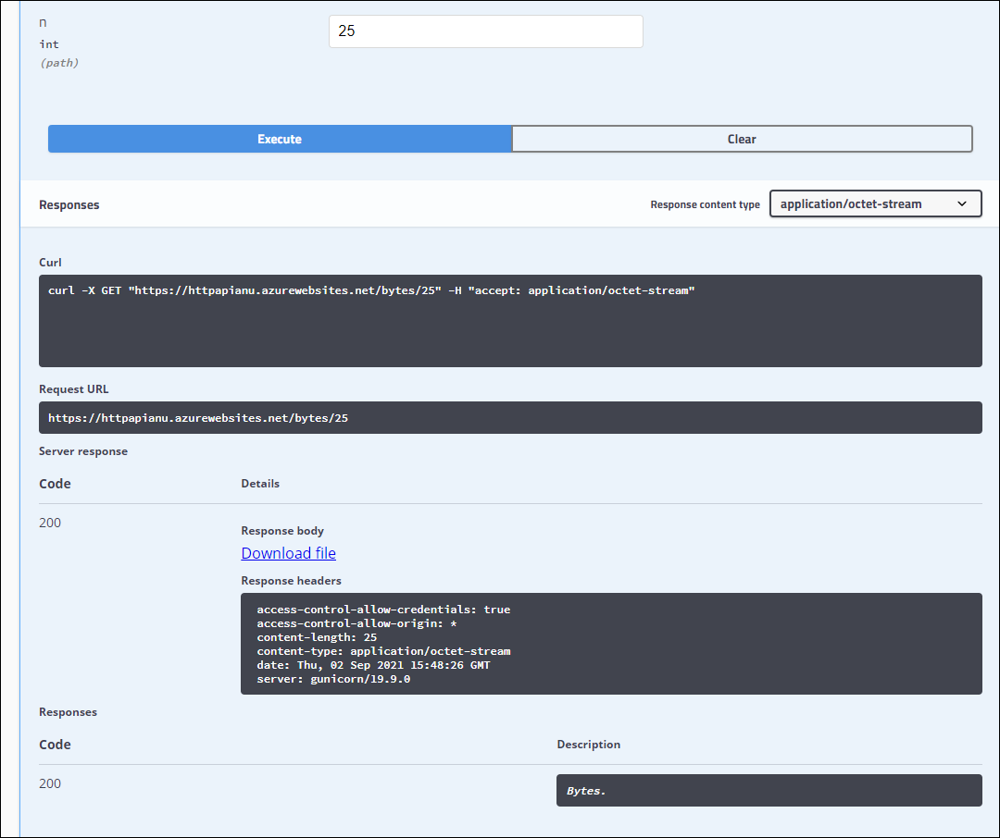

7.  Within the web application, perform the following actions:

    a.  Select **Status codes**.

    b.  Select **GET /status/{codes}**.

    c.  Select **Try it out**.

    d.  In the **codes** text box, enter **404**.

    e.  Select **Execute**.
       
    f.  Review the **Server response** and note that it includes **Error: NOT FOUND** entry.
     

     

8.  Close the browser window that displays the web application.

9.  Switch back to the browser window that displays the **httpapi<inject key="DeploymentID" enableCopy="false"/>** web app.

10.  In the **properties** section, record the value of the **default domain URL** link under Domain. You'll use this value later in the lab to send requests to the corresponding API.

 > **Congratulations** on completing the task! Now, it's time to validate it. Here are the steps:

 - Navigate to the Lab Validation Page, from the upper right corner in the lab guide section.
 - Hit the Validate button for the corresponding task. If you receive a success message, you can proceed to the next task. 
 - If not, carefully read the error message and retry the step, following the instructions in the lab guide.
 - If you need any assistance, please contact us at labs-support@spektrasystems.com. We are available 24/7 to help you out.

### Review

In this exercise, you created a new Azure web app by using a container image sourced from Docker Hub.

### Exercise 2: Build an API proxy tier by using Azure API Management

#### Task 1: Create an API Management resource

1.  In the Azure portal, use the **Search resources, services, and docs** text box to search for **API Management services** and, in the list of results, select **API Management services**.

1.  On the **API Management services** blade, select **+ Create**.

1.  On the **Create API Management** blade, perform the following actions, and then select **Review + create**:

    
    | Setting                           | Action                                                       |
    | --------------------------------- | ------------------------------------------------------------ |
    | **Subscription** drop-down list    | Retain the default value                                    |
    | **Resource group** section        | Select the **ApiService-<inject key="DeploymentID" enableCopy="false"/>** group|
    | **Resource name** text box        | Enter **proapi<inject key="DeploymentID" enableCopy="false"/>** |
    | **Region** list                   | Select the same region you chose in the previous exercise.   |
    | **Organization name** text box    | Enter **Contoso**                                           |
    | **Administrator email** text  box | Enter `admin@contoso.com`                                    |
    | **Pricing tier** drop-down  list   | **Consumption (99.95% SLA)**                                |

    The following screenshot displays the configured settings of **Create API Management** blade of the web application.
    
    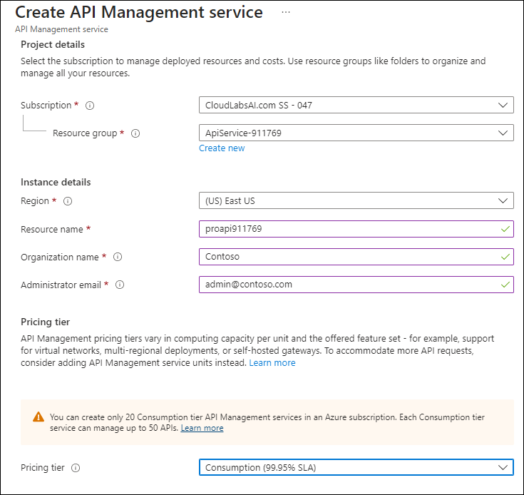

1.  On the **Review + create** tab, review the option that you specified in the previous step, and then select **Create**.

    > **Note**: Wait for the creation task to complete before you continue with this lab.

#### Task 2: Define a new API

1.  In the Azure portal, use the **Search resources, services, and docs** text box to search for **API Management services** and, in the list of results, select **API Management services**.

1.  On the **API Management services** blade, select the newly created API management service.

1.  On the **API Management Service** blade, in the **APIs** section, select **APIs**.

1.  In the **Define a new API** section, select **HTTP**.

1.  In the **Create a HTTP API** window, perform the following actions in the **Basic** tab and select **Create**:

    
    | Setting                           | Action                                                       |
    | --------------------------------- | ------------------------------------------------------------ |
    | **Display name** text box         | Enter **HTTPBin API**                                    |
    | **Name** text box                 | Enter **httpbin-api** |
    | **Web service URL** text box      | Enter the URL for the web app that you copied earlier in this lab **Note**: Make sure that the URL starts with the https:// prefix.|     | **API URL suffix** text box   | Leave it empty  |
 
    The following screenshot displays the configured settings of **Create a blank API** window of the web application.

    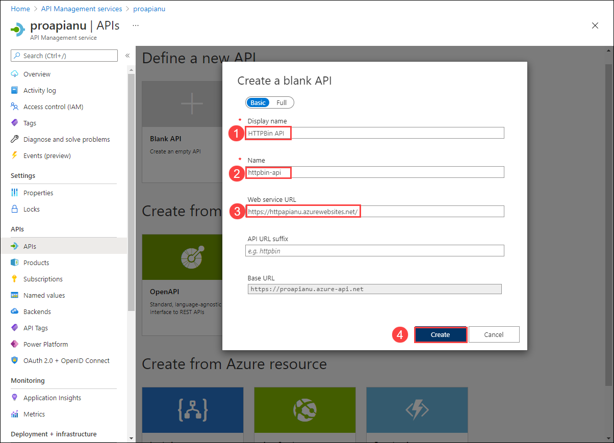

    > **Note**: Wait for the new API to finish being created.

1.  On the **Design** tab, select **+ Add operation**.

1.  In the **Add operation** section, perform the following actions, and then select **Save**:

    | Setting                           | Action                                                       |
    | --------------------------------- | ------------------------------------------------------------ |
    | **Display name** text box         | Enter **Echo Headers**                                      |
    | **Name** text box                 | Verify that its value is set to **echo-headers**            |
    | **URL** list                      | Select **GET**                                              |
    | **URL** text box                  | Enter **/**                                                  |

    The following screenshot displays the configured settings of the **Add operation** section.
    
    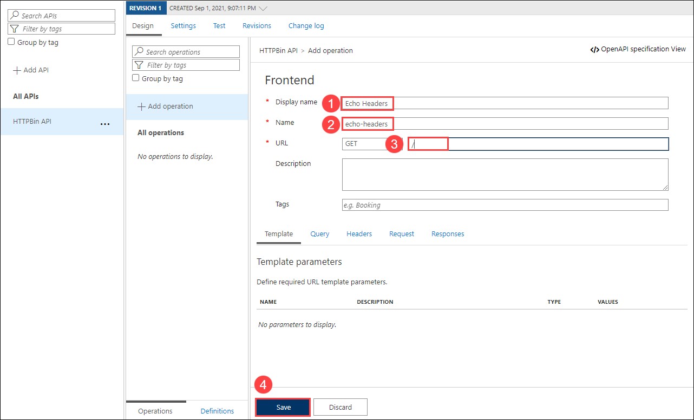

    
1.  Back on the **Design** tab, in the list of operations, select **Echo Headers**.

1.  In the **Design** section, on the **Inbound processing** tile select **+ Add policy**.

1.  In the **Add inbound policy** section, select the **Set headers** tile.

1.  In the **Set Headers** section, perform the following actions, and then select **Save**:
    
    | Setting                           | Action                                                       |
    | --------------------------------- | ------------------------------------------------------------ |
    | **Name** text box    | Enter **source**                          |
    | **Value** text box | Select the list, select **Add Value**, and then enter **azure-api-mgmt** |
    | **Action** list        | Select **append**              |

    The following screenshot displays the configured settings of the **Design** section.

    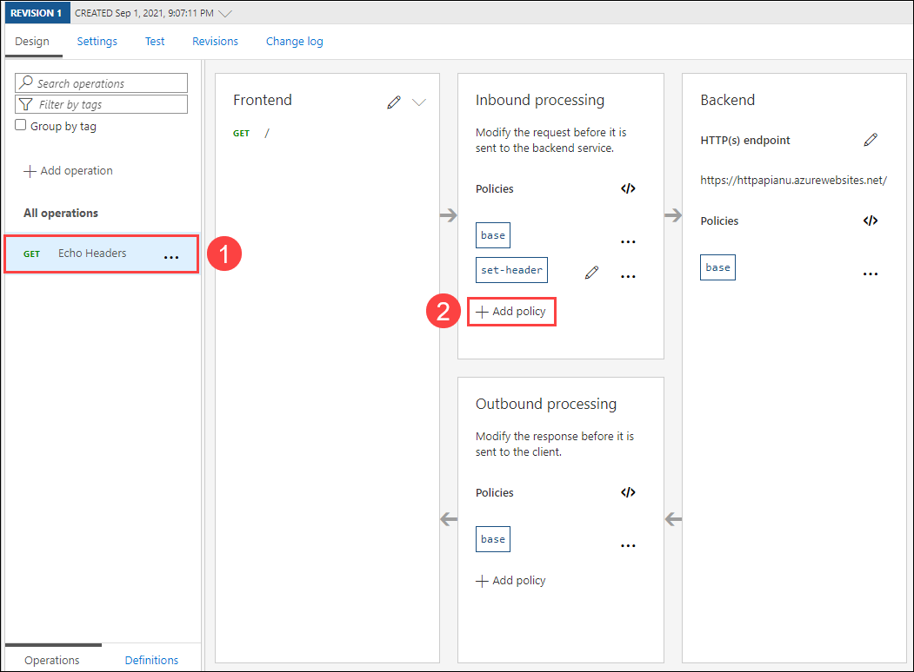

1.  Back on the **Design** tab, in the list of operations, select **Echo Headers**.

1.  In the **Design** section for **Echo Headers**, on the **Backend** tile, select the pencil icon.

1.  In the **Backend** section, perform the following actions, and then select **Save**:

    | Setting                           | Action                                                       |
    | --------------------------------- | ------------------------------------------------------------ |
    | **Service URL** section    | Select the **Override** check box |
    | **Service URL** text box | Append the value **/headers** to its current value. **Note**: For example, if the current value is **https://httpapi[DeploymentID].azurewebsites.net**, the new value will be **https://httpapi[DeploymentID].azurewebsites.net/headers** |

     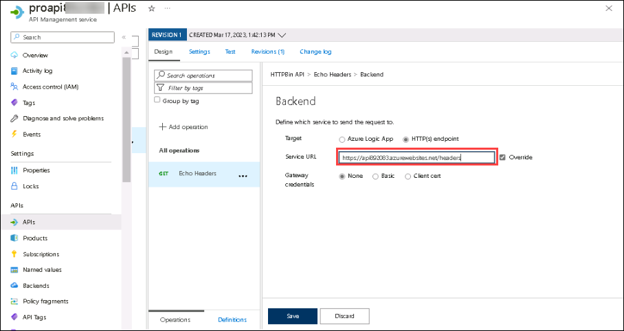  

1.  Back on the **Design** tab, in the list of operations, select **Echo Headers**.

1.  In the **Echo Headers** section, select **Test** and click **Send**.

    The following screenshot displays the configured settings of the **Echo Headers** section.

    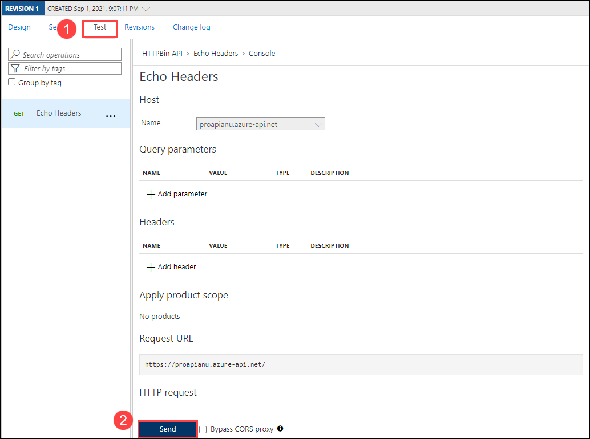
    
1.  Review the results of the API request.

    > **Note**: Verify that there are many headers sent as part of your request that are echoed in the response. They should include the new **Source** header that you created as part of this task.
     
    The following screenshot displays the response to the **Echo Headers** request.

    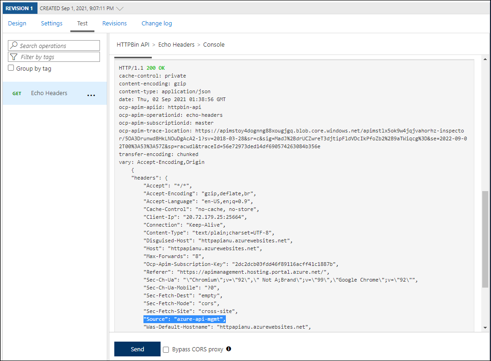
     
1.  Select the **Design** tab to return to the list of operations.

 > **Congratulations** on completing the task! Now, it's time to validate it. Here are the steps:

 - Navigate to the Lab Validation Page, from the upper right corner in the lab guide section.
 - Hit the Validate button for the corresponding task. If you receive a success message, you can proceed to the next task. 
 - If not, carefully read the error message and retry the step, following the instructions in the lab guide.
 - If you need any assistance, please contact us at labs-support@spektrasystems.com. We are available 24/7 to help you out.

#### Task 3: Manipulate an API response

1.  On the **Design** tab, select **+ Add operation**.

1.  In the **Add operation** section, perform the following actions, and then select **Save**:

    | Setting                           | Action                                                       |
    | --------------------------------- | ------------------------------------------------------------ |
    | **Display name** text box    | Enter **Get Legacy Data**|
    | **Name** text box | Verify that its value is set to **get-legacy-data**|
    | **URL** list | Verify that its value is set to **GET**|
    | **URL** text box | Enter **/xml**|

1.  Back on the **Design** tab, in the list of operations, select **Get Legacy Data**.
    
    > **Note**: Ensure that you have checked the Override checkbox in the backend panel to proceed with the next step.

1.  Select the **Test** tab, and then select **Send**.

1.  Review the results of the API request.

    > **Note**: At this point, the results should be in XML format.

    The following screenshot displays the results of the API request.
    
    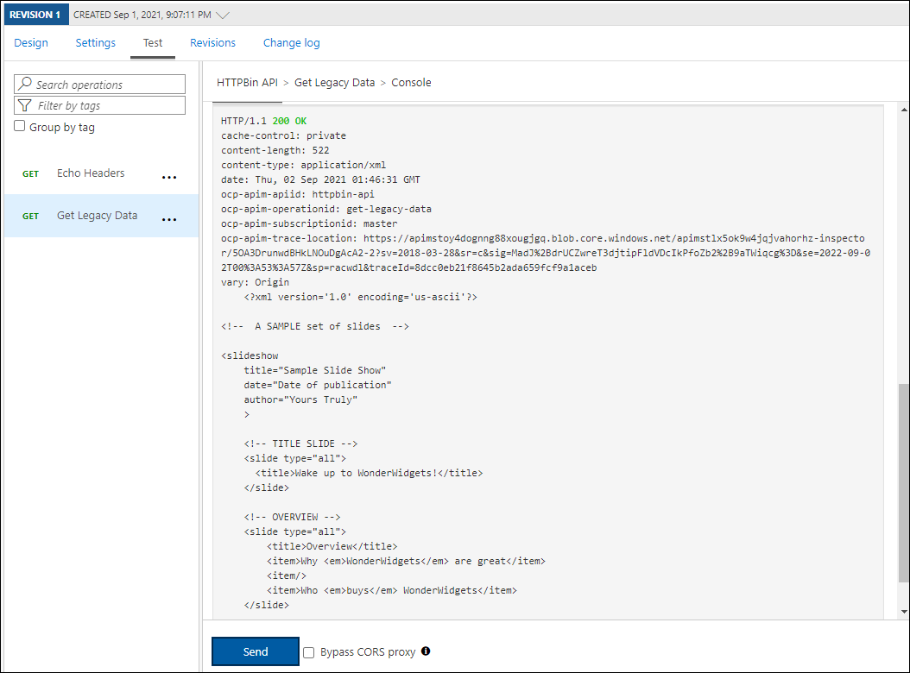

    
1.  Select the **Design** tab, and then select **Get Legacy Data**.

1.  On the **Design** pane, in the **Outbound processing** section, select **Add policy**.
    
    The following screenshot displays the **Outbound processing** section.
    
    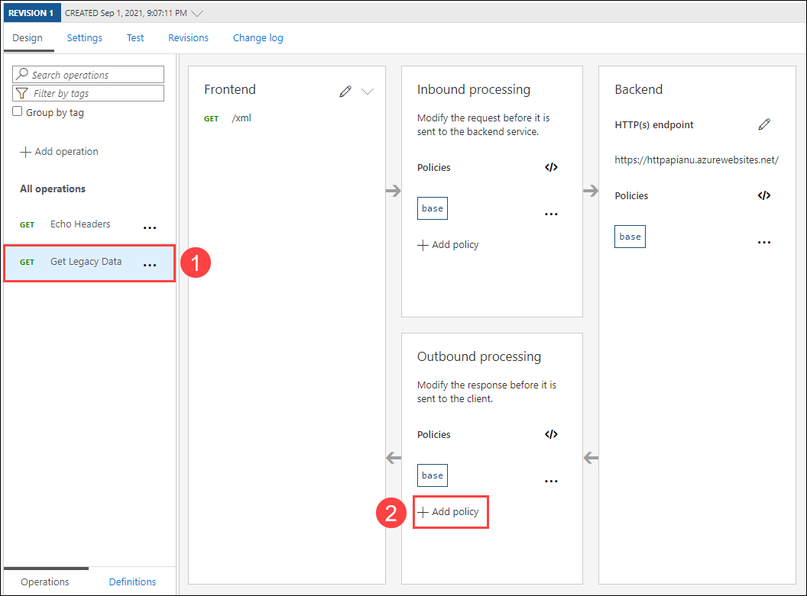
    
1.  In the **Add outbound policy** section, select the **Other policies** tile.

1.  In the policy code editor, find the following block of XML content:

    ```
    <outbound>
        <base />
    </outbound>
    ```

1.  Replace that block of XML with the following XML:

    ```
    <outbound>
        <base />
        <xml-to-json kind="direct" apply="always" consider-accept-header="false" />
    </outbound>
    ```
     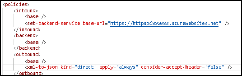  

1.  In the policy code editor, select **Save**.

1.  Back on the **Design** tab, in the list of operations, select **Get Legacy Data**, and then select **Test**.

1.  In the **Get Legacy Data** section, select **Send**.

1.  Review the results of the API request.

    > **Note**: The new results are in JavaScript Object Notation (JSON) format.

 > **Congratulations** on completing the task! Now, it's time to validate it. Here are the steps:

 - Navigate to the Lab Validation Page, from the upper right corner in the lab guide section.
 - Hit the Validate button for the corresponding task. If you receive a success message, you can proceed to the next task. 
 - If not, carefully read the error message and retry the step, following the instructions in the lab guide.
 - If you need any assistance, please contact us at labs-support@spektrasystems.com. We are available 24/7 to help you out.

#### Task 4: Manipulate an API request

1.  On the **Design** tab, select **+ Add operation**.

1.  In the **Add operation** section, perform the following actions, and then select **Save**:

    | Setting                           | Action                                                       |
    | --------------------------------- | ------------------------------------------------------------ |
    | **Display name** text box    | Enter **Modify Status Code**|
    | **Name** text box | Verify that its value is set to **modify-status-code**|
    | **URL** list | Select **GET**|
    | **URL** text box | Enter **/status/404**|

1.  Back on the **Design** tab, in the list of operations, select **Modify Status Code**.

1.  In the **Design** section, on the **Inbound processing** tile, select **+ Add policy** (move your scroll bar to the right).

1.  In the **Add inbound policy** section, select the **Rewrite URL** tile.

1.  In the **Rewrite URL** section, perform the following actions:
       
    a.  In the **Backend** text box, enter **/status/200**.
    
     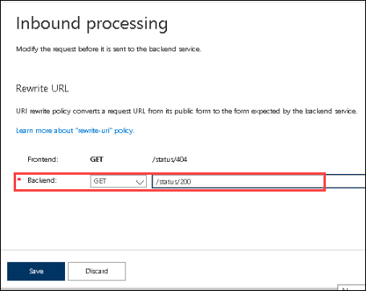   
    
    b.  Select **Save**.
    
    > **Note**:  Ensure that you have checked the Override checkbox in the backend panel to proceed with the next step.

1.  Back on the **Design** tab, in the list of operations, select **Modify Status Code**, and then select the **Test** tab.
    
1.  In the **Modify Status Code** section, select **Send**.

1.  Review the results of the API request.

    > **Note**: Verify that the request returned the **HTTP/1.1 200 OK** response.
   
### Review

In this exercise, you built a proxy tier between your App Service resource and any developers who wish to make queries against its API.

**You have successfully completed the lab**
