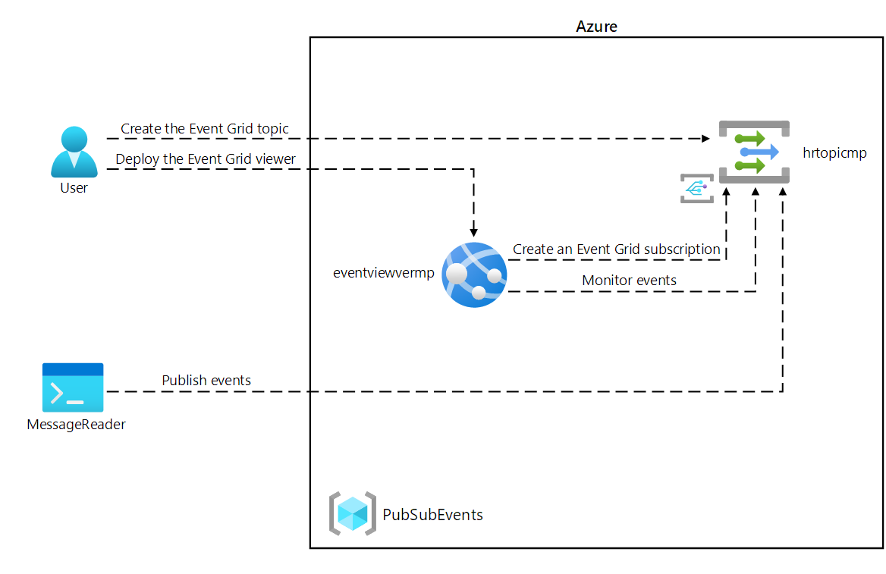
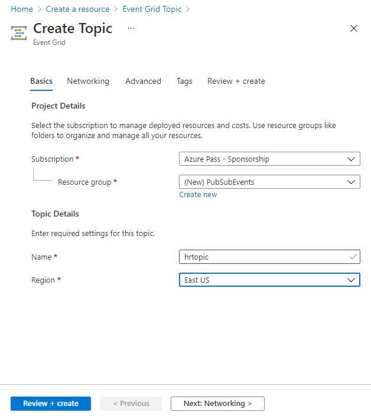
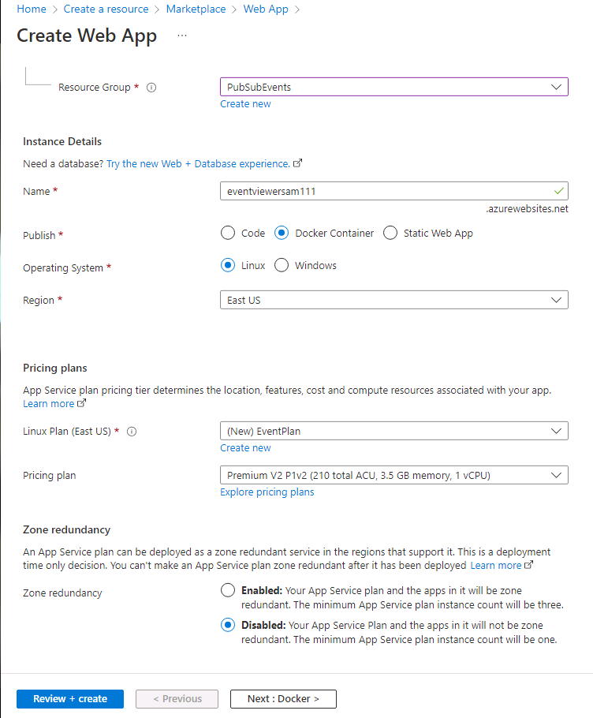
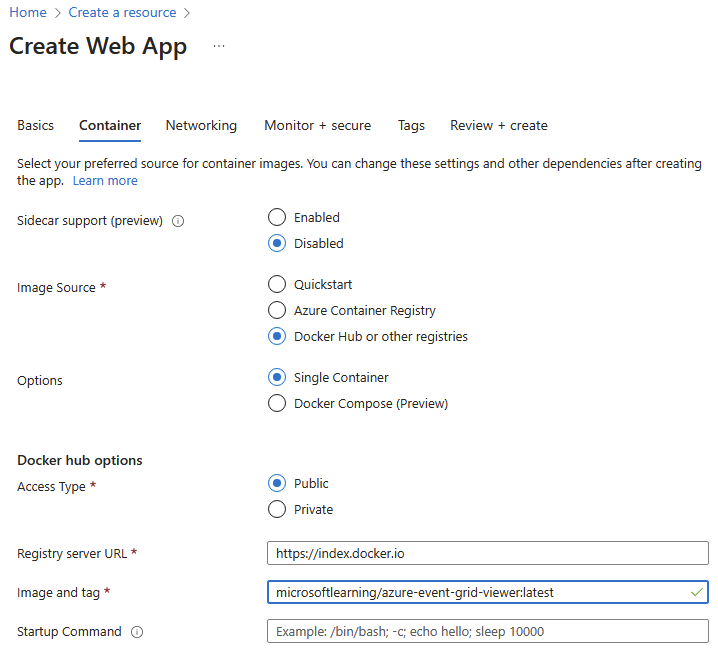
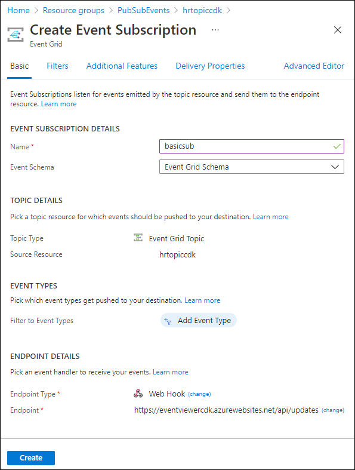

---
lab:
    az204Title: 'Lab 09: Publish and subscribe to Event Grid events'
    az020Title: 'Lab 09: Publish and subscribe to Event Grid events'
    az204Module: 'Module 09: Develop event-based solutions'
    az020Module: 'Module 09: Develop event-based solutions'
---

# Lab 09: Publish and subscribe to Event Grid events

## Microsoft Azure user interface

Given the dynamic nature of Microsoft cloud tools, you might experience Azure UI changes that occur after the development of this training content. As a result, the lab instructions and lab steps might not align correctly.

Microsoft updates this training course when the community alerts us to needed changes. However, cloud updates occur frequently, so you might encounter UI changes before this training content updates. **If this occurs, adapt to the changes, and then work through them in the labs as needed.**

## Instructions

### Before you start

#### Sign in to the lab environment

Sign in to your Windows 10 virtual machine (VM) using the following credentials:

- Username: **Admin**

- Password: **Pa55w.rd**

> **Note**: Your instructor will provide instructions for connecting to the virtual lab environment.

#### Review the installed applications

Find the taskbar on your Windows 10 desktop. The taskbar contains the icons for the applications that you'll use in this lab, including:

- Microsoft Edge

- Microsoft Visual Studio Code

## Architecture diagram



### Exercise 1: Create Azure resources

#### Task 1: Open the Azure portal

1. On the taskbar, select the **Microsoft Edge** icon.

1. In the open browser window, browse to the Azure portal (<https://portal.azure.com>), and then sign in with the account you'll be using for this lab.

    > **Note**: If this is your first time signing in to the Azure portal, you'll be offered a tour of the portal. Select **Get Started** to skip the tour and begin using the portal.

#### Task 2: Open Azure Cloud Shell

1. In the Azure portal, select the **Cloud Shell** icon  to open a new Bash session. If Cloud Shell defaults to a PowerShell session, select **PowerShell** and, in the drop-down menu, select **Bash**.

    > **Note**: If this is the first time you are starting **Cloud Shell**, when prompted to select either **Bash** or **PowerShell**, select **Bash**. When you are presented with the **You have no storage mounted** message, select the subscription you are using in this lab, and then select **Create storage**.

1. In Azure portal, at the **Cloud Shell** command prompt, run the following command to get the version of the Azure Command-Line Interface (Azure CLI) tool:

    ```bash
    az --version
    ```

#### Task 3: Review the Microsoft.EventGrid provider registration

1. In the **Cloud Shell pane**, run the following command to check if the resource provider "Microsoft.EventGrid" has been registered :

    ```bash
    az provider show --namespace Microsoft.EventGrid --query "registrationState"
    ```

1. Notice that the **Microsoft.EventGrid** provider has been registered.

1. Close the **Cloud Shell** pane.

#### Task 4: Create a custom Event Grid topic

1. On the Azure portal's navigation pane, select **Create a resource**.

1. On the **Create a resource** blade, in the **Search services and marketplace** text box, enter **Event Grid Topic**, and then select Enter.

1. On the **Marketplace** search results blade, select the **Event Grid Topic** result, and then select **Create**.

1. On the **Create Topic** blade, on the **Basics** tab, perform the following actions, and then select the **Advanced** tab:

    | Setting | Action |
    | -- | -- |
    | **Subscription** drop-down list  | Retain the default value |
    | **Resource group** drop-down list | Select **Create new**, enter **PubSubEvents**, and then select **OK** |
    | **Name** text box | Enter **hrtopic**_[yourname]_ |
    | **Region** drop-down list | Select **East US** |

   The following screenshot displays the configured settings on the **Basics** tab.

   

1. On the **Advanced** tab, from the **Event Schema** drop-down list, select **Event Grid Schema**, and then select **Review + create**.

1. On the **Review + create** tab, review the options that you selected during the previous steps.

1. Select **Create** to create the event grid topic by using your specified configuration.
  
    > **Note**: Wait for Azure to finish creating the topic before you continue with the lab. You'll receive a notification when the topic is created.

#### Task 5: Deploy the Azure Event Grid viewer to a web app

1. On the Azure portal's navigation pane, select **Create a resource**.

1. On the **Create a resource** blade, in the **Search services and marketplace** text box, enter **Web App**, and then select Enter.

1. On the **Marketplace** search results blade, select the **Web App** result, and then select **Create**.

1. On the **Create Web App** blade, on the **Basics** tab, perform the following actions, and then select **Next: Docker**:

   | Setting | Action |
   | -- | -- |
   | **Subscription** drop-down list | Retain the default value |
   | **Resource group** drop-down list | Select **PubSubEvents** in the list |
   | **Name** text box | Enter **eventviewer**_[yourname]_ |
   | **Publish** section | Select **Docker Container** |
   | **Operating System** section | Select **Linux** |
   | **Region** drop-down list | Select **East US** |
   | **Linux Plan (East US)** section | Select **Create new**, in the **Name** text box, enter **EventPlan**, and then select **OK** |
   | **Pricing plan** section | Retain the default value |

   The following screenshot displays the configured settings on the **Create Web App** blade.

   

1. On the **Docker** tab, perform the following actions, and select **Review + create**:

    | Setting | Action |
    | -- | -- |
    | **Options** drop-down list | Select **Single Container** |
    | **Image Source** drop-down list | Select **Docker Hub** |
    | **Access Type** drop-down list | Select **Public** |
    | **Image and tag** text box | Enter **microsoftlearning/azure-event-grid-viewer:latest** |

   The following screenshot displays the configured settings on the **Docker** tab.

   

1. On the **Review + create** tab, review the options that you selected during the previous steps.

1. Select **Create** to create the web app using your specified configuration.
  
    > **Note**: Wait for Azure to finish creating the web app before you continue with the lab. You'll receive a notification when the app is created.

#### Review

In this exercise, you created the Event Grid topic and a web app that you will use throughout the remainder of the lab.

### Exercise 2: Create an Event Grid subscription

#### Task 1: Access the Event Grid Viewer web application

1. On the Azure portal's navigation pane, select **Resource groups**.

1. On the **Resource groups** blade, select the **PubSubEvents** resource group.

1. On the **PubSubEvents** blade, select the **eventviewer**_[yourname]_ web app.

1. On the **App Service** blade, in the **Settings** category, select the **Properties** link.

1. In the **Properties** section, record the value of the **URL** link. You'll use this value later in the lab.

1. Select **Overview**, and then select **Browse**.

1. Observe the currently running **Azure Event Grid Viewer** web application. Leave this web application running for the remainder of the lab.

    > **Note**: This web application will update in real time as events are sent to its endpoint. You'll use this application to monitor events throughout the lab.

1. Return to your currently open browser window that displays the Azure portal.

#### Task 2: Create a new subscription

1. On the Azure portal's navigation pane, select **Resource groups**.

1. On the **Resource groups** blade, select the **PubSubEvents** resource group that you created previously in this lab.

1. On the **PubSubEvents** blade, select the **hrtopic**_[yourname]_ Event Grid topic that you created previously in this lab.

1. On the **Event Grid Topic** blade, select **+ Event Subscription**.

1. On the **Create Event Subscription** blade, perform the following actions, and then select **Create**:

    | Setting | Action |
    | -- | -- |
    | **Name** text box | Enter **basicsub** |
    | **Event Schema** drop-down list | Select **Event Grid Schema** |
    | **Endpoint Type** drop-down list | Select **Web Hook** |
    | **Endpoint** | Select **Select an endpoint**. In the **Subscriber Endpoint** text box, enter the **Web App URL** value that you recorded previously, ensure that it uses an **https://** prefix, add the suffix **/api/updates**, and then select **Confirm Selection**. For example, if your **Web App URL** value is ``http://eventviewerstudent.azurewebsites.net/``, then your **Subscriber Endpoint** would be ``https://eventviewerstudent.azurewebsites.net/api/updates`` |

   The following screenshot displays the configured settings on the **Create Event Subscription** blade.

   

    > **Note**: Wait for Azure to finish creating the subscription before you continue with the lab. You'll receive a notification when the subscription is created.

#### Task 3: Observe the subscription validation event

1. Return to the browser window displaying the **Azure Event Grid Viewer** web application.

1. Review the **Microsoft.EventGrid.SubscriptionValidationEvent** event that was created as part of the subscription creation process.

1. Select the event and review its JSON content.

1. Return to your currently open browser window with the Azure portal.

#### Task 4: Record subscription credentials

1. On the Azure portal's navigation pane, select **Resource groups**.

1. On the **Resource groups** blade, select the **PubSubEvents** resource group that you created previously in this lab.

1. On the **PubSubEvents** blade, select the **hrtopic**_[yourname]_ Event Grid topic that you created previously in this lab.

1. On the **Event Grid Topic** blade, record the value of the **Topic Endpoint** field. You'll use this value later in the lab.

1. In the **Settings** category, select the **Access keys** link.

1. In the **Access keys** section, record the value of the **Key 1** text box. You'll use this value later in the lab.

#### Review

In this exercise, you created a new subscription, validated its registration, and then recorded the credentials required to publish a new event to the topic.

### Exercise 3: Publish Event Grid events from .NET

#### Task 1: Create a .NET project

1. On the **Start** screen, select the **Visual Studio Code** tile.

1. On the **File** menu, select **Open Folder**.

1. In the **File Explorer** window that opens, browse to **Allfiles (F):\\Allfiles\\Labs\\09\\Starter\\EventPublisher**, and then select **Select Folder**.

1. In the **Visual Studio Code** window, from its top menu bar, go to **Terminal** menu and select **New Terminal**.

1. Run the following command to create a new .NET project named **EventPublisher** in the current folder:

    ```powershell
    dotnet new console --framework net6.0 --name EventPublisher --output . 
    ```

    > **Note**: The **dotnet new** command will create a new **console** project in a folder with the same name as the project.

1. Run the following command to import version 4.11.0 of **Azure.Messaging.EventGrid** from NuGet:

    ```powershell
    dotnet add package Azure.Messaging.EventGrid --version 4.11.0
    ```
    

    > **Note**: The **dotnet add package** command will add the **Microsoft.Azure.EventGrid** package from NuGet. For more information, go to [Azure.Messaging.EventGrid](https://www.nuget.org/packages/Azure.Messaging.EventGrid/4.11.0).


1. Run the following command to build the .NET web application:

    ```powershell
    dotnet build
    ```

1. Select **Kill Terminal** or the **Recycle Bin** icon to close the currently open terminal and any associated processes.

#### Task 2: Modify the Program class to connect to Event Grid

1. On the **Explorer** pane of the **Visual Studio Code** window, open the **Program.cs** file.

1. On the code editor tab for the **Program.cs** file, delete all the code in the existing file.

1. Add the following line of code to import the **Azure**, and **Azure.Messaging.EventGrid** namespaces from the **Azure.Messaging.EventGrid** package imported from NuGet:

    ```csharp
    using Azure;
    using Azure.Messaging.EventGrid;
    ```

1. Add the following lines of code to add **using** directives for the built-in namespaces that will be used in this file:

    ```csharp
    using System;
    using System.Threading.Tasks;
    ```

1. Enter the following code to create a new **Program** class:

    ```csharp
    public class Program
    {
    }
    ```

1. In the **Program** class, enter the following line of code to create a new string constant named **topicEndpoint**:

    ```csharp
    private const string topicEndpoint = "";
    ```

1. Update the **topicEndpoint** string constant by setting its value to the **Topic Endpoint** of the Event Grid topic that you recorded previously in this lab.

1. In the **Program** class, enter the following line of code to create a new string constant named **topicKey**:

    ```csharp
    private const string topicKey = "";
    ```

1. Update the **topicKey** string constant by setting its value to the **Key** of the Event Grid topic that you recorded previously in this lab.

1. In the **Program** class, enter the following code to create a new asynchronous **Main** method:

    ```csharp
    public static async Task Main(string[] args)
    {
    }
    ```

1. Observe the **Program.cs** file, which should now include the following lines of code:

    ```csharp
    using Azure;
    using Azure.Messaging.EventGrid;
    using System;
    using System.Threading.Tasks;    
    public class Program
    {
        private const string topicEndpoint = "<topic-endpoint>";
        private const string topicKey = "<topic-key>";        
        public static async Task Main(string[] args)
        {
        }
    }
    ```

#### Task 3: Publish new events

1. In the **Main** method, perform the following actions to publish a list of events to your topic endpoint:

    a. Add the following line of code to create a new variable named **endpoint** of type **Uri**, using the **topicEndpoint** string constant as a constructor parameter:

    ```csharp
    Uri endpoint = new Uri(topicEndpoint); 
    ```

    b. Add the following line of code to create a new variable named **credential** of type **[AzureKeyCredential](https://docs.microsoft.com/dotnet/api/azure.azurekeycredential)**, using the **topicKey** string constant as a constructor parameter:

    ```csharp
    AzureKeyCredential credential = new AzureKeyCredential(topicKey);
    ```

    c. Add the following line of code to create a new variable named **client** of type **[EventGridPublisherClient](https://docs.microsoft.com/dotnet/api/azure.messaging.eventgrid.eventgridpublisherclient)**, using the **endpoint** and **credential** variables as constructor parameters:

    ```csharp
    EventGridPublisherClient client = new EventGridPublisherClient(endpoint, credential);
    ```

    d. Add the following block of code to create a new variable named **firstEvent** of type **[EventGridEvent](https://docs.microsoft.com/dotnet/api/azure.messaging.eventgrid.eventgridevent)** and populate that variable with sample data:

    ```csharp
    EventGridEvent firstEvent = new EventGridEvent(
        subject: $"New Employee: Alba Sutton",
        eventType: "Employees.Registration.New",
        dataVersion: "1.0",
        data: new
        {
            FullName = "Alba Sutton",
            Address = "4567 Pine Avenue, Edison, WA 97202"
         }
     );
     ```

    e. Add the following block of code to create a new variable named **secondEvent** of type **[EventGridEvent](https://docs.microsoft.com/dotnet/api/azure.messaging.eventgrid.eventgridevent)** and populate that variable with sample data:

     ```csharp
        EventGridEvent secondEvent = new EventGridEvent(
            subject: $"New Employee: Alexandre Doyon",
            eventType: "Employees.Registration.New",
            dataVersion: "1.0",
            data: new
            {
                FullName = "Alexandre Doyon",
                Address = "456 College Street, Bow, WA 98107"
            }
        );
     ```

    f. Add the following line of code to asynchronously invoke the **[EventGridPublisherClient.SendEventAsync](https://docs.microsoft.com/dotnet/api/azure.messaging.eventgrid.eventgridpublisherclient.sendeventasync)** method using the **firstEvent** variable as a parameter:

     ```csharp
     await client.SendEventAsync(firstEvent);
     ```

    g. Add the following line of code to render the **"First event published"** message to the console:

     ```csharp
     Console.WriteLine("First event published");
     ```

    h. Add the following line of code to asynchronously invoke the **[EventGridPublisherClient.SendEventAsync](https://docs.microsoft.com/dotnet/api/azure.messaging.eventgrid.eventgridpublisherclient.sendeventasync)** method using the **secondEvent** variable as a parameter:

     ```csharp
     await client.SendEventAsync(secondEvent);
     ```

    i. Add the following line of code to render the **"Second event published"** message to the console:

     ```csharp
     Console.WriteLine("Second event published");
     ```

1. Review the **Main** method, which should now include:

    ```csharp
    public static async Task Main(string[] args)
    {
        Uri endpoint = new Uri(topicEndpoint);
        AzureKeyCredential credential = new AzureKeyCredential(topicKey);
        EventGridPublisherClient client = new EventGridPublisherClient(endpoint, credential);        
        EventGridEvent firstEvent = new EventGridEvent(
            subject: $"New Employee: Alba Sutton",
            eventType: "Employees.Registration.New",
            dataVersion: "1.0",
            data: new
            {
                FullName = "Alba Sutton",
                Address = "4567 Pine Avenue, Edison, WA 97202"
            }
        );
        EventGridEvent secondEvent = new EventGridEvent(
            subject: $"New Employee: Alexandre Doyon",
            eventType: "Employees.Registration.New",
            dataVersion: "1.0",
            data: new
            {
                FullName = "Alexandre Doyon",
                Address = "456 College Street, Bow, WA 98107"
            }
        );
        await client.SendEventAsync(firstEvent);
        Console.WriteLine("First event published");
        await client.SendEventAsync(secondEvent);
        Console.WriteLine("Second event published");
    }
    ```

1. Save the **Program.cs** file.

1. In the **Visual Studio Code** window, activate the shortcut menu for the **Explorer** pane, and then select **Open in Integrated Terminal**.

1. Run the following command to run the .NET web application:

    ```powershell
    dotnet run
    ```

    > **Note**: If there are any build errors, review the **Program.cs** file in the **Allfiles (F):\\Allfiles\\Labs\\09\\Solution\\EventPublisher** folder.

1. Observe the success message output from the currently running console application.

1. Select **Kill Terminal** or the **Recycle Bin** icon to close the currently open terminal and any associated processes.

#### Task 4: Observe published events

1. Return to the browser window with the **Azure Event Grid Viewer** web application.

1. Review the **Employees.Registration.New** events that were created by your console application.

1. Select any of the events and review its JSON content.

1. Return to the Azure portal.

#### Review

In this exercise, you published new events to your Event Grid topic by using a .NET console application.