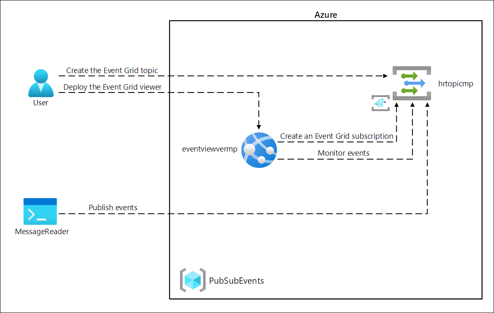
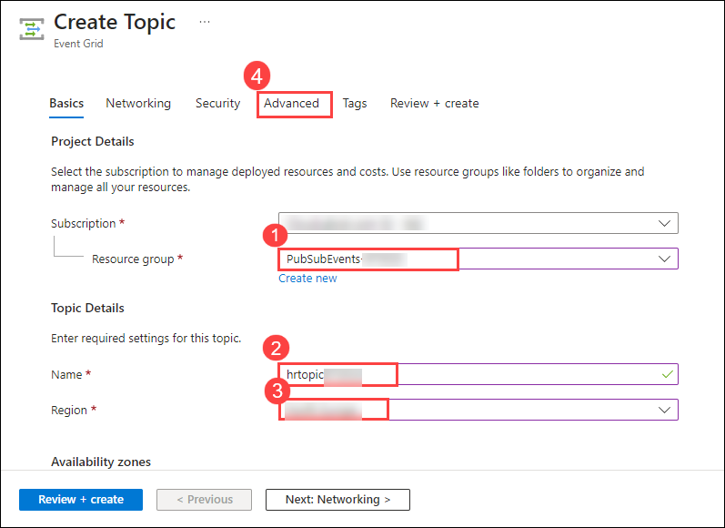
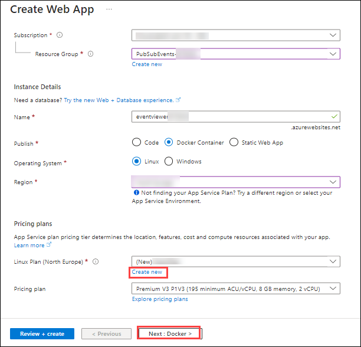
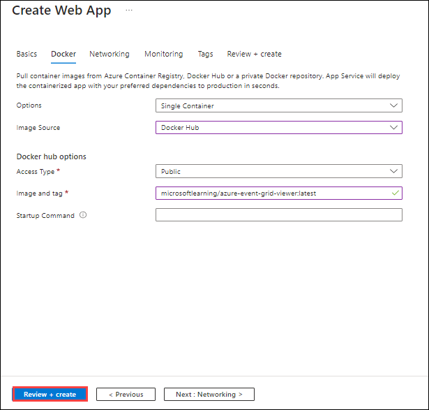
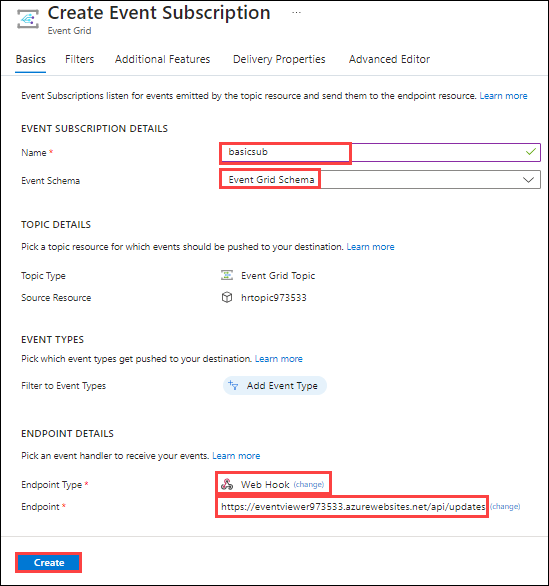
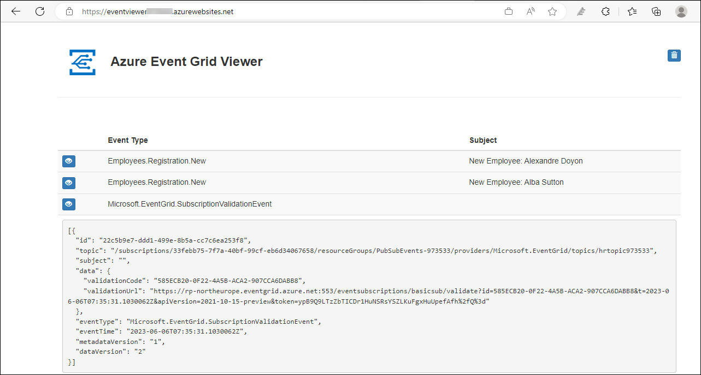

# Lab 09: Publish and subscribe to Event Grid events

## Lab Scenario

In this lab, you will start with a proof-of-concept web app, hosted in a container, that will be used to subscribe to your Event Grid. This app will allow you to submit events and receive confirmation messages that the events were successful.

## Lab objectives

In this lab, you will perform:

+ Exercise 1: Create Azure resources
+ Exercise 2: Create an Event Grid subscription
+ Exercise 3: Publish Event Grid events from .NET
   
## Estimated timing: 60 minutes

## Architecture diagram



## Lab setup and pre-requisites

Before starting this lab, you must complete **Prerequisites** of this lab.

To install **C#** extension for this lab, follow the below steps in visual studio code:

1. Start Visual Studio Code which can be found in the start menu/desktop.

     

1. Select the **Extensions** blade from the left panel.

1. Search with **C#** and select **Install** to install the extension.

    

1. After installing C# extensions, close the Visual studio code.

## Exercise 1: Create Azure resources

### Task 1: Open the Azure portal

1. If you are not logged in already, click on Azure portal shortcut that is available on the desktop and log in with Azure credentials.

1. If not Sign-in, then on the **Sign into Microsoft Azure** tab you will see the login screen, in that enter following **Email/Username** and then click on **Next**. 

   * Email/Username: <inject key="AzureAdUserEmail"></inject>
   
    
    
1. Now enter the following **Password** and click on **Sign in**.

   * Password: <inject key="AzureAdUserPassword"></inject>

     .png)
    
1. If you see the pop-up **Stay Signed in?**, click No.

    

### Task 2: Create a custom Event Grid topic

1. On the Azure portal's navigation pane, select **Create a resource**.

1. On the **Create a resource** blade, in the **Search services and marketplace** text box, enter **Event Grid Topic**, and then select Enter.

1. On the **Marketplace** search results blade, select the **Event Grid Topic** result, and then select **Create**.

1. On the **Create Topic** blade, on the **Basics** tab, perform the following actions, and then select the **Advanced** tab **(4)**:

    | Setting                           | Action                                                                 |
    | --------------------------------- | ------------------------------------------------------------           |
    | **Subscription** drop-down list   | Retain the default value.                                              |
    | **Resource group** drop-down list | Select existing **PubSubEvents-<inject key="DeploymentID" enableCopy="false"/> (1)** |
    | **Name** text box                 | Enter **hrtopic<inject key="DeploymentID" enableCopy="false"/> (2)**         |
    | **Region** drop-down list         | Select **<inject key="Region" enableCopy="false"/> (3)**       |

   The following screenshot displays the configured settings on the **Create Topic** blade.
   
   
   
1. On the **Advanced** tab, from the **Event Schema** drop-down list, select **Event Grid Schema**, and then select **Review + create**.

1. On the **Review + create** tab, review the options that you selected during the previous steps.

1. Select **Create** to create the event grid topic by using your specified configuration.
  
    > **Note**: Wait for Azure to finish creating the topic before you continue with the lab. You'll receive a notification when the topic is created.

### Task 3: Deploy the Azure Event Grid viewer to a web app

1. On the Azure portal's navigation pane, select **Create a resource**.

1. On the **Create a resource** blade, in the **Search services and marketplace** text box, enter **Web App**, and then select Enter.

1. On the **Marketplace** search results blade, select the **Web App** result, and then select **Create**.

1. On the **Create Web App** blade, on the **Basics** tab, perform the following actions, and then select **Next: Docker**:

   | Setting | Action |
   | -- | -- |
   | **Subscription** drop-down list | Retain the default value |
   | **Resource group** drop-down list | Select **PubSubEvents-<inject key="DeploymentID" enableCopy="false"/>** in the list |
   | **Name** text box | Enter **eventviewer<inject key="DeploymentID" enableCopy="false"/>** |
   | **Publish** section | Select **Docker Container** |
   | **Operating System** section | Select **Linux** |
   | **Region** drop-down list | Select **<inject key="Region" enableCopy="false"/>** |
   | **Linux Plan (East US)** section | Select **Create new**, in the **Name** text box, enter **eventviewerplan<inject key="DeploymentID" enableCopy="false"/>**, and then select **OK** |
   | **Pricing plan** section | Retain the default value |

   The following screenshot displays the configured settings on the **Create Web App** blade.

   

1. On the **Docker** tab, perform the following actions, and select **Review + create**:

    | Setting | Action |
    | -- | -- |
    | **Options** drop-down list | Select **Single Container** |
    | **Image Source** drop-down list | Select **Docker Hub** |
    | **Access Type** drop-down list | Select **Public** |
    | **Image and tag** text box | Enter **microsoftlearning/azure-event-grid-viewer:latest** |

   The following screenshot displays the configured settings on the **Docker** tab.

   

1. On the **Review + create** tab, review the options that you selected during the previous steps.

1. Select **Create** to create the web app using your specified configuration.
  
    > **Note**: Wait for Azure to finish creating the web app before you continue with the lab. You'll receive a notification when the app is created.
    
    > **Congratulations** on completing the task! Now, it's time to validate it. Here are the steps:
    > - Navigate to the Lab Validation Page, from the upper right corner in the lab guide section.
    > - Hit the Validate button for the corresponding task. If you receive a success message, you can proceed to the next task. 
    > - If not, carefully read the error message and retry the step, following the instructions in the lab guide.
    > - If you need any assistance, please contact us at labs-support@spektrasystems.com. We are available 24/7 to help.
 
### Review

In this exercise, you created the Event Grid topic and a web app that you will use throughout the remainder of the lab.

## Exercise 2: Create an Event Grid subscription

### Task 1: Access the Event Grid Viewer web application

1. On the Azure portal's navigation pane, select **Resource groups**.

1. On the **Resource groups** blade, select the **PubSubEvents-<inject key="DeploymentID" enableCopy="false"/>** resource group.

1. On the **PubSubEvents-<inject key="DeploymentID" enableCopy="false"/>** blade, select the **eventviewer<inject key="DeploymentID" enableCopy="false"/>** web app.

1. In the **Overview** section, record the value of the **Default domain** under the essentials pane. You'll use this value later in the lab.

1. Click the **Browse** button while you're still in the **Overview** section.

1. Observe the currently running **Azure Event Grid Viewer** web application. Leave this web application running for the remainder of the lab.

    > **Note**: This web application will update in real time as events are sent to its endpoint. You'll use this application to monitor events throughout the lab.

1. Return to your currently open browser window that displays the Azure portal.

### Task 2: Create a new subscription

1. On the Azure portal's navigation pane, select **Resource groups**.

1. On the **Resource groups** blade, select the **PubSubEvents-<inject key="DeploymentID" enableCopy="false"/>** resource group that you created previously in this lab.

1. On the **PubSubEvents-<inject key="DeploymentID" enableCopy="false"/>** blade, select the **hrtopic<inject key="DeploymentID" enableCopy="false"/>** Event Grid topic that you created previously in this lab.

1. On the **Event Grid Topic** blade, select **+ Event Subscription**.

1. On the **Create Event Subscription** blade, perform the following actions, and then select **Confirm Selection**:

    | Setting                          | Action                                                       |
    | -------------------------------- | ------------------------------------------------------------ |
    | **Name** text box                | Enter **basicsub**                                          |
    | **Event Schema** drop-down list  | Select **Event Grid Schema**.                                |
    | **Endpoint Type** drop-down list | Select **Web Hook**.                                         |
    | **Endpoint**                     | Select **Select an endpoint**. In the **Subscriber Endpoint** text box, enter the **Web App URL** value that you recorded previously, ensure that it uses an **https://** prefix, add the suffix **/api/updates**, and then select **Confirm Selection**. For example, if your **Web App URL** value is ``http://eventviewerxxxxx.azurewebsites.net/``, then your **Subscriber Endpoint** would be ``https://eventviewerxxxxx.azurewebsites.net/api/updates``. |
    
1. Click on the **Create** button.

   The following screenshot displays the configured settings on the **Create Event Subscription** blade.

   

    > **Note**: Wait for Azure to finish creating the subscription before you continue with the lab. You'll receive a notification when the subscription is created.

### Task 3: Observe the subscription validation event

1. Return to the browser window displaying the **Azure Event Grid Viewer** web application.

1. Review the **Microsoft.EventGrid.SubscriptionValidationEvent** event that was created as part of the subscription creation process.

1. Select the event and review its JSON content.

1. Return to your currently open browser window with the Azure portal.

### Task 4: Record subscription credentials

1. On the Azure portal's navigation pane, select **Resource groups**.

1. On the **Resource groups** blade, select the **PubSubEvents-<inject key="DeploymentID" enableCopy="false"/>** resource group that you created previously in this lab.

1. On the **PubSubEvents-<inject key="DeploymentID" enableCopy="false"/>** blade, select the **hrtopic<inject key="DeploymentID" enableCopy="false"/>** Event Grid topic that you created previously in this lab.

1. On the **Event Grid Topic** blade, record the value of the **Topic Endpoint** field. You'll use this value later in the lab.

1. In the **Settings** category, select the **Access keys** link.

1. In the **Access keys** section, record the value of the **Key 1** text box. You'll use this value later in the lab.
    
    > **Congratulations** on completing the task! Now, it's time to validate it. Here are the steps:
    > - Navigate to the Lab Validation Page, from the upper right corner in the lab guide section.
    > - Hit the Validate button for the corresponding task. If you receive a success message, you can proceed to the next task. 
    > - If not, carefully read the error message and retry the step, following the instructions in the lab guide.
    > - If you need any assistance, please contact us at labs-support@spektrasystems.com. We are available 24/7 to help.
 
### Review

In this exercise, you created a new subscription, validated its registration, and then recorded the credentials required to publish a new event to the topic.

## Exercise 3: Publish Event Grid events from .NET

### Task 1: Create a .NET project

1. On the **Start** screen, select the **Visual Studio Code** tile.

1. On the **File** menu, select **Open Folder**.

1. In the **File Explorer** window that opens, browse to **C:\AllFiles\AZ-204-DevelopingSolutionsforMicrosoftAzure-master\Allfiles\Labs\09\Starter**, and then select **EventPublisher** Folder.

1. On the **Visual Studio Code** pop-up select **Yes, I trust the authors**.

1. In the **Visual Studio Code** window, activate the shortcut menu for the **Explorer** pane, and then select **Open in integrated Terminal**.

1. Run the following command to create a new .NET project named **EventPublisher** in the current folder:

    ```powershell
    dotnet new console --framework net6.0 --name EventPublisher --output .
    ```

    > **Note**: The **dotnet new** command will create a new **console** project in a folder with the same name as the project.

1. Run the following command to import version 4.11.0 of **Azure.Messaging.EventGrid** from NuGet:

    ```powershell
    dotnet add package Azure.Messaging.EventGrid --version 4.11.0
    ```

    > **Note**: The **dotnet add package** command will add the **Microsoft.Azure.EventGrid** package from NuGet. For more information, go to [Azure.Messaging.EventGrid](https://www.nuget.org/packages/Azure.Messaging.EventGrid/4.11.0).

1. Run the following command to build the .NET web application:

    ```powershell
    dotnet build
    ```

1. Select **Kill Terminal** or the **Recycle Bin** icon to close the currently open terminal and any associated processes.

### Task 2: Modify the Program class to connect to Event Grid

1. On the **Explorer** pane of the **Visual Studio Code** window, open the **Program.cs** file.

1. On the code editor tab for the **Program.cs** file, delete all the code in the existing file.
  
1. **Add the following** of code and update the **topic-endpoint** and **topic-key** placeholders with their respective values recorded earlier**

    ```csharp
    using Azure;
    using Azure.Messaging.EventGrid;
    using System;
    using System.Threading.Tasks;    
    public class Program
    {
        private const string topicEndpoint = "<topic-endpoint>";
        /* Update the topicEndpoint string constant by setting its value to the Topic
           Endpoint of the Event Grid topic that you recorded previously in this lab. */
        private const string topicKey = "<topic-key>";   
        /* Update the topicKey string constant by setting its value to the Key of the Event Grid topic that you recorded previously in this lab. */     
        public static async Task Main(string[] args)
        {
            //Add Main code here
        }
    }
    ```

### Task 3: Publish new events

1. Add the following code in the **Main** method of **Program.cs** file:
   
    ```csharp
    public static async Task Main(string[] args)
    {   
        /* To create a new variable named "endpoint" of type "Uri", 
           using the "topicEndpoint" string constant as a constructor parameter */
        Uri endpoint = new Uri(topicEndpoint);

        /* To create a new variable named "credential" of type "AzureKeyCredential",
           use the "topicKey" string constant as a constructor parameter. */
        AzureKeyCredential credential = new AzureKeyCredential(topicKey);

        /* To create a new variable named "client" of type "EventGridPublisherClient", 
           using the "endpoint" and "credential" variables as constructor parameters */
        EventGridPublisherClient client = new EventGridPublisherClient(endpoint, credential);

        /* To create a new variable named "firstEvent" of type "EventGridEvent",
           and populate that variable with sample data */        
        EventGridEvent firstEvent = new EventGridEvent(
            subject: $"New Employee: Alba Sutton",
            eventType: "Employees.Registration.New",
            dataVersion: "1.0",
            data: new
            {
                FullName = "Alba Sutton",
                Address = "4567 Pine Avenue, Edison, WA 97202"
            }
        );

        /* To create a new variable named "secondEvent" of type "EventGridEvent",
           and populate that variable with sample data */
        EventGridEvent secondEvent = new EventGridEvent(
            subject: $"New Employee: Alexandre Doyon",
            eventType: "Employees.Registration.New",
            dataVersion: "1.0",
            data: new
            {
                FullName = "Alexandre Doyon",
                Address = "456 College Street, Bow, WA 98107"
            }
        );

        /* To asynchronously invoke the "EventGridPublisherClient.SendEventAsync"
           method using the "firstEvent" variable as a parameter */
        await client.SendEventAsync(firstEvent);
        Console.WriteLine("First event published");

        /* To asynchronously invoke the "EventGridPublisherClient.SendEventAsync"
           method using the "secondEvent" variable as a parameter */
        await client.SendEventAsync(secondEvent);
        Console.WriteLine("Second event published");
    }
    ```
    > **Note**: For knowing more about **[AzureKeyCredential](https://docs.microsoft.com/dotnet/api/azure.azurekeycredential)**
  
    > **Note**: For knowing more about Event Grid, click the blew links: 
    - **[EventGridPublisherClient](https://docs.microsoft.com/dotnet/api/azure.messaging.eventgrid.eventgridpublisherclient)**
    
    - **[EventGridEvent](https://docs.microsoft.com/dotnet/api/azure.messaging.eventgrid.eventgridevent)**

    - **[EventGridPublisherClient.SendEventAsync](https://docs.microsoft.com/dotnet/api/azure.messaging.eventgrid.eventgridpublisherclient.sendeventasync)**

1. Save the **Program.cs** file.

1. In the **Visual Studio Code** window, activate the shortcut menu for the **Explorer** pane, and then select **Open in Integrated Terminal**.

1. Run the following command to run the .NET web application:

    ```powershell
    dotnet run
    ```

    > **Note**: If there are any build errors, review the **Program.cs** file in the **Allfiles (F):\\Allfiles\\Labs\\09\\Solution\\EventPublisher** folder.

1. Observe the success message output from the currently running console application.

1. Select **Kill Terminal** or the **Recycle Bin** icon to close the currently open terminal and any associated processes.
   
    > **Congratulations** on completing the task! Now, it's time to validate it. Here are the steps:
    > - Navigate to the Lab Validation Page, from the upper right corner in the lab guide section.
    > - Hit the Validate button for the corresponding task. If you receive a success message, you can proceed to the next task. 
    > - If not, carefully read the error message and retry the step, following the instructions in the lab guide.
    > - If you need any assistance, please contact us at labs-support@spektrasystems.com. We are available 24/7 to help.

### Task 4: Observe published events

1. Return to the browser window with the **Azure Event Grid Viewer** web application.

1. Review the **Employees.Registration.New** events that were created by your console application.

   

1. Select any of the events and review its JSON content.

1. Return to the Azure portal.

### Review

In this exercise, you published new events to your Event Grid topic by using a .NET console application.

## You have successfully completed the lab
