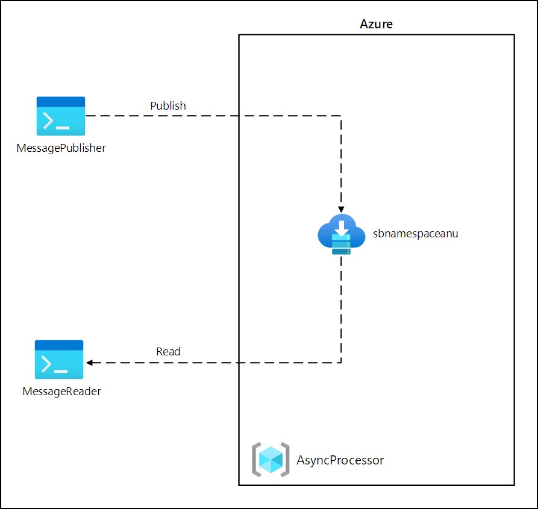
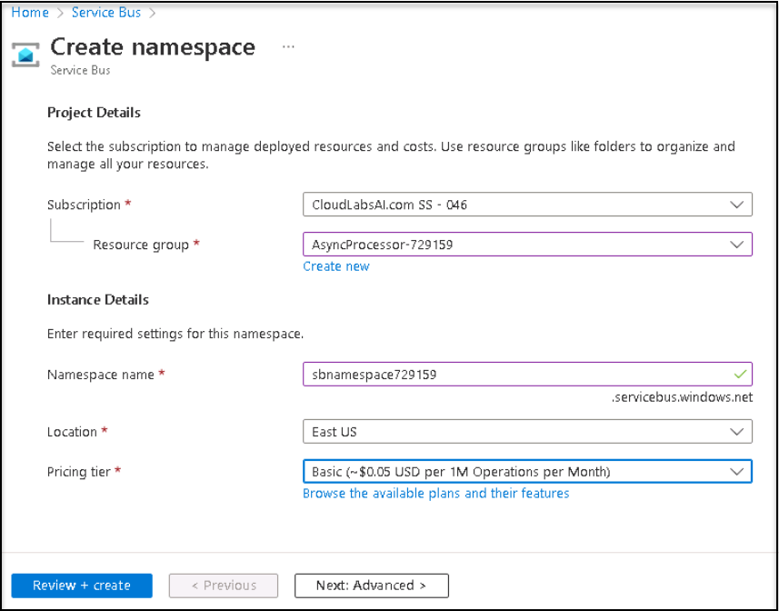
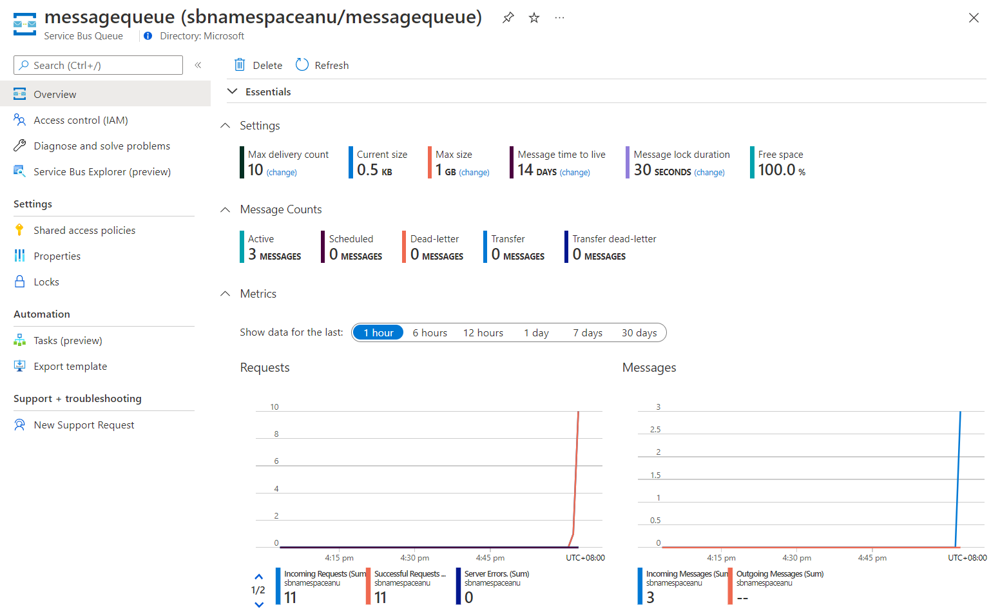
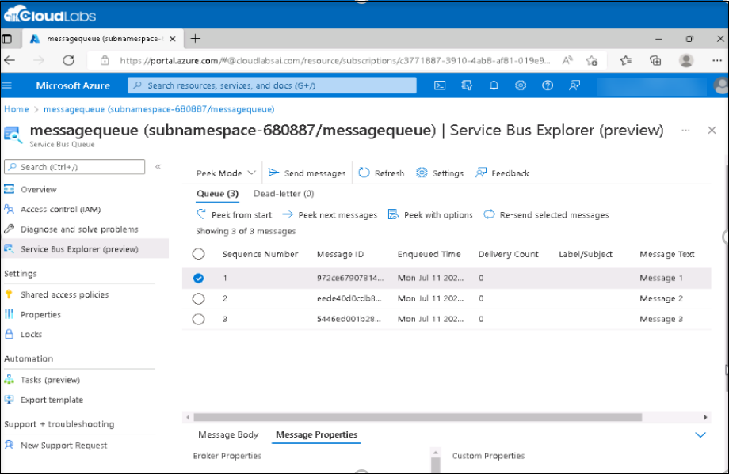

# Lab 10: Asynchronously process messages by using Azure Service Bus Queues

## Estimated timing: 60 minutes

## Architecture diagram



## Lab setup and pre-requisites

Before starting this lab, you must complete the **Prerequisites** of this lab.

To install the **C#** extension for this lab, follow the below steps in visual studio code:

1. Start Visual Studio Code.

     

2. Select the **Extensions** blade from the left panel.
3. Search with **C#** and select **Install** to install the extension.

    

4. After installing C# extensions, close the Visual studio code.

# Exercise 1: Create Azure resources

## Task 1: Open the Azure portal

1. If you are not logged in already, click on the Azure portal shortcut that is available on the desktop and log in with Azure credentials.

   * Email/Username: <inject key="AzureAdUserEmail"></inject>

    

1. Now enter the following **Password** and click on **Sign in**.

   * Password: <inject key="AzureAdUserPassword"></inject>

    
    
    > **Note**: Click on **No**, if stay signed in window Pops-up and select **May be later** on Welcome to Microsoft Azure Window.

## Task 2: Create an Azure Service Bus queue

1.  In the Azure portal, use the **Search resources, services, and docs** text box to search for **Service Bus** and then, in the list of results, select **Service Bus**.

1.  On the **Service Bus** blade, select **+ Create**.

1.  On the **Create namespace** blade, on the **Basics** tab, perform the following actions, and select **Review + create**:
        
    | Setting                           | Action                                                       |
    | --------------------------------- | ------------------------------------------------------------ |
    | **Subscription** drop-down list    |Retain the default value. |
    | **Resource group** section | Select existing resource group **AsyncProcessor-<inject key="DeploymentID" enableCopy="false"/>**|
    | **Namespace name** text box | Enter **sbnamespace<inject key="DeploymentID" enableCopy="false"/>**|
    | **Region** drop-down list |  Select any Azure region in which you can deploy an Azure Service Bus.|
    | **Pricing tier** drop-down list |  Select **Basic**|

    The following screenshot displays the configured settings on the **Basics** tab on the **Create namespace** blade.
    
    
     
1.  On the **Review + create** tab, review the options that you selected during the previous steps.

1.  Select **Create** to create the **Service Bus** namespace by using your specified configuration.

    > **Note**: Wait for the creation task to complete before you proceed with this lab.

1.  On the **Deployment** blade, select the **Go to resource** button to navigate to the blade of the newly created **Service Bus** namespace.

1.  On the left ment of **Service Bus** namespace blade, in the **Settings** section, select **Shared access policies**.

1.  In the list of policies, select **RootManageSharedAccessKey**.

1.  On the **SAS Policy: RootManageSharedAccessKey** pane, next to the **Primary Connection String** entry, select the **Copy to clipboard** button, and record the copied value. You'll use it later in this lab.

1.  On the **Service Bus** namespace blade, in the **Entities** section, select **Queues**, and then select **+ Queue**.

1.  On the **Create queue** blade, review the available settings, in the **Name** text box, enter **messagequeue**, and then select **Create**.

1.  Select **messagequeue** to display the properties of the **Service Bus** queue.

1.  Leave the browser window open. You'll use it again later in this lab.

  > **Congratulations** on completing the task! Now, it's time to validate it. Here are the steps:

 - Navigate to the Lab Validation Page, from the upper right corner in the lab guide section.
 - Hit the Validate button for the corresponding task. If you receive a success message, you can proceed to the next task. 
 - If not, carefully read the error message and retry the step, following the instructions in the lab guide.
 - If you need any assistance, please contact us at labs-support@spektrasystems.com. We are available 24/7 to help you out.

### Review

In this exercise, you created an Azure **Service Bus** namespace and a **Service Bus** queue that you'll use through the remainder of the lab.

# Exercise 2: Create a .NET Core project to publish messages to a Service Bus queue

## Task 1: Create a .NET Core project

1.  From the lab computer, start Visual Studio Code.

1.  In Visual Studio Code, in the **File** menu, select **Open Folder**.

1.  In the **Open Folder** window, browse to **C:\AllFiles\AZ-204-DevelopingSolutionsforMicrosoftAzure-master\Allfiles\Labs\10\Solution**, and then select **MessagePublisher** Folder.

1. On the **Visual Studio Code** pop-up select **Yes, I trust the authors**.

1.  In the **Visual Studio Code** window, Right click on the **MessagePublisher.csproj**, and then select **Open in Integrated Terminal**.

1.  Run the following command to import version 7.8.1 of the **Azure.Messaging.ServiceBus** package from NuGet:

    ```
    dotnet add package Azure.Messaging.ServiceBus --version 7.8.1
    ```

    > **Note**: The **dotnet add package** command will add the **Azure.Messaging.ServiceBus** package from NuGet. For more information, go to [Azure.Messaging.ServiceBus](https://www.nuget.org/packages/Azure.Messaging.ServiceBus/).

1.  At the terminal prompt, run the following command to build the .NET Core console application:

    ```
    dotnet build
    ```

1.  Select **Kill Terminal** (the **Recycle Bin** icon) to close the terminal pane and any associated processes.

## Task 2: Publish messages to an Azure Service Bus queue

1.  In the **Explorer** pane of the **Visual Studio Code** window, open the **Program.cs** file.

1.  On the code editor tab for the **Program.cs** file, delete all the code in the existing file.

1.  Observe the following lines of code to facilitate the use of the built-in namespaces that will be referenced in this file:

    ```csharp
    using System;
    using System.Threading.Tasks;
    ```

1.  Observe the following code to import the **Azure.Messaging.ServiceBus** namespace included in the **Azure.Storage.Queues** package imported from NuGet:

    ```csharp
    using Azure.Messaging.ServiceBus;
    ```
    
1.  Observe the following code to create a new **Program** class in the MessagePublisher namespace:

    ```csharp
    namespace MessagePublisher
    {
       public class Program
       {
       }
    }
    ```

1.  In the **Program** class, Observe the following code to create a string constant named **storageConnectionString**:

    ```csharp
    private const string serviceBusConnectionString = "";
    ```

1.  Update the **serviceBusConnectionString** string constant by setting its value to **Primary Connection String** of the Service Bus namespace you recorded earlier in this lab.

1.  Observe the following code to create a string constant named **queueName** with a value of **messagequeue**, matching the name of the Service Bus queue you created earlier in this exercise.

    ```csharp
    private const string queueName = "messagequeue";
    ```

1.  Observe the following code to create an integer constant which stores the number of messages to be sent to the target queue:

    ```csharp
    private const int numOfMessages = 3;
    ```

1.  Observe the following code to create a Service Bus client that will own the connection to the target queue:

    ```csharp
    static ServiceBusClient client;
    ```

1.  Observe the following code to create a Service Bus sender that will be used to publish messages to the target queue:

    ```csharp
    static ServiceBusSender sender;
    ```

1.  Observe the following code to create an asynchronous **Main** method:

    ```csharp
    public static async Task Main(string[] args)
    {
    }
    ```

1.  Review the **Program.cs** file, which should now include the following code. Note that the `<serviceBus-connection-string>` placeholder represents the connection string to the target Azure Service Bus namespace:

    ```csharp
    using System;
    using System.Threading.Tasks;
    using Azure.Messaging.ServiceBus;

    namespace MessagePublisher
    {
        public class Program
        {
            private const string serviceBusConnectionString = "<serviceBus-connection-string>";
            private const string queueName = "messagequeue";
            private const int numOfMessages = 3;

            static ServiceBusClient client = default!;
            static ServiceBusSender sender = default!;

            public static async Task Main(string[] args)
            {
            }
        }
    }
    ```
    
1.  In the **Main** method, Observe the following code to initialize *client* of type **ServiceBusClient** that will provide connectivity to the Service Bus namespace and **sender** that will be responsible for sending messages:

    ```csharp
    client = new ServiceBusClient(serviceBusConnectionString);
    sender = client.CreateSender(queueName);  
    ```

    > **Note**: The Service Bus client is safe to cache and use as a singleton for the lifetime of the application. This is considered one of the best practices when publishing and reading messages on a regular basis.

1.  In the **Main** method, Observe the following code to create a **ServiceBusMessageBatch** object that will allow you to combine multiple messages into a batch by using the **TryAddMessage** method:

    ```csharp        
    using ServiceBusMessageBatch messageBatch = await sender.CreateMessageBatchAsync();
    ```

1.  In the **Main** method, Observe the following lines of code to add messages to a batch and throw an exception if a message size exceeds the limits supported by the batch:

    ```csharp        
    for (int i = 1; i <= numOfMessages; i++)
    {
        if (!messageBatch.TryAddMessage(new ServiceBusMessage($"Message {i}")))
        {
            throw new Exception($"The message {i} is too large to fit in the batch.");
        }
    }
    ```

1.  In the **Main** method, Observe the following lines of code to create a try block, with **sender** asynchronously publishing messages in the batch to the target queue:

    ```csharp        
    try
    {
    await sender.SendMessagesAsync(messageBatch);
    Console.WriteLine($"A batch of {numOfMessages} messages has been published to the queue.");
    }
    ```

1.  In the **Main** method, Observe the following lines of code to create a finally block that asynchronously disposes of the **sender** and **client** objects, releasing any network and unmanaged resources:

    ```csharp
    finally
    {
        await sender.DisposeAsync();
        await client.DisposeAsync();
    }
    ```

1.  Review the **Main** method, which should now consist of the following code: 

    ```csharp
    public static async Task Main(string[] args)
    {
        client = new ServiceBusClient(serviceBusConnectionString);
        sender = client.CreateSender(queueName);

        using ServiceBusMessageBatch messageBatch = await sender.CreateMessageBatchAsync();

        for (int i = 1; i <= numOfMessages; i++)
        {
            if (!messageBatch.TryAddMessage(new ServiceBusMessage($"Message {i}")))
            {
                throw new Exception($"The message {i} is too large to fit in the batch.");
            }
        }

        try
        {
            await sender.SendMessagesAsync(messageBatch);
            Console.WriteLine($"A batch of {numOfMessages} messages has been published to the queue.");
        }
        finally
        {
            await sender.DisposeAsync();
            await client.DisposeAsync();
        }
    }
    ```

1.  Save the **Program.cs** file.

1.  In the **Visual Studio Code** window, activate the shortcut menu, and then select **Open in Integrated Terminal**.

1.  At the terminal prompt, run the following command to launch the .NET Core console app:

    ```
    dotnet run
    ```

    > **Note**: If you encounter any errors, review the **Program.cs** file in the **Allfiles C:\AllFiles\AZ-204-DevelopingSolutionsforMicrosoftAzure-master\Allfiles\Labs\10\\Solution\\MessagePublisher** folder.

1.  Verify that the console message displayed at the terminal prompt states that a batch of three messages has been published to the queue.

1.  Select **Kill Terminal** (the **Recycle Bin** icon) to close the terminal pane and any associated processes.

1.  Switch to the Microsoft Edge browser displaying the Service Bus queue **messagequeue** in the Azure portal.

1.  Review the **Essentials** pane and note that the queue contains three active messages.

    > **Note**: Click on refresh to reflect the changes.

    The following screenshot displays the Service Bus queue metrics and message count.
     
    
     
1.  Select **Service Bus Explorer (preview)** blade.

1.  On the **Service Bus Explorer (Preview)** blade, select **Peek mode** tab or make sure you are in **Peek** mode tab.

1.  Verify that the **queue** contains three messages and select **peek from start** to see all three messages.

1.  Select the first message and review its content in the **Message** pane.

    The following screenshot displays the first message's content.
         
    
    
    > **Note**: If messages are not displayed then click on **Peek** from start option to display the messages.

1.  Unselect the **Message** to close the message pane.

  > **Congratulations** on completing the task! Now, it's time to validate it. Here are the steps:

 - Navigate to the Lab Validation Page, from the upper right corner in the lab guide section.
 - Hit the Validate button for the corresponding task. If you receive a success message, you can proceed to the next task. 
 - If not, carefully read the error message and retry the step, following the instructions in the lab guide.
 - If you need any assistance, please contact us at labs-support@spektrasystems.com. We are available 24/7 to help you out.
 
### Review

In this exercise, you configured your .NET project that published messages into an Azure Service Bus queue.

# Exercise 3: Create a .NET Core project to read messages from a Service Bus queue

## Task 1: Create a .NET project

1.  From the lab computer, start Visual Studio Code.

1.  In Visual Studio Code, in the **File** menu, select **Open Folder**.

1.  In the **Open Folder** window, browse to **C:\AllFiles\AZ-204-DevelopingSolutionsforMicrosoftAzure-master\Allfiles\Labs\10\\Solution**, and then select **MessageReader** Folder.

1. On the **Visual Studio Code** pop-up select **Yes, I trust the authors**.

1.  In the **Visual Studio Code** window, Right click on the **MessageReader.csproj**, and then select **Open in Integrated Terminal**.

1.  Run the following command to import version 7.8.1 of **Azure.Messaging.ServiceBus** package from NuGet:

    ```
    dotnet add package Azure.Messaging.ServiceBus --version 7.8.1
    ```

1.  At the terminal prompt, run the following command to build the .NET Core console application:

    ```
    dotnet build
    ```

1.  Select **Kill Terminal** (the **Recycle Bin** icon) to close the terminal pane and any associated processes.

## Task 2: Read messages from an Azure Service Bus queue

1.  In the **Explorer** pane of the **Visual Studio Code** window, open the **Program.cs** file.

1.  On the code editor tab for the **Program.cs** file, delete all the code in the existing file.

1.  Observe the same code which was included in the Program.cs file to allow for interaction with Azure Service Bus queues, but set the namespace to **MessageReader**:

    ```csharp
    using System;
    using System.Threading.Tasks;
    using Azure.Messaging.ServiceBus;
    
    namespace MessageReader
    {
       public class Program
       {
          private const string serviceBusConnectionString = "";
          static string queueName = "messagequeue";
          static ServiceBusClient client = default!;

       }
    }
    ```

1.  As before, update the **serviceBusConnectionString** string constant by setting its value to **Primary Connection String** of the **Service Bus** namespace you recorded earlier in this lab.

1.  Observe the following code to create a ServiceBusProcessor that will be used to process messages from the queue:

    ```csharp
    static ServiceBusProcessor processor = default!;
    ```

1.  Observe the following code to create a static async **MessageHandler** task that displays the body of messages in the queue as they are being processed and deletes them after the processing completes:

    ```csharp
    static async Task MessageHandler(ProcessMessageEventArgs args)
    {
        string body = args.Message.Body.ToString();
        Console.WriteLine($"Received: {body}");
        await args.CompleteMessageAsync(args.Message);
    }
    ```

1.  Observe the following code to create a static async **ErrorHandler** task that manages any exceptions encountered during message processing:

    ```csharp
    static Task ErrorHandler(ProcessErrorEventArgs args)
    {
        Console.WriteLine(args.Exception.ToString());
        return Task.CompletedTask;
    }
    ```

1.  Observe the following code to create an asynchronous **Main** method:

    ```csharp
    public static async Task Main(string[] args)
    {
    }
    ```

1.  Review the **Program.cs** file, which should now include the following code. The `<serviceBus-connection-string>` placeholder represents the connection string to the target Azure Service Bus namespace:

    ```csharp
    using System;
    using System.Threading.Tasks;
    using Azure.Messaging.ServiceBus;

    namespace MessageReader
    {
        class Program
        {
            static string serviceBusConnectionString = "<serviceBus-connection-string>";
            static string queueName = "messagequeue";
            static ServiceBusClient client;
            static ServiceBusProcessor processor;

            static async Task MessageHandler(ProcessMessageEventArgs args)
            {
                string body = args.Message.Body.ToString();
                Console.WriteLine($"Received: {body}");
                await args.CompleteMessageAsync(args.Message);
            }

            static Task ErrorHandler(ProcessErrorEventArgs args)
            {
                Console.WriteLine(args.Exception.ToString());
                return Task.CompletedTask;
            }

            static async Task Main()
            {
            }
        }
    }
    ```

1.  In the **Main** method, Observe the following code to initialize *client* of type **ServiceBusClient** that will provide connectivity to the Service Bus namespace and **processor** that will be responsible for the processing of messages:

    ```csharp
    client = new ServiceBusClient(serviceBusConnectionString);
    processor = client.CreateProcessor(queueName, new ServiceBusProcessorOptions());
    ```

    > **Note**: As mentioned earlier, the Service Bus client is safe to cache and use as a singleton for the lifetime of the application. This is considered one of the best practices when publishing and reading messages on a regular basis.

1.  In the **Main** method, Observe the following lines of code to create a try block, which first implements a message and error processing handler, initiates message processing, and stops processing following user input:

    ```csharp        
     try
     {
        processor.ProcessMessageAsync += MessageHandler;
        processor.ProcessErrorAsync += ErrorHandler;

        await processor.StartProcessingAsync();
        Console.WriteLine("Wait for a minute and then press any key to end the processing");
        Console.ReadKey();

        Console.WriteLine("\nStopping the receiver...");
        await processor.StopProcessingAsync();
        Console.WriteLine("Stopped receiving messages");
     }
     ```

1.  In the **Main** method, Observe the following lines of code to create a finally block that asynchronously disposes of the **processor** and **client** objects, releasing any network and unmanaged resources:

    ```csharp
    finally
    {
        await processor.DisposeAsync();
        await client.DisposeAsync();
    }
    ```

1.  Review the **Main** method, which should now consist of the following code:

    ```csharp
    static async Task Main()
    {
        client = new ServiceBusClient(serviceBusConnectionString);
        processor = client.CreateProcessor(queueName, new ServiceBusProcessorOptions());

        try
        {
            processor.ProcessMessageAsync += MessageHandler;
            processor.ProcessErrorAsync += ErrorHandler;

            await processor.StartProcessingAsync();
            Console.WriteLine("Wait for a minute and then press any key to end the processing");
            Console.ReadKey();

            Console.WriteLine("\nStopping the receiver...");
            await processor.StopProcessingAsync();
            Console.WriteLine("Stopped receiving messages");
        }
        finally
        {
            await processor.DisposeAsync();
            await client.DisposeAsync();
        }
    }
    ```

1.  Save the **Program.cs** file.

1.  In the **Visual Studio Code** window, activate the shortcut menu, and then select **Open in Integrated Terminal**.

1.  At the terminal prompt, run the following command to launch the .NET Core console app:

    ```
    dotnet run
    ```

    > **Note**: If you encounter any errors, review the **Program.cs** file in the **Allfiles C:\AllFiles\AZ-204-DevelopingSolutionsforMicrosoftAzure-master\Allfiles\Labs\10\\Solution\\MessageReader** folder.

1.  Verify that the console message displayed at the terminal prompt states that each of the three messages in the queue has been received.

1.  At the terminal prompt, press any key to stop the receiver and terminate the app execution.

1.  Select **Kill Terminal** (the **Recycle Bin** icon) to close the terminal pane and any associated processes.

1.  Switch back to the Microsoft Edge browser displaying the Service Bus queue **messagequeue** in the Azure portal.

1.  On the **Service Bus Explorer (preview)** blade, select **Refresh**, and note that the number of active messages in the **queue** has changed to **0**.

### Review

In this exercise, you read and deleted messages from the Azure Service Bus queue by using the .NET library.

**You have successfully completed the lab**
