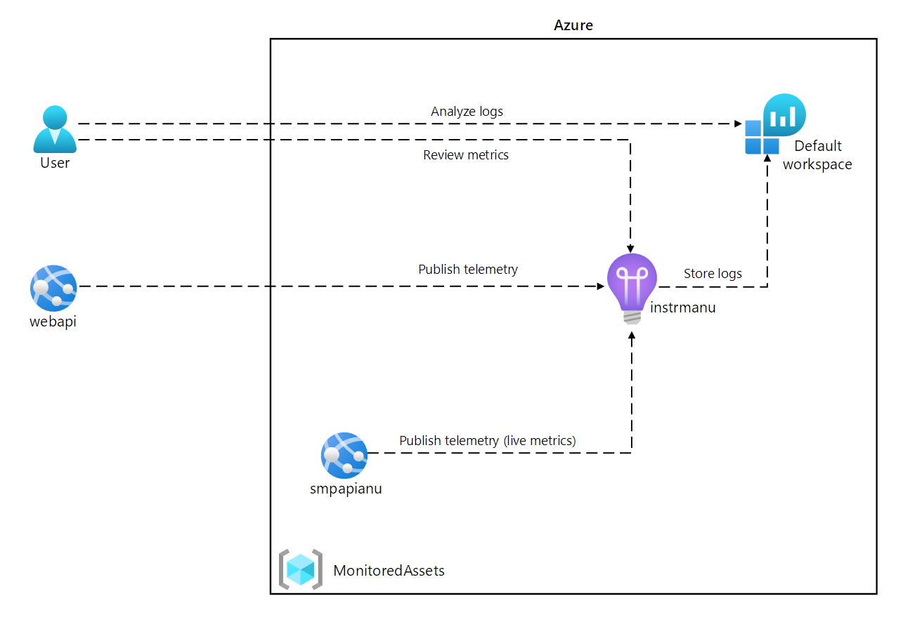
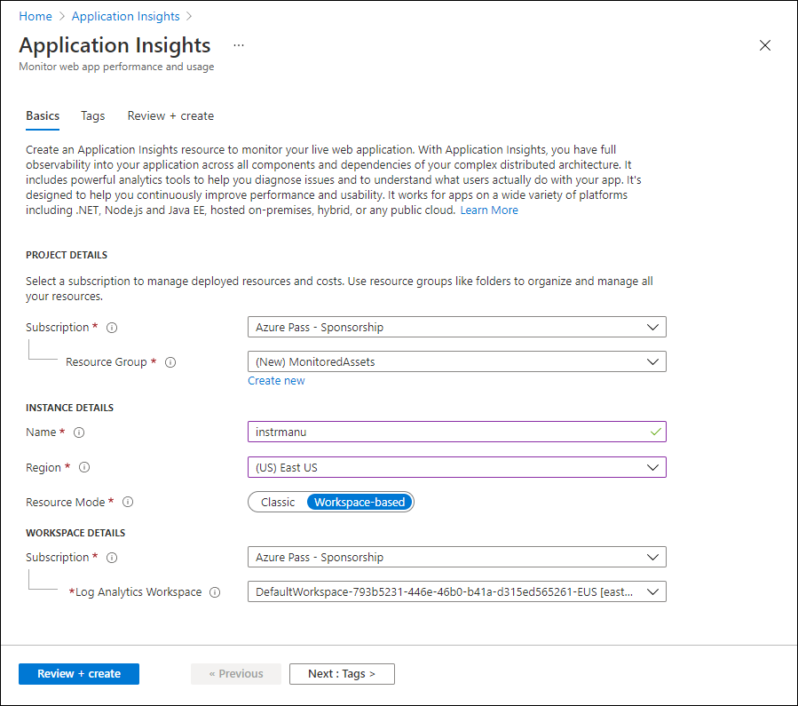
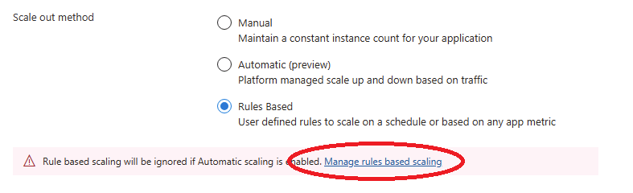
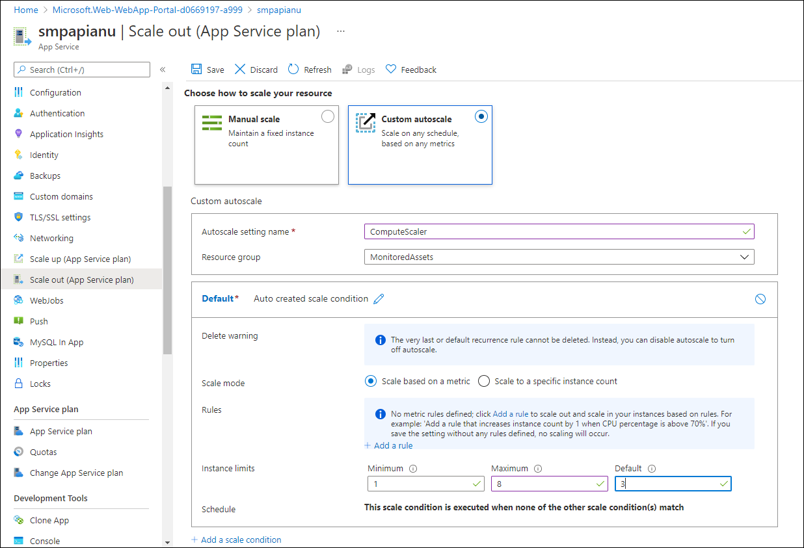
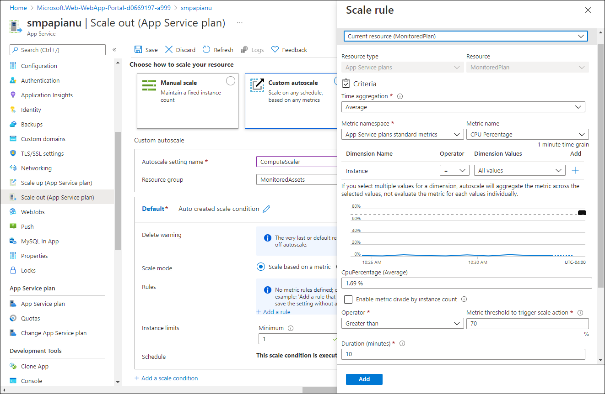
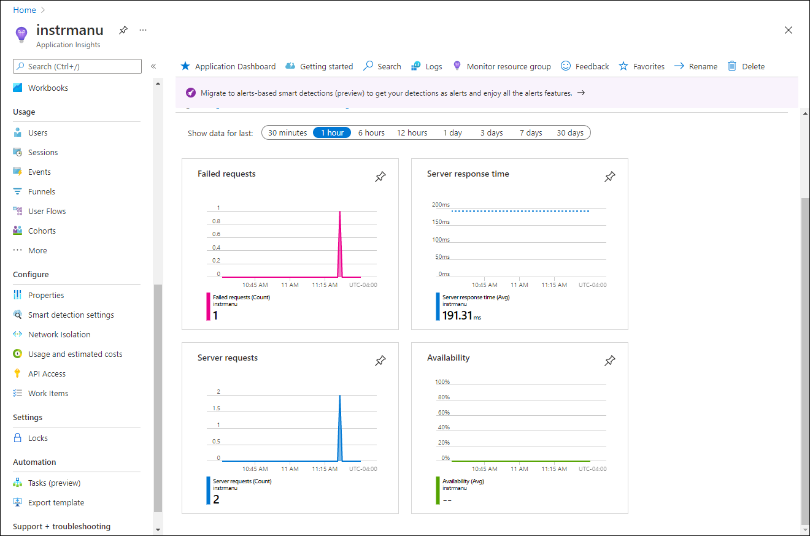
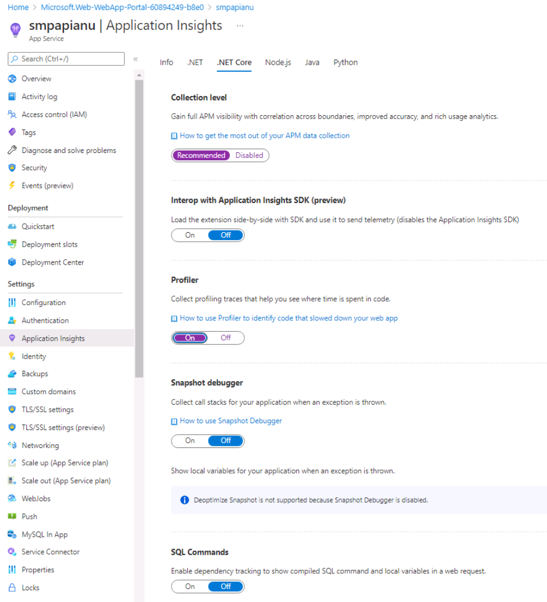
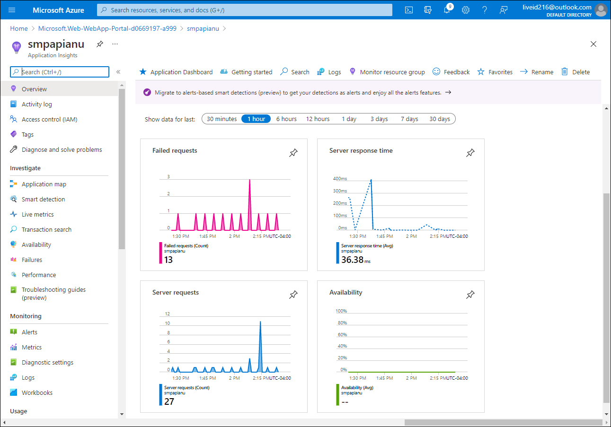

---
lab:
    az204Title: 'Lab 11: Monitor services that are deployed to Azure'
    az204Module: 'Learning Path 11: Troubleshoot solutions by using Application Insights'
---

# Lab 11: Monitor services that are deployed to Azure

## Microsoft Azure user interface

Given the dynamic nature of Microsoft cloud tools, you might experience Azure UI changes that occur after the development of this training content. As a result, the lab instructions and lab steps might not align correctly.

Microsoft updates this training course when the community alerts us to needed changes. However, cloud updates occur frequently, so you might encounter UI changes before this training content updates. **If this occurs, adapt to the changes, and then work through them in the labs as needed.**

## Instructions

### Before you start

#### Sign in to the lab environment

Sign in to your Windows 11 virtual machine (VM) by using the following credentials:

- Username: `Admin`
- Password: `Pa55w.rd`

> **Note**: Your instructor will provide instructions to connect to the virtual lab environment.

#### Review the installed applications

Find the taskbar on your Windows 11 desktop. The taskbar contains the icons for the applications that you'll use in this lab, including:
    
-   Microsoft Edge
-   File Explorer
-   Visual Studio Code
-   Azure PowerShell

## Lab Scenario

In this lab, you will create an Application Insights resource in Azure that will be used to monitor and log application insight data for later review. The API will be set to automatically scale if demand increases to a certain threshold and logging the data will help determine how the service is being utilized.

## Architecture diagram



### Exercise 1: Create and configure Azure resources

#### Task 1: Open the Azure portal

1. On the taskbar, select the **Microsoft Edge** icon.

1. In the browser window, browse to the Azure portal at `https://portal.azure.com`, and then sign in with the account you'll be using for this lab.

    > **Note**: If this is your first time signing in to the Azure portal, you'll be offered a tour of the portal. Select **Get Started** to skip the tour and begin using the portal.

#### Task 2: Create an Application Insights resource

1. In the Azure portal, use the **Search resources, services, and docs** text box at the top of the page to search for **Application Insights** and then, in the list of results, select **Application Insights**.

1. On the **Application Insights** blade, select **+ Create**.

1. On the **Application Insights** blade, on the **Basics** tab, perform the following actions, and select **Review + create**:
    
    | Setting | Action |
    | -- | -- |
    | **Subscription** drop-down list | Retain the default value |
    | **Resource group** section | Select **Create new**, enter **MonitoredAssets**, and then select **OK** |
    | **Name** text box | **instrm**_[yourname]_ |
    | **Region** drop-down list | Select any Azure region in which you can deploy an Application Insights resource |
    | **Resource Mode** section | Select the **Workspace-based** option |
    | **WORKSPACE DETAILS** section | Retain the default values for the **Subscription** and **Log Analytics Workspace** drop-down lists |
    
    The following screenshot displays the configured settings on the **Application Insights** blade.

    
     
1. On the **Review + create** tab, review the options that you selected during the previous steps.

1. Select **Create** to create the **Application Insights** instance by using your specified configuration.

    > **Note**: Wait for the creation task to complete before you proceed with this lab.

1. On the **Microsoft.AppInsights \| Overview** blade, select the **Go to resource** button to navigate to the blade of the newly created **Application Insights** resource.

1. On the **Application Insights** blade, in the **Configure** section, select the **Properties** link.

1. On the **Properties** blade, next to the **Instrumentation Key** entry, select the **Copy to clipboard** button, and then record the copied value. You'll use it later in this lab.

    > **Note**: The key is used by client applications to connect to a specific **Application Insights** resource.

### Task 3: Create an Azure Web API resource

1. In the Azure portal, use the **Search resources, services, and docs** text box at the top of the page to search for **App Services** and then, in the list of results, select **App Services**.

1. On the **App Services** blade, select **+ Create**.
    
1. On the **Create Web App** blade, on the **Basics** tab, perform the following actions, and then select the **Monitoring** tab:

    | Setting | Action |
    | -- | -- |
    | **Subscription** drop-down list | Retain the default value |
    | **Resource group** drop-down list |Select **MonitoredAssets** |
    | **Name** text box | Enter **smpapi**_[yourname]_ |
    | **Publish** section | Select **Code** |
    | **Runtime stack** drop-down list | Select **.NET 8 (LTS)** |
    | **Operating System** section |  Select **Windows** |
    | **Region** drop-down list |  Select the same region you chose as the location of the **Application Insights** resource |
    | **Windows Plan (East US)** section | Select **Create new**, in the **Name** text box, enter **MonitoredPlan**, and then select **OK** |
    | **Pricing plan** section |  Retain the default value |

1. On the **Monitoring** tab, perform the following actions, and then select **Review + create**:
    
    | Setting | Action |
    | -- | -- |
    | **Enable Application Insights** section | Ensure that **Yes** is selected |
    | **Application Insights** drop-down list | Select the **instrm**_[yourname]_ Application Insights resource that you created previously in this lab |
    
1. On the **Review + create** tab, review the options that you selected during the previous steps.

1. Select **Create** to create the web API by using your specified configuration.

    > **Note**: Wait for the creation task to complete before you proceed with this lab.

1. On the deployment **Overview** blade, select the **Go to resource** button to navigate to the blade of the newly created Azure web API.

1. On the **App Service** blade, in the **Settings** section, select the **Configuration** link.

1. In the **Configuration** section, perform the following actions:
    
    a.  On the **Application settings** tab, select **Show Values** to display secrets associated with your web API.

    b.  Note the value representing the **APPLICATIONINSIGHTS_CONNECTION_STRING** key. This value was set automatically when you built the web API resource.

1. On the **App Service** blade, in the **Settings** section, select the **Properties** link.

1. In the **Properties** section, record the value of the **URL** link. You'll use this value later in the lab to submit requests to the web API.

#### Task 4: Configure web API autoscale options

1. On the **App Service** blade, in the **Settings** section, select the **Scale out (App Service Plan)** link.

1. Scroll down untill you see the **Scale out method**. Click on the **Rules Based** option, then select the **Manage rules based scaling**.



1. In the **Scale out** section, perform the following actions, and then select **Save**:
    
    | Setting | Action |
    | -- | -- |
    | **Scale out** section | Select **Custom autoscale** |
    | **Autoscale setting name** text box | Enter **ComputeScaler** |
    | **Resource group** drop-down list |Select **MonitoredAssets** |
    | **Scale mode** section | Select **Scale based on a metric** |
    | **Minimum** text box in the **Instance limits** section | Enter **1** |
    | **Maximum** text box in the **Instance limits** section | Enter **8** |
    | **Default** text box in the **Instance limits** section | Enter **3** |
   
    The following screenshot displays the configured settings in the **Scale out** section on the **App Service** blade.
    
    

    | Setting | Action |
    | -- | -- |
    | **Rules** section | Select **Add a rule** |
    | **Scale rule** blade | Retain default values for all settings, and then select **Add** |

    The following screenshot displays additional settings in the **Scale out** section on the **App Service** blade.

   

    > **Note**: Wait for the save operation to complete before you continue with this lab.

#### Review

In this exercise, you created the Azure resources that you'll use for the remainder of the lab.

### Exercise 2: Monitor a local web API by using Application Insights

#### Task 1: Build a .NET Web API project

1. From the lab computer, start **Visual Studio Code**.

1. In Visual Studio Code, on the **File** menu, select **Open Folder**.

1. In the **Open Folder** window, browse to **Allfiles (F):\\Allfiles\\Labs\\11\\Starter\\Api**, and then select **Select Folder**.

1. In the **Visual Studio Code** window, on the Menu Bar, select **Terminal** and then select **New Terminal***.

1. At the terminal prompt, run the following command to create a new .NET Web API application named **SimpleApi** in the current directory:

    ```
    dotnet new webapi --output . --name SimpleApi --framework net8.0
    ```

1. Run the following command to import version 2.21.0 of **Microsoft.ApplicationInsights** from NuGet to the current project:

    ```
    dotnet add package Microsoft.ApplicationInsights --version 2.21.0
    ```

    > **Note**: The **dotnet add package** command will add the **Microsoft.ApplicationInsights** package from NuGet. For more information, refer to [Microsoft.ApplicationInsights](https://www.nuget.org/packages/Microsoft.ApplicationInsights/).

1. Run the following command to import version 2.21.0 of **Microsoft.ApplicationInsights.AspNetCore** from NuGet:

    ```
    dotnet add package Microsoft.ApplicationInsights.AspNetCore --version 2.21.0
    ```

    > **Note**: The **dotnet add package** command will add the **Microsoft.ApplicationInsights.AspNetCore** package from NuGet. For more information, refer to [Microsoft.ApplicationInsights.AspNetCore](https://www.nuget.org/packages/Microsoft.ApplicationInsights.AspNetCore).

1. At the terminal prompt, run the following command to import version 2.21.0 of **Microsoft.ApplicationInsights.PerfCounterCollector** from NuGet to the current project:

    ```
    dotnet add package Microsoft.ApplicationInsights.PerfCounterCollector --version 2.21.0
    ```

    > **Note**: The **dotnet add package** command will add the **Microsoft.ApplicationInsights.PerfCounterCollector** package from NuGet. For more information, refer to [Microsoft.ApplicationInsights.PerfCounterCollector](https://www.nuget.org/packages/Microsoft.ApplicationInsights.PerfCounterCollector/).

1. At the terminal prompt, run the following command to import version 2.4.0 of **Microsoft.ApplicationInsights.Profiler.AspNetCore** from NuGet to the current project:

    ```
    dotnet add package Microsoft.ApplicationInsights.Profiler.AspNetCore --version 2.4.0
    ```

    > **Note**: The **dotnet add package** command will add the **Microsoft.ApplicationInsights.Profiler.AspNetCore** package from NuGet. For more information, refer to [Microsoft.ApplicationInsights.Profiler.AspNetCore](https://www.nuget.org/packages/Microsoft.ApplicationInsights.Profiler.AspNetCore/).

1. At the terminal prompt, run the following command to build the .NET Web API:

    ```
    dotnet build
    ```
    
#### Task 2: Update app code to disable HTTPS and use Application Insights

1. In the **Visual Studio Code** window, on the **Explorer** pane, select the **Program.cs** file to open the file on the **editor** pane.

1. On the **editor** pane, locate and delete the following code in line 17:

    ```csharp
    app.UseHttpsRedirection();
    ```

    > **Note**: This line of code forces the web API to use HTTPS. For this lab, this is unnecessary.

1. In the **Program.cs** file, add the following two lines starting with line 7 to enable Profiler by registering it along with Application Insights into the Service collection:

    ```csharp
    builder.Services.AddApplicationInsightsTelemetry();
    builder.Services.AddServiceProfiler();
    ```

1. Save the changes and close the **Program.cs** file.

1. In the **Visual Studio Code** window, on the **Explorer** pane, select the **appsettings.json** file to open the file on the **editor** pane.

1. Add to the **appsettings.json** file the following element right after the **Logging** element, replacing the `instrumentation-key` placeholder with the value of the Application Insights resource instrumentation key that you recorded earlier in this lab:

    ```json
       "ApplicationInsights":
       {
          "InstrumentationKey": "instrumentation-key"
       },
    ```

    > **Note**: If the section you are adding is the last element of the file, remove the trailing comma.

1. Your appsettings.json file should now look similar in structure to the following:

    ```json
    {
        "Logging":{
            "LogLevel": {
                "Default": "Information",
                "Microsoft.AspNetCore": "Warning"
            }
        },
       "ApplicationInsights":
       {
          "InstrumentationKey": "instrumentation-key"
       },
       "AllowedHosts": "*"
    }

    > **Note**" Ensure you have replaced the placeholder with your own instrumentation key that you recorded earlier.

1. Save the changes to the **appsettings.json** file and close it.

1. At the terminal prompt, run the following command to build the .NET Web API.

    ```
    dotnet publish -c Release -r win-x86 --self-contained -p:PublishReadyToRun=true .\SimpleApi.csproj
    ```

#### Task 3: Test an API application locally

1. At the terminal prompt, run the following command to launch the .NET Web API.

    ```
    dotnet run
    ```

1. Review the output of the command and note the HTTP URL that the site is listening on.

1. From the taskbar, open the context menu for the **Microsoft Edge** icon, and then open a new browser window.

1. In the browser window that opens, navigate to the `http://localhost` URL and add the **/weatherforecast** relative path of your web API.
    
    > **Note**: The full URL is `http://localhost:[port-number]/weatherforecast`, where the `[port-number]` placeholder identifies the port number at which the web app is accessible via the HTTP protocol.

    > **Note**: The page should contain an output in the following format. The actual values **will** be different. 

    ```json
    [
        {
            "date": "2023-10-29",
            "temperatureC": -8,
            "summary": "Sweltering",
            "temperatureF": 18
        },
        {
            "date": "2023-10-30",
            "temperatureC": -12,
            "summary": "Hot",
            "temperatureF": 11
        },
        {
            "date": "2023-10-31",
            "temperatureC": 50,
            "summary": "Chilly",
            "temperatureF": 121
        },
        {
            "date": "2023-11-01",
            "temperatureC": 51,
            "summary": "Chilly",
            "temperatureF": 123
        },
        {
            "date": "2023-11-02",
            "temperatureC": 29,
            "summary": "Balmy",
            "temperatureF": 84
        }
    ]
    ```

1. Refresh the browser page a number of times to simulate some responses.

1. Close the browser window that's displaying the page generated by `http://localhost:[port-number]/weatherforecast`.

1. In Visual Studio Code, select **Kill Terminal** (the **Recycle Bin** icon) to close the **terminal** pane and any associated processes.

#### Task 4: Review metrics in Application Insights

1. On your lab computer, switch to the **Microsoft Edge** browser window displaying the Azure portal.

1. In the Azure portal, navigate back to the blade of the **instrm**_[yourname]_ Application Insights resource you created previously in this lab.

1. On the **Application Insights** blade, in the tiles in the center of the blade, find the displayed metrics. Specifically, find the number of server requests that have occurred and the average server response time.

    The following screenshot displays the **Application Insights** metrics of the local web app.

    

    > **Note**: It can take up to five minutes to observe requests in the Application Insights metrics charts.

#### Review

In this exercise, you created an API app by using ASP.NET and configured it to stream application metrics to Application Insights. You then used the Application Insights dashboard to review performance details about your API.

### Exercise 3: Monitor a web API using Application Insights

#### Task 1: Deploy an application to the web API

1. On the lab computer, switch to the Visual Studio Code.

1. In the **Visual Studio Code** window, on the Menu Bar, select **Terminal** and then select **New Terminal**.

1. At the terminal prompt, run the following command to ensure that the current directory is set to the **Allfiles (F):\\Allfiles\\Labs\\11\\Starter\\Api\\bin\\Release\\net8.0\\net8.0\\win-x86\\publish**, where the deployment files reside:

    ```
    cd F:\Allfiles\Labs\11\Starter\Api\bin\Release\net8.0\win-x86\publish\
    ```

1. Run the following command to create a zip file containing the starter project that you'll deploy next to the Azure web API:

    ```powershell
    Compress-Archive -Path * -DestinationPath api.zip
    ```

1. At the terminal prompt, run the following command to sign in to your Azure subscription by using Azure PowerShell:

    ```powershell
    Connect-AzAccount
    ```

1. When prompted, authenticate by providing the credentials to access the Azure subscription you are using for this lab.

    > **Note**: Wait for the sign-in process to complete.

1. Run the following command to display the listing of all web apps in the **MonitoredAssets** resource group:

    ```powershell
    Get-AzWebApp -ResourceGroupName MonitoredAssets
    ```

1. Run the following command to display the list of web apps in the **MonitoredAssets** resource group, which names start with **smpapi\***:

    ```powershell
    Get-AzWebApp -ResourceGroupName MonitoredAssets | Where-Object {$_.Name -like 'smpapi*'}
    ```

1. Run the following commands to display the name of the first of the web apps identified in the previous step and store it in a variable named **$webAppName**:

    ```powershell
    Get-AzWebApp -ResourceGroupName MonitoredAssets | Where-Object {$_.Name -like 'smpapi*'} | Select-Object -ExpandProperty Name
    $webAppName = (Get-AzWebApp -ResourceGroupName MonitoredAssets | Where-Object {$_.Name -like 'smpapi*'})[0] | Select-Object -ExpandProperty Name
    ```

1. Run the following command to deploy the **api.zip** file you created previously in this task to the web API whose name you identified in the previous step:

    ```powershell
    Publish-AzWebApp -ResourceGroupName MonitoredAssets -Name $webAppName -ArchivePath "F:\Allfiles\Labs\11\Starter\Api\bin\Release\net8.0\win-x86\publish\api.zip" -force
    ```

    > **Note**: Wait for the deployment to complete before you continue with this lab.

1. On the lab computer, launch another Microsoft Edge browser window.

1. In the browser window, navigate to the Azure Web API app into which you deployed the API app previously in this task by appending to its URL (that you recorded previously in this lab) the suffix **/weatherforecast**.

    > **Note**: For example, if your URL is `https://smpapianu.azurewebsites.net`, the new URL would be `https://smpapianu.azurewebsites.net/weatherforecast`.

1. Verify that the output resembles the one generated when running the API app locally.

    > **Note**: The output will include different values but it should have the same format.

#### Task 2: Configure in-depth metric collection for Web Apps

1. On your lab computer, switch to the **Microsoft Edge** browser window displaying the Azure portal.

1. In the Azure portal, navigate back to the blade of the **smpapi**_[yourname]_ web app resource you created previously in this lab.

1. On the **App Service** blade, select **Application Insights**.

1. On the **Application Insights** blade, perform the following actions, select **Apply**, and then in the confirmation dialog, select **Yes**:

    | Setting | Action |
    | -- | -- |
    | **Application Insights** slider | Ensure it is set to **Enable** |
    | **Instrument your application** section | Select the **.NET** tab |
    | **Collection level** section | Select **Recommended** |
    | **Profiler** section | Select **On** |
    | **Snapshot debugger** section | Select **Off** |
    | **SQL Commands** section | Select **Off** |

    
    The following screenshot displays the **Application Insights** settings of the Azure Web API.
    
    

1. Switch to the browser tab you opened in the previous task to display the results of deployment of your API app to the target Azure API app (including the **/weatherforecast** relative path in the target URL) and refresh the browser page several times.

1. Review the JSON-formatted output generated by the API.

1. Record the URL that you used to access the JSON-formatted output.

    > **Note**: The URL should be in the format `https://smpapianu.azurewebsites.net/weatherforecast` if **smpapianu** was the site name you created earlier.

#### Task 3: Get updated metrics in Application Insights

1. Return to the browser window displaying the Azure web app in the Azure portal.

1. On the **Application Insights** blade of the web app, select the **View Application Insights data** link.

1. On the **Application Insights** blade, review the collected metrics in the tiles in the center of the blade, including the number of server requests that have occurred and the average server response time.
 
    The following screenshot displays the **Application Insights** metrics of the Azure web app in the Azure portal.
     
    

    > **Note**: It can take up to five minutes for updated metrics to appear in the Application Insights metrics charts.

#### Task 4: View real-time metrics in Application Insights

1. On the **Application Insights** blade, in the **Investigate** section, select **Live metrics**.

1. Switch back to the browser window displaying the target API app running in the target Azure web app (which targets the **/weatherforecast** relative path in the target URL), and then refresh the browser page several times.

1. Switch to the browser window displaying the **Live metrics** blade and review its content.

    > **Note**: The **Incoming Requests** section should update within seconds, showing the requests that you made to the web API.

#### Review

In this exercise, you configured and tested Application Insights logging of your web API app and viewed live information about the requests being made.