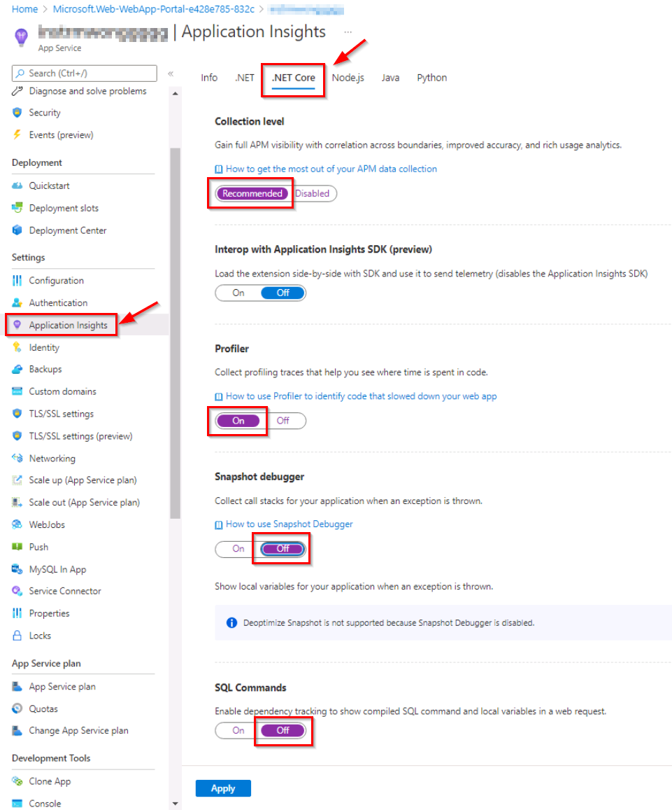

---
lab:
    az204Title: 'Lab 11: Monitor services that are deployed to Azure'
    az020Title: 'Lab 11: Monitor services that are deployed to Azure'
    az204Module: 'Module 11: Monitor and optimize Azure solutions'
    az020Module: 'Module 11: Monitor and optimize Azure solutions'
---

# Lab 11: Monitor services that are deployed to Azure

## Microsoft Azure user interface

Given the dynamic nature of Microsoft cloud tools, you might experience Azure UI changes that occur after the development of this training content. As a result, the lab instructions and lab steps might not align correctly.

Microsoft updates this training course when the community alerts us to needed changes. However, cloud updates occur frequently, so you might encounter UI changes before this training content updates. **If this occurs, adapt to the changes, and then work through them in the labs as needed.**

## Instructions

### Before you start

#### Sign in to the lab environment

Sign in to your Windows 10 virtual machine (VM) by using the following credentials:
    
-   Username: **Admin**

-   Password: **Pa55w.rd**

> **Note**: Your instructor will provide instructions to connect to the virtual lab environment.

#### Review the installed applications

Find the taskbar on your Windows 10 desktop. The taskbar contains the icons for the applications that you'll use in this lab, including:
    
-   Microsoft Edge

-   File Explorer

-   Visual Studio Code

-   Azure PowerShell

## Architecture diagram


### Exercise 1: Create and configure Azure resources

#### Task 1: Open the Azure portal

1.  On the taskbar, select the **Microsoft Edge** icon.

1.  In the browser window, browse to the Azure portal ([portal.azure.com](https://portal.azure.com)), and then sign in with the account you'll be using for this lab.

    > **Note**: If this is your first time signing in to the Azure portal, you'll be offered a tour of the portal. Select **Get Started** to skip the tour and begin using the portal.

#### Task 2: Create an Application Insights resource

1.  In the Azure portal, use the **Search resources, services, and docs** text box at the top of the page to search for **Application Insights** and then, in the list of results, select **Application Insights**.

1.  On the **Application Insights** blade, select **+ Create**.

1.  On the **Application Insights** blade, on the **Basics** tab, perform the following actions, and select **Review + Create**:
    
    | Setting                         | Action                                                       |
    | ------------------------------- | ------------------------------------------------------------ |
    | **Subscription** drop-down list | Retain the default value.                                    |
    | **Resource group** section      | Select **Create new**, enter **MonitoredAssets**, and then select **OK**. |
    | **Name** text box     | **instrm**_[yourname]_.                           |
    | **Region** drop-down list       | Select any Azure region in which you can deploy an Azure Service Bus. |
    | **Resource Mode** section | Select the **Workspace-based** option.|
    | **WORKSPACE DETAILS** section | Retain the default values for the **Subscription** and **Log Analytics Workspace** drop-down lists.|
    
    The following screenshot displays the configured settings on the **Application Insights** blade.

       
     
1.  On the **Review + Create** tab, review the options that you selected during the previous steps.

1.  Select **Create** to create the **Application Insights** instance by using your specified configuration.

    > **Note**: Wait for the creation task to complete before you proceed with this lab.

1.  On the **Microsoft.AppInsights \| Overview** blade, select the **Go to resource** button to navigate to the blade of the newly created **Application Insights** resource.

1.  On the **Application Insights** blade, in the **Configure** section, select the **Properties** link.

1.  On the **Properties** blade, next to the **Instrumentation Key** entry, select the **Copy to clipboard** button, and then record the copied value. You'll use it later in this lab.

    > **Note**: The key is used by client applications to connect to a specific **Application Insights** resource.

### Task 3: Create an Azure Web API resource

1.  In the Azure portal, use the **Search resources, services, and docs** text box at the top of the page to search for **App Services** and then, in the list of results, select **App Services**.

1.  On the **App Services** blade, select **+ Create**.
    
1.  On the **Create Web App** blade, on the **Basics** tab, perform the following actions, and then select **Next: Deployment**:

    | Setting                         | Action                                                       |
    | ------------------------------- | ------------------------------------------------------------ |
    | **Subscription** drop-down list | Retain the default value.                                    |
    | **Resource group** drop-down list      |Select **MonitoredAssets**. |
    | **Name** text box     | Enter **smpapi**_[yourname]_ |
    | **Publish** section       | Select **Code**. |
    | **Runtime stack** drop-down list | Select **.NET Core 3.1 (LTS)**.|
    | **Operating System** section |  Select **Windows**.|
    | **Region** drop-down list |  Select the same region you chose as the location of the **Application Instance** resource. |
    | **App Service Plan** section |  Select **Create new**. |
    | **Name** text box |  Enter **MonitoredPlan**, and then select **OK**.|
    |  **SKU and size** section |  Retain the default value. |

1.  On the **Deployment** tab, select **Next: Networking (preview)** and select **Next: Monitoring**.

1.  On the **Monitoring** tab, perform the following actions, and then select **Review + Create**:

    | Setting                         | Action                                                       |
    | ------------------------------- | ------------------------------------------------------------ |
    | **Enable Application Insights** section | Ensure that **Yes** is selected.                                    |
    | **Application Insights** drop-down list     | Select the **instrm**_[yourname]_ Application Insights resource that you created previously in this lab.|

1.  On the **Review + Create** tab, review the options that you selected during the previous steps.

1.  Select **Create** to create the web API by using your specified configuration.

    > **Note**: Wait for the creation task to complete before you proceed with this lab.

1.  On the deployment **Overview** blade, select the **Go to resource** button to navigate to the blade of the newly created Azure web API.

1.  On the **App Service** blade, in the **Settings** section, select the **Configuration** link.

1.  In the **Configuration** section, perform the following actions:

    a.  On the **Application settings** tab, select **Show Values** to display secrets associated with your web API.

    b.  Note the value representing the **APPINSIGHTS\_INSTRUMENTATIONKEY** key. This value was set automatically when you built the web API resource.

1.  On the **App Service** blade, in the **Settings** section, select the **Properties** link.

1.  In the **Properties** section, record the value of the **URL** link. You'll use this value later in the lab to submit requests to the web API.

#### Task 4: Configure web API autoscale options

1.  On the **App Service** blade, in the **Settings** section, select the **Scale out (App Service Plan)** link.

1.  In the **Scale out** section, perform the following actions, and then select **Save**:

    | Setting                         | Action                                                       |
    | ------------------------------- | ------------------------------------------------------------ |
    | **Scale out** section | Select **Custom autoscale**.|
    | **Autoscale setting name** text box     | Enter **ComputeScaler**.|
    | **Resource group** drop-down list     |Select **MonitoredAssets**. |
    | **Scale mode** section      | Select **Scale based on a metric**. |
    | **Minimum** text box in the **Instance limits** section | Enter **2**.|
    | **Maximum** text box in the **Instance limits** section | Enter **8**.|
    | **Default** text box in the **Instance limits** section | Enter **3**. |

    The following screenshot displays the configured settings in the **Scale out** section on the **App Service** blade.

    

    | Setting                         | Action                                                       |
    | ------------------------------- | ------------------------------------------------------------ |
    | **Rules** section |  Select **Add a rule**.|
    | **Scale rule** blade | Retain default values for all settings, and then select **Add**.|

    The following screenshot displays additional settings in the **Scale out** section on the **App Service** blade.

    

    > **Note**: Wait for the save operation to complete before you continue with this lab.

#### Review

In this exercise, you created the Azure resources that you'll use for the remainder of the lab.

### Exercise 2: Monitor a local web API by using Application Insights

#### Task 1: Build a .NET Web API project

1.  From the lab computer, start **Visual Studio Code**.

1.  In Visual Studio Code, on the **File** menu, select **Open Folder**.

1.  In the **Open Folder** window, browse to **Allfiles (F):\\Allfiles\\Labs\\11\\Starter\\Api**, and then select **Select Folder**.

1.  In the **Visual Studio Code** window, activate the shortcut menu, and then select **Open in Integrated Terminal**.

1.  At the terminal prompt, run the following command to create a new .NET Web API application named **SimpleApi** in the current directory:

    ```
    dotnet new webapi --output . --name SimpleApi
    ```

1.  Run the following command to import version 2.18.0 of **Microsoft.ApplicationInsights** from NuGet to the current project:

    ```
    dotnet add package Microsoft.ApplicationInsights --version 2.18.0
    ```

    > **Note**: The **dotnet add package** command will add the **Microsoft.ApplicationInsights** package from NuGet. For more information, refer to [Microsoft.ApplicationInsights](https://www.nuget.org/packages/Microsoft.ApplicationInsights/).

1.  Run the following command to import version 2.18.0 of **Microsoft.ApplicationInsights.AspNetCore** from NuGet:

    ```
    dotnet add package Microsoft.ApplicationInsights.AspNetCore --version 2.18.0
    ```

    > **Note**: The **dotnet add package** command will add the **Microsoft.ApplicationInsights.AspNetCore** package from NuGet. For more information, refer to [Microsoft.ApplicationInsights.AspNetCore](https://www.nuget.org/packages/Microsoft.ApplicationInsights.AspNetCore).

1.  At the terminal prompt, run the following command to import version 2.18.0 of **Microsoft.ApplicationInsights.PerfCounterCollector** from NuGet to the current project:

    ```
    dotnet add package Microsoft.ApplicationInsights.PerfCounterCollector --version 2.18.0
    ```

    > **Note**: The **dotnet add package** command will add the **Microsoft.ApplicationInsights.PerfCounterCollector** package from NuGet. For more information, refer to [Microsoft.ApplicationInsights.PerfCounterCollector](https://www.nuget.org/packages/Microsoft.ApplicationInsights.PerfCounterCollector/).

1.  At the terminal prompt, run the following command to build the .NET Web API:

    ```
    dotnet build
    ```

#### Task 2: Update app code to disable HTTPS and use Application Insights

1.  In the **Visual Studio Code** window, on the **Explorer** pane, select the **Startup.cs** file to open the file on the **editor** pane.

1.  On the **editor** pane, in the **Startup** class, locate and delete the following code in line 39:

    ```csharp
    app.UseHttpsRedirection();
    ```

    > **Note**: This line of code forces the web API to use HTTPS. For this lab, this is unnecessary.

1.  At the beginning of the definition of the **Startup** class, add a new static string constant named **INSTRUMENTATION_KEY** with the value set to the Application Insights resource instrumentation key that you recorded previously in this lab:

    ```csharp
    private const string INSTRUMENTATION_KEY = "instrumentation_key";
    ```

    > **Note**: For example, if your instrumentation key is `d2bb0eed-1342-4394-9b0c-8a56d21aaa43`, that line of code would be `private const string INSTRUMENTATION_KEY = "d2bb0eed-1342-4394-9b0c-8a56d21aaa43";`

1.  Locate the **ConfigureServices** method in the **Startup** class:

    ```csharp
    public void ConfigureServices(IServiceCollection services)
    {
        services.AddControllers();
    }
    ```

1.  Starting from a new line, add the following code at the end of the **ConfigureServices** method to configure Application Insights using the provided instrumentation key:

    ```csharp
    services.AddApplicationInsightsTelemetry(INSTRUMENTATION_KEY);
    ```

1.  Review the **ConfigureServices** method, which should now contain the following code:

    ```csharp
    public void ConfigureServices(IServiceCollection services)
    {
        services.AddControllers();
        services.AddApplicationInsightsTelemetry(INSTRUMENTATION_KEY);        
    }
    ```

1.  Save the **Startup.cs** file.

1.  At the terminal prompt, run the following command to build the .NET Web API.

    ```
    dotnet build
    ```

#### Task 3: Test an API application locally

1.  At the terminal prompt, run the following command, and then select **Enter** to create a certificate. Select **YES** on the prompted option.

    ```
    dotnet dev-certs https --trust
    ```

1.  At the terminal prompt, run the following command to launch the .NET Web API.

    ```
    dotnet run
    ```

1.  From the taskbar, open the context menu for the **Microsoft Edge** icon, and then open a new browser window.

1.  In the browser window that opens, navigate to the page in which the URL contains the **/weatherforecast** relative path of your web API, which at this point is hosted at **localhost** on port **5000**.
    
    > **Note**: The full URL is `http://localhost:5000/weatherforecast`.

    > **Note**: The page should contain an output in the following format:

    ```
    [{"date":"2021-09-04T10:15:04.0969996-07:00","temperatureC":54,"temperatureF":129,"summary":"Sweltering"},{"date":"2021-09-05T10:15:04.0972401-07:00","temperatureC":44,"temperatureF":111,"summary":"Balmy"},{"date":"2021-09-06T10:15:04.0976549-07:00","temperatureC":41,"temperatureF":105,"summary":"Scorching"},{"date":"2021-09-07T10:15:04.0976613-07:00","temperatureC":-4,"temperatureF":25,"summary":"Freezing"},{"date":"2021-09-08T10:15:04.0976618-07:00","temperatureC":33,"temperatureF":91,"summary":"Balmy"}]
    ```

1.  Close the browser window that's displaying the page generated by `http://localhost:5000/weatherforecast`.

1.  In Visual Studio Code, select **Kill Terminal** (the **Recycle Bin** icon) to close the **terminal** pane and any associated processes.

#### Task 4: Review metrics in Application Insights

1.  On your lab computer, switch to the **Microsoft Edge** browser window displaying the Azure portal.

1.  In the Azure portal, navigate back to the blade of the **instrm**_[yourname]_ Application Insights resource you created previously in this lab.

1.  On the **Application Insights** blade, in the tiles in the center of the blade, find the displayed metrics. Specifically, find the number of server requests that have occurred and the average server response time.

    The following screenshot displays the **Application Insights** metrics of the local web app.

    

    > **Note**: It can take up to five minutes to observe requests in the Application Insights metrics charts.

#### Review

In this exercise, you created an API app by using ASP.NET and configured it to stream application metrics to Application Insights. You then used the Application Insights dashboard to review performance details about your API.

### Exercise 3: Monitor a web API using Application Insights

#### Task 1: Deploy an application to the web API

1.  On the lab computer, switch to the Visual Studio Code.

1.  In the **Visual Studio Code** window, in the **Explorer** pane, navigate to the **bin\Debug\netcoreapp3.1** directory.

    > **Note**: To verify that you are in the **bin\Debug\netcoreapp3.1** directory, in Visual Studio Code, on the File menu, select Open Folder and browse to **Allfiles (F):\\Allfiles\\Labs\\11\\Starter\\Api\\bin\\Debug\\netcoreapp3.1**, and then select **Select Folder**.

1.  Add a file named **web.config** to the directory.

1.  Open the **web.config** file and add the following content:

    ```
    <?xml version="1.0" encoding="utf-8"?>
    <configuration>
      <location path="." inheritInChildApplications="false">
        <system.webServer>
          <handlers>
            <add name="aspNetCore" path="*" verb="*" modules="AspNetCoreModuleV2" resourceType="Unspecified" />
          </handlers>
          <aspNetCore processPath="dotnet" arguments=".\SimpleApi.dll" stdoutLogEnabled="false" stdoutLogFile=".\logs\stdout" hostingModel="inprocess" />
        </system.webServer>
      </location>
    </configuration>
    ```

1.  Save and close the file.

1.  In the **Visual Studio Code** window, activate the shortcut menu, and then select **Open in Integrated Terminal**.

1.  At the terminal prompt, run the following command to ensure that the current directory is set to the **Allfiles (F):\\Allfiles\\Labs\\11\\Starter\\Api\\bin\\Debug\\netcoreapp3.1**, where the deployment files reside:

    ```
    cd F:\Allfiles\Labs\11\Starter\Api\bin\Debug\netcoreapp3.1
    ```

1.  Run the following command to create a zip file containing the starter project that you'll deploy next to the Azure web API:

    ```powershell
    Compress-Archive -Path * -DestinationPath api.zip
    ```

1.  At the terminal prompt, run the following command to sign in to your Azure subscription by using Azure PowerShell:

    ```powershell
    Connect-AzAccount
    ```

1.  Follow the instructions displayed at the terminal prompt by switching to the Microsoft Edge browser displaying the Azure portal, opening another tab in the browser window, navigating to `https://microsoft.com/devicelogin`, when prompted, entering the provided code, and then signing in with the account you'll be using for this lab.

    > **Note**: Wait for the sign-in process to complete.

1.  Close the newly opened browser tab and switch back to the terminal prompt in the Visual Studio Code window.

1.  Run the following command to display the listing of all web apps in the **MonitoredAssets** resource group:

    ```powershell
    Get-AzWebApp -ResourceGroupName MonitoredAssets
    ```

1.  Run the following command to display the list of web apps in the **MonitoredAssets** resource group, which names start with **smpapi\***:

    ```powershell
    Get-AzWebApp -ResourceGroupName MonitoredAssets | Where-Object {$_.Name -like 'smpapi*'}
    ```

1.  Run the following commands to display the name of the first of the web apps identified in the previous step and store it in a variable named **$webAppName**:

    ```powershell
    Get-AzWebApp -ResourceGroupName MonitoredAssets | Where-Object {$_.Name -like 'smpapi*'} | Select-Object -ExpandProperty Name
    $webAppName = (Get-AzWebApp -ResourceGroupName MonitoredAssets | Where-Object {$_.Name -like 'smpapi*'})[0] | Select-Object -ExpandProperty Name
    ```

1.  Run the following command to deploy the **api.zip** file you created previously in this task to the web API whose name you identified in the previous step:

    ```powershell
    az webapp deployment source config-zip --resource-group MonitoredAssets --src api.zip --name $webAppName
    ```

    > **Note**: If prompted to authenticate, run `az login` and follows instructions to complete the sign in process.

    > **Note**: Wait for the deployment to complete before you continue with this lab.

    > **Note**: Review the output of the command and verify that the `provisioningState` is set to `Succeeded`. The output of the command should have the following format:

    ```
    Getting scm site credentials for zip deployment
    Starting zip deployment. This operation can take a while to complete ...
    Deployment endpoint responded with status code 202
    {
        "active": true,
        "author": "N/A",
        "author_email": "N/A",
        "complete": true,
        "deployer": "ZipDeploy",
        "end_time": "2021-09-03T17:02:18.124062Z",
        "id": "f5fb8ef6a11d4f8387f09dc47628007e",
        "is_readonly": true,
        "is_temp": false,
        "last_success_end_time": "2021-09-03T17:02:18.124062Z",
        "log_url": "https://smpapianu.scm.azurewebsites.net/api/deployments/latest/log",
        "message": "Created via a push deployment",
        "progress": "",
        "provisioningState": "Succeeded",
        "received_time": "2021-09-03T17:02:11.942626Z",
        "site_name": "smpapianu",
        "start_time": "2021-09-03T17:02:12.1613438Z",
        "status": 4,
        "status_text": "",
        "url": "https://smpapianu.scm.azurewebsites.net/api/deployments/latest"
    }
    ```

1.  On the lab computer, launch another Microsoft Edge browser window.

1.  In the browser window, navigate to the Azure Web API app into which you deployed the API app previously in this task by appending to its URL (that you recorded previously in this lab) the suffix **/weatherforecast**.

    > **Note**: For example, if your URL is `https://smpapianu.azurewebsites.net`, the new URL would be `https://smpapianu.azurewebsites.net/weatherforecast`.

1.  Verify that the output resembles the one generated when running the API app locally.

    > **Note**: The output will include different values but it should have the same format.

    > **Note**: If you are getting an exception, make sure the contents of the **web.config** file matches the sample shown earlier in this task. If it does not match, make any necessary changes and regenerate the **api.zip** file and re-deploy.

#### Task 2: Configure in-depth metric collection for Web Apps

1.  On your lab computer, switch to the **Microsoft Edge** browser window displaying the Azure portal.

1.  In the Azure portal, navigate back to the blade of the **smpapi**_[yourname]_ web app resource you created previously in this lab.

1.  On the **App Service** blade, select **Application Insights**.

1.  On the **Application Insights** blade, perform the following actions, select **Apply**, and then in the confirmation dialog, select **Yes**:

    | Setting                         | Action                                                       |
    | ------------------------------- | ------------------------------------------------------------ |
    | **Application Insights** slider | Ensure it is set to **Enable**.|
    | **Instrument your application** section    | Select the **.NET Core** tab.|
    | **Collection level** section    | Select **Recommended**. |
    | **Profiler** section      | Select **On**.|
    | **Snapshot debugger** section | Select **Off**.|
    | **SQL Commands** section | Select **Off**.|


    The following screenshot displays the **Application Insights** settings of the Azure Web API.

    

1.  Switch to the browser tab you opened in the previous task to display the results of deployment of your API app to the target Azure API app (including the **/weatherforecast** relative path in the target URL) and refresh the browser page several times.

1.  Review the JSON-formatted output generated by the API.

1.  Record the URL that you used to access the JSON-formatted output.

    > **Note**: The URL should be in the format `https://smpapianu.azurewebsites.net/weatherforecast` if **smpapianu** was the site name you created earlier.

#### Task 3: Get updated metrics in Application Insights

1.  Return to the browser window displaying the Azure web app in the Azure portal.

1.  On the **Application Insights** blade of the web app, select the **View Application Insights data** link.

1.  On the **Application Insights** blade, review the collected metrics in the tiles in the center of the blade, including the number of server requests that have occurred and the average server response time.

    The following screenshot displays the **Application Insights** metrics of the Azure web app in the Azure portal.

    

    > **Note**: It can take up to five minutes for updated metrics to appear in the Application Insights metrics charts.

#### Task 4: View real-time metrics in Application Insights

1.  On the **Application Insights** blade, in the **Investigate** section, select **Live metrics**.

1.  Switch back to the browser window displaying the target API app running in the target Azure web app (which targets the **/weatherforecast** relative path in the target URL), and then refresh the browser page several times.

1.  Switch to the browser window displaying the **Live metrics** blade and review its content.

    > **Note**: The **Incoming Requests** section should update within seconds, showing the requests that you made to the web API.

### Exercise 4: Application Insights logging with .NET Core

#### Task 1: Configure logging for a .NET Core API app

1.  Switch to the **Visual Studio Code** window.

1.  At the terminal prompt, run the following command to set the current directory to the **Allfiles (F):\\Allfiles\\Labs\\11\\Starter\\Api**, where the deployment files reside:

    ```
    cd F:\Allfiles\Labs\11\Starter\Api
    ```

1.  Run the following command to import version 2.18.0 of **Microsoft.Extensions.Logging.ApplicationInsights** from NuGet to the current project:

    ```
    dotnet add package Microsoft.Extensions.Logging.ApplicationInsights --version 2.18.0
    ```

    > **Note**: The **dotnet add package** command will add the **Microsoft.ApplicationInsights** package from NuGet. For more information, refer to [Microsoft.Extensions.Logging.ApplicationInsights](https://www.nuget.org/packages/Microsoft.Extensions.Logging.ApplicationInsights).

1.  In the **Visual Studio Code** window, in the **Explorer** pane, navigate to the **Controllers** directory, and then open the file **WeatherForecastController.cs**.

1.  Review the content of the file and note that it includes the `using Microsoft.Extensions.Logging` directive and a constructor injection for the generic ILogger<WeatherForecastController> interface.

    ```csharp
    using System;
    using System.Collections.Generic;
    using System.Linq;
    using System.Threading.Tasks;
    using Microsoft.AspNetCore.Mvc;
    using Microsoft.Extensions.Logging;
    namespace SimpleApi.Controllers
    {
        [ApiController]
        [Route("[controller]")]
        public class WeatherForecastController : ControllerBase
        {
            private static readonly string[] Summaries = new[]
            {
                "Freezing", "Bracing", "Chilly", "Cool", "Mild", "Warm", "Balmy", "Hot", "Sweltering", "Scorching"
            };
            private readonly ILogger<WeatherForecastController> _logger;
            public WeatherForecastController(ILogger<WeatherForecastController> logger)
            {
                _logger = logger;
            }
            [HttpGet]
            public IEnumerable<WeatherForecast> Get()
            {
                var rng = new Random();
                return Enumerable.Range(1, 5).Select(index => new WeatherForecast
                {
                    Date = DateTime.Now.AddDays(index),
                    TemperatureC = rng.Next(-20, 55),
                    Summary = Summaries[rng.Next(Summaries.Length)]
                })
                .ToArray();
            }
        }
    }
    ```

    > **Note**: You'll leverage this configuration to implement custom logging. Currently, the constructor displays a group of five randomly generated weather forecasts. You'll modify the controller to display one forecast at a time. For each forecast, you'll generate an informational, warning, or error log entry indicating the type of weather (mild, severe, and extreme). After these log entries are recorded by Application Insights in the corresponding Log Analytics workspace, each entry will have an automatically assigned severity level of 1, 2, or 3. 

1.  Locate the `var rng = new Random();` line in the `public IEnumerable<WeatherForecast> Get()` method in the file **WeatherForecastController.cs**, and then add the following code starting with the next line:

    ```csharp
            int temperatureC = rng.Next(-20, 55);
            var summaryId = rng.Next(Summaries.Length);
            switch (summaryId)
            {
                case 0: case 9:
                _logger.LogError("WeatherForecast: extreme weather");
                break;
                case 1: case 2: case 7: case 8:
                _logger.LogWarning("WeatherForecast: severe weather");
                break;
                default:
                _logger.LogInformation("WeatherForecast: mild weather");
                break;
            }
    ```

1.  Modify the `return` statement so it has the following content:

    ```csharp
            return Enumerable.Range(1, 1).Select(index => new WeatherForecast
            {
                Date = DateTime.Now.AddDays(index),
                TemperatureC = temperatureC,
                Summary = Summaries[summaryId]
            })
            .ToArray();
    ```

1.   Save and close the file.

1.  At the terminal prompt, run the following command to build the .NET Web API:

    ```
    dotnet build
    ```

#### Task 2: Test logging of a .NET Core API app

1.  Run the following command to launch the .NET Web API.

    ```
    dotnet run
    ```

    > **Note**: Keep the web API running and monitor the output of the Visual Studio Code **terminal** pane as you perform the next steps in this task.

1.  On your lab computer, from the taskbar, open the context menu for the **Microsoft Edge** icon, and then open a new browser window.

    > **Note**: Position the browser window such that it doesn't block the Visual Studio Code **terminal** pane.

1.  In the open browser window, navigate to `http://localhost:5000/weatherforecast`, and then refresh the page several times.

    > **Note**: Each time you refresh the page, it should display a different weather forecast in the following format.

    ```
    [{"date":"2021-09-04T14:35:29.0789168-07:00","temperatureC":2,"temperatureF":35,"summary":"Sweltering"}]
    ```

    > **Note**: Each refresh of the page should result in an informational, warning, or error message display at the terminal prompt, in the following format:

    ```
    warn: SimpleApi.Controllers.WeatherForecastController[0]
      WeatherForecast: severe weather
    ```

    > **Note**: Refresh the page several times to ensure that you generated at least one message of each type (**info**, **warn**, and **fail**).

1.  Leave the API app running.

#### Task 3: Review the Application Insights logging

1.  On your lab computer, switch to the **Microsoft Edge** browser window displaying the Azure portal.

1.  In the Azure portal, navigate back to the blade of the **instrm**_[yourname]_ Application Insights resource you created previously in this lab.

1.  On the **Application Insights** blade, in the **Monitoring** section, select **Logs**.

1.  If needed, close the **Welcome to Log Analytics** pane and **Queries** pane.

1.  In the **New Query** pane, type the following query and select **Run**:

    ```
    traces
    | order by timestamp desc
    ```

1.  Review the results of the query.

    > **Note**: The results should include log entries corresponding to the warning and error messages generated by the .NET Core api app, with their respective severity levels (2 and 3).

    > **Note**: It can take up to five minutes to observe requests in the Application Insights metrics charts.

    The following screenshot displays the log query results on the **Application Insights Logs** blade.

    

    > **Note**: You could deploy the updated API app to an Azure web app to collect its logs using Application Insights in an equivalent manner.

    > **Note**: You can extend the Application Insights logging level to include informational events by modifying the **appsettings.Development.json** (or **appsettings.json**) file as illustrated in the following code listing. However, you should keep in mind that this will considerably increase the log volume, which has potential network performance and pricing implications:

    ```
    {
      "Logging": {
        "LogLevel": {
          "Default": "Information",
          "Microsoft": "Warning",
          "Microsoft.Hosting.Lifetime": "Information"
        },
        "ApplicationInsights": {
          "LogLevel": {
            "Microsoft": "Information"
          }
        }
      }
    }
    ```

1.  Close the browser window displaying the output of your API app.

1.  Switch to the **Visual Studio Code** window, and then select **Kill Terminal** (the **Recycle Bin** icon) to close the **terminal** pane and any associated processes.

#### Review

In this exercise, you configured and tested Application Insights logging of your web API app.

### Exercise 5: Clean up your subscription

#### Task 1: Open Azure Cloud Shell

1.  In the Azure portal, select the **Cloud Shell** icon  to open a new PowerShell session. If Cloud Shell defaults to a PowerShell session, select **PowerShell**, and in the drop-down menu, select **Bash**.

    > **Note**: If this is the first time you're starting **Cloud Shell**, when prompted to select either **Bash** or **PowerShell**, select **Bash**. When you're presented with the **You have no storage mounted** message, select the subscription you're using in this lab, and select **Create storage**.

#### Task 2: Delete resource groups

1.  On the **Cloud Shell** pane, run the following command to delete the **MonitoredAssets** resource group:

    ```
    az group delete --name MonitoredAssets --no-wait --yes
    ```

    > **Note**: The command executes asynchronously (as determined by the *--no-wait* parameter), so while you'll be able to run another Azure CLI command immediately afterwards within the same Bash session, it'll take a few minutes before the resource groups are actually removed.

1.  Close the **Cloud Shell** pane in the portal.

#### Task 3: Close the active applications

1.  Close the currently running Microsoft Edge application.

1.  Close the currently running Visual Studio Code application.

#### Review

In this exercise, you cleaned up your subscription by removing the resource groups used in this lab.
