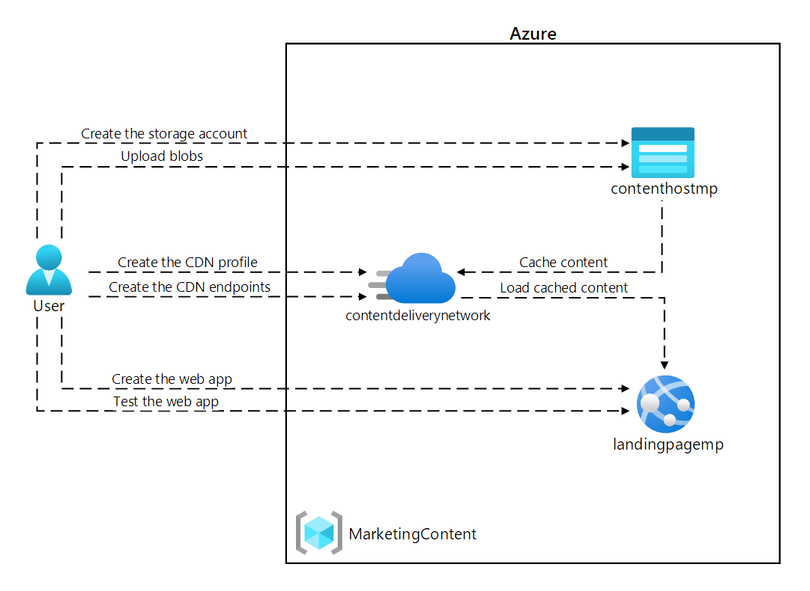
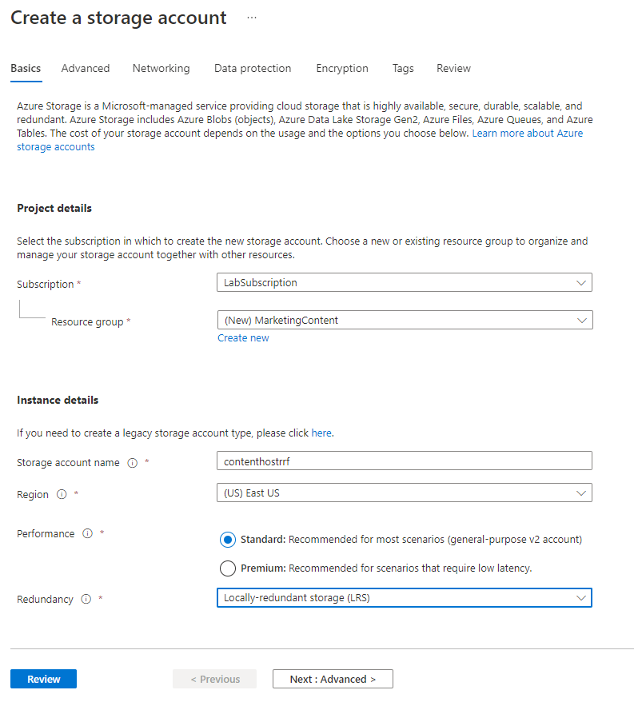
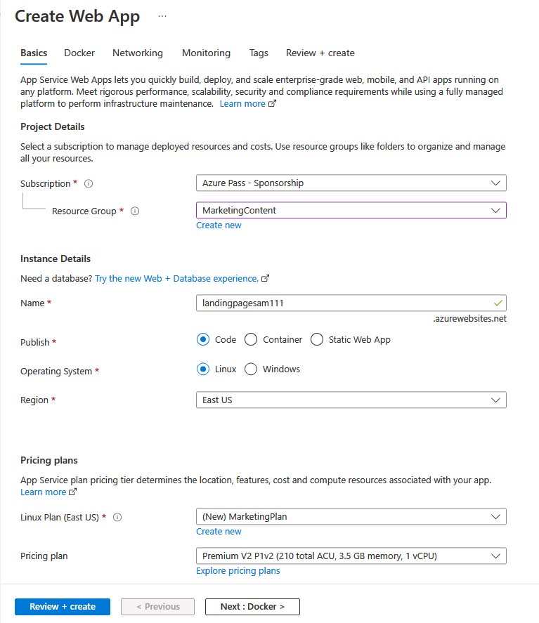
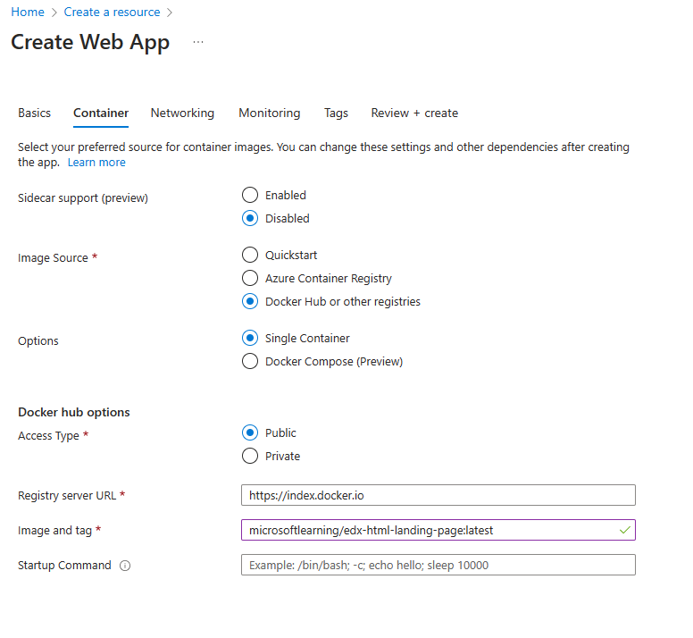
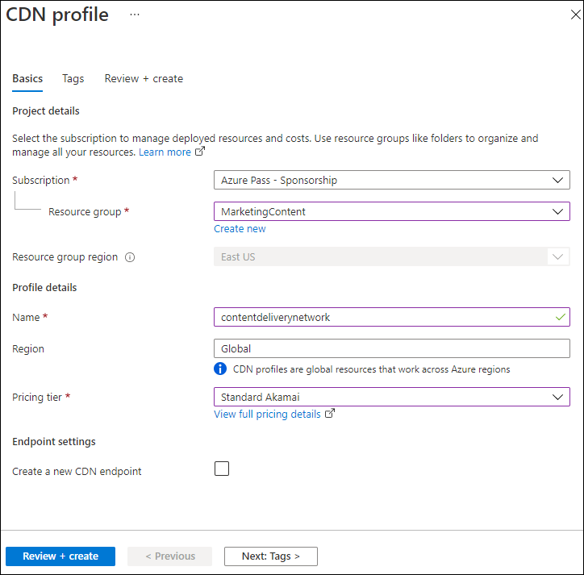
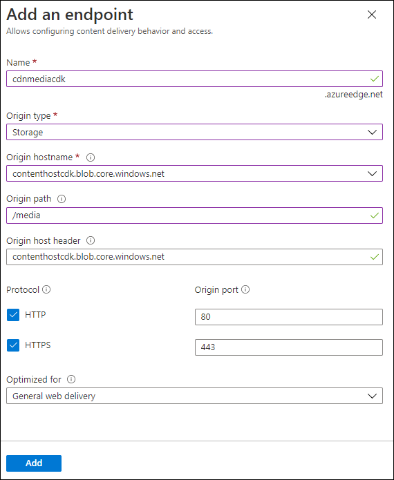
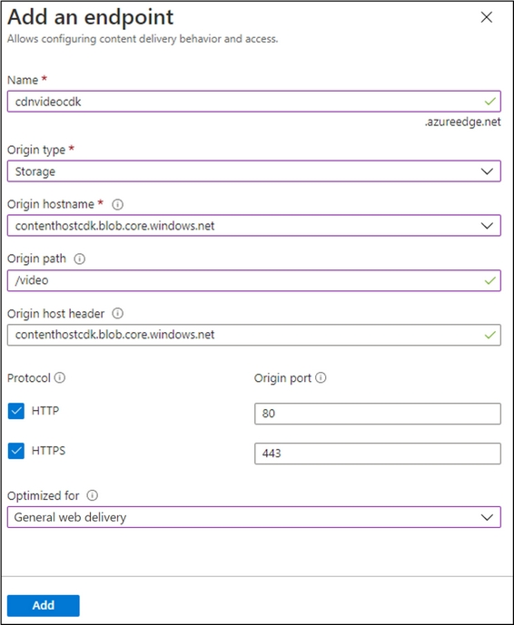
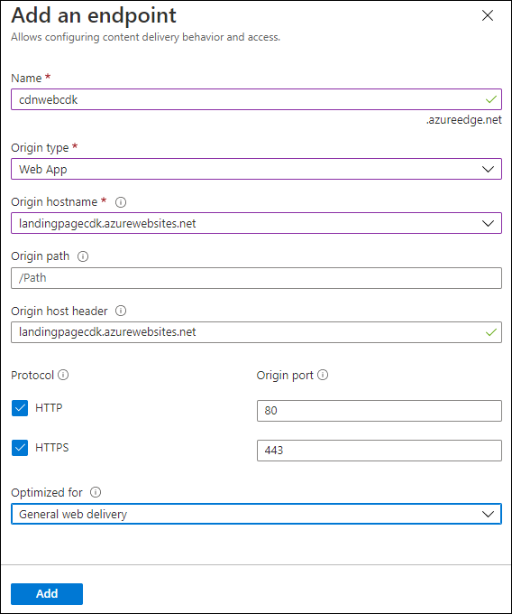

---
lab:
    az204Title: 'Lab 12: Enhance a web application by using the Azure Content Delivery Network'
    az204Module: 'Learning Path 12: Implement caching for solutions'
---

# Lab 12: Enhance a web application by using the Azure Content Delivery Network

## Microsoft Azure user interface

Given the dynamic nature of Microsoft cloud tools, you might experience Azure UI changes that occur after the development of this training content. As a result, the lab instructions and lab steps might not align correctly.

Microsoft updates this training course when the community alerts us to needed changes. However, cloud updates occur frequently, so you might encounter UI changes before this training content updates. **If this occurs, adapt to the changes, and then work through them in the labs as needed.**

## Instructions

### Before you start

#### Sign in to the lab environment

Sign in to your Windows 11 virtual machine (VM) by using the following credentials:

- Username: `Admin`
- Password: `Pa55w.rd`

> **Note**: Your instructor will provide instructions to connect to the virtual lab environment.

#### Review the installed applications

Find the taskbar on your Windows 11 desktop. The taskbar contains the icon for the application that you'll use in this lab:

- Microsoft Edge

## Lab Scenario

In this lab, you will implement the Azure Content Delivery Network capabilities to provide a caching solution based on customer locations. The lab configures a storage account for image and video files, which are impacted the most by the latency issues. You will use the Azure Content Delivery Network to implement the caching solution to aid in reducing latency for these image and video files.

## Architecture diagram



### Exercise 1: Create Azure resources

#### Task 1: Open the Azure portal

1. On the taskbar, select the **Microsoft Edge** icon.

1. In the open browser window, browse to the Azure portal at `https://portal.azure.com`, and then sign in with the account you'll be using for this lab.

   > **Note**: If this is your first time signing in to the Azure portal, you'll be offered a tour of the portal. Select **Get Started** to skip the tour and begin using the portal.

#### Task 2: Create a Storage account

1. In the Azure portal, use the **Search resources, services, and docs** text box to search for **Storage account**, and then in the list of results, select **Storage accounts**.

1. On the **Storage accounts** blade, select **+ Create**.

1. On the **Create a storage account** blade, on the **Basics** tab, perform the following actions, and then select **Next: Advanced >**:

   | Setting | Action |
   | -- | -- |
   | **Subscription** drop-down list | Retain the default value |
   | **Resource group** section | Select **Create new**, enter **MarketingContent**, and then select **OK** |
   | **Storage account name** text box | Enter **contenthost**_[yourname]_ |
   | **Region** drop-down list | Select **(US) East US** |
   | **Performance** section | Select the **Standard** option |
   | **Redundancy** drop-down list | Select **Locally-redundant storage (LRS)** |

    The following screenshot displays the configured settings in the **Create a storage account** blade.

    

1. On the **Advanced** tab, ensure **Allow enabling anonymous access on individual containers** is enabled. Check the box if it is not enabled.

1. On the **Review** tab, review the options that you selected during the previous steps.

1. Select **Create** to create the storage account by using your specified configuration.

    > **Note**: Wait for the creation task to complete before you move forward with this lab.

#### Task 3: Create a web app by using Azure App Service

1. On the Azure portal's navigation pane, select **Create a resource**.

1. On the **Create a resource** blade, in the **Search services and marketplace** text box, enter **Web App**, and then select Enter.

1. On the search results blade, select the **Web App** result, and then select **Create**.

1. On the **Create Web App** blade, on the **Basics** tab, perform the following actions, and then select **Next: Docker**:

   | Setting | Action |
   | -- | -- |
   | **Subscription** drop-down list | Retain the default value |
   | **Resource group** drop-down list | Select **MarketingContent** in the list |
   | **Name** text box | Enter **landingpage**_[yourname]_ |
   | **Publish** section | Select **Container** |
   | **Operating System** section | Select **Linux** |
   | **Region** drop-down list | Select **East US** |
   | **Linux Plan (East US)** section | Select **Create new**. In the **Name** text box, enter **MarketingPlan**, and then select **OK** |
   | **Pricing plan** section | Retain the default value |

   The following screenshot displays the configured settings on the **Create Web App** blade.

   

1. On the **Container** tab, perform the following actions, and then select **Review + create**:

    | Setting | Action |
    | -- | -- |
    | **Sidecar support (preview)** | Select **Disabled** |
    | **Image Source**  | Select **Docker Hub or other registries** |
    | **Options** | Select **Single container** |
    | **Access Type** drop-down list | Select **Public** |
    | **Registry server URL** | Enter `https://index.docker.io` |
    | **Image and tag** text box | Enter **microsoftlearning/edx-html-landing-page:latest** |

   The following screenshot displays the configured settings on the **Container** tab.

   

1. On the **Review + create** tab, review the options that you selected during the previous steps.

1. Select **Create** to create the web app by using your specified configuration.

    > **Note**: Wait for the creation task to complete before you move forward with this lab.

1. On the **Deployment** blade, select **Go to resource**.

1. On the **App Service Overview** blade, in the **Essentials**, record the value of the **Default domain** link. You'll use this value later in the lab.

#### Review

In this exercise, you created an Azure Storage account and an Azure Web App that you'll use later in this lab.

### Exercise 2: Configure Content Delivery Network and endpoints

#### Task 1: Open Azure Cloud Shell

1. In the Azure portal, select the **Cloud Shell** icon  to open a the Cloud Shell. If Cloud Shell defaults to a PowerShell session, select **Switch to Bash** in the **Cloud Shell** menu and then select **Confirm**.

    > **Note**: The **Cloud Shell** icon is represented by a greater than sign (\>) and underscore character (\_).

    If this is the first time you're starting **Cloud Shell** you will be presented with a series of prompts to create the resource. Perform the actions presented in the following table:

    | Prompt | Action |
    |--|--|
    | Welcome to Azure Cloud Shell | Select **Bash**. |
    | Getting Started | Select **Mount storage account**, then select your **Storage account subscription** from the drop-down, and finally select **Apply**. |
    | Mount storage account | Select **We will create a storage account for you**, and then select **Next**. |

1. In the Azure portal, at the **Cloud Shell** command prompt, run the following command to get the version of the Azure Command-Line Interface (Azure CLI) tool:

    ```bash
    az --version
    ```

#### Task 2: Register the Microsoft.CDN provider

1. At the **Cloud Shell** command prompt in the portal, perform the following actions:

    a.  Enter the following command to check if the Microsoft.CDN has been registered. Proceed to step 2. if the Microsoft.CDN has already been registered:

    ```bash
    az provider show --namespace Microsoft.CDN --query "registrationState"
    ```

    b.  If the Microsoft.CDN has not been registered. Enter the following command, and then select Enter to register the **Microsoft.CDN** namespace with your current subscription:

    ```bash
    az provider register --namespace Microsoft.CDN
    ```

1. Close the **Cloud Shell** pane in the portal.

#### Task 3: Create a Content Delivery Network profile

1. On the Azure portal's navigation pane, select **Create a resource**.

1. On the **Create a resource** blade, in the **Search services and marketplace** text box, enter **CDN**, and then select Enter.

1. On the **Marketplace** search results blade, select the **Front Door and CDN profiles** result, and then select **Create**.

1. On the **Compare offerings** page, select **Explore other offerings** and then select **Azure CDN Standard from Microsoft (classic)**, and then select **Continue**.

1. On the **CDN profile** blade, on the **Basics** tab, perform the following actions, and then select **Review + create**:

   | Setting | Action |
   | -- | -- |
   | **Subscription** drop-down list | Retain the default value |
   | **Resource group** drop-down list | Select **MarketingContent** in the list |
   | **Name** text box | Enter **contentdeliverynetwork** |
   | **Region** text box | Retain the default value **Global** |
   | **Pricing tier** drop-down list | Retain the default value **Microsoft CDN (classic)** |
   | **Create a new CDN endpoint** check box | Not selected |

   The following screenshot displays the configured settings on the **CDN profile** blade.

   

1. On the **Review + create** tab, review the options that you selected during the previous steps.

1. Select **Create** to create the CDN profile by using your specified configuration.
  
    > **Note**: Wait for Azure to finish creating the CDN profile before you move forward with the lab. You'll receive a notification when the profile is created.

#### Task 4: Configure Storage containers

1. On the Azure portal's navigation pane, select **Resource groups**.

1. On the **Resource groups** blade, select the **MarketingContent** resource group that you created previously in this lab.

1. On the **MarketingContent** blade, select the **contenthost**_[yourname]_ storage account that you created previously in this lab.

1. On the **Storage account** blade, select the **Containers** link in the **Data storage** section.

1. In the **Containers** section, select **+ Container**.

1. In the **New container** pop-up window, perform the following actions, and then select **Create**:

   | Setting | Action |
   | -- | -- |
   | **Name** text box | Enter **media** |
   | **Public access level** drop-down list | Select **Blob (anonymous read access for blobs only)** |

1. In the **Containers** section, select **+ Container** again.

1. In the **New container** pop-up window, perform the following actions, and then select **Create**:

   | Setting | Action |
   | -- | -- |
   | **Name** text box | Enter **video** |
   | **Public access level** drop-down list | Select **Blob (anonymous read access for blobs only)** |

1. Observe the updated list of containers and confirm that both the **media** and **video** containers are listed.

#### Task 5: Create Content Delivery Network endpoints

1. On the Azure portal's navigation pane, select the **Resource groups** link.

1. On the **Resource groups** blade, select the **MarketingContent** resource group that you created previously in this lab.

1. On the **MarketingContent** blade, select the **contentdeliverynetwork** CDN profile that you created previously in this lab.

1. On the **CDN profile** blade, select **+ Endpoint**.

1. In the **Add an endpoint** pop-up dialog box, perform the following actions, and then select **Add**:

   | Setting | Action |
   | -- | -- |
   | **Name** text box | Enter **cdnmedia**_[yourname]_ |
   | **Origin type** drop-down list | Select **Storage** |
   | **Origin hostname** drop-down list | Select the **contenthost*[yourname]*.blob.core.windows.net** option for the Storage account that you created previously in this lab |
   | **Origin path** text box | Enter **/media** |
   | **Origin host header** text box | Retain the default value |
   | **Protocol** and **Origin port** sections | Retain the default values |
   | **Optimized for** drop-down list | Select **General web delivery** |

   The following screenshot displays the configured settings in the **Add an endpoint** dialog box.

   

1. On the **CDN profile** blade, select **+ Endpoint** again.

1. In the **Add an endpoint** pop-up dialog box, perform the following actions, and then select **Add**:

   | Setting | Action |
   | -- | -- |
   | **Name** text box | Enter **cdnvideo**_[yourname]_ |
   | **Origin type** drop-down list | Select **Storage** |
   | **Origin hostname** drop-down list | Select the **contenthost*[yourname]*.blob.core.windows.net** option for the Storage account that you created previously in this lab |
   | **Origin path** text box | Enter **/video** |
   | **Origin host header** text box | Retain the default value |
   | **Protocol** and **Origin port** sections | Retain the default values |
   | **Optimized for** drop-down list | Select **General web delivery** |

   The following screenshot displays the configured settings in the **Add an endpoint** dialog box.

   

1. On the **CDN profile** blade, select **+ Endpoint** again.

1. In the **Add an endpoint** pop-up dialog box, perform the following actions, and then select **Add**:

   | Setting | Action |
   | -- | -- |
   | **Name** text box | Enter **cdnweb**_[yourname]_ |
   | **Origin type** drop-down list | Select **Web App** |
   | **Origin hostname** drop-down list | Select the **landingpage*[yourname]*.azurewebsites.net** option for the web app that you created previously in this lab |
   | **Origin path** text box | Retain the default value |
   | **Origin host header** text box | Retain the default value |
   | **Protocol** and **Origin port** sections | Retain the default values |
   | **Optimized for** drop-down list | Select **General web delivery** |

   The following screenshot displays the configured settings in the **Add an endpoint** dialog box.

   

#### Review

In this exercise, you registered the resource provider for Content Delivery Network (CDN), and then used the provider to create both a CDN profile and endpoint resources.

### Exercise 3: Upload and configure static web content

#### Task 1: Observe the landing page

1. On the Azure portal's navigation pane, select **Resource groups**.

1. On the **Resource groups** blade, select the **MarketingContent** resource group that you created previously in this lab.

1. On the **MarketingContent** blade, select the **landingpage**_[yourname]_ web app that you created previously in this lab.

1. On the **App Service** blade, select **Browse**. A new browser tab opens and returns the current website. Observe the error message displayed on the screen. The website won't work until you configure the specified settings to reference multimedia content.

1. Return to your currently open browser window that's displaying the Azure portal.

#### Task 2: Upload Storage blobs

1. On the Azure portal's navigation pane, select **Resource groups**.

1. On the **Resource groups** blade, select the **MarketingContent** resource group that you created previously in this lab.

1. On the **MarketingContent** blade, select the **contenthost**_[yourname]_ storage account that you created previously in this lab.

1. On the **Storage account** blade, select the **Containers** link in the **Data storage** section.

1. In the **Containers** section, select the **media** container, and then select **Upload**.

1. In the **Upload blob** pop-up window, perform the following actions:

    a.  In the **Files** section, select **Browse for files** or use the drag and drop feature.

    b.  In the **File Explorer** window, browse to **Allfiles (F):\\Allfiles\\Labs\\12\\Starter**, select the following files, and then select **Open**:

    - **campus.jpg**

    - **conference.jpg**

    - **poster.jpg**

    c.  Ensure that **Overwrite if files already exist** is selected, and then select **Upload**.  

    > **Note**: Wait for the blob to upload before you continue with this lab.

1. On the **Container** blade, select **Properties** in the **Settings** section.

1. Record the value in the **URL** text box. You'll use this value later in the lab.

1. Close the **Container** blade.

1. On the **Containers** blade, select the **video** container, and then select **Upload**.

1. In the **Upload blob** pop-up window, perform the following actions:

    a.  In the **Files** section, select **Browse for files** or use the drag and drop feature.

    b.  In the **File Explorer** window, browse to **Allfiles (F):\\Allfiles\\Labs\\12\\Starter**, select the **welcome.mp4** file, and then select **Open**.

    c.  Ensure that **Overwrite if files already exist** is selected, and then select **Upload**.  

    > **Note**: Wait for the blob to upload before you continue with this lab.

1. On the **Container** blade, select **Properties** in the **Settings** section.

1. Record the value in the **URL** text box. You'll use this value later in the lab.

#### Task 3: Configure Web App settings

1. On the Azure portal's navigation pane, select **Resource groups**.

1. On the **Resource groups** blade, select the **MarketingContent** resource group that you created previously in this lab.

1. On the **MarketingContent** blade, select the **landingpage**_[yourname]_ web app that you created previously in this lab.

1. On the **App Service** blade, in the **Settings** section, select the **Environment variables** link.

1. In the **App settings** tab, select **+ Add**. Enter the following information in the **Add/Edit application setting** pop-up dialog:

    | Setting | Action |
    |--|--|
    | **Name** text box | Enter **CDNMediaEndpoint** |
    | **Value** text box | Enter the **URI** value of the **media** container in the **contenthost**_[yourname]_ storage account that you recorded previously in this lab |
    | **Deployment slot setting** check box | Retain the default value |

1. Select **Apply** to close the pop-up dialog and return to the **App settings** section.

1. In the **App settings** tab, select **+ Add**. Enter the following information in the **Add/Edit application setting** pop-up dialog:

    | Setting | Action |
    | -- | -- |
    | **Name** text box | Enter **CDNVideoEndpoint** |
    | **Value** text box | Enter the **URI** value of the **video** container in the **contenthost**_[yourname]_ storage account that you recorded previously in this lab |
    | **Deployment slot setting** check box | Retain the default value |

1. Select **Apply** to close the pop-up dialog and return to the **App settings** section.

1. At the bottom of the **App settings** section, select **Apply**.

   >**Note:** You may receive a warning that your app may restart when updating app settings. Select **Confirm**. Wait for your application settings to save before you continue with the lab.

#### Task 4: Validate the corrected landing page

1. On the Azure portal's navigation pane, select **Resource groups**.

1. On the **Resource groups** blade, select the **MarketingContent** resource group that you created previously in this lab.

1. On the **MarketingContent** blade, select the **landingpage**_[yourname]_ web app that you created previously in this lab.

1. On the **App Service** blade, select **Restart**, and then select **Yes** to confirm the app restart process.

   > **Note**: Wait for the restart operation to complete before you move forward with the lab. You'll receive a notification when the operation is done.

1. On the **App Service** blade, select **Browse**. A new browser window or tab will open and return to the current website. Observe the updated website rendering multimedia content of various types.

1. Return to your currently open browser window that's displaying the Azure portal.

#### Review

In this exercise, you uploaded multimedia content as blobs to Storage containers, and then updated your web app to point directly to the storage blobs.

### Exercise 4: Use Content Delivery Network endpoints

#### Task 1: Retrieve endpoint Uniform Resource Identifiers (URIs)

1. On the Azure portal's navigation pane, select the **Resource groups** link.

1. On the **Resource groups** blade, select the **MarketingContent** resource group that you created previously in this lab.

1. On the **MarketingContent** blade, select the **contentdeliverynetwork** CDN profile that you created previously in this lab.

1. On the **CDN profile** blade, select the **cdnmedia**_[yourname]_ endpoint.

1. On the **Endpoint** blade, copy the value of the **Endpoint hostname** link. You'll use this value later in the lab.

1. Close the **Endpoint** blade.

1. On the **CDN profile** blade, select the **cdnvideo**_[yourname]_ endpoint.

1. On the **Endpoint** blade, copy the value of the **Endpoint hostname** link. You'll use this value later in the lab.

1. Close the **Endpoint** blade.

#### Task 2: Test multimedia content

1. Construct a URL for the **campus.jpg** resource by combining the **Endpoint hostname** URL from the **cdnmedia**_[yourname]_ endpoint that you copied previously in the lab with a relative path of **/campus.jpg**.

    > **Note**: For example, if your **Endpoint hostname** URL is `https://cdnmediastudent.azureedge.net/`, your newly constructed URL would be `https://cdnmediastudent.azureedge.net/campus.jpg`.

1. Construct a URL for the **conference.jpg** resource by combining the **Endpoint hostname** URL from the **cdnmedia**_[yourname]_ endpoint that you copied previously in the lab with a relative path of **/conference.jpg**.

    > **Note**: For example, if your **Endpoint hostname** URL is `https://cdnmediastudent.azureedge.net/`, your newly constructed URL would be `https://cdnmediastudent.azureedge.net/conference.jpg`.

1. Construct a URL for the **poster.jpg** resource by combining the **Endpoint hostname** URL from the **cdnmedia**_[yourname]_ endpoint that you copied previously in the lab with a relative path of **/poster.jpg**.

    > **Note**: For example, if your **Endpoint hostname** URL is `https://cdnmediastudent.azureedge.net/`, your newly constructed URL would be `https://cdnmediastudent.azureedge.net/poster.jpg`.

1. Construct a URL for the **welcome.mp4** resource by combining the **Endpoint hostname** URL from the **cdnvideo**_[yourname]_ endpoint that you copied previously in the lab with a relative path of **/welcome.mp4**.

    > **Note**: For example, if your **Endpoint hostname** URL is `https://cdnvideostudent.azureedge.net/`, your newly constructed URL would be `https://cdnvideostudent.azureedge.net/welcome.mp4`.

1. On the taskbar, activate the shortcut menu for the **Microsoft Edge** icon, and then select **New window**.

1. In the new browser window, refer to the URL that you constructed for the **campus.jpg** media resource, and then verify that the resource was successfully found.

    > **Note**: If the content isn't available yet, the CDN endpoint is still initializing. This initialization process can take anywhere from 5 to 15 minutes.

1. Refer to the URL that you constructed for the **conference.jpg** media resource, and then verify that the resource was successfully found.

1. Refer to the URL that you constructed for the **poster.jpg** media resource, and then verify that the resource was successfully found.

1. Refer to the URL that you constructed for the **welcome.mp4** video resource, and then verify that the resource was successfully found.

1. Close the browser window that you created in this task.

#### Task 3: Update the Web App settings

1. On the Azure portal's navigation pane, select **Resource groups**.

1. On the **Resource groups** blade, select the **MarketingContent** resource group that you created previously in this lab.

1. On the **MarketingContent** blade, select the **landingpage**_[yourname]_ web app that you created previously in this lab.

1. On the **App Service** blade, in the **Settings** section, select the **Environment variables** link.

1. In the **Application settings** tab, select the existing **CDNMediaEndpoint** application setting.

1. In the **Add/Edit application setting** pop-up dialog box, update the **Value** text box by entering the **Endpoint hostname** URL from the **cdnmedia**_[yourname]_ endpoint that you copied previously in the lab, and then select **Apply**.

1. Select the existing **CDNVideoEndpoint** application setting.

1. In the **Add/Edit application setting** pop-up dialog box, update the **Value** text box by entering the **Endpoint hostname** URL from the **cdnvideo**_[yourname]_ endpoint that you copied previously in the lab, and then select **Apply**.

1. At the bottom of the **App settings** section, select **Apply**.

   >**Note:** You may receive a warning that your app may restart when updating app settings. Select **Confirm**. Wait for your application settings to save before you continue with the lab.

1. In the **Configuration** section, select **Overview**.

1. In the **Overview** section, select **Restart**, and then select **Yes** to confirm the app restart process.

   > **Note**: Wait for the restart operation to complete before you continue with the lab. You'll receive a notification when the operation is done.

#### Task 4: Test the web content

1. On the Azure portal's navigation pane, select the **Resource groups** link.

1. On the **Resource groups** blade, select the **MarketingContent** resource group that you created previously in this lab.

1. On the **MarketingContent** blade, select the **contentdeliverynetwork** CDN profile that you created previously in this lab.

1. On the **CDN profile** blade, select the **cdnweb**_[yourname]_ endpoint.

1. On the **Endpoint** blade, copy the value of the **Endpoint hostname** link.

1. On the taskbar, activate the shortcut menu for the **Microsoft Edge** icon, and then select **New window**.

1. In the new browser window, refer to the **Endpoint hostname** URL for the **cdnweb**_[yourname]_ endpoint.

1. Observe the website and multimedia content that are all served using Content Delivery Network.

#### Review

In this exercise, you updated your web app to use Content Delivery Network to serve multimedia content and to serve the web application itself.
