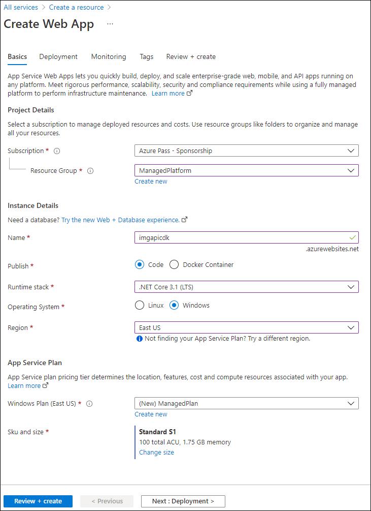

---
lab:
    az204Title: 'Lab 13: Create and configure an Azure web app'
    az204Module: 'Learning Path 13: Implement caching for solutions'
---

# Lab 13: Create and configure an Azure web app

## Microsoft Azure user interface

Given the dynamic nature of Microsoft cloud tools, you might experience Azure UI changes that occur after the development of this training content. As a result, the lab instructions and lab steps might not align correctly.

Microsoft updates this training course when the community alerts us to needed changes. However, cloud updates occur frequently, so you might encounter UI changes before this training content updates. **If this occurs, adapt to the changes, and then work through them in the labs as needed.**

## Instructions

### Before you start

#### Sign in to the lab environment

Sign in to your Windows 10 virtual machine (VM) by using the following credentials:

- Username: `Admin`
- Password: `Pa55w.rd`

> **Note**: Your instructor will provide instructions to connect to the virtual lab environment.

#### Review the installed applications

Find the taskbar on your Windows 10 desktop. The taskbar contains the icon for the application that you'll use in this lab:

- Microsoft Edge

## Lab Scenario

In this lab, you will deploy and configure an Azure Web App that integrates with GitHub. The web app will be a simple implementation of a single-page web app accessible only to internal employees. The website will host content related to company strategies and division sales goals.

To create the web app, you will use the Azure portal and connect it to a GitHub repository. To do this, you will need a free GitHub account, where you will upload the sample website content provided as part of this lab. Once the web app is up and running, you will make changes to the content and watch as the GitHub content is synced to the web app, using the CI/CD methodology.

Because this is an employee-only web app, you will need to secure access to the web app by creating users in Azure AD and implementing security for the web app through user authentication.


## Architecture diagram


### Exercise 1: Create an Azure App Service Web App

#### Task 1: Create a GitHub account and upload the sample web app code to a repository

1. On the taskbar, select the **Microsoft Edge** icon.

1. In the browser window, browse to the GitHub website at `https://github.com/`, and create a new account if you don't already have one..

1. Once you've logged in, create a new repository by clicking the **New** button on the main page.

1. Give your repository a name and description, and choose whether it should be public or private.

1. In the **Add a README file** section, select **Add a README file**.

1. Click on **Create repository** to create the repository.

1. Download the sample web app code from the source that you have and extract the files to a folder on your computer.

1. Go back to the repository page on GitHub and click on the **Upload files** button.

1. Drag and drop the sample web app code files from the folder on your computer to the GitHub upload page.

1. Add a commit message that describes the changes you made (e.g. "Initial commit of sample web app code").

1. Click on "Commit changes" to upload the sample web app code to the repository.


#### Task 2: Create the web app in the Azure portal and connect it to the GitHub account

1. On the taskbar, select the **Microsoft Edge** icon.

1. In the browser window, browse to the Azure portal at `https://portal.azure.com`, and then sign in with the account you'll be using for this lab.

1. On the Azure portal's navigation pane, select the **Create a resource** button in the left-hand menu.

1. On the search bar, type **Web App** and select **Web App** from the list of options.

1. On the **Web App** blade, select **Create**.

1. On the **Create Web App** blade, on the **Basics** tab, perform the following actions, and then select the **Deployment** tab:

    | Setting | Action |
    | -- | -- |
    | **Subscription** drop-down list | Retain the default value |
    | **Resource group** section | Select **Create new**, enter **ManagedPlatform**, and then select **OK** |
    | **Name** text box | Enter **webapp**_[yourname]_ |
    | **Publish** section | Select **Code** |
    | **Runtime stack** drop-down list | Select **.NET 6 (LTS)** |
    | **Operating System** section | Select **Windows** |
    | **Region** drop-down list | Select the **East US** region |
    | **Windows Plan (East US)** section | Select **Create new**, enter the value **ManagedPlan** in the **Name** text box, and then select **OK** |
    | **Pricing plan** section | Select **Standard S1** |

    The following screenshot displays the configured settings on the **Create web app** blade.

    

1. On the **Deployment** tab, in the **Continuous deployment** section, select **Enable**.

1. Select "Authorize" button to allow Azure to access your GitHub account.

1. On the "GitHub Actions details" section, select the organization, repository and branch that you created in Task 1, and then select the **Monitoring** tab. 

1. On the **Monitoring** tab, in the **Enable Application Insights** section, select **No**, and then select **Review + create**.

1. On the **Review + create** tab, review the options that you selected during the previous steps.

1. Select **Create** to create the web app by using your specified configuration. 

   > **Note**: Wait for the web app to be created before you continue with this lab.

1. On the **Overview** blade, select the **Go to resource** button to navigate to the blade of the newly created web app.


#### Task 3: Verify that the web app loads and works

1. On the Azure portal's **navigation** pane, select **Resource groups**.

1. On the **Resource groups** blade, select the **ManagedPlatform** resource group that you created previously in this lab.

1. On the **ManagedPlatform** blade, select the **imgweb**_[yourname]_ web app that you created previously in this lab.

1. On the **App Service** blade, select **Browse**.

1. Review and test the web app's various functions and features to ensure that they work as intended.

#### Task 4: Make changes to the code in GitHub and verify that the changes are reflected in the web app

1. Open the GitHub repository that contains the code for the web app.

1. Locate the file or code that needs to be changed and make the necessary modifications.

1. Commit the changes to the repository.

1. Wait for the changes to be reflected in the web app. This may take a few minutes to an hour, depending on the deployment process.

1. Open the web app in a browser and verify that the changes are visible.

1. Test the functionality affected by the changes to ensure that everything is working as expected.

1. If the changes are not reflected in the web app, check the deployment logs and troubleshoot as needed.

1. If the changes are still not visible, contact the development team for assistance.

   > **Note**: Remember to always test changes before committing them to the repository and deploying them to the web app. Additionally, it's important to follow best practices for version control and collaboration when working with code in GitHub.

#### Review

This exercise is about creating a web app in the Azure portal and connecting it to a GitHub repository. 


### Exercise 2: Configure user authentication and authorization

#### Task 1: Create an Azure AD user

1. Open the Azure portal and sign in with your Azure account credentials.

1. On the Azure portal, navigate to the **Azure Active Directory (AD)** service.

2. Select **Users** in the left-hand menu and then select **+ New User**.

3. On the **New user** pane, enter the required information for the new user:

    | Setting | Action |
    | -- | -- |
    | **Name** | enter **name143** |
    | **Username**  | enter **username143** |
    | **Password**  | enter **Password143** |

4. Select **Create** to create the new user account.

5. Once the user account is created, you can assign the appropriate roles and permissions to the user as needed.

   > **Note**: It is important to ensure that you follow any security best practices when creating user accounts, such as using strong passwords and enabling multi-factor authentication where possible.

#### Task 2: Configure authentication for the web app with the new Azure AD user you created

1. Open the Azure portal and navigate to the web app that you want to configure for authentication.

1. In the left-hand menu, select the **Authentication / Authorization**.

1. In the **Authentication / Authorization** pane, toggle the switch to **On** for **App Service Authentication**.

1. In the **Authentication Providers** section, select **Azure Active Directory**.

1. In the **Azure Active Directory** section, select the **Azure AD tenant** that you want to use.

1. Under **Management Mode**, select **Advanced** and then select **Save**.

1. In the **Authorization** section, select **Authenticated Users Only** and then select **Save**.

1. In the **Azure Active Directory** section, select **Express** for **Management Mode** and then select **Save**.

1. In the **Authorization** section, select **Allow Anonymous Requests (no action)** and then select **Save**.

1. Under **Actions**, select **Add/Edit** next to **Authentication / Authorization**.

1. In the **Authentication Providers** section, select **Azure Active Directory**.

1. Under **Action to take when request is not authenticated**, select **Log in with Azure Active Directory**.

1. In the **Azure Active Directory** section, select the **Azure AD tenant** that you want to use.

1. Under **Management Mode**, select **Express** and then select **Save**.


#### Task 3: Test the authentication and ensure that anonymous access is not permitted, ensuring only the Azure AD user can access the web app

1. Open a web browser and navigate to the URL of the web app that you have configured for authentication.

1. Attempt to access the web app without logging in. You should receive an error message or be redirected to the Azure AD login page.

1. Log in to the web app using the Azure AD user account that you created in Task 1.

1. Verify that you are able to access the web app and any protected resources within it.

1. Attempt to access the web app using a different user account or as an anonymous user. You should not be able to access the web app or any protected resources.

1. If necessary, repeat steps 2-5 with different user accounts to ensure that only authorized users are able to access the web app.

#### Review 

This exercise is about configuring user authentication and authorization for a web app using Azure Active Directory (Azure AD). 


### Exercise 3: Enable autoscale for the web app

#### Task 1: Enable custom scaling

1. Open the Azure portal and navigate to the **App Service** that you want to enable custom scaling for.

1. In the left-hand menu, select on **Scale up (App Service plan)**.

1. In the **App Service Plan** pane, select **Custom** under **Size**.

1. Use the slider or enter the desired values for **Instance Size** and **Capacity**.

1. Select **Apply** to save the changes.

1. Navigate back to the **App Service** and select the **Scale out (App Service plan)** in the left-hand menu.

1. In the **App Service Plan** pane, select **Custom** under **Scale mode**.

1. Use the slider or enter the desired values for **Instance count**.

1. Select **Apply** to save the changes.

1. Verify that the changes have been applied by monitoring the performance and resource usage of the App Service.

#### Task 2: Configure scale-out options based on CPU usage to increase the instance count

1. Open the Azure portal and navigate to the **Auto Scaling Groups** that you want to enable custom scaling for.

1. Select the auto scaling group you want to configure.

1. Click on the **Edit** button to edit the group.

1. Scroll down to the **Scaling Policies** section and click on **Add Policy**.

1. Select **Scale-Out** as the policy type.

1. Choose **Use scaling policies to adjust the capacity of this group** as the policy adjustment type.

1. Choose **CPU utilization** as the metric type.

1. Choose the desired CPU threshold for scaling out.

1. Enter the number of instances you want to add when the CPU threshold is reached.

1. Configure any other options you may want to change, such as cooldown period or notification settings.

1. Select **Create** to save the policy.

1. Test the policy by generating traffic that reaches the CPU threshold you set.

1. Verify that the auto scaling group scales out as expected.


#### Task 3: Configure scale-in options based on CPU usage to decrease the instance count

1. Open the Azure portal and navigate to the **Auto Scaling Groups** that you want to enable custom scaling for. 

1. Select the auto scaling group you want to configure.

1. Select the **Edit** button to edit the group.

1. Scroll down to the **Scaling Policies** section and select **Add Policy**.

1. Select **Scale-In** as the policy type.

1. Choose **Use scaling policies to adjust the capacity of this group** as the policy adjustment type.

1. Choose **CPU utilization** as the metric type.

1. Choose the desired CPU threshold for scaling in.

1. Enter the number of instances you want to remove when the CPU threshold is reached.

1. Configure any other options you may want to change, such as cooldown period or notification settings.

1. Select **Create** to save the policy.

1. Test the policy by generating traffic that reaches the CPU threshold you set.

1. Verify that the auto scaling group scales in as expected.

That's it! You have successfully configured your auto scaling group to scale in based on CPU utilization.

#### Task 4: Test the scaling of the web app

1. Generate traffic to your web app by using a load testing tool or creating a script to simulate user activity.

1. Monitor the CPU usage of the instances in your auto scaling group using your cloud service provider's console or monitoring tools.

1. When the CPU usage reaches the scaling threshold you set, observe the auto scaling group to see if it adds or removes instances as expected.

1. Monitor the health of the instances added by the auto scaling group to ensure they are functioning properly.

1. Repeat the test several times to ensure the auto scaling group is working consistently.

That's it! You have successfully tested the scaling of your web app using your auto scaling group. If you encounter any issues during the testing process, review the configuration of your auto scaling group and adjust as necessary.

#### Review 

This exercise is about enabling autoscaling for a web app. Autoscaling allows the web app to automatically adjust its capacity based on demand, ensuring that it can handle fluctuations in traffic and usage without manual intervention. The goal of the exercise is to provide practical experience in configuring auto scaling groups for web apps and to demonstrate the importance of autoscaling in ensuring that web apps can handle varying levels of traffic and usage.


### Exercise 4: Enable Application Insights

#### Task 1: Enable Application Insights for the web app

1. Open the Azure portal and navigate to your web app.

1. Select the **Monitoring** tab in the left-hand menu.

1. Select **Application Insights** in the **Monitoring** menu.

1. If you have not already created an Application Insights resource, select the **Create new resource** button and follow the prompts to create a new resource. Otherwise, select the existing Application Insights resource you want to use.

2. Select **Turn on Application Insights** to enable Application Insights for your web app.

3. Select the Application Insights resource you just created (or an existing one if 1. you already have one) from the dropdown list and select **OK** to confirm.

4. Wait a few minutes for the Application Insights service to be provisioned for your web app.

5. Once the service is provisioned, you should see a confirmation message that Application Insights has been enabled for your web app.

Congratulations, you have now successfully enabled Application Insights for your web app! Now you can move on to configuring Application Insights to collect telemetry data in Task 2.

#### Task 2: View the application’s performance through Application Insights

1. Open the Azure portal and navigate to your Application Insights resource.

1. In the left-hand menu, select **Performance**.

1. You should see a dashboard with several performance metrics for your application, including response times, server response times, and page views.

1. To view more detailed information about a specific metric, select it to open the corresponding chart.

1. From here, you can adjust the time range and granularity of the chart to view the data you're interested in.

1. You can also use the **Filter** option to narrow down the data based on specific criteria.

1. If you notice any performance issues, you can use the **Investigate** option to drill down into the data and identify the root cause of the issue.

1. Additionally, you can use the **Alerts** feature to set up alerts for specific performance metrics, so you can be notified if they fall outside of acceptable ranges.

Congratulations, you have now successfully viewed your application's performance through Application Insights! You can now move on to configuring custom telemetry in Task 3.

#### Task 3: Query the web performance metrics in Log Analytics

1. Open the Azure portal and navigate to your Application Insights resource.

1. In the left-hand menu, select **Logs** under the **Monitoring** section.

1. This will open the Log Analytics workspace for your Application Insights resource.

1. In the query editor, enter the following query to retrieve web performance metrics:

```bash  
requests  

| where timestamp > ago(24h)  
| summarize count() by bin(timestamp, 1h), resultCode  
```
1. This query retrieves the number of requests and the HTTP status code for each hour over the last 24 hours. You can modify the time range and granularity of the query as needed.

1. Select **Run** to execute the query. The results will be displayed in a table below the query editor.

1. You can also visualize the query results by clicking on the **Chart** button in the query editor. This will open a chart that displays the data in a more visual format.

1. If you want to save the query for future use, select the **Save** button and give the query a name and description.

Congratulations, you have now successfully queried web performance metrics in Log Analytics! You can now move on to creating custom telemetry in Task 4.


#### Review 

This exercise is all about enabling and utilizing the Application Insights service in Azure to monitor and diagnose issues in a web app.


### Exercise 5: Enable caching for the web app

#### Task 1: Register a CDN provider

1. Open the Azure portal and navigate to your web app.

1. In the left-hand menu, select the **CDN** under the **Settings** section.

1. If you haven't already created a CDN profile, click on **Create a CDN profile** and follow the prompts to create a new profile. Otherwise, select the existing profile you want to use.

1. Select **Add endpoint** to create a new CDN endpoint for your web app.

1. In the **Add an endpoint** dialog, select the following options:
   - Origin type: **Web app**
   - Origin hostname: Select your web app from the dropdown list
   - Protocol: **HTTPS only**
   - Content types to compress: Select any content types you want to compress (optional)
   - Query string caching behavior: **Use origin**

1. Select **Add** to create the new CDN endpoint.

1. Wait a few minutes for the CDN endpoint to be provisioned.

1. Once the endpoint is provisioned, you should see a confirmation message that the CDN endpoint has been created.

Congratulations, you have now successfully registered a CDN provider to enable caching for your web app! You can now move on to configuring caching rules in Task 2.

#### Task 2: Create a CDN profile

1. Open the Azure portal and navigate to the **CDN profiles** page.

1. Select **Add** to create a new CDN profile.

1. Fill out the required fields in the **Basics** tab, including the following:

   - Subscription: Select the Azure subscription you want to use.

   - Resource group: Select the resource group where you want to create the CDN profile.

   - Name: Enter a name for the CDN profile.

   - Pricing tier: Select a pricing tier for the CDN profile.

1. Select **Review + create** button to review your settings.

1. Review your settings and click on the **Create** button to create the CDN profile.

1. Wait a few minutes for the CDN profile to be provisioned.

1. Once the profile is provisioned, you should see a confirmation message that the CDN profile has been created.

Congratulations, you have now successfully created a CDN profile! You can now move on to creating a CDN endpoint in Task 1 of Exercise 5.

#### Task 3: Enable caching on the web app endpoint

1. Open the Azure portal and navigate to your web app.

1. In the left-hand menu, select **CDN** under the **Settings** section.

1. Select the CDN endpoint you want to configure caching for.

1. In the CDN endpoint overview page, select **Caching rules** in the left-hand menu.

1. Select **Add** to create a new caching rule.

1. In the **Add a caching rule** dialog, select the following options:
   - Name: Enter a name for the caching rule.
   - Resource type: Select **File name extension** or **File path** depending on how you want to configure caching.
   - Value: Enter the file name extension or file path you want to configure caching for.
   - Vary by headers: Select any headers you want to vary the cache by (optional).
   - Cache duration: Enter the duration you want to cache the content for (in seconds).

1. Select **Add** to create the new caching rule.

1. Repeat steps 5-7 for any additional caching rules you want to create.

1. Once you've created all the caching rules you need, select **Save** to save your changes.

Congratulations, you have now successfully enabled caching on your web app endpoint! The CDN will now cache the specified files or paths, which can improve the performance and scalability of your web app.


#### Review 

This exercise is all about enabling caching for a web app using Azure CDN.
By completing the tasks, you'll gain practical experience in registering a CDN provider, creating a CDN profile, and configuring caching rules.


### Exercise 6: Enable SSL on the web app

#### Task 1: Create a custom domain for the web app

1. Open the Azure portal and navigate to your web app.

1. In the left-hand menu, select **Custom domains** under the **Settings** section.

1. Select **Add custom domain** to add a new custom domain.

1. Enter the domain name you want to use and select **Validate**.

1. Follow the prompts to verify ownership of the domain. This may involve adding a TXT record to your DNS settings or uploading a verification file to your website.

1. Once ownership is verified, select **Add custom domain** to add the custom domain to your web app.

1. Wait a few minutes for the custom domain to be added and propagated.

1. Once the custom domain is added, you should see a confirmation message that the custom domain has been added to your web app.

Congratulations, you have now successfully created a custom domain for your web app! You can now move on to creating an app-managed certificate in Task 2.

#### Task 2: Create an app-managed certificate

1. Open the Azure portal and navigate to your web app.

1. In the left-hand menu, select **TLS/SSL settings** under the **Settings** section.

1. Select **Private Key Certificates (.pfx)** and then select **Create App Service Managed Certificate**.

1. Enter the domain name you want to secure with the certificate and select **Create**.

1. Azure will create a new certificate and add it to your web app.

1. Once the certificate is created, you should see a confirmation message that the certificate has been added to your web app.

1. You can now bind the certificate to your custom domain by going back to the **Custom domains** section and select **Add binding**.

1. Select the custom domain you want to bind the certificate to, and select the app-managed certificate you just created.

1. Select **Add binding** to bind the certificate to your custom domain.

1. Wait a few minutes for the certificate to be added and propagated.

That's it! You have successfully created an app-managed certificate and secured your custom domain with SSL/TLS encryption in Azure.

#### Task 3: Configure the certificate security for the custom domain

1. Open the Azure portal and navigate to your web app.

1. In the left-hand menu, select **TLS/SSL settings** under the **Settings** section.

1. Select **Private Key Certificates (.pfx)** and then select **Create App Service Managed Certificate** if you haven't already created an app-managed certificate.

1. Once you have a certificate, go back to the **TLS/SSL settings** section and select **Custom domains**.

1. Select custom domain you want to configure certificate security for.

1. In the **Custom domains** blade, select **Add binding**.

1. Select the certificate you want to use for the custom domain and select **Add binding**.

1. Once the certificate is bound to the custom domain, select **Edit bindings**.

1. Under **SSL/TLS settings**, select **On** for **HTTPS Only**.

1. Under **Client certificates**, select **Require** for **Client Certificate Mode**.

1. Select **Save** to save the changes.

That's it! You have successfully configured the certificate security for your custom domain in Azure. Your website is now accessible only over HTTPS and requires client certificates for authentication.


#### Review

This exercise is about enabling SSL on a web app in Azure.
