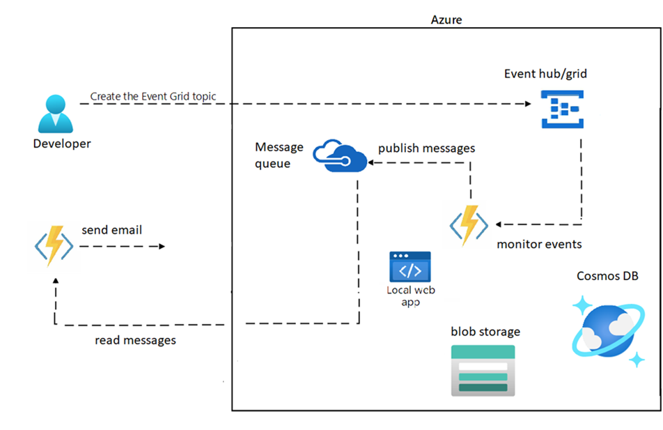

---
lab:
    az204Title: 'Lab 15: Develop apps for Azure storage'
    az204Module: 'Learning Path 15: Implement caching for solutions'
---

# Lab 15: Develop apps for Azure storage

## Microsoft Azure user interface

Given the dynamic nature of Microsoft cloud tools, you might experience Azure UI changes that occur after the development of this training content. As a result, the lab instructions and lab steps might not align correctly.

Microsoft updates this training course when the community alerts us to needed changes. However, cloud updates occur frequently, so you might encounter UI changes before this training content updates. **If this occurs, adapt to the changes, and then work through them in the labs as needed.**

## Instructions

### Before you start

#### Sign in to the lab environment

Sign in to your Windows 10 virtual machine (VM) by using the following credentials:

- Username: `Admin`
- Password: `Pa55w.rd`

> **Note**: Your instructor will provide instructions to connect to the virtual lab environment.

#### Review the installed applications

Find the taskbar on your Windows 10 desktop. The taskbar contains the icon for the application that you'll use in this lab:

- Microsoft Edge

## Lab Scenario

In this lab, you will implement a storage account, a blob container for the images, and secure the storage account using shared access signatures for the customer to access and download their images.

You will also implement an Azure Cosmos DB instance to store customer-related data for billing information. The connection string to the Azure Cosmos DB will be secured using Azure Key Vault. The Azure Functions will use this information to securely access Azure Cosmos DB.

Since there may be multiple orders arriving simultaneously, you will also make use of message queuing to store the order and job information before it is written to the database.


## Architecture diagram



### Exercise 1: Implement Azure Storage solutions for your application

#### Task 1: Create an Azure Storage resource

1. On the taskbar, select the **Microsoft Edge** icon.

1. In the browser window, browse to the Azure portal at `https://portal.azure.com`, and then sign in with the account you'll be using for this lab.

1. In the Azure portal, use the **Search resources, services, and docs** text box to search for **Storage Accounts**, and then in the list of results, select **Storage Accounts**.

1. On the **Storage accounts** blade, select **+ Create**.

1. On the **Create a storage account** blade, on the **Basics** tab, perform the following actions, and then select **Review**:

    | Setting | Action |
    | -- | -- |
    | **Subscription** drop-down list | Retain the default value |
    | **Resource group** section | Select **Create new**, enter **WebProject-Sam-RG**, and then select **OK** |
    | **Storage account name** text box | Enter **webproject**_[yourname]_ | 
    | **Region** drop-down list | Select **(US) East US** |
    | **Performance** section | Select the **Standard** option |
    | **Redundancy** drop-down list | Select **Locally-redundant storage (LRS)** |
    
1. On the **Review** tab, review the options that you selected during the previous steps and then select **Create**.

    > **Note**: Wait for the creation task to complete before you proceed with this lab.

1. On the **Overview** blade, select the **Go to resource** button to navigate to the blade of the newly created storage account.

1. On the **Storage account** blade, in the **Security + networking** section, select **Access keys**.

1. On the **Access keys** blade, select **Show keys**.

1. Review any one of the keys, and then copy the value of either of the **Connection string** boxes to the clipboard.

    > **Note**: It doesn't matter which connection string you choose. They are interchangeable.

1. Open Notepad, and then paste the copied connection string value to Notepad. You'll use this value later in this lab.
      

#### Task 2: Create Blob storage solution

1. On the **Storage Account** blade, in the **Data storage** section, select the **Containers** link.

1. On the **Containers** blade, select **+ Container**.

1. In the **New container** window, perform the following actions:

    | Setting  | Action |
    | -- | -- |
    | **Name** text box | Enter **containername** |
    | **Public access level** list | Select **Blob (anonymous read access for blobs only)**, and then select **Create** |
    
   You can now use this Blob container to store and manage unstructured data such as images, videos, documents, and log files.    

1. On the **Containers** blade, select the newly created **containername** container.

1. On the **containername** blade, select **Upload**.

1. In the **Upload blob** window, perform the following actions:

    | Setting | Action |
    | -- | -- |
    | **Files** section | Select **Browse for files** or use the drag and drop feature |
    | **File Explorer** window | Browse to **Allfiles (F):\\Allfiles\\Labs\\15\\Starter\\Images**, select the **filename** file, and then select **Open** |
    | **Overwrite if files already exist** check box | Ensure that the check box is selected, and then select **Upload** |

    > **Note**: Wait for the blob to upload before you continue with this lab.

#### Task 3: Create an Azure file share

1. On the **Storage Account** blade, in the **Data storage** section, select the **File shares** link.

1. On the **File shares** blade, select **+ File share**.

1. In the **File shares** window, perform the following actions:

    | Setting | Action |
    | -- | -- |
    | **Name** text box | Enter **filesharename** |
    | **Tier** drop-down list | Select **Transaction optimized**, and then select **Create** |

You can now use this file share to store and share files across multiple virtual machines or applications.

#### Task 4: Secure Azure Storage by using Key Vault for the storage key

1. In the Azure portal, use the **Search resources, services, and docs** text box to search for **Key vaults**, and then in the list of results, select **Key vaults**.

1. On the **Key vaults** blade, select **+ Create**.

1. On the **Create a key vault** blade, on the **Basics** tab, perform the following actions, and then select **Review + create**:

   | Setting | Action |
   | -- | -- |
   | **Subscription** drop-down list | Retain the default value |
   | **Resource group** drop-down list | Select **WebProject-Sam-RG** in the list |
   | **Key vault name** text box | Enter **securevault**_[yourname]_ |
   | **Region** drop-down list | Select **East US** |
   | **Pricing tier** drop-down list | Select **Standard** |

   
1. On the **Review + create** tab, review the options that you selected during the previous steps.

1. Select **Create** to create the key vault by using your specified configuration.

1. Select **Go to resource**.

1. In the Key Vault resource, select the **Access policies** option from the left-hand menu.

1. Select the **+ Add Access Policy**.

1. Select the **Secret Management** option from the list of available permissions.

1. Choose the appropriate options for the **Select principal** and **Secret permissions** sections, depending on your requirements.

1. Select the **Add** button to add the access policy.

1. On the **Key Vault** blade, in the **Objects** section, select the **Secrets**.

1. Select the **+ Generate/Import** to create a new secret.

1. On the **Create a secret** blade, perform the following actions, and then select **Create**:

    | Setting | Action |
    | -- | -- |
    | **Upload options** drop-down list | Select **Manual** |
    | **Name** text box | Enter **storage-secret** |
    | **Value** text box | Enter the storage account connection string that you recorded previously in this lab |
    | **Content type** text box | Leave blank |
    | **Set activation date** check box | Not selected |
    | **Set expiration date** check box | Not selected |
    | **Enabled** option | Select **Yes** |

1. Open the **Storage account** blade, in the **Security + networking** section, select **Access keys**.

1. Select the **Rotate key** to generate a new key.

1. Choose the **Use a key from Key Vault** option for the new key.

1. Select the Key Vault resource and secret that you created earlier.

1. Select the **Save** button to save the new key.

1. Update your application or service to use the new storage account key.

By using Key Vault to store and manage your Azure Storage keys, you can ensure that your keys are securely stored and managed, and you can easily rotate your keys as needed for improved security.

#### Task 5: Secure Azure Storage using shared access signature

1. Open the **Storage account** blade, in the **Security + networking** section, select **Shared access signature**.

1. Choose the appropriate options for the **Allowed services**, **Allowed resource types**, **Allowed permissions**, and **Start time/Expiry time** sections, depending on your requirements.

1. Select the **Generate SAS and connection string** to generate the shared access signature and connection string.

1. Copy the generated connection string to your clipboard.

1. Update your application or service to use the new connection string for accessing the Azure Storage account.

By using shared access signature, you can control the level of access that different users or applications have to your Azure Storage account. You can specify the allowed services, resource types, and permissions for each shared access signature, and you can set the start time and expiry time to control the duration of each shared access signature.


#### Review 

 From this exercise, the students learned how to implement Azure Storage solutions for their applications. Specifically, they learned how to create an Azure Storage resource, create a Blob storage solution, create an Azure file share, secure Azure Storage by using Key Vault for the storage key, and secure Azure Storage using shared access signature.

### Exercise 2: Implement Azure Cosmos DB solutions

#### Task 1: Create an Azure Cosmos DB instance

1. In the Azure portal, use the **Search resources, services, and docs** text box to search for **Azure Cosmos DB** and then in the list of results, select **Azure Cosmos DB**.

1. On the **Azure Cosmos DB** blade, select **+ Create**.

1. On the **Select API option** blade, select **Create** in the **Azure Cosmos DB for NoSQL** box.

1. On the **Basics** tab of the **Create Azure Cosmos DB Account - Azure Cosmos DB for NoSQL** page, perform the following actions, and then select **Review + Create**:

    | Setting | Action |
    | -- | -- |
    | **Subscription** list | Retain defaults |
    | **Resource group** drop-down list | Select **WebProject-Sam-RG** in the list |
    | **AccountName** text box | Enter **polycosmos**_[yourname]_ |
    | **Location** drop-down list | Select an Azure region that is closest to the location of your lab computer and where you can create a Cosmos DB account |
    | **Capacity mode** section | Select **Serverless** |
    
1. On the **Review + Create** tab of the **Create Azure Cosmos DB Account - Azure Cosmos DB for NoSQL** page, review the options that you selected during the previous steps. 

1. Select **Create** to create the Azure Cosmos DB account by using your specified configuration.

    > **Note**: Wait for the creation task to complete before you move forward with this lab.

1. Select **Go to resource**.

1. On the **Azure Cosmos DB account** blade, find the **Settings** section, and then select the **Keys** link.

1. In the **Keys** pane, on the **Read-write Keys** tab, record the values of the **URI**, **PRIMARY KEY**, and **PRIMARY CONNECTION STRING** text boxes. You'll use these values later in this lab.


#### Task 2: Secure the Azure Cosmos DB connection string in Key Vault

1. Open the **Key Vault** blade, in the **Objects** section, select the **Secrets**.

1. Select the **+ Generate/Import** to create a new secret.

1. On the **Create a secret** blade, perform the following actions, and then select **Create**:

    | Setting | Action |
    | -- | -- |
    | **Upload options** drop-down list | Select **Manual** |
    | **Name** text box | Enter **cosmosdb-secret** |
    | **Value** text box | Enter the storage account connection string that you recorded previously in this lab |
    | **Content type** text box | Leave blank |
    | **Set activation date** check box | Not selected |
    | **Set expiration date** check box | Not selected |
    | **Enabled** option | Select **Yes** |
  
   > **Note**: Wait for the secret to be created before you move forward with this lab.
 

1. Return to the **Secrets** pane, and then select the **cosmosdb-secret** item in the list.

1. On the **Versions** pane, select the latest version of the **cosmosdb-secret** secret.

1. On the **Secret Version** pane, perform the following actions:

    - Select **Show secret value** to find the value of the secret.

    - Record the value of the **Secret Identifier** text box because you'll use this later in the lab.

    > **Note**: You're recording the value of the **Secret Identifier** text box, not the **Secret Value** text box.
  
 Your Azure Cosmos DB connection string is now securely stored in Key Vault and can be accessed by your Azure Functions.
   

#### Review 
In this exercise, we learned how to create an Azure Cosmos DB instance and secure the connection string in Key Vault.


### Exercise 3: Implement Event Hub processing and message queueing (Use Event Hub and/or Event Grid)

#### Task 1: Implement a message queue for writing and reading customer transaction information

1. On the Azure portal's navigation pane, select the **Create a resource** button in the left-hand menu.

1. On the search bar, type **Event Hubs** and select **Event Hubs** from the list of options.

1. On the **Event Hubs** blade, select **Create**.

1. On the **Create Namespace** blade, on the **Basics** tab, perform the following actions, and then select the **Review + create** tab:
   
    | Setting | Action |
    | -- | -- |
    | **Subscription** drop-down list |Retain the default value |
    | **Resource group** drop-down list | Select **WebProject-Sam-RG** in the list |
    | **Namespace name** text box | Enter **eventhub-namespace**_[yourname]_ |
    | **Location** drop-down list | Select any Azure region in which you can deploy an Azure event hub |
    | **Pricing tier** drop-down list | Select **Standard** |
    | **Throughput Units** text box | Enter **2** |
    | **Enable Auto-Inflate** check box | keep the default |

1. On the **Review + create** tab, review the options that you selected during the previous steps.

1. Select **Create** to create the **Event Hubs Namespace** by using your specified configuration.

    > **Note**: Wait for the creation task to complete before you proceed with this lab.

1. On the **Overview** blade, select the **Go to resource** button to navigate to the blade of the newly created Event Hubs namespace.

1. On the **Event Hubs Namespace** blade, select **+ Event Hub** from the top menu.

1. On the **Create Event Hub** blade, on the **Basics** tab, perform the following actions, and then select the **Review + create** tab:
   
    | Setting | Action |
    | -- | -- |
    | **Name** text box | Enter **eventhub_**_[yourname]_ |
    | **Partition count** text box | Enter **2** |
    | **Cleanup policy** drop-down list | Select **Delete** |
    | **Retention time (hrs)** text box | Enter **1** |
  
1. On the **Review + create** tab, review the options that you selected during the previous steps.

1. Select **Create** to create the **Event Hubs** by using your specified configuration.


2. Once the Service Bus instance is created, navigate to its dashboard.
3. Select **Queues** in the left-hand menu and then select **Create queue**.
4. Fill in the required fields for creating a new queue, such as the name and access level (set to "Private" for security).
5.  Select **Create** to create the new queue.


1. Navigate to your Azure Function that writes the customer transaction information to Azure Cosmos DB.
1. In the **Integrate** tab, add a new input binding for Service Bus.
1. Fill in the required fields for the input binding, such as the connection string (from the Service Bus instance), the queue name, and the message parameter name.
1. Select **Save** to save the input binding.
1. In your Azure Function code, write code to send a message to the Service 1. Bus queue whenever a customer transaction is created.
1. Navigate to your Azure Function that generates billing information for the invoicing system.
1. In the **Integrate** tab, add a new input binding for Service Bus.
1. Fill in the required fields for the input binding, such as the connection string (from the Service Bus instance), the queue name, and the message parameter name.
1. Select **Save** to save the input binding.
1. In your Azure Function code, write code to read messages from the Service Bus queue and generate billing information for each customer transaction.


1. Select on "Containers" in the left-hand menu and then click on "Create container".
1. Fill in the required fields for creating a new container, such as the name and access level (set to "Private" for security).
1. Select on "Create" to create the new container.
1. Navigate to the "Access keys" section in the left-hand menu and copy one of the connection strings (either the primary or secondary).


#### Task 2: Create an Event Hub to monitor HTTP requests for uploaded images

1. Navigate to the Azure portal and sign in to your account.
1. Select on **Create a resource** and select **Event Hubs** from the **Integration** category.
1. On the **Create namespace** blade, on the **Basics** tab, perform the following actions, and select **Review + create**:
        
    | Setting | Action |
    | -- | -- |
    | **Subscription** drop-down list |Retain the default value |
    | **Resource group** drop-down list | Select **WebProject-Sam-RG** in the list |
    | **Namespace name** text box | Enter **sbnamespace**_[yourname]_ |
    | **Region** drop-down list | Select any Azure region in which you can deploy an Azure Service Bus |
    | **Pricing tier** drop-down list | Select **Basic** |


1. On the **Review + create** tab, review the options that you selected during the previous steps.

1. Select **Create** to create the **Event Hubs** namespace by using your specified configuration.

    > **Note**: Wait for the creation task to complete before you proceed with this lab.

1. Once the Event Hub is created, navigate to its dashboard.
1. Select **Shared access policies** in the left-hand menu and then select **Add**.
1. Fill in the required fields for creating a new shared access policy, such as the name and permissions (set to "Send" and "Listen" for now).
1. Select **Create** to create the new shared access policy.
1. Navigate to the **Overview** tab and copy the connection string for the Event Hub namespace.
1. In your Azure Function that processes HTTP requests for uploaded images, add a new output binding for Event Hub.
1. Fill in the required fields for the output binding, such as the connection string (from the Event Hub namespace), the name of the Event Hub, and the message parameter name.
1. Select **Save** to save the output binding.
1. In your Azure Function code, write code to send a message to the Event Hub whenever a customer uploads an image for processing.

You can now monitor HTTP requests for uploaded images in real-time by reading messages from the Event Hub.


#### Task 3: Create and Event Hub to trigger customer invoicing based on a time trigger

1. Navigate to the Azure portal and sign in to your account.
1. Select "Create a resource" button and select "Event Hubs" from the "Integration" category.
1. Fill in the required fields for creating the Event Hub, such as the subscription, resource group, and name.
1. Choose the pricing tier that suits your needs and click on "Review + create".
1. Review the settings and click on "Create" to create the Event Hub.


1. Once the Event Hub is created, navigate to its dashboard.
1. Select on "Shared access policies" in the left-hand menu and then click on "Add".
1. Fill in the required fields for creating a new shared access policy, such as the name and permissions (set to "Send" and "Listen" for now).
1. Select on "Create" to create the new shared access policy.
1. Navigate to the "Overview" tab and copy the connection string for the Event Hub namespace.


1. Create a new Azure Function that will be triggered based on a time trigger.
1. In the **Integrate** tab, add a new output binding for Event Hub.
1. Fill in the required fields for the output binding, such as the connection string (from the Event Hub namespace), the name of the Event Hub, and the 1. message parameter name.

1. Select on "Save" to save the output binding.
1. In your Azure Function code, write code to send a message to the Event Hub that contains the customer information and job details for all completed image processing jobs.
1. The Event Hub will trigger the Azure Function that generates billing information for the invoicing system based on the time trigger.
1. In the "Integrate" tab of this Azure Function, add a new input binding for Event Hub.
1. Fill in the required fields for the input binding, such as the connection string (from the Event Hub namespace), the name of the Event Hub, and the message parameter name.
1. Select on "Save" to save the input binding.
1. In your Azure Function code, write code to read messages from the Event Hub and generate billing information for each completed image processing job.

### Task 4: Create a .NET application to upload images to the blob storage

1. Open Visual Studio and create a new project using the "ASP.NET Web Application (.NET Framework)" template.
1. Choose the "MVC" project type and select "No Authentication" for now.
1. Select on "Create" to create the project.
1. Right-click on the project in the Solution Explorer and select "Manage NuGet Packages".
1. Install the "WindowsAzure.Storage" NuGet package.
1. In the "web.config" file, add the following configuration settings for the connection string to the Azure Storage Account:

```csharp
<configuration>  
  <connectionStrings>  
    <add name="StorageConnectionString" connectionString="DefaultEndpointsProtocol=https;AccountName=[your_account_name];AccountKey=[your_account_key];EndpointSuffix=core.windows.net" />  
  </connectionStrings>  
</configuration>  
 ```

1. Create a new controller by right-clicking on the "Controllers" folder in the Solution Explorer and selecting "Add" -> "Controller".

1. Choose the "MVC 5 Controller - Empty" template and name the controller "ImageController".
1. In the "ImageController.cs" file, add the following code:


```csharp
using Microsoft.WindowsAzure.Storage;  
using Microsoft.WindowsAzure.Storage.Blob;  
using System.IO;  
using System.Threading.Tasks;  
using System.Web;  
using System.Web.Mvc;  
  
namespace YourProject.Controllers  
{  
    public class ImageController : Controller  
    {  
        private CloudBlobContainer GetCloudBlobContainer()  
        {  
            // Retrieve the connection string for use with the application. The storage account name and key are stored  
            // in the connection string.  
            string connectionString = System.Configuration.ConfigurationManager.ConnectionStrings["StorageConnectionString"].ConnectionString;  
  
            // Retrieve storage account from connection string.  
            CloudStorageAccount storageAccount = CloudStorageAccount.Parse(connectionString);  
  
            // Create a blob client for interacting with the blob service.  
            CloudBlobClient blobClient = storageAccount.CreateCloudBlobClient();  
  
            // Retrieve reference to a previously created container.  
            CloudBlobContainer container = blobClient.GetContainerReference("images");  
  
            // Create the container if it doesn't already exist.  
            container.CreateIfNotExists();  
  
            // Enable public access to the container.  
            container.SetPermissions(  
                new BlobContainerPermissions  
                {  
                    PublicAccess = BlobContainerPublicAccessType.Blob  
                });  
  
            return container;  
        }  
  
        [HttpPost]  
        public async Task<ActionResult> Upload(HttpPostedFileBase file)  
        {  
            if (file != null && file.ContentLength > 0)  
            {  
                // Get the container reference.  
                CloudBlobContainer container = GetCloudBlobContainer();  
  
                // Retrieve reference to a blob named "myblob".  
                CloudBlockBlob blockBlob = container.GetBlockBlobReference(file.FileName);  
  
                // Upload the file to blob storage.  
                using (var fileStream = file.InputStream)  
                {  
                    await blockBlob.UploadFromStreamAsync(fileStream);  
                }  
            }  
  
            return RedirectToAction("Index", "Home");  
        }  
    }  
}  
 ```

1. In the "Views" folder, create a new folder called "Image" and then add a new view by right-clicking on the "Image" folder and selecting "Add" -> "View".

1. Name the view "Upload" and add the following code:

```csharp
@{  
    ViewBag.Title = "Upload Image";  
}  
  
<h2>@ViewBag.Title</h2>  
  
@using (Html.BeginForm("Upload", "Image", FormMethod.Post, new { enctype = "multipart/form-data" }))  
{  
    <input type="file" name="file" />  
    <br />  
    <input type="submit" value="Upload" />  
}  
```

1. Run the application and navigate to the "Image/Upload" view to upload an image file to the "images" container in the Azure Storage Account.

#### Review 

In this exercise, students learn how to implement Event Hub processing and message queueing using Azure services. This exercise provides a comprehensive hands-on experience in implementing Event Hub processing and message queueing using Azure services. Students gain practical knowledge and skills that can be applied to real-world scenarios, and learn how to build an efficient and reliable solution to the lab scenario.

### Exercise 4: Implement Azure Functions to process messages

#### Task 1: Create an Azure function that reads customer data from the message queue

1. Open the Azure portal and navigate to the Function App that you want to use.
1. Select on the "Functions" menu item and then click on the "+ New Function" button.
1. Choose "Azure Queue Storage trigger" as the template for the new function.
1. Fill in the required fields, such as the name of the function, the name of the storage account, and the name of the queue.
1. Choose the "C#" language and click on "Create".
1. In the "function.json" file, modify the "connection" property to specify the name of the Azure Storage Account connection string that you want to use.
1. In the "run.csx" file, write the code to read the customer data from the message queue. Here's an example:
#r "Microsoft.WindowsAzure.Storage"  

```csharp  
using System;  
using Microsoft.WindowsAzure.Storage;  
using Microsoft.WindowsAzure.Storage.Queue;  
  
public static void Run(CloudQueueMessage myQueueItem, TraceWriter log)  
{  
    log.Info($"C# Queue trigger function processed: {myQueueItem.AsString}");  
  
    // Retrieve the customer data from the message body.  
    string[] customerInfo = myQueueItem.AsString.Split(',');  
  
    string customerId = customerInfo[0];  
    string customerName = customerInfo[1];  
    string customerEmail = customerInfo[2];  
  
    // Do something with the customer data, such as store it in a database or send an email.  
}  
```

1. Save the changes to the "run.csx" file.

1. Test the function by adding a message to the specified queue in the Azure Storage Account. The message should contain the customer data in the format: **"customerId,customerName,customerEmail"**. The function should be triggered automatically and the customer data should be processed according to the code in the **"run.csx"** file.

#### Task 2: Create an Azure function that writes data from the message queue to the Azure Cosmos DB

1. Open the Azure portal and navigate to the Function App that you want to use.
1. Select on the "Functions" menu item and then click on the "+ New Function" button.
1. Choose "Azure Queue Storage trigger" as the template for the new function.
1. Fill in the required fields, such as the name of the function, the name of the storage account, and the name of the queue.
1. Choose the "C#" language and click on "Create".
1. In the "function.json" file, modify the "connection" property to specify the name of the Azure Storage Account connection string that you want to use.
1. In the "run.csx" file, write the code to read the customer data from the message queue and write it to the Azure Cosmos DB. Here's an example:
#r "Microsoft.Azure.Documents.Client"  
#r "Microsoft.Azure.Documents.Linq"  

```csharp  
using System;  
using System.Linq;  
using Microsoft.Azure.Documents;  
using Microsoft.Azure.Documents.Client;  
using Microsoft.Azure.Documents.Linq;  
using Microsoft.WindowsAzure.Storage;  
using Microsoft.WindowsAzure.Storage.Queue;  
  
public static void Run(CloudQueueMessage myQueueItem, TraceWriter log)  
{  
    log.Info($"C# Queue trigger function processed: {myQueueItem.AsString}");  
  
    // Retrieve the customer data from the message body.  
    string[] customerInfo = myQueueItem.AsString.Split(',');  
  
    string customerId = customerInfo[0];  
    string customerName = customerInfo[1];  
    string customerEmail = customerInfo[2];  
  
    // Write the customer data to the Azure Cosmos DB.  
    DocumentClient client = new DocumentClient(new Uri("[cosmos_db_endpoint]"), "[cosmos_db_auth_key]");  
    var collectionUri = UriFactory.CreateDocumentCollectionUri("[cosmos_db_database]", "[cosmos_db_collection]");  
  
    var customer = new  
    {  
        id = customerId,  
        name = customerName,  
        email = customerEmail  
    };  
  
    client.CreateDocumentAsync(collectionUri, customer);  
  
    // Do something else with the customer data, such as send an email or log it.  
}  
``` 

1. Replace "[cosmos_db_endpoint]", "[cosmos_db_auth_key]", "[cosmos_db_database]", and "[cosmos_db_collection]" with the appropriate values for your Azure Cosmos DB account.

1. Save the changes to the "run.csx" file.

1. Test the function by adding a message to the specified queue in the Azure Storage Account. The message should contain the customer data in the format: **"customerId,customerName,customerEmail"**. The function should be triggered automatically and the customer data should be written to the specified Azure Cosmos DB collection.

#### Task 3: Create an Azure function that reads data from the invoicing message queue process

1. Open the Azure portal and navigate to the Function App that you want to use.
1. Select on the "Functions" menu item and then click on the "+ New Function" button.
1. Choose "Azure Queue Storage trigger" as the template for the new function.
1. Fill in the required fields, such as the name of the function, the name of the storage account, and the name of the queue.
1. Choose the "C#" language and click on "Create".
1. In the "function.json" file, modify the "connection" property to specify the name of the Azure Storage Account connection string that you want to use.
1. In the "run.csx" file, write the code to read the invoicing data from the message queue. Here's an example:
#r "Microsoft.WindowsAzure.Storage"  

```csharp  
using System;  
using Microsoft.WindowsAzure.Storage;  
using Microsoft.WindowsAzure.Storage.Queue;  
  
public static void Run(CloudQueueMessage myQueueItem, TraceWriter log)  
{  
    log.Info($"C# Queue trigger function processed: {myQueueItem.AsString}");  
  
    // Retrieve the invoicing data from the message body.  
    string[] invoicingInfo = myQueueItem.AsString.Split(',');  
  
    string customerId = invoicingInfo[0];  
    string jobDetails = invoicingInfo[1];  
  
    // Do something with the invoicing data, such as generate an invoice or log it.  
}  
```

1. Save the changes to the "run.csx" file.

1. Test the function by adding a message to the specified queue in the Azure Storage Account. The message should contain the invoicing data in the format: "customerId,jobDetails". The function should be triggered automatically and the invoicing data should be processed according to the code in the "run.csx" file.

### Task 4: Create an Azure function that sends customer invoice information to a customer via email

1. Open the Azure portal and navigate to the Function App that you created in Task 2.

1. Select on the "Functions" option in the left-hand menu, and then click the "+ Add" button to create a new function.

1. Choose "Event Hub Trigger" as the template for the new function.

1. In the "New Function" dialog box, enter a name for your function, such as "SendInvoiceEmailFunction".

1. Under "Event Hub settings", choose the Event Hub that you created in Task 3.

1. Under "Connection", select "New", and then select "Azure Cosmos DB" from the list of available connections.

1. Enter the name of the Cosmos DB account that you created in Task 3.

1. Under "Input", select "OrderQueue" as the queue that your function will read messages from.

1. Under "Output", select "SendGrid" as the output binding.

1. Enter the SendGrid API key that you created in Task 2.

1. In the "Function code" section, replace the default code with the following code:

```csharp
using System;  
using Microsoft.Azure.WebJobs;  
using Microsoft.Extensions.Logging;  
using Newtonsoft.Json;  
using SendGrid;  
using SendGrid.Helpers.Mail;  
  
public static async Task Run(string[] eventHubMessages, ILogger log, [CosmosDB(databaseName: "your-db-name", collectionName: "your-collection-name", ConnectionStringSetting = "CosmosDBConnection")]IAsyncCollector<dynamic> documents, [SendGrid()]IAsyncCollector<SendGridMessage> message)  
{  
    foreach (var message in eventHubMessages)  
    {  
        var order = JsonConvert.DeserializeObject<Order>(message);  
  
        var document = new  
        {  
            id = Guid.NewGuid().ToString(),  
            customerId = order.CustomerId,  
            jobType = order.JobType,  
            jobCost = order.JobCost,  
            processedDate = DateTime.UtcNow  
        };  
  
        await documents.AddAsync(document);  
  
        var emailMessage = new SendGridMessage();  
        emailMessage.SetFrom(new EmailAddress("your-email-address@example.com", "Contoso Image Processing"));  
        emailMessage.AddTo(new EmailAddress(order.CustomerEmail));  
        emailMessage.SetSubject("Your Contoso Image Processing Invoice");  
        emailMessage.AddContent(MimeType.Text, $"Dear {order.CustomerName},\n\nThank you for using Contoso Image Processing. Your invoice for the {order.JobType} job is {order.JobCost:C}.\n\nBest regards,\nContoso Image Processing");  
  
        await message.AddAsync(emailMessage);  
    }  
}  
  
public class Order  
{  
    public string CustomerId { get; set; }  
    public string CustomerName { get; set; }  
    public string CustomerEmail { get; set; }  
    public string JobType { get; set; }  
    public decimal JobCost { get; set; }  
}  
```

1. Make sure to replace "your-db-name" and "your-collection-name" with the actual names of your Cosmos DB database and collection.

1. Select on the "Save" button to save your function.

1. Test your function by sending a message to the "OrderQueue" queue that you created in Task 3. You can do this by using the Azure Storage Explorer or by using the Azure Portal.

1. Check your email inbox to verify that you received the invoice email.

Congratulations! You have successfully created an Azure function that sends customer invoice information to a customer via email.

#### Review

In this exercise, you updated your web app to use Content Delivery Network to serve multimedia content and to serve the web application itself.