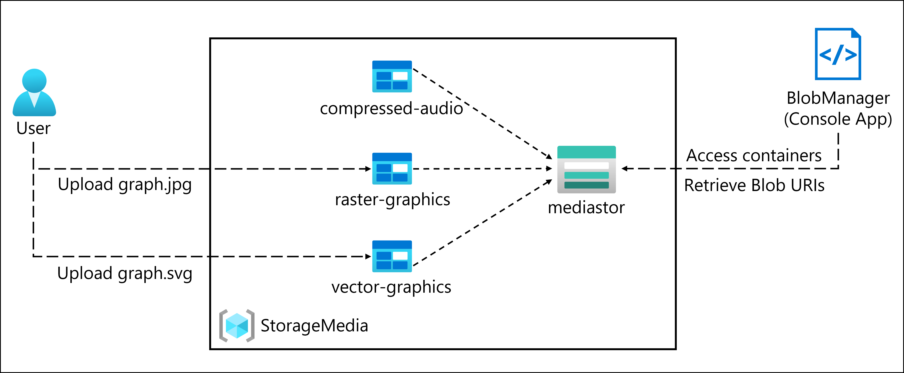

# Lab Scenario Preview - 03 - Retrieve Azure Storage resources and metadata by using the Azure Storage SDK for .NET

## Lab overview
In this lab, you will learn how to use the Azure Storage SDK to access Azure Storage containers within a C# application. You will also learn how to access metadata and expose URI information to gain access to the contents of the containers in the storage account.

Finally, to ensure compliance with company regulations, you will implement secure access by generating shared access signatures and data lifecycle policies. You will test access to the content through a static website as well.

## Objective
+ Exercise 1: Create Azure resources
    + Task 1: Open the Azure portal
    + Task 2: Create a Storage account
+ Exercise 2: Upload a blob into a container
    + Task 1: Create storage account containers
    + Task 2: Upload a storage account blob
+ Exercise 3: Access containers by using the .NET SDK
    + Task 1: Create .NET project
    + Task 2: Modify the Program class to access Storage
    + Task 3: Connect to the Azure Storage blob service endpoint
    + Task 4: Enumerate the existing containers
+ Exercise 4: Retrieve blob Uniform Resource Identifiers (URIs) by using the .NET SDK
    + Task 1: Enumerate the blobs in an existing container by using the SDK
    + Task 2: Create a new container by using the SDK
    + Task 3: Upload a new blob by using the portal
    + Task 4: Access blob URI by using the SDK
    + Task 5: Test the URI by using a browser

## Architecture diagram

Once you understand the lab's content, you can start the Hands-on Lab by clicking the **Launch** button located in the top right corner. This will lead you to the lab environment and guide. You can also preview the full lab guide [here](https://experience.cloudlabs.ai/#/labguidepreview/393fe3c7-8574-45b7-aaf6-d0f9273e4b99) if you want to go through detailed guide prior to launching lab environment. 
