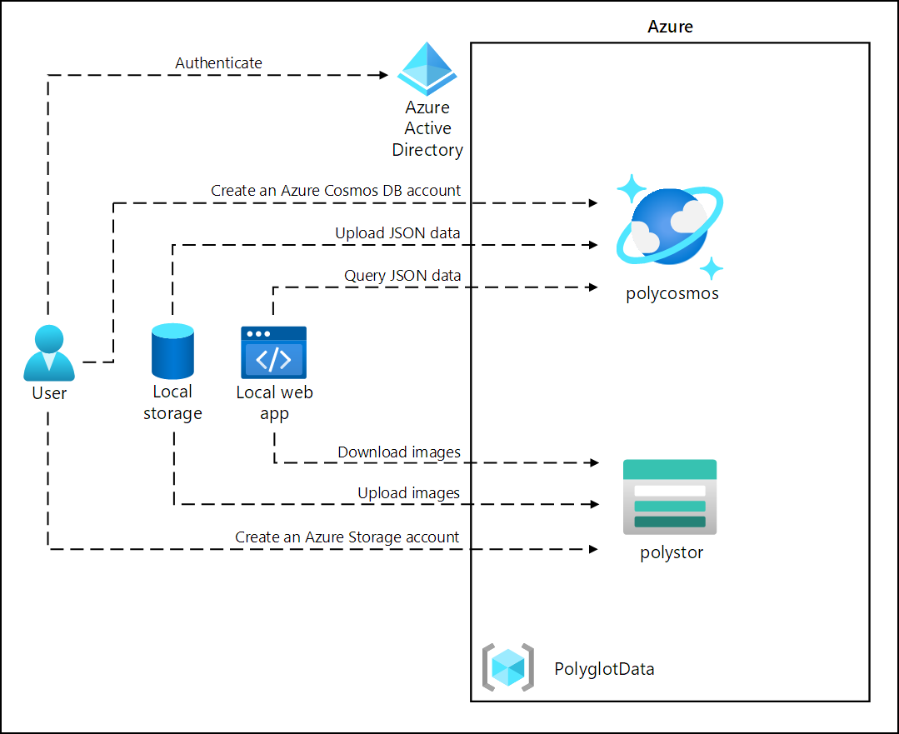

# Lab Scenario Preview - 04 - Construct a polyglot data solution

## Lab overview
In this lab, you will create an Azure Cosmos DB resource and a storage account resource. Using C# and .NET, you will access the Cosmos DB resource and upload data into it.

Additionally, as Contoso may want to access the data in Cosmos DB through a user-friendly interface, you will implement a .NET solution that accesses and displays the data from Cosmos DB in a web browser.

Finally, you will set the consistency level for your Cosmos DB instance and implement an Azure function for change feed notifications.

## Objective
+ Exercise 1: Creating data store resources in Azure
    + Task 1: Open the Azure portal
    + Task 2: Create an Azure Cosmos DB account resource
    + Task 3: Create an Azure Storage account resource
+ Exercise 2: Review and upload data
    + Task 1: Upload images to Azure Blob Storage
    + Task 2: Review JSON data
    + Task 3: Create a Cosmos DB database and collection, and perform a JSON data upload
    + Task 4: Validate JSON data upload
+ Exercise 3: Configure a .NET web application
    + Task 1: Update references to data stores and build the web application
    + Task 2: Configure connectivity to Azure Cosmos DB
    + Task 3: Review the .NET application startup logic
    + Task 4: Validate that the .NET application successfully connects to data stores

## Architecture diagram

Once you understand the lab's content, you can start the Hands-on Lab by clicking the **Launch** button located in the top right corner. This will lead you to the lab environment and guide. You can also preview the full lab guide [here](https://experience.cloudlabs.ai/#/labguidepreview/14508cd3-41c6-4b88-8a0c-277f823c16be) if you want to go through detailed guide prior to launching lab environment.
