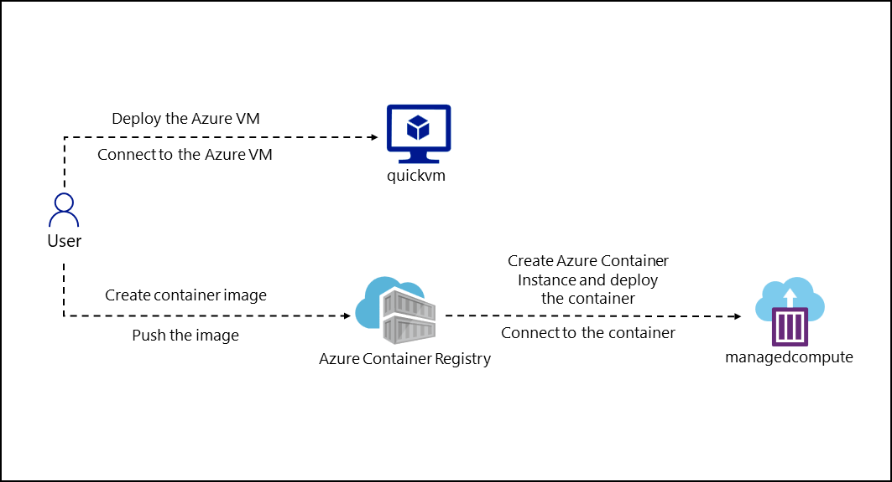

# Lab Scenario Preview - 05 - Deploy compute workloads by using images and containers

## Lab overview
In this lab, you will explore how to create and deploy containers to the Azure Container Registry using a .NET application and docker files. And also deploy a containerized solution to Azure Container Apps.

## Objective
+ Exercise 1: Create a VM by using the Azure Command-Line Interface (CLI)
    + Task 1: Open the Azure portal
    + Task 2: Open Azure Cloud Shell
    + Task 3: Use the Azure CLI commands
+ Exercise 2: Create a Docker container image and deploy it to Azure Container Registry
    + Task 1: Open the Cloud Shell and editor
    + Task 2: Create and test a .NET application
    + Task 3: Create a Container Registry resource
    + Task 4: Open Azure Cloud Shell and store Container Registry metadata
    + Task 5: Deploy a Docker container image to Container Registry
    + Task 6: Validate your container image in Container Registry
+ Exercise 3: Deploy an Azure container instance
    + Task 1: Enable the admin user in Container Registry
    + Task 2: Automatically deploy a container image to an Azure container instance
    + Task 3: Manually deploy a container image to Container Instances
    + Task 4: Validate that the container instance ran successfully

## Architecture diagram

Once you understand the lab's content, you can start the Hands-on Lab by clicking the **Launch** button located in the top right corner. This will lead you to the lab environment and guide. You can also preview the full lab guide [here](https://experience.cloudlabs.ai/#/labguidepreview/086e36e1-ad3d-4788-b41c-b1ced7ded65f) if you want to go through the detailed guide prior to launching lab environment.
