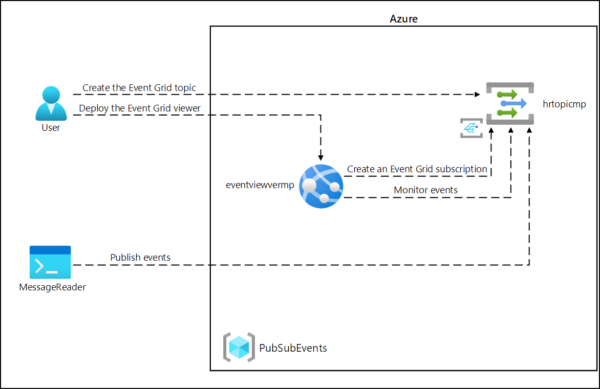

# Lab Scenario Preview - 09 - Publish and subscribe to Event Grid events

## Lab overview
In this lab, you will start with a proof-of-concept web app, hosted in a container, that will be used to subscribe to your Event Grid. This app will allow you to submit events and receive confirmation messages that the events were successful.

## Objective
+ Exercise 1: Create Azure resources
    + Task 1: Open the Azure portal
    + Task 2: Open Azure Cloud Shell
    + Task 3: Review the Microsoft.EventGrid provider registration
    + Task 4: Create a custom Event Grid topic
    + Task 5: Deploy the Azure Event Grid viewer to a web app
+ Exercise 2: Create an Event Grid subscription
    + Task 1: Access the Event Grid Viewer web application
    + Task 2: Create a new subscription
    + Task 3: Observe the subscription validation event
    + Task 4: Record subscription credentials
+ Exercise 3: Publish Event Grid events from .NET
    + Task 1: Create a .NET project
    + Task 2: Modify the Program class to connect to Event Grid
    + Task 3: Publish new events
    + Task 4: Observe published events

## Architecture diagram

Once you understand the lab's content, you can start the Hands-on Lab by clicking the **Launch** button located in the top right corner. This will lead you to the lab environment and guide. You can also preview the full lab guide [here](https://experience.cloudlabs.ai/#/labguidepreview/b07739a8-b164-414a-bf40-24e6d79e6817) if you want to go through detailed guide prior to launching lab environment.
