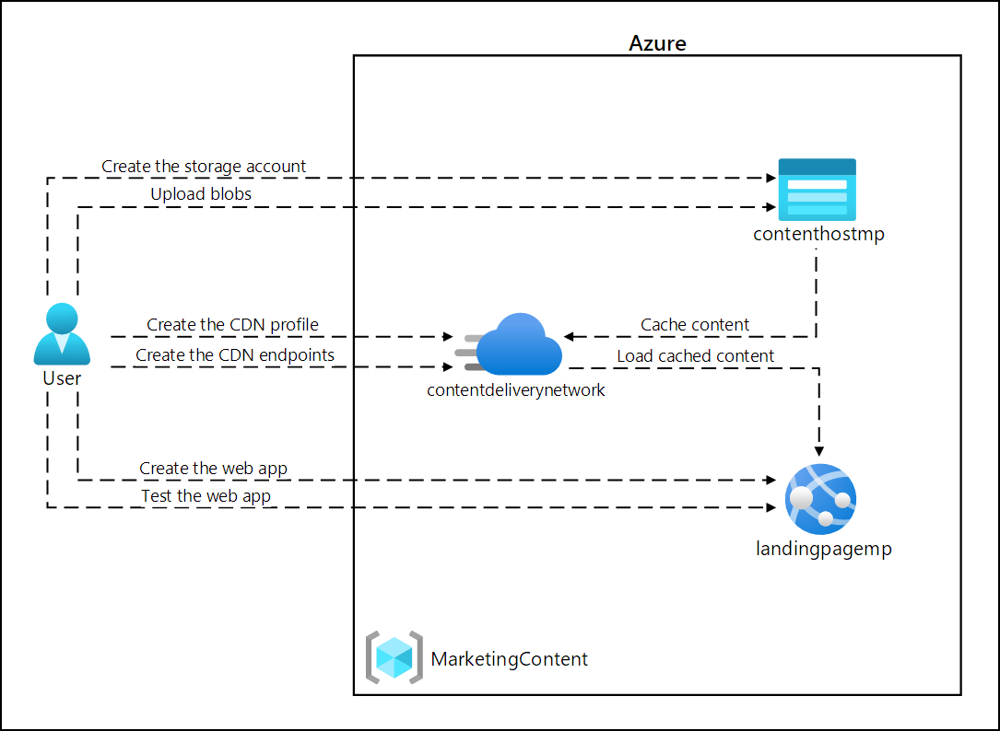

# Lab Scenario Preview - 12 - Enhance a web application by using the Azure Content Delivery Network

## Lab overview
In this lab, you will implement the Azure Content Delivery Network capabilities to provide a caching solution based on customer locations. The lab configures a storage account for image and video files, which are impacted the most by the latency issues. You will use the Azure Content Delivery Network to implement the caching solution to aid in reducing latency for these image and video files.

## Objective
+ Exercise 1: Create Azure resources
    + Task 1: Open the Azure portal
    + Task 2: Create a Storage account
    + Task 3: Create a web app by using Azure App Service
+ Exercise 2: Configure Content Delivery Network and endpoints
    + Task 1: Open Azure Cloud Shell
    + Task 2: Register the Microsoft.CDN provider
    + Task 3: Create a Content Delivery Network profile
    + Task 4: Configure Storage containers
    + Task 5: Create Content Delivery Network endpoints
+ Exercise 3: Upload and configure static web content
    + Task 1: Observe the landing page
    + Task 2: Upload Storage blobs
    + Task 3: Configure Web App settings
    + Task 4: Validate the corrected landing page
+ Exercise 4: Use Content Delivery Network endpoints
    + Task 1: Retrieve endpoint Uniform Resource Identifiers (URIs)
    + Task 2: Test multimedia content
    + Task 3: Update the Web App settings
    + Task 4: Test the web content

## Architecture diagram

Once you understand the lab's content, you can start the Hands-on Lab by clicking the **Launch** button located in the top right corner. This will lead you to the lab environment and guide. You can also preview the full lab guide [here](https://experience.cloudlabs.ai/#/labguidepreview/39ffd3f2-a4d5-451e-9727-f81a5f009912) if you want to go through detailed guide prior to launching lab environment.
